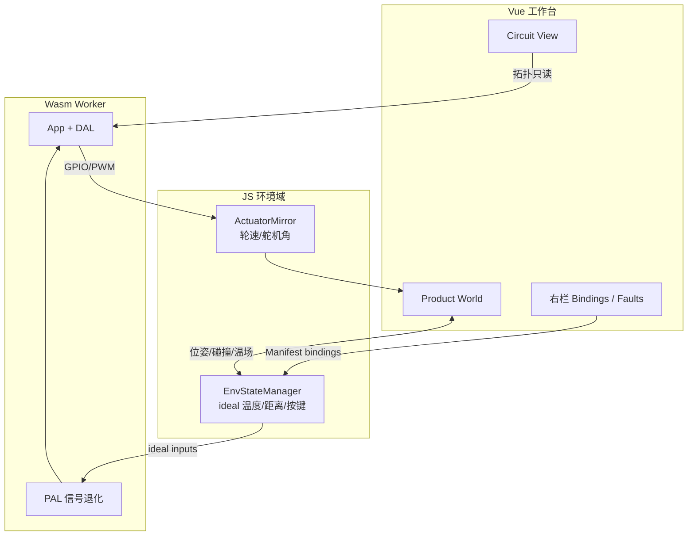

# 16. 双视窗产品世界布局与 3D 机械仿真界面规范

| 项 | 内容 |
|----|------|
| 状态 | **Living（活文档）** |
| 创建日期 | 2026-07-09 |
| 范围层级 | ① 设计规范（`docs/design/05-frontend-workbench/`） |
| 关联设计规范 | [`01-frontend-workbench-architecture.md`](./01-frontend-workbench-architecture.md)、[`../04-wasm-simulation/05-simulation-consistency-and-fidelity-spec.md`](../04-wasm-simulation/archive/05-simulation-consistency-and-fidelity-spec.md)、[`../04-wasm-simulation/06-physical-degradation-engine.md`](../04-wasm-simulation/archive/06-physical-degradation-engine.md)、[`../03-app-codegen/02-project-manifest-schema.md`](../03-app-codegen/02-project-manifest-schema.md) |
| 关联 ADR | [ADR-0003](../../decisions/unisim/0003-simulation-fidelity-boundary.md)（行为级高保真边界）、[ADR-0009](../../decisions/unisim/0009-physical-behavior-simulation-fault-injection.md)（双域混合架构）、[ADR-0014](../../decisions/unisim/0014-sim-single-virtual-core.md)（单 Worker 隔离） |
| 关联实施计划 | [`../../implementation-plans/frontend/2026-07-09-dual-viewport-layout-plan.md`](../../implementation-plans/frontend/2026-07-09-dual-viewport-layout-plan.md)（已归档） |
| 执行细化（SSOT） | [`03-dual-viewport-phased-design/`](./03-dual-viewport-phased-design/README.md) |
| 增强设计细化 | [`03-dual-viewport-phased-design/`](./03-dual-viewport-phased-design/00-master-plan.md)（UI/UX 交互规范、性能预算、分阶段交付详案） |
| 负责人 | TBD |

> **定位**：本文是 [`01-frontend-workbench-architecture.md`](./01-frontend-workbench-architecture.md) 的**增补规范**，定义「电路设计视窗 + 3D 产品/环境仿真视窗」双域联动布局、工作模式、Manifest 扩展与仿真桥接契约。实施完成后，应将 Manifest 字段定义回写至 [`02-project-manifest-schema.md`](../03-app-codegen/02-project-manifest-schema.md)。
>
> **增强设计**：本规范定义 What & Why；UI/UX 交互细节、性能约束、迁移策略和分阶段实施详案见 [`03-dual-viewport-phased-design/`](./03-dual-viewport-phased-design/00-master-plan.md)。

---

## 0. TL;DR

**问题**：当前工作台中心区域通过 Tab 在 `Circuit Canvas` 与 `Simulation View` 之间互斥切换；`Simulation View` 仅为外设卡片网格，无法表达「产品封装 + 环境交互」的 3D 机械仿真需求。

**决策**：

1. 中心区域从 **Tab 互斥** 升级为 **可拖拽分屏双视窗**（电路 2D + 产品世界 3D）。
2. 引入 **工作模式**（`design` / `simulate` / `diagnose`）驱动布局比例与编辑权限，替代「画布 Tab / 仿真 Tab」心智。
3. Manifest 新增 `mechanical`、`environment`、`bindings` 三节，与现有 `devices` / `connections` 并列。
4. 3D 物理引擎归属 **JS 环境域**（理想物理状态）；Wasm 只消费 ideal 值并做信号退化（遵循 ADR-0009 双域混合模型）。
5. 底栏新增 **因果链（Causal Chain）** 面板，串联 3D 事件 → JS 理想值 → Wasm 退化 → App 逻辑 → GPIO 输出 → 3D 执行器反馈。

**不在范围**（与系统 overview 一致）：

- ngspice 级电气仿真
- 复杂多关节机械臂逆运动学
- STM32 / 多板联合仿真
- 真机 WebUSB DFU 完整替代方案

---

## 1. 背景与动机

### 1.1 当前实现基线（Phase C）

`../../../../wink-ai/packages/embedded-frontend/src/views/EmbeddedWorkbench.vue` 已具备：

| 能力 | 状态 |
|------|------|
| 三栏 + 底栏 IDE 骨架 | ✅ |
| 电路画布 + HCTR 正交布线 | ✅（见 §7.1 of 01 文档） |
| Wasm Worker 仿真客户端 | ✅ |
| 虚拟外设实时渲染（Canvas 层 + Wokwi Elements） | ✅ |
| 属性面板 + 故障注入 | ✅ |
| Trace / Logs 底栏 | ✅ |

缺口：

| 缺口 | 影响 |
|------|------|
| Canvas / Simulation **Tab 互斥** | 用户无法在仿真运行时同时观察连线电平与 3D 产品运动 |
| Simulation View 为外设卡片网格 | 超声波距离等仍靠右栏手调滑块，未与环境联动 |
| 无机械装配与执行器绑定 UI | 电机 PWM 无法驱动 3D 轮子；传感器无法挂载到 3D 位姿 |
| 无环境道具库 | 火源、障碍物、温场等无法表达 |
| 顶栏无工作模式 | 设计态与运行态控件混杂（布线模式与仿真控制在同一行） |

### 1.2 产品目标对齐

用户需要完成的仿真包含两层：

1. **电路设计**：开发板 + 外设 + 连线拓扑（现有画布）。
2. **3D 机械结构仿真**：将嵌入式系统封装为可运动产品，与环境交互（电机驱动轮子、超声测距遇障、温度传感器遇火源等），且 **业务逻辑在 wink-micro-os Wasm 中同源运行**。

两层仿真的因果链必须在 UI 上**可见、可追踪、可调试**。

---

## 2. 设计目标

1. **双域同屏**：电路拓扑与 3D 产品世界在仿真运行时同屏呈现，支持选中联动与高亮。
2. **模式驱动布局**：设计 / 仿真 / 诊断三种模式自动调整分屏比例、编辑权限与面板可见性。
3. **Manifest 单一事实源**：机械零件、环境道具、电路-机械绑定均持久化到 Project Manifest，支持撤销/重做/AI patch。
4. **架构纪律**：3D 引擎不直接写 GPIO；Wasm 不依赖 Three.js；时间基准统一为 SimTime（`pal_timer_get_us()`）。
5. **渐进交付**：分屏骨架可先落地，3D 引擎按模板（避障小车）逐步填充，不阻塞电路/HCTR 迭代。
6. **可测试**：布局状态机、绑定校验、环境 ideal 值计算可脱离 WebGL 单测。

---

## 3. 总体布局：七区 IDE

在 [`01-frontend-workbench-architecture.md`](./01-frontend-workbench-architecture.md) §2「三栏 + 底栏」基础上，将中心区域细化为**双视窗**，并扩展左栏资产分层：

```text
┌─────────────────────────────────────────────────────────────────────────────┐
│ ① TOP BAR                                                                    │
│    项目 / 工作模式 / Target / 仿真 Transport / SimTime / 一致性 & 安全门禁   │
├──────────┬──────────────────────────────────────────────────┬─────────────┤
│ ② LEFT   │ ③ CENTER — 双视窗工作区                           │ ④ RIGHT     │
│ ASSET    │  ┌─ Circuit View (2D) ────┐ ┌─ Product World (3D) ┐ │ CONTEXT     │
│ LIBRARY  │  │ 开发板 + 外设 + HCTR   │ │ 产品 + 环境 + 物理  │ │ INSPECTOR   │
│          │  └────────────────────────┘ └─────────────────────┘ │             │
│          │         ▲ 选中联动 / 电平动画 ▲ 执行器反馈 ▲           │             │
├──────────┴──────────────────────────────────────────────────┴─────────────┤
│ ⑤ BOTTOM CONSOLE — Trace / Causal Chain / Logs / Build / Static Check      │
└─────────────────────────────────────────────────────────────────────────────┘
  ⑥ FLOATING — 虚拟输入控件、3D Gizmo（火源/障碍物拖拽）
  ⑦ PIP      — 可选画中画：仿真时将电路缩为角落预览
```

### 3.1 ① 顶栏（Global Command Bar）

| 控件组 | 设计态 | 仿真态 | 诊断态 |
|--------|--------|--------|--------|
| 项目名 / 保存 | ✅ | ✅ 只读保存 | ✅ |
| 工作模式切换 | ✅ | ✅ | ✅ |
| Target 板卡 | ✅ 可改 | 🔒 | 🔒 |
| Play / Pause / Step / Reset | 灰显 | ✅ | ✅ |
| SimSpeed | 灰显 | ✅ | ✅ |
| SimTime 显示 | 灰显 | ✅ | ✅ 高亮 |
| 布线模式（Auto/Manual） | ✅ | 🔒 只读展示 | — |
| 一致性标签（Causal / Faulted） | — | ✅ | ✅ 放大 |
| Safety Level（S0–S4） | ✅ | ✅ | ✅ |

**原则**：设计态顶栏突出「编辑工具」；仿真态突出「Transport + 时间」；诊断态突出「Fault + 一致性」。

### 3.2 ② 左栏（分层资产库）

左栏采用 **Accordion 折叠分区**，替代当前单一的 Device Library：

| 分区 | 内容 | 拖放目标 |
|------|------|----------|
| `Boards` | ESP32 DevKit 等开发板 | 电路视窗（固定锚点） |
| `Peripherals` | LED / Button / OLED / HC-SR04 等 | 电路视窗 |
| `Mechanical` | 底盘、驱动轮、万向轮、舵机臂、传感器支架 | 3D 视窗 |
| `Environment` | 墙壁、障碍物、火源、地面、光照区 | 3D 视窗 |
| `Templates` | 避障小车、温感报警器等一键模板 | 双视窗批量装配 |
| `Active` | 当前项目已放置对象树（电路 + 机械 + 环境） | 点击选中联动 |

仿真运行时左栏**默认收起**（可手动展开），将像素让给双视窗。

### 3.3 ③ 中心双视窗（Dual Viewport Workspace）

**废弃**：`activeTab = 'canvas' | 'sim'` 互斥 Tab（迁移期可保留 feature flag `VITE_LEGACY_SIM_TAB=true`）。

**采用**：水平或垂直可拖拽分屏（`split-pane`），两侧最小宽度 280px。

| 视窗 | 技术栈 | 职责 |
|------|--------|------|
| **Circuit View** | SVG + 现有 HCTR + Wokwi Elements | 电路拓扑、连线、引脚电平动画 |
| **Product World** | Three.js + 轻量物理（Rapier 或等价） | 产品刚体、关节、环境碰撞、传感器射线、执行器动画 |

**分屏比例（默认值）**：

| 工作模式 | Circuit : World | 说明 |
|----------|-----------------|------|
| `design`（接线优先） | 70 : 30 | 3D 为装配预览 |
| `design`（结构优先） | 30 : 70 | 用户手动切换或通过模板进入 |
| `simulate` | 40 : 60 | 强调产品运动与环境 |
| `diagnose` | 25 : 25（底栏拉高） | 双视窗压缩，因果链占主视野 |

**画中画（PiP）**：仿真模式下可将 Circuit View 缩为右下角浮动窗口（约 25% 面积），双击还原分屏。

### 3.4 ④ 右栏（上下文检查器）

右栏由单一「Properties & Faults」拆为 **上下文 Tab**，随选中对象类型自动切换默认 Tab：

| Tab | 可见条件 | 内容 |
|-----|----------|------|
| `Circuit` | 选中电路外设或开发板引脚 | 引脚连接、器件属性、旋转（现有 Property Inspector） |
| `Mechanical` | 选中 3D 机械件 | 质量、摩擦、碰撞体、关节限位 |
| `Bindings` | 选中可绑定对象或执行器/传感器 | 电路-机械映射表（见 §8.3） |
| `Environment` | 选中环境道具 | 火源功率、温场半径、障碍物尺寸 |
| `Faults` | 仿真/诊断模式 | 现有 Fault Injector（ADR-0009 参数） |
| `Diagnostics` | 校验失败或诊断模式 | 静态检查、连线警告、绑定缺失 |

**迁移要求**：超声波 `distance` 手调滑块从 `Circuit` 属性迁出，改由 `Bindings` + 3D 射线检测自动供给（设计态可保留「覆盖 ideal 值」调试开关）。

### 3.5 ⑤ 底栏（可观测性控制台）

在现有 Trace / Logs 基础上扩展：

| Tab | 优先级 | 内容 |
|-----|--------|------|
| `Trace` | MVP | 语义级 trace 事件（沿用 01 文档 §10） |
| `Causal` | Phase 2 | 因果链时间线（见 §10） |
| `Logs` | MVP | Worker / 构建日志 |
| `Static` | Phase 3 | 静态检查结果 |
| `Build` | MVP-1 | 编译输出 |

默认展示：`simulate` 模式 → `Trace`；`diagnose` 模式 → `Causal`。

### 3.6 ⑥ 浮动层与 ⑦ 画中画

- **虚拟输入**：按键、拨码开关可附着于电路外设或 3D 产品外壳（Wokwi 式），事件经 JS 环境域注入 ideal GPIO。
- **3D Gizmo**：火源、障碍物支持 Transform Gizmo 拖拽；位姿变更写入 `environment.props[].transform`。
- **联动高亮**：选中电路 HC-SR04 → 3D 中对应传感器支架描边；选中 3D 驱动轮 → 右栏 `Bindings` 展示对应 PWM 引脚与当前占空比。

---

## 4. 工作模式状态机

工作模式是布局与权限的**主控维度**，与 01 文档 §3「页面模式」的关系如下：

| 01 文档模式 | 本文工作模式 | 说明 |
|-------------|--------------|------|
| `design` | `design` | 合并拓扑设计与机械装配 |
| `simulate` | `simulate` | 双视窗联动运行 |
| `diagnose` | `diagnose` | 从 simulate 进入或 Fault 触发 |
| `logic` | `design` 子状态 | 逻辑编辑可作为中心区域第三视图（未来） |
| `build` | 独立向导 | 不切换工作模式，以 Modal / 右栏向导呈现 |

```text
                    ┌─────────────┐
         ┌─────────│   design    │─────────┐
         │         │ 可编辑 Manifest│       │
         │         └──────┬──────┘         │
         │                │ static check OK │
         │                ▼                │
         │         ┌─────────────┐         │
         │         │  simulate   │         │
         │         │ 双视窗 + Worker│      │
         │         └──────┬──────┘         │
         │                │ fault / user   │
         │                ▼                │
         │         ┌─────────────┐         │
         └────────►│  diagnose   │◄────────┘
                   │ 因果链 + Trace │
                   └─────────────┘
```

### 4.1 模式切换规则

| 转换 | 条件 | 副作用 |
|------|------|--------|
| design → simulate | 静态检查通过；bindings 无 blocking 错误 | 冻结 Manifest 编辑；启动/恢复 Worker |
| simulate → design | 用户确认停止仿真 | Stop Worker；解冻编辑 |
| simulate → diagnose | Fault 触发或用户手动 | 自动暂停；底栏切 Causal |
| diagnose → simulate | 用户 Resume | 保留 Causal 历史 |
| any → design | Reset | 清空 Runtime State，不修改 Manifest |

---

## 5. 双视窗联动契约

### 5.1 选中同步（Selection Sync）

```typescript
interface WorkbenchSelection {
  domain: 'circuit' | 'mechanical' | 'environment';
  componentId: string;       // manifest devices / mechanical.parts / environment.props
  sourceViewport: 'circuit' | 'world';
}
```

规则：

1. 单选为主；Ctrl/Cmd 多选仅用于 `design` 模式批量删除。
2. `bindings` 中关联对象形成**绑定组**；选中组内任一成员，双视窗同步高亮全组。
3. 无选中时右栏显示项目级摘要（板卡、外设数量、绑定完整度）。

### 5.2 视觉反馈

| 信号 | Circuit View | Product World |
|------|--------------|---------------|
| GPIO HIGH | 引脚/导线高亮 | — |
| PWM 占空比 | 可选示波条 | 轮子转速 / 舵机角度 |
| 超声测距 | 模块上距离标注 | 射线 + 命中点 |
| 温度超阈 | — | 火源热力场 + 传感器读数气泡 |
| Fault | 断线/Hi-Z 标记 | 碰撞异常/传感器失效标记 |

### 5.3 编辑权限矩阵

| 对象 | design | simulate | diagnose |
|------|--------|----------|------------|
| 连线 / 布线 waypoint | 可编辑 | 只读 | 只读 |
| 外设位置（2D） | 可编辑 | 只读 | 只读 |
| 机械件 Transform | 可编辑 | 只读 | 只读 |
| 环境道具 Transform | 可编辑 | 可编辑（运行时调场景） | 可编辑 |
| 故障注入参数 | 可配置 | 可热更新 | 可热更新 |
| Bindings 表 | 可编辑 | 只读 | 只读 |

---

## 6. Product World（3D 视窗）规范

### 6.1 场景图结构

```text
Scene
├── Environment
│   ├── Ground (static collider)
│   ├── Walls / Obstacles (static)
│   └── HeatSources (volumetric field, no rigid body required)
├── Product
│   ├── Chassis (dynamic or kinematic root)
│   ├── Wheels (revolute joints ← PWM bindings)
│   ├── SensorMounts (raycast origins ← device bindings)
│   └── Enclosure (visual only, optional)
└── Debug
    ├── Ray helpers
    └── COM / joint axes
```

### 6.2 物理保真度边界

遵循 [ADR-0003](../../decisions/unisim/0003-simulation-fidelity-boundary.md)：

| 仿真层次 | 实现 | 不追求 |
|----------|------|--------|
| 运动学 | 轮速积分、舵机角度映射 | 轮胎形变、悬挂 |
| 碰撞 | AABB / 凸包 + 简单摩擦 | 软体、流体 |
| 测距 | Raycaster → 距离 cm | 声波扩散锥精确建模 |
| 温场 | 距离衰减 ideal 温度 | 热传导 PDE |

### 6.3 帧循环与 Worker 隔离

遵循 [ADR-0014](../../decisions/unisim/0014-sim-single-virtual-core.md)：

```text
requestAnimationFrame (主线程)
  ├── Three.js render + physics step (dt clamped)
  ├── EnvStateManager.tick(simTimeUs) → ideal sensor values
  ├── postMessage → Worker: setIdealInputs(...)
  └── ← Worker: actuatorOutputs (GPIO/PWM)

Worker (Wasm)
  ├── pal_wasm_advance_virtual_clock
  ├── App loop / DAL / PAL degradation
  └── → postMessage: pinStates, traces, framebuffer
```

**纪律**：

1. 物理步进使用 **SimTime 增量**，不用 `Date.now()` 驱动语义。
2. Wasm 运行在 Web Worker；Three.js 在主线程或独立 Worker（推荐主线程渲染，物理步进与 render 同线程避免竞态）。
3. 每帧 JS→Wasm 交换为**批量 ideal 输入**与**批量执行器输出**，禁止逐 GPIO 高频跨界。

### 6.4 内置产品模板（MVP）

| 模板 ID | 电路默认 | 机械默认 | 环境默认 |
|---------|----------|----------|----------|
| `tpl_avoidance_car` | ESP32 + HC-SR04 + 双轮电机驱动 | 差速底盘 + 2 驱动轮 + 超声支架 | 四面围墙 |
| `tpl_temp_alarm` | ESP32 + DHT + LED + 蜂鸣器 | 传感器舱 + 指示灯窗 | 可拖拽火源 |

模板插入 = 批量 Manifest patch + 自动建议 `bindings`（用户可改）。

---

## 7. 双域数据流（UI 视角）

与 [`04-wasm-simulation/06-physical-degradation-engine.md`](../04-wasm-simulation/archive/06-physical-degradation-engine.md) §1 对齐：



**禁止**：

- `ProductWorld` 直接调用 `Module.js_pal_gpio_write`
- Wasm C 代码 import Three.js 或读取 DOM
- 用 `setTimeout` 驱动 PAL 退化算法（见路线图 §1.3）

---

## 8. Manifest 扩展

以下字段为本文定义的 **Workbench SSOT**，实施完成后须回写 [`02-project-manifest-schema.md`](../03-app-codegen/02-project-manifest-schema.md)。

### 8.1 顶层新增节

```json
{
  "schemaVersion": 2,
  "devices": [],
  "connections": [],
  "mechanical": {
    "parts": [],
    "joints": []
  },
  "environment": {
    "props": [],
    "fields": []
  },
  "bindings": {
    "actuators": [],
    "sensors": [],
    "displays": []
  },
  "logic": {},
  "simulation": {}
}
```

`schemaVersion: 1 → 2` 迁移：缺失三节时视为空数组，不阻断加载。

### 8.2 `mechanical` — 机械装配

```json
{
  "mechanical": {
    "parts": [
      {
        "partId": "chassis_main",
        "modelId": "diff_drive_chassis_v1",
        "displayName": "Main Chassis",
        "transform": {
          "position": { "x": 0, "y": 0, "z": 0 },
          "rotation": { "x": 0, "y": 0, "z": 0 },
          "scale": { "x": 1, "y": 1, "z": 1 }
        },
        "physics": {
          "massKg": 0.8,
          "friction": 0.6,
          "collider": "box"
        }
      },
      {
        "partId": "wheel_left",
        "modelId": "drive_wheel_v1",
        "parentPartId": "chassis_main",
        "transform": { "position": { "x": -0.12, "y": 0.05, "z": 0 } },
        "physics": { "massKg": 0.05, "collider": "cylinder" }
      }
    ],
    "joints": [
      {
        "jointId": "joint_wheel_left",
        "type": "revolute",
        "parentPartId": "chassis_main",
        "childPartId": "wheel_left",
        "axis": { "x": 0, "y": 0, "z": 1 },
        "limits": { "minRad": null, "maxRad": null }
      }
    ]
  }
}
```

### 8.3 `environment` — 环境道具与场

```json
{
  "environment": {
    "props": [
      {
        "propId": "wall_north",
        "modelId": "env_wall_segment",
        "transform": { "position": { "x": 0, "y": 1, "z": 2 }, "rotation": { "x": 0, "y": 0, "z": 0 } },
        "physics": { "static": true, "collider": "box" }
      },
      {
        "propId": "fire_01",
        "modelId": "env_heat_source",
        "transform": { "position": { "x": 1.2, "y": 0, "z": 0.5 } },
        "properties": {
          "coreTemperatureC": 80,
          "falloffRadiusM": 1.5
        }
      }
    ],
    "fields": [
      {
        "fieldId": "ambient",
        "type": "uniform_temperature",
        "valueC": 25
      }
    ]
  }
}
```

### 8.4 `bindings` — 电路↔机械↔环境映射

```json
{
  "bindings": {
    "actuators": [
      {
        "bindingId": "bind_motor_left",
        "deviceComponentId": "motor_driver",
        "pin": "PWM_LEFT",
        "mechanicalJointId": "joint_wheel_left",
        "mapping": {
          "type": "pwm_to_angular_velocity",
          "maxRpm": 200,
          "deadband": 0.05,
          "invert": false
        }
      }
    ],
    "sensors": [
      {
        "bindingId": "bind_radar_front",
        "deviceComponentId": "front_radar",
        "mechanicalPartId": "mount_ultrasonic",
        "mapping": {
          "type": "raycast_range_cm",
          "maxRangeCm": 400,
          "rayOriginOffset": { "x": 0, "y": 0, "z": 0.02 },
          "rayDirection": { "x": 1, "y": 0, "z": 0 }
        }
      },
      {
        "bindingId": "bind_dht_temp",
        "deviceComponentId": "env_sensor",
        "environmentPropId": "fire_01",
        "mapping": {
          "type": "temperature_field_sample",
          "fallbackAmbientFieldId": "ambient"
        }
      }
    ],
    "displays": [
      {
        "bindingId": "bind_oled_ui",
        "deviceComponentId": "oled_main",
        "mechanicalPartId": "enclosure_window",
        "mapping": { "type": "framebuffer_texture" }
      }
    ]
  }
}
```

### 8.5 绑定校验规则

| 规则 ID | 检查 | 严重级别 |
|---------|------|----------|
| B-01 | `deviceComponentId` 必须存在于 `devices` | Error |
| B-02 | `mechanicalJointId` / `mechanicalPartId` 必须存在于 `mechanical` | Error |
| B-03 | 同一 PWM 引脚不得绑定多个冲突执行器 | Error |
| B-04 | 超声绑定缺少 `mechanicalPartId` 时，design 模式 Warning，simulate 阻塞 | Warning / Error |
| B-05 | 火源温感绑定无 `environmentPropId` 时回退 `fields` ambient | Info |
| B-06 | 绑定引脚信号类型与 `mapping.type` 不匹配 | Error |
| B-07 / B-07s | 执行器/传感器 mapping 与目标引用类型匹配 | Error |
| B-08 | 可选绑定器件无 binding 覆盖率提示 | Info |
| B-09 | Device Catalog `worldCoupling: required` 器件缺 binding | Warning(design) / Error(simulate) |
| B-10 | binding 存在但 connections 无法解析所需引脚 | Warning(design) / Error(simulate) |

完整实现细节、模式感知门禁与 `binding-pin-resolver` 契约见 [03-dual-viewport-phased-design/02-phase-w2-binding-model.md](./03-dual-viewport-phased-design/02-phase-w2-binding-model.md) §3。

校验结果驱动右栏 `Diagnostics` 与 design → simulate 门禁（先 static-check，再 binding-validation）。

### 8.6 与 `simulation` 节的关系

现有 `simulation.faultScenarios` / `workerLimits` 不变。可选扩展：

```json
{
  "simulation": {
    "worldStepHz": 60,
    "physicsBackend": "rapier",
    "deterministicSeed": 42,
    "overrideIdealInputs": false
  }
}
```

`overrideIdealInputs: true` 时允许调试手调 ideal 值（替代迁移前的距离滑块）。

---

## 9. 前端模块边界（目标结构）

在 01 文档 §4 基础上演进：

```text
../../../../wink-ai/packages/embedded-frontend/src/
├── views/
│   └── EmbeddedWorkbench.vue          # 壳：布局 + 模式状态机
├── components/
│   ├── circuit/
│   │   └── CircuitCanvas.vue          # 从 Workbench 抽离现有 SVG 画布
│   ├── world/
│   │   ├── ProductWorld3D.vue         # Three.js 场景入口
│   │   ├── EnvStateManager.ts         # JS 环境域 ideal 状态
│   │   ├── ActuatorMirror.ts          # 执行器反馈镜像
│   │   └── templates/                 # 产品模板装配
│   ├── layout/
│   │   ├── SplitPane.vue
│   │   └── ViewportPiP.vue
│   ├── inspector/
│   │   ├── CircuitInspector.vue
│   │   ├── MechanicalInspector.vue
│   │   ├── BindingsInspector.vue
│   │   └── EnvironmentInspector.vue
│   ├── asset-library/
│   │   └── LayeredAssetLibrary.vue
│   ├── causal/
│   │   └── CausalChainConsole.vue
│   └── trace-console/                 # 现有底栏组件化
├── stores/
│   ├── project.store.ts
│   ├── workbench-mode.store.ts        # design | simulate | diagnose
│   ├── selection.store.ts
│   ├── layout.store.ts                # 分屏比例、PiP
│   └── ...                            # 沿用 canvas / simulation / trace
├── services/
│   ├── simulation-client.ts           # 扩展 ideal/actuator 命令
│   ├── binding-validation.service.ts
│   └── manifest-patch.service.ts
└── workers/
    └── wasm-simulation.worker.ts
```

---

## 10. 仿真客户端协议扩展

在 01 文档 §9 已有命令基础上扩展：

### 10.1 UI → Worker 命令

```typescript
type SimulationCommand =
  | { type: 'loadProject'; manifest: EmbeddedProjectManifest; registryLockHash: string }
  | { type: 'start' }
  | { type: 'pause' }
  | { type: 'resume' }
  | { type: 'stop' }
  | { type: 'injectFault'; scenarioId: string }
  | { type: 'setFaultParams'; faults: SimFaultsConfig }
  | { type: 'setIdealInputs'; inputs: IdealInputBatch }   // 新增
  | { type: 'exportTrace' };

interface IdealInputBatch {
  simTimeUs: bigint;
  sensors: Array<{
    bindingId: string;
    value: number | boolean;
    unit?: 'cm' | 'celsius' | 'percent' | 'bool';
  }>;
  virtualGpio?: Array<{ pin: number; level: boolean }>;
}
```

### 10.2 Worker → UI 事件

```typescript
type SimulationEvent =
  | { type: 'heartbeat'; timestampMs: number; loopCount: number; memoryBytes: number }
  | { type: 'stateChanged'; state: 'ready' | 'running' | 'paused' | 'faulted' | 'terminated' }
  | { type: 'traceEvent'; event: TraceEvent }
  | { type: 'diagnostic'; diagnostic: Diagnostic }
  | { type: 'virtualPeripheralUpdate'; componentId: string; patch: unknown }
  | { type: 'actuatorOutput'; outputs: ActuatorOutputBatch }  // 新增
  | { type: 'causalStep'; step: CausalChainStep };            // 新增（可选，diagnose 用）

interface ActuatorOutputBatch {
  simTimeUs: bigint;
  gpio: Record<number, boolean>;
  pwm: Record<number, number>;   // 0..1 duty
}
```

### 10.3 因果链记录（Causal Chain）

```typescript
interface CausalChainStep {
  simTimeUs: bigint;
  layer: 'world' | 'env' | 'pal' | 'app' | 'actuator' | 'world_feedback';
  summary: string;
  data?: Record<string, unknown>;
}
```

示例序列：

```text
[world]  Raycast hit wall @ 32cm
  → [env]  ideal_distance_cm = 32
  → [pal]  +noise → 31.7cm, warmup OK
  → [app]  if (dist < 40) stop motors
  → [actuator] PWM_L=0, PWM_R=0
  → [world_feedback] wheel_angular_vel = 0
```

---

## 11. 因果链控制台（Causal Console）

### 11.1 展示规则

1. 默认折叠 `pal` 层噪声细节，仅显示退化前后 delta。
2. Fault 触发时自动滚动至第一个 `pal` 或 `app` 异常步。
3. 点击任一步骤 → 双视窗高亮相关对象（绑定组）。
4. 支持导出 JSON，供 Golden Trace 对比扩展（未来）。

### 11.2 性能

- 环形缓冲最多 500 步；超出合并同类型连续 `world_feedback`。
- 不在 `simulate` 模式默认开启全量 `causalStep` 推送（`diagnose` 或 `?causal=verbose` 开启）。

---

## 12. 分阶段交付路线图

| 阶段 | 交付物 | 验收标准 |
|------|--------|----------|
| **W1 布局骨架** | SplitPane + 工作模式 + 右栏 Tab 壳 | 可拖拽分屏；模式切换改变编辑权限；legacy tab 可 flag 回退 |
| **W2 绑定模型** | Manifest v2 三节 + 校验服务 + Bindings 面板 | 可配置超声 raycast 绑定；缺绑定 simulate 阻塞 |
| **W3 最小 3D** | ProductWorld3D + `tpl_avoidance_car` | PWM 驱动轮转；Raycaster 距离驱动 HC-SR04 ideal 值 |
| **W4 环境交互** | 火源 + 温场 + `tpl_temp_alarm` | 拖拽火源 → DHT ideal 温度变化 → App 报警 |
| **W5 因果链** | Causal Console MVP | 5 步以上因果可追踪；diagnose 模式可用 |
| **W6 文档回写** | manifest schema v2、01 文档交叉引用 | schema 迁移脚本 + 设计规范一致 |

---

## 13. 与现有实现的对照迁移

| 现有 | 迁移动作 |
|------|----------|
| `activeTab: canvas \| sim` | 废弃；`sim` 网格迁入 ProductWorld 或删除 |
| `VirtualUltrasonic distance` 滑块 | 迁至 `bindings` + EnvState；保留 `overrideIdealInputs` 调试 |
| `EmbeddedWorkbench.vue` 单体 | 抽离 `CircuitCanvas.vue`、`ProductWorld3D.vue` |
| 顶栏布线控件 | design 模式可见；simulate 隐藏 |
| HCTR `routing/` | 不变；仅 Circuit View 消费 |

**Feature Flag**：

| 变量 | 作用 |
|------|------|
| `VITE_LEGACY_SIM_TAB=true` | 保留旧 Tab 互斥行为 |
| `VITE_ENABLE_PRODUCT_WORLD=false` | 3D 视窗显示占位符 |
| `VITE_MANIFEST_SCHEMA_V2=false` | 忽略 mechanical/environment/bindings |

---

## 14. MVP 范围更新（相对 01 文档 §14）

### MVP-0.5（布局增补，本规范 W1）

1. 双视窗分屏骨架 + 工作模式状态机。
2. 右栏 Inspector Tab 结构（Bindings 空壳可接受）。
3. `workbench-mode.store` / `layout.store`。

### MVP-1.5（3D 增补，本规范 W2–W4）

1. 避障小车模板端到端（电路 + 3D + Wasm）。
2. 超声 Raycaster 绑定取代手调距离。
3. 火源环境 + 温感模板（可与 MVP-1 并行）。

### 仍属 MVP-2 及以后

1. WebSerial 烧录。
2. 硬件 trace 对比。
3. 主项目路由集成。
4. OLED framebuffer 纹理绑定到 3D 外壳窗。

---

## 15. 遵循与后续（Compliance & Follow-up）

| 动作 | 负责人 | 状态 |
|------|--------|------|
| 创建实施计划 `implementation-plans/2026-07-09-dual-viewport-layout-plan.md` | TBD | ✅ 已归档（v1.1） |
| 分阶段增强设计 `03-dual-viewport-phased-design/` | TBD | ✅ 已创建（执行 SSOT） |
| 回写 `02-project-manifest-schema.md` §mechanical / §environment / §bindings | TBD | 待办（W6） |
| 更新 `01-frontend-workbench-architecture.md` §2–§3 交叉引用 | 本文创建时 | 进行中 |
| 更新 `docs/design/README.md` 导航 | 本文创建时 | 进行中 |
| 3D 桥接 API 如需新 ADR（Three.js 域边界） | TBD | 评估中 |

---

*文档变更记录：*

- 2026-07-09：初版创建（双视窗布局、Manifest v2 扩展、双域数据流、分阶段路线图）。
- 2026-07-09：关联 `03-dual-viewport-phased-design/` 为执行 SSOT；实施计划归档 v1.1。

