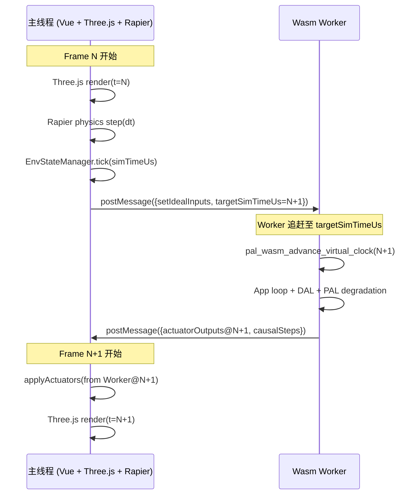
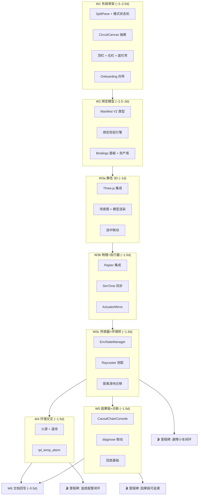

# 双视窗产品世界增强设计方案 — 总纲

| 项 | 内容 |
|----|------|
| 状态 | **Living（活文档）** |
| 创建日期 | 2026-07-09 |
| 范围层级 | ① 设计规范（`docs/design/05-frontend-workbench/03-dual-viewport-phased-design/`） |
| 上游规范 | [`02-dual-viewport-product-world-layout.md`](../02-dual-viewport-product-world-layout.md)（架构约束 SSOT） |
| 上游实施计划 | [`../../../implementation-plans/frontend/2026-07-09-dual-viewport-layout-plan.md`](../../../implementation-plans/frontend/2026-07-09-dual-viewport-layout-plan.md) |
| 关联 ADR | [ADR-0003](../../../decisions/unisim/0003-simulation-fidelity-boundary.md)、[ADR-0009](../../../decisions/unisim/0009-physical-behavior-simulation-fault-injection.md)、[ADR-0014](../../../decisions/unisim/0014-sim-single-virtual-core.md) |
| 负责人 | TBD |

> **定位**：本目录是 [`02-dual-viewport-product-world-layout.md`](../02-dual-viewport-product-world-layout.md) 的**增强设计细化**。上游规范定义 What & Why（架构约束、数据流、Manifest 契约）；本目录定义 **How in detail**（UI/UX 交互规范、性能约束、迁移策略、阶段交付详案）。阶段文档在实施时可直接作为开发指南。

---

## 1. 愿景与用户画像

### 1.1 产品愿景

将 Wink-AI 嵌入式工作台从**电路拓扑设计工具**提升为**嵌入式产品全仿真 IDE**——用户在同一浏览器界面完成电路连线、3D 产品装配、环境搭建、Wasm 仿真运行、因果链调试的完整闭环，且业务逻辑全程同源（wink-micro-os Wasm）。

### 1.2 目标用户画像

| 角色 | 特征 | 核心诉求 | 对 UI 复杂度的容忍度 |
|------|------|----------|---------------------|
| **教育用户** | 高中/大学生，初学嵌入式 | 拖入模板 → 观察运动 → 理解因果 | 低：需要引导和渐进披露 |
| **创客用户** | 有 Arduino 经验，做快速原型 | 连线 → 装配 → 仿真 → 验证想法 | 中：能接受分屏但需直观 |
| **AI 生成用户** | 通过 AI 对话生成逻辑 | 生成 → 沙箱验证 → 安全烧录 | 中：关注仿真结果而非操作 |
| **专业开发者** | 嵌入式工程师，用于调试 | trace / 因果链 / 退化参数精调 | 高：欢迎诊断模式的复杂面板 |

> **设计原则**：默认体验面向教育/创客用户（渐进披露），专业功能通过模式切换和面板展开逐步暴露。

### 1.3 核心场景

| # | 场景 | 涉及阶段 | 验收里程碑 |
|---|------|----------|-----------|
| S1 | 打开避障小车模板 → 仿真运行 → 观察小车遇墙停下 | W1–W3c | W3c |
| S2 | 在 3D 中拖拽火源 → 温度传感器检测到高温 → App 报警 | W4 | W4 |
| S3 | 电机没转 → 进入诊断模式 → 因果链追溯到 PWM 输出为 0 | W5 | W5 |
| S4 | 新用户首次打开 → 引导向导 → 3 步内看到可运行的仿真 | W1 | W1 |
| S5 | AI 生成避障逻辑 → 绑定自动建议 → 一键仿真验证 | W2+ | W2 |

### 1.4 成功指标（KPI）

| 指标 | 目标值 | 测量方式 | 验收阶段 |
|------|--------|----------|----------|
| **Time-to-First-Simulation**（新用户） | ≤ 3 分钟 | Onboarding 完成 → 首次 Play 成功 | W1（S4） |
| **M4 避障闭环演示成功率** | ≥ 95% | 标准桌面配置（1440px / Chrome）连续 20 次 | W3c |
| **simulate 模式 60fps 达成率** | ≥ 80% 帧 | Chrome Performance：`frameBudget.total ≤ 16ms` | W3b+ |
| **W1 电路回归零破坏** | HCTR 快照 100% 通过 | CI Vitest 快照 | W1 |
| **design → simulate 误放行率** | 0（W2 后含 bindings） | 缺绑定项目不得进入 simulate | W2 |

---

## 2. 架构全景

### 2.1 七区 IDE 终态

```text
┌─────────────────────────────────────────────────────────────────────────────┐
│ ① TOP BAR (两行式)                                                          │
│   行1: 项目名 / Target / Safety Level / 一致性标签                          │
│   行2: [design|simulate|diagnose] 模式工具条 (内容随模式切换)              │
├──────────┬──────────────────────────────────────────────────┬─────────────┤
│ ② LEFT   │ ③ CENTER — 双视窗工作区                           │ ④ RIGHT     │
│ ASSET    │  ┌─ Circuit View (2D) ────┐ ┌─ Product World (3D)─┐│ CONTEXT     │
│ LIBRARY  │  │ 开发板 + 外设 + HCTR   │ │ 产品 + 环境 + 物理  ││ INSPECTOR   │
│ (Accord.)│  └────────────────────────┘ └─────────────────────┘│ (6 Tabs)    │
│          │         ▲ 选中联动 / 电平动画 ▲ 执行器反馈 ▲          │             │
├──────────┴──────────────────────────────────────────────────┴─────────────┤
│ ⑤ BOTTOM CONSOLE — Trace / Causal Chain / Logs / Build / Static Check     │
└─────────────────────────────────────────────────────────────────────────────┘
  ⑥ FLOATING — 虚拟输入控件、3D Gizmo（火源/障碍物拖拽）
  ⑦ PIP      — 可选画中画：仿真时将电路缩为角落预览（**Phase 2**，见 §12）
```

#### 2.1.1 工作模式空间分配（扣除顶栏后）

> `70 : 30` 等比例为**中心双视窗内** Circuit : World 宽度比；**diagnose** 为三元分配（中心 + 底栏），勿与 `splitRatio` 数值混读。

| 模式 | 中心区高度 | 中心内 Circuit : World | 底栏高度 | 备注 |
|------|-----------|------------------------|----------|------|
| `design`（接线优先） | 75% | 70 : 30 | 25% | 默认 |
| `design`（结构优先） | 75% | 30 : 70 | 25% | 见 W1 §2.4 |
| `simulate` | 70% | 40 : 60 | 30% | 左栏默认折叠 |
| `diagnose` | **50%** | **50 : 50** | **50%** | 因果链占主视野；`splitRatio = 0.5` |

```text
diagnose 模式（侧栏可折叠后示意）:
┌────────────────────────────────────────┐
│ 顶栏                                    │
├──────────────────┬─────────────────────┤
│ Circuit (50%)    │ Product World (50%) │  ← 中心区 = 50% 视口高
├──────────────────┴─────────────────────┤
│ BOTTOM — Causal Chain / Trace / Logs   │  ← 底栏 = 50% 视口高
└────────────────────────────────────────┘
```

### 2.2 双域数据流（增强版）

在上游规范 §7 基础上增加 SimTime 同步和双缓冲细节：



**关键约束**：

1. **主线程为 Time Master**：每帧 `simTimeUs += dtUs`，Worker 被动追赶
2. **执行器反馈延迟 ≤ 1 帧**：可接受，因为物理世界在下一帧才应用
3. **Worker 追赶超时**：若 Worker 连续 3 帧未返回，主线程自动降低 SimSpeed 并显示 ⚠ 警告
4. **批量交换**：每帧 JS→Wasm 为 `IdealInputBatch`（全部 sensor），Wasm→JS 为 `ActuatorOutputBatch`（全部 GPIO/PWM），禁止逐引脚高频跨界

### 2.3 与 Wasm 仿真就绪度评估及 8 大 ABI 缺口的对齐

本增强设计方案深度对齐了 `web_simulation_readiness_assessment.md` 与 `sim_specs_deep_assessment.md` 中指出的 **8 大 TypeScript 数据结构/契约缺口** 及 **宿主-Worker 桥接层缺口**，并将它们分散落实到各交付波次中，确保 UI/3D 表现层与 Wasm 底层运行时 ABI 契约 100% 对齐：

| # | 评估报告指出的 ABI/TS 缺口 | 核心职责与映射 | 落实波次与文档 |
|---|-----------------------------|-----------------|----------------|
| **1** | 中断桥接队列与注册映射表 | 建立 Wasm 中断 Poll 队列，打通 UI 与 Wasm 异步通知 | **W3b** (`04-phase-w3b-physics-actuators.md`) |
| **2** | 协议级旁路 I2C 接口与总线引擎 | 抽象 I2CDevice/Bus 契约，支持虚拟 OLED 协议级旁路 | **W6+ (Phase 2)** (保留于 `WasmImports` 预定义) |
| **3** | 故障审计日志读取与解析器 | 从 C 侧 `s_fault_log` 环形缓冲拉取故障，记录于因果链 | **W5** (`07-phase-w5-causal-diagnostics.md`) |
| **4** | 功耗模型与能量遥测桥接类型 | 提供 `PinPowerModel` 配置，支持器件级能耗属性编辑 | **W2** (`02-phase-w2-binding-model.md`) |
| **5** | 故障域隔离框架与控制类型 | 将扁平的 Faults 调参升级为结构化的 `FaultDomainControl` | **W5** (`07-phase-w5-causal-diagnostics.md`) |
| **6** | 导线正交路由命令与连接描述协议 | 为 SVG 画布提供 orthogonal 路由与 path 解析类型支持 | **W1** (`01-phase-w1-layout-skeleton.md`) |
| **7** | 项目拓扑描述规范 (`sim-project.json`) | 将原 TS 拓扑结构整合至 `EmbeddedProjectManifest` V2 | **W2** (`02-phase-w2-binding-model.md`) |
| **8** | WASM 模块实例化胶水 imports 契约 | 规范 `WasmImports` 接口，解决 Emscripten 胶水函数类型安全 | **W3b** (`04-phase-w3b-physics-actuators.md`) |

---

## 3. 性能预算

### 3.1 主线程帧预算（目标 60fps = 16.67ms/帧）

| 阶段 | 预算 | 监控手段 | 超限降级策略 |
|------|------|----------|-------------|
| Three.js render | ≤ 8ms | `renderer.info` + `performance.mark` | 降低渲染分辨率（PiP 0.5x） |
| Rapier physics step | ≤ 3ms | step 前后计时 | 降低 physics sub-steps |
| EnvState.tick() | ≤ 1ms | 内联计时 | 缓存射线结果（每 2 帧更新） |
| postMessage 序列化 | ≤ 1ms | Transferable 优化 | 使用 SharedArrayBuffer（需 COOP/COEP） |
| Vue 响应式更新 | ≤ 3ms | Vue DevTools perf | 减少 reactive 属性粒度 |
| **总计** | **≤ 16ms** | Chrome Performance tab | 自动降至 30fps 并提示 |

### 3.2 资源预算

| 资源 | 预算 | 管控 |
|------|------|------|
| Three.js 包体积（gzip） | ≤ 150KB | 动态 `import()`，W1 不加载 |
| Rapier WASM（gzip） | ≤ 500KB | 动态 `import()`，W3a 不加载 |
| 刚体数量上限 | ≤ 50 | 超限 Warning + 阻止添加 |
| 活跃射线数 | ≤ 10 | 每 2 帧轮询非活跃射线 |
| 因果链环形缓冲 | 500 步 | 超出合并同类型连续步 |

### 3.3 响应式断点

| 断点 | 窗口宽度 | 布局调整 |
|------|----------|----------|
| 超宽屏 | ≥ 1920px | 双视窗 + 左右栏全展开 |
| 标准桌面 | 1440–1919px | 双视窗 + 左栏收窄（200px） |
| 小屏笔记本 | 1280–1439px | 默认折叠右栏为图标模式 |
| 最低支持 | 1280px | 双视窗最小各 280px + 单栏 |
| **不支持** | < 1280px | 显示「请使用桌面浏览器」 |

---

## 4. 全局交互规范

### 4.1 选中联动视觉状态矩阵

| 状态 | Circuit View | Product World | 右栏 |
|------|-------------|---------------|------|
| **Hover** | 外设/引脚 2px glow 描边 | 零件 outline highlight | — |
| **Selected** | 蓝色 3px 描边 + 引脚编号放大 | 蓝色描边 + Transform gizmo | 自动切至对应 Tab |
| **Binding Group** | 组内成员淡蓝 (#3B82F6/20%) 背景 | 组内成员淡蓝轮廓 | 所有绑定行高亮 |
| **Error** | 红色 2Hz 闪烁描边（`prefers-reduced-motion` 时改为静态红框） | 红色闪烁 + ⚠ 图标（同上） | Diagnostics Tab 弹出 |
| **Disabled (sim)** | 灰化 + 🔒 角标 | — | 编辑控件 disabled |
| **无选中** | — | — | 项目级摘要 |

### 4.2 键盘快捷键

| 快捷键 | 功能 | 可用模式 |
|--------|------|----------|
| `Ctrl+1` | 聚焦电路视窗 | 全局 |
| `Ctrl+2` | 聚焦 3D 视窗 | 全局 |
| `Ctrl+\` | 切换分屏方向（水平/垂直） | 全局 |
| `Space` | Play / Pause | simulate / diagnose |
| `Ctrl+Shift+R` | Reset 仿真 | simulate / diagnose |
| `Ctrl+Shift+D` | 切换 diagnose 模式 | simulate |
| `F` | 3D 聚焦选中对象 | 3D 视窗激活时 |
| `G` / `R` / `S` | Gizmo 移动/旋转/缩放 | design + 3D 视窗 |
| `Ctrl+Z` / `Ctrl+Y` | Undo / Redo | **Phase 2（W1 不实现）** |
| `Delete` | 删除选中对象 | design |
| `Escape` | 取消当前操作 / 清除选中 | 全局 |

### 4.3 拖拽交互规范

| 场景 | 视觉反馈 | 松开行为 |
|------|----------|----------|
| 机械件 → 电路视窗 | ❌ 禁止图标 + 箭头指向 3D 视窗 | 无操作 |
| 外设 → 3D 视窗 | ❌ + 提示「请先在电路视窗添加」| 无操作 |
| 机械件 → 3D 视窗 | ✅ 半透明 ghost + 吸附网格 | 创建 mechanical.parts 条目 |
| 环境道具 → 3D 视窗 | ✅ ghost + 放置预览 | 创建 environment.props 条目 |
| 模板 → 任意位置 | 双视窗同时 ghost 预览 | 弹出确认对话框 → 批量 Manifest patch |
| 拖拽经过分割条 | 分割条高亮 + 自动切换焦点视窗 | — |

### 4.4 错误与边缘情况

| 场景 | 处理策略 |
|------|----------|
| WebGL 不可用 / GPU 降级 | 3D 视窗降级为 2D 俯视简图 + Toast 提示 |
| Rapier WASM 加载失败 | 3D 视窗显示静态预览（无物理），simulate 阻塞 |
| Worker OOM（heartbeat 超时） | 自动暂停 + 底栏 Error + 建议减少物体 |
| `visibilitychange` 标签页不可见 | 暂停 Three.js 渲染（省 GPU）；**Worker 同步暂停 catch-up**（避免 SimTime 与画面脱节） |
| Chrome 后台 `rAF` 节流 | 与 `visibilitychange` 同样暂停 SimTime 推进；恢复可见时按当前 `simSpeed` 继续，不追帧补偿 |
| 浏览器窗口 < 1280px | 显示全屏遮罩提示 |

### 4.5 无障碍（Accessibility）摘要

| 项 | 规范 |
|----|------|
| 动效 | 尊重 `prefers-reduced-motion`；错误态默认静态红框，闪烁仅作增强 |
| 焦点 | 模式切换后焦点落至当前模式主控件（design→电路视窗，simulate→Play） |
| 键盘 | SplitPane 支持 `ArrowLeft/Right` 调整比例（步进 5%，`Shift` 步进 20%） |
| 对比度 | 错误/警告态文本与背景 ≥ WCAG 2.1 AA（4.5:1） |
| 国际化 | UI 文案使用 i18n key（`t('workbench.*')`）；MVP 仅 `zh-CN`，结构预留 `en-US`（见 §12） |

### 4.6 simulate 门禁分阶段（W1 / W2 过渡）

| 阶段 | `design → simulate` 门禁 | bindings 相关 |
|------|--------------------------|---------------|
| **W1** | 仅 **静态检查**（现有 `static-check` 逻辑） | **不校验** bindings；顶栏一致性标签隐藏或显示「—」 |
| **W2+** | **先** `static-check` **再** `binding-validation.service` | `validateBindings(manifest, { targetMode:'simulate', blockingOnly:true })`；blocking 时展开 Static Check / Diagnostics |

> W1：`workbench-mode.store.switchTo('simulate')` 仅调用 `static-check.service.ts`。  
> W2：见 [02-phase-w2-binding-model.md](./02-phase-w2-binding-model.md) §3.3——`VITE_MANIFEST_SCHEMA_V2=false` 时跳过 bindings 校验；B-09/10 在 simulate 下阻塞缺绑定/缺连线。

---

## 5. Onboarding 与渐进披露策略

### 5.1 首次体验引导（3 步向导）

```text
Step 1: "认识双视窗"
  - 电路视窗高亮 + 文字：「这里设计电路连线」
  - 3D 视窗高亮 + 文字：「这里搭建产品和环境」

Step 2: "选择一个模板"
  - 左栏 Templates 自动展开
  - 高亮「避障小车」模板 + 文字：「点击快速开始」

Step 3: "运行你的第一个仿真"
  - 顶栏 Play 按钮脉冲高亮
  - 文字：「点击运行，观察小车如何避障」
```

- 向导可通过 `localStorage` 标记 `onboarding_completed` 跳过
- 设置面板可重置向导

### 5.2 渐进披露规则

| 条件 | 界面变化 |
|------|----------|
| 项目无 `mechanical` 数据 | 3D 视窗显示引导卡片而非空白画布 |
| 用户首次添加机械件 | 3D 视窗自动展开至 ≥ 40% 宽度 |
| 用户首次切换 simulate | 底栏自动展开 Trace tab |
| Fault 首次触发 | diagnose 模式提示 banner + 因果链 Tab 脉冲高亮 |
| 所有 bindings 完整 | 顶栏一致性标签显示 ✅ Causal OK |

### 5.3 空状态设计

| 区域 | 空状态内容 |
|------|-----------|
| 3D 视窗（无 mechanical） | 插画 + 「拖入底盘开始构建你的产品」 + 模板快捷按钮 |
| 右栏 Bindings（无绑定） | 「电路外设和 3D 零件尚未关联」 + 自动建议按钮 |
| 因果链面板（无数据） | 「运行仿真后，因果链将在此展示」 |
| 左栏 Active 列表（空项目） | 「从上方库中拖入组件」 |

### 5.4 底栏（Bottom Console）默认行为

> W1 实现底栏与模式联动壳层；W5 充实 Causal Chain 内容。详见 [01-phase-w1-layout-skeleton.md](./01-phase-w1-layout-skeleton.md) §9。

| 工作模式 | 底栏默认状态 | 默认激活 Tab | 自动展开条件 |
|----------|-------------|-------------|-------------|
| `design` | 折叠或 25% 高 | `Static Check` | 静态检查有 warning/error |
| `simulate` | 展开 30% 高 | `Trace` | 首次进入 simulate（§5.2） |
| `diagnose` | 展开 **50%** 高 | `Causal Chain` | 进入 diagnose 或 Fault 触发 |

- 用户手动拖拽底栏高度后，记入 `layout.store.bottomPanelHeight`，模式切换仅在未手动调整时应用默认高度（与分屏 `userOverriddenRatio` 同理，见 W1 `layout.store`）。
- `diagnose` 模式下底栏为主视野，中心双视窗压缩至 50% 高度（§2.1.1）。

---

## 6. 重构迁移策略

### 6.1 EmbeddedWorkbench.vue Strangler Fig 计划

当前 [`EmbeddedWorkbench.vue`](../../../../../wink-ai/packages/embedded-frontend/src/views/EmbeddedWorkbench.vue) 为 **3234 行单体文件**。采用 Strangler Fig 模式渐进拆分：

| 步骤 | 波次 | 动作 | 验证 |
|------|------|------|------|
| S1 | W1 前 | 编写 E2E 测试覆盖关键用户流（添加外设 → 连线 → 仿真 → trace） | Playwright 或 Cypress |
| S2 | W1 | 在 Workbench 内引入 `<SplitPane>` 包裹现有 canvas 和新的空 3D 占位 | 现有功能不回归 |
| S3 | W1 | 提取 SVG 画布相关代码（~1200 行）→ `CircuitCanvas.vue` | 画布行为零变化 |
| S4 | W1 | 提取顶栏 → `TopBar.vue` + 右栏 → `ContextInspector.vue` | 各组件独立可测 |
| S5 | W2 | 提取左栏 → `LayeredAssetLibrary.vue` | Accordion 分区工作 |
| S6 | W3a | 引入 `ProductWorld3D.vue`（新代码，非抽离） | Three.js 正常渲染 |
| S7 | 持续 | Workbench.vue 最终仅保留布局壳 + 模式状态机（目标 < 300 行） | 清晰的组件依赖树 |

### 6.2 Stores 迁移

当前 [`simulation-client.ts`](../../../../../wink-ai/packages/embedded-frontend/src/services/simulation-client.ts) 使用裸 `ref()` 导出状态。迁移计划（**技术选型：Pinia**，见总纲 §11）：

| 现有模块 | 目标 Store | 波次 |
|----------|-----------|------|
| `simulation-client.ts` 状态 refs | `simulation.store.ts`（Pinia） | W1 Task 1.0 |
| Workbench 内的 UI 状态 | `workbench-mode.store.ts` + `layout.store.ts` | W1 |
| 选中状态（散落在 Workbench） | `selection.store.ts` | W1 |
| Canvas 状态（组件位置等） | `canvas.store.ts` | W1 |
| Manifest 数据 | `project.store.ts`（W1 空壳，W2 接 Manifest v2） | W1 + W2 |
| 右栏 Tab / Pin | `inspector.store.ts` | W1 |

### 6.3 Worker 协议向后兼容

当前 Worker 使用 `'INIT'`, `'START'`, `'STATE_UPDATE'` 等字符串协议。新协议引入 `protocolVersion` 握手：

```typescript
// Worker 启动握手
Main → Worker: { type: 'HANDSHAKE', protocolVersion: 2 }
Worker → Main: { type: 'HANDSHAKE_ACK', supportedVersions: [1, 2] }

// 过渡期：Worker 同时支持 v1 和 v2 命令
// v1: { type: 'SET_PIN_IDEAL', payload: { pin, level } }
// v2: { type: 'setIdealInputs', inputs: IdealInputBatch }
```

### 6.4 测试策略

```text
Unit (Vitest)
  → Store 状态机、binding 校验、ConnectionRouting 解析、EnvState 纯函数
Integration
  → Worker mock + postMessage 协议 v2、SimTime 追赶超时、layout/mode 联动
E2E (Playwright)
  → W1 smoke（Task 1.6）：双视窗 + simulate 不崩溃 + Onboarding
  → W3c 回归：避障闭环 M4 全流程
```

| 层级 | 工具 | 首建阶段 | CI 策略 |
|------|------|----------|---------|
| Unit | Vitest | W1 | 每次 PR |
| 快照 | Vitest + SVG path | W1（HCTR） | 每次 PR |
| Integration | Vitest + Worker mock | W2 / W3b | 每次 PR |
| E2E smoke | Playwright | W1 Task 1.6–1.7 | `main` nightly（可选） |
| E2E 回归 | Playwright | W3c | release 前必跑 |

---

## 7. 阶段路线总览

### 7.1 阶段依赖图



### 7.2 可演示里程碑

| 里程碑 | 阶段末 | 演示场景 | 录屏时长 |
|--------|--------|----------|----------|
| **M0: 分屏可拖拽** | W1 | Onboarding 3 步完成 → design 连线 → simulate 双视窗可见（3D 占位）→ Play 不崩溃 | 45s |
| **M1: 绑定可配** | W2 | 配置超声 raycast 绑定 → 缺绑定时 simulate 阻塞 → 补全后放行 | 45s |
| **M2: 3D 可见** | W3a | 避障小车底盘在 3D 中渲染 → 轨道控制旋转观察 → 选中联动 | 30s |
| **M3: 轮子会转** | W3b | PWM 输出 → 3D 中轮子按占空比转动 → 底盘移动 | 30s |
| **M4: 避障闭环** | W3c | 小车前进 → 遇墙 → 超声检测距离 → App 停止电机 → 小车停下 | 60s |
| **M5: 温感报警** | W4 | 拖拽火源靠近 → DHT 温度升高 → App 报警 → LED 亮 | 45s |
| **M6: 因果追溯** | W5 | M4 全流程在因果链面板中 ≥5 步可正向/反向追溯 | 60s |

### 7.3 Feature Flag 矩阵

| Flag | W1 | W2 | W3a | W3b | W3c | W4 | W5 | 最终 |
|------|----|----|-----|-----|-----|----|----|------|
| `VITE_LEGACY_SIM_TAB` | true | true | true | true | false | false | false | 删除 |
| `VITE_ENABLE_PRODUCT_WORLD` | false | false | true | true | true | true | true | 删除 |
| `VITE_MANIFEST_SCHEMA_V2` | false | true | true | true | true | true | true | 删除 |
| `VITE_ENABLE_CAUSAL_CHAIN` | — | — | — | — | — | — | true | 删除 |
| `VITE_ENABLE_3D_PHYSICS` | — | — | false | true | true | true | true | 删除 |

### 7.4 工期估算与缓冲

| 项 | 理想人天 | 含缓冲（×1.35） | 说明 |
|----|---------|----------------|------|
| W1–W6 合计 | ~11.5d | **~15.5d** | 含单体抽离、3D、因果链 |
| 单阶段缓冲 | — | +0.5d / 阶段 | 用于 E2E、回归、文档修补 |

**Kill criteria（阶段级）**：

| 阶段 | 若未达标 | 降级方案 |
|------|----------|----------|
| W3c | M4 避障闭环 2 天内未打通 | 暂保留距离滑块 + 静态 3D，物理闭环移至 W3c.1 |
| W3b | Rapier WASM 加载失败率 > 10% | 静态 3D + 执行器镜像（无刚体碰撞） |
| W1 | CircuitCanvas 抽离 2 天内回归 | 推迟抽离至 W1.5，先交付 SplitPane + 模式机 |

### 7.5 风险登记表

| ID | 风险 | 概率 | 影响 | 缓解措施 | 责任阶段 |
|----|------|------|------|----------|----------|
| R1 | `EmbeddedWorkbench.vue` 抽离引入电路回归 | 高 | 高 | HCTR 快照 + `VITE_LEGACY_SIM_TAB` + W1 E2E smoke | W1 |
| R2 | Rapier WASM 加载失败 / 体积超预期 | 中 | 高 | 动态 import + 静态预览降级 + Kill criteria | W3b |
| R3 | Worker 追赶超时导致 SimTime 漂移 | 中 | 高 | 3 帧降速 + `visibilitychange` 同步暂停 | W3b |
| R4 | WebGL 不可用（校园机房旧 GPU） | 中 | 中 | 2D 俯视降级 + Toast | W3a |
| R5 | bindings 校验过严阻塞教育用户 | 中 | 中 | Warning / Error 分级；模板预填 bindings | W2 |
| R6 | 11.5d 理想工期不足 | 高 | 中 | §7.4 缓冲 + P0/P1 任务分级（W1） | 全程 |
| R7 | OLED I2C 旁路未实现导致用户预期落差 | 低 | 中 | §12 标明 2D 卡片降级；ADR 缺口 #2 推迟 | W2+ |

---

## 8. 阶段文档导航

| 文档 | 阶段 | 核心内容 |
|------|------|----------|
| [01-phase-w1-layout-skeleton.md](./01-phase-w1-layout-skeleton.md) | W1 | SplitPane、工作模式状态机、CircuitCanvas 抽离、顶栏/右栏/底栏壳、Onboarding |
| [02-phase-w2-binding-model.md](./02-phase-w2-binding-model.md) | W2 | Manifest V2 类型、绑定校验、映射类型注册表、资产库 Accordion |
| [03-phase-w3a-static-3d-preview.md](./03-phase-w3a-static-3d-preview.md) | W3a | Three.js 集成、场景图、OrbitControls、WebGL 降级 |
| [04-phase-w3b-physics-actuators.md](./04-phase-w3b-physics-actuators.md) | W3b | Rapier 物理、SimTime 同步协议、ActuatorMirror、帧预算监控 |
| [05-phase-w3c-sensors-env-bridge.md](./05-phase-w3c-sensors-env-bridge.md) | W3c | EnvStateManager、Raycaster 测距、距离滑块迁移、噪声可视化 |
| [06-phase-w4-environment-interaction.md](./06-phase-w4-environment-interaction.md) | W4 | 火源温场、环境道具、tpl_temp_alarm、EnvironmentInspector |
| [07-phase-w5-causal-diagnostics.md](./07-phase-w5-causal-diagnostics.md) | W5 | 因果链数据模型、正向/反向追溯、diagnose 联动、回放基础 |
| [08-phase-w6-documentation-schema.md](./08-phase-w6-documentation-schema.md) | W6 | Manifest schema 回写、实施计划归档、迁移脚本验收 |

目录索引见 [README.md](./README.md)。

---

## 9. W6 文档回写 Checklist

> 完整 Task 与验收见 [08-phase-w6-documentation-schema.md](./08-phase-w6-documentation-schema.md)。

| 动作 | 目标文件 | 状态 |
|------|----------|------|
| 回写 `mechanical` / `environment` / `bindings` 节定义 | [`02-project-manifest-schema.md`](../../03-app-codegen/02-project-manifest-schema.md) | 待办 |
| 更新 §2–§3 交叉引用 + 中心区域描述 | [`01-frontend-workbench-architecture.md`](../01-frontend-workbench-architecture.md) | 待办 |
| 新增本目录导航条目 | [`../../README.md`](../../README.md) | 待办 |
| 评估是否需要新 ADR（Three.js 域边界） | `decisions/` | 评估中（默认：ADR-0009 已覆盖，见 W6 §6） |
| 实施计划归档并指向 phased-design | [`2026-07-09-dual-viewport-layout-plan.md`](../../../implementation-plans/frontend/2026-07-09-dual-viewport-layout-plan.md) | ✅ v1.1 |
| 分阶段增强设计目录 | [`03-dual-viewport-phased-design/`](./README.md) | ✅ |
| 新增本目录导航条目 | [`../../README.md`](../../README.md) | ✅ |
| Manifest schema v2 迁移脚本验收 | `../../../../../wink-ai/packages/embedded-frontend/src/services/manifest-migration.ts` | 待办（W6） |

---

## 10. Manifest 字段对齐表（SSOT）

分阶段文档、TypeScript 类型、JSON 文件**必须以本表为准**。早期草稿中的别名仅允许在迁移层做兼容，不得写入新代码。

| 概念 | 正式字段（JSON / schema） | 禁止使用的草稿别名 | 定义来源 |
|------|---------------------------|-------------------|----------|
| 项目 ID | `id` | — | `02-project-manifest-schema.md` |
| 项目名称 | `name` | `projectName` | 同上 |
| 器件实例 ID | `devices[].componentId` | `devices[].id` | 同上 |
| 环境温场标量 | `environment.fields[].valueC` | `intensity` | [`02-dual-viewport-product-world-layout.md`](../02-dual-viewport-product-world-layout.md) §8.3 |
| 绑定→器件 | `bindings.*.deviceComponentId` | `deviceId` | 02-layout §8.4 |
| 绑定→机械关节 | `bindings.actuators[].mechanicalJointId` | — | 02-layout §8.4 |
| 绑定→机械零件 | `bindings.sensors[].mechanicalPartId` 等 | — | 02-layout §8.4 |
| 绑定→环境道具 | `bindings.sensors[].environmentPropId` | — | 02-layout §8.4 |
| 引脚解析 | `binding-pin-resolver.ts`（W2 接口，W3c Worker 实现） | — | W2 §2.5 |

**TypeScript 约定**：`types/manifest-v2.ts` 字段名与上表一致；`migrateManifest()` 负责吞掉历史别名（如将只读阶段的 `intensity` 映射为 `valueC`）。

---

## 11. Store 全景与创建阶段

| Store | 职责 | 创建阶段 | 持久化 |
|-------|------|----------|--------|
| `workbench-mode.store` | design / simulate / diagnose | W1 | 否 |
| `layout.store` | 分屏比例、侧栏折叠、底栏高度 | W1 | localStorage |
| `selection.store` | 双视窗选中、绑定组高亮 | W1 | 否 |
| `canvas.store` | 2D 外设位置、布线 UI 态（从 Workbench 迁出） | W1 | 否 |
| `project.store` | Manifest SSOT、patch / 模板应用 | W1 壳 + W2 充实 | 未来 wink-project.json |
| `inspector.store` | 右栏 Tab 激活、Pin 状态 | W1 | 否 |
| `simulation.store` | 从 `simulation-client.ts` refs 迁入 | W1 | 否 |
| `causal-chain.store` | 因果链缓冲、筛选 | W5 | 否 |

**状态管理技术选型（W1 定案）**：采用 **Pinia** + `pinia-plugin-persistedstate`（仅 `layout.store` 等 UI 偏好）。理由：多面板联动、DevTools 调试、与 Vue 3 生态一致。`package.json` 在 W1 Task 1.0 添加依赖。

---

## 12. 明确推迟的能力（非 MVP）

| 能力 | 推迟至 | 说明 |
|------|--------|------|
| Undo/Redo（`Ctrl+Z`） | Phase 2 | 需 Manifest command stack；W1 快捷键预留但不实现 |
| SharedArrayBuffer 零拷贝 | Phase 3 | 需 COOP/COEP；当前用结构化 clone + 批量消息 |
| 仿真回放拖拽 | Phase 3 | W5 仅预留 UI；见 W5 §7 |
| OLED framebuffer → 3D 纹理 | MVP-2 | 见 02-layout §14 |
| glTF 外模 | Phase 2 | W3a 仅 primitive |
| 完整 E2E（Playwright） | W1 smoke + W3c 回归 | 见 W1 Task 1.6–1.7 |
| PiP 画中画模式 | Phase 2 | W1 仅在 `layout.store` 预留字段；无 UI |
| 多 Tab Pin（Inspector） | Phase 2 | W1 仅单 Pin |
| i18n 多语言 UI | Phase 2 | W1 起文案走 i18n key，仅加载 `zh-CN` |
| AI 绑定自动建议 UI | W2 | 场景 S5；逻辑在 `binding-suggestion.service` |

---

## 13. 2D 电路坐标与 3D 世界坐标

| 域 | 坐标系 | 单位 |
|----|--------|------|
| Circuit View | SVG 画布，原点左上，Y 向下 | px |
| Product World | Three.js 右手系，Y 向上 | m |

**模板装配时**由 `manifest-patch.service` 写入默认 3D transform；不要求 2D 外设像素位置与 3D 零件自动对齐。绑定关系通过 `bindings` 表达语义关联，而非几何共位。

未来可选：`devices[].position` → 启发式 3D 摆放（Phase 2，非 MVP）。

---

*文档变更记录：*

- 2026-07-09：初版创建（增强设计总纲：用户画像、性能预算、交互规范、Onboarding、迁移策略、阶段路线）。
- 2026-07-09：评审修补——§10 Manifest 对齐表、§11 Store 全景、§12 推迟能力、§13 坐标系、W6 导航、实施计划 SSOT 说明。
- 2026-07-09：二次评审修补——§1.4 KPI、§2.1.1 diagnose 布局、§4.5–4.6、§5.4 底栏、§6.4 测试策略、§7.4–7.5 工期/风险、W1 bindings 过渡、§12 PiP/i18n/AI。
- 2026-07-09：W2 评审回写——§4.6 门禁顺序与 B-09/10；§10 引脚解析 SSOT。

