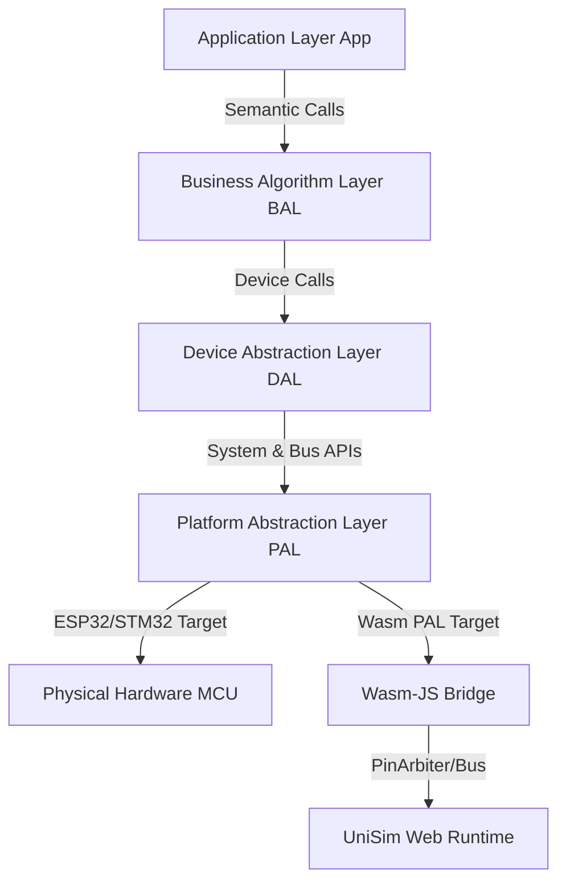

# 3.1 Device Abstraction Layer (DAL) Architecture & Device Tree Generation

<!-- i18n-meta
source: docs/zh/design/02-wink-micro-os/01-dal-device-abstraction.md
translated: 2026-08-17
glossary-version: v1.0
translator: AI-assisted
sync-status: up-to-date
-->

| Item | Content |
|---|---|
| **Code-Mapping** | `/src/core/dal/` (`dal_gpio.h`, `dal_i2c.h`, `dal_sensor.h`) |
| **Related ADRs** | ADR-0004, ADR-0003, ADR-0040, ADR-0046, ADR-0048, ADR-0050, ADR-0051, ADR-0056 |

The Device Abstraction Layer (DAL) provides semantic business interfaces to the App and BAL layers, encapsulating platform hardware details.

---

## 1. Core Vision & Design Intent

1. **Semantic Business Interfaces**: Exposes peripherals as logical components (e.g. distance in cm, angle in degrees, framebuffers), abstracting hardware register timings.
2. **Physical Source Substitution**: Sinks simulation bypasses to the PAL layer while compiling identical DAL driver code across physical MCUs and WebAssembly.

---

## 2. Layered Architecture

