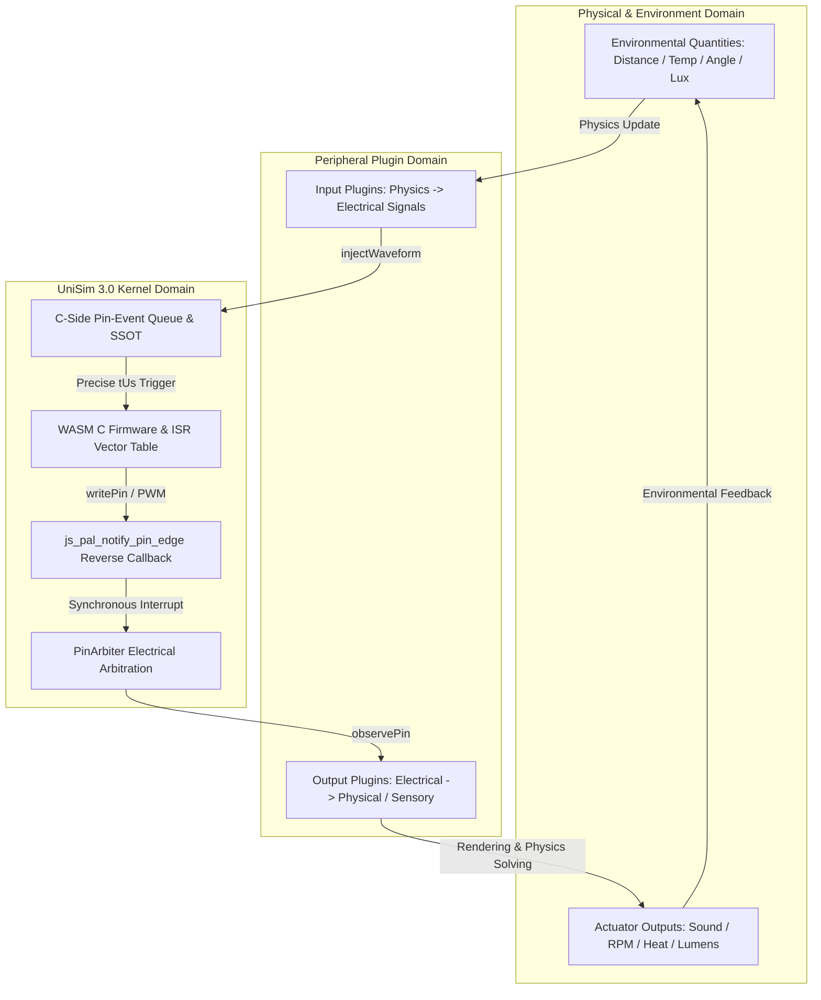

# Bidirectional High-Fidelity Closed-Loop Simulation Architecture

<!-- i18n-meta
source: docs/zh/design/04-wasm-simulation/02-mechanisms/12-bidirectional-high-fidelity-closed-loop.md
translated: 2026-08-17
glossary-version: v1.0
translator: AI-assisted
sync-status: up-to-date
-->

| Item | Content |
|---|---|
| Document Level | ① Design Specification (UniSim 3.0 / mechanisms) |
| Document Status | **Active** (Deployed 2026-08-11; UniSim bidirectional closed-loop SSOT) |
| **Landed** | **Landed** (Waveform batch injection / C-driven SSOT / `js_pal_notify_pin_edge` reverse callback / PinArbiter electrical arbitration / Plugin bidirectional math models) |
| Supporting Axis | Axis A (Peripheral Source), Axis B (Timebase), Axis E (Scheduler Concurrency) |
| Associated Code | `@wink-ai/unisim` (PluginContext, PinArbiter, UnisimBridgeFactory), `wink-micro-os/targets/wasm/wasm_bridge.h` |

> This document defines the bidirectional closed-loop high-fidelity simulation model, covering input/output fidelity, plugin physics-electrical algorithms, and electrical arbitration boundaries.

---

## 1. Architectural Vision & Closed-Loop Overview

Embedded control systems operate in physical environments as **bidirectional closed loops**:
- **Input Direction (Peripheral $\rightarrow$ MCU)**: Physical quantities $\rightarrow$ Electrical/digital signals (Sensors);
- **Output Direction (MCU $\rightarrow$ Peripheral)**: Electrical signals $\rightarrow$ Physical actuation/sound/light/heat (Actuators);
- **Closed-Loop Feedback**: Firmware output actuates hardware, altering the physical environment, which sensors detect and feed back to the MCU.



### 1.1 Kernel vs Plugin Boundary

| Domain | UniSim Simulation Kernel | Peripheral Plugins |
|---|---|---|
| **Core Responsibilities** | Pure digital & microsecond time stepping, C event queues, `PinArbiter`, `js_pal_notify_pin_edge` callbacks | Bidirectional physical-electrical models, Web Audio synthesis, 2nd-order ODE dynamics, UI rendering |
| **Data Formats** | Logic 0/1, absolute timestamps (`tUs: bigint`), normalized analog (`0.0 ~ 1.0`) | Physical units (cm, °C, RPM, Lux, dBA), 3D geometries |
| **Stability** | Frozen core ABI signatures | Pluggable, highly autonomous mathematical modules |

---

## 2. Input High-Fidelity (Peripheral $\rightarrow$ MCU)

Peripherals relying on microsecond edge captures (HC-SR04 ultrasonic echo, infrared NEC protocols, pulse counters) avoid jitter through **preloaded waveform sequences + C-driven SSOT**.

### 2.1 Waveform Batch Injection

```typescript
export interface WaveformEdge {
  tUs: bigint;      // Absolute virtual timestamp (based on VirtualClock.getUs())
  level: 0 | 1;     // Target level
}

export interface Waveform {
  pin: number;
  edges: WaveformEdge[];   // Strictly ascending by tUs
  generation?: number;     // Token used to invalidate stale waveforms
}
```

### 2.2 Absolute BigInt Timestamps & Zero Jitter
- Replaces floating-point durations with absolute `bigint tUs`.
- Accurately models acoustic propagation delays: $t_{\text{prop}} = \frac{2D}{v}$.

### 2.3 C-Driven Single Source of Truth
- `PluginContext.injectWaveform` enqueues edges directly into the C event queue via `push_pin_event`.
- The JavaScript layer avoids maintaining redundant queues.

### 2.4 Input High-Fidelity Code Modification Matrix

| Repository | Module Contract | Code Modification Responsibility |
|:---|:---|:---|
| **`wink-micro-os`**<br>*(C PAL Layer)* | `targets/wasm/wasm_bridge.c`<br>`targets/wasm/wasm_bridge.h` | 1. **Dedicated Ring Buffer**: Allocates 512-depth C `pin-event` queue.<br>2. **Microsecond Triggers**: Pops edges at exact microsecond offsets during virtual clock stepping to invoke firmware ISRs.<br>3. **Generation Token**: Invalidates stale edges upon receiving new waveforms. |
| **`wink-ai` (`@wink-ai/unisim`)**<br>*(TS Simulation Kernel)* | Waveform Engine<br>PluginContext<br>WasmPhysicalBridge | 1. **Type Definitions**: Declares `WaveformEdge{tUs:bigint}`.<br>2. **First-Class API**: Exposes `injectWaveform(pin, waveform)`.<br>3. **WASM Proxy**: Dispatches to `pal_wasm_push_pin_event`.<br>4. **Mode Fallback**: Applies static level degradation under behavioral mode. |
| **Peripheral Plugins**<br>*(Implementation Layer)* | `peripherals/builtin/ultrasonic/1.0.0/src/simulation.ts` | 1. **Removes Bypasses**: Deletes legacy `deferUs` pin overrides.<br>2. **Physical Math**: Computes propagation delays via $v = 331.4 + 0.61T$.<br>3. **Batch Injection**: Constructs and submits `Waveform` arrays on trigger pulses. |

---

## 3. Output High-Fidelity (MCU $\rightarrow$ Peripheral)

### 3.1 `js_pal_notify_pin_edge` C-to-JS Synchronous Notification
When firmware sets pin levels or processes scheduled pin events, the engine invokes:
`js_pal_notify_pin_edge(pin: uint8_t, level: uint8_t, current_virtual_us: uint64_t)`

### 3.2 Jitter-Free Recording & Instant `PinArbiter` Updates
1. Updates `PinArbiter` states at the identical virtual microsecond timestamp;
2. Feeds transitions into `SessionRecorder` for bit-exact trace logs.

### 3.3 High-Frequency PWM Duty Cycle Windowing
For ultra-high frequency PWM (>20kHz), `onDutyChange` smooths signals over a sliding window ($0.0 \sim 1.0$), reducing canvas draw overhead.

### 3.4 Output High-Fidelity Code Modification Matrix

| Repository | Module Contract | Code Modification Responsibility |
|:---|:---|:---|
| **`wink-micro-os`**<br>*(C PAL Layer)* | `targets/wasm/wasm_bridge.h`<br>`targets/wasm/wasm_bridge.c` | 1. **Declares Reverse Callback**: `extern void js_pal_notify_pin_edge(uint8_t pin, uint8_t level, uint64_t current_virtual_us);`.<br>2. **Synchronous Invocation**: Calls callback during `pal_gpio_set_level()` transitions. |
| **`wink-ai` (`@wink-ai/unisim`)**<br>*(TS Simulation Kernel)* | ABI Imports<br>Bridge Factory<br>PinArbiter | 1. **TS ABI Declarations**: Adds signature to `WasmImports`.<br>2. **Reverse Handler**: Updates `PinArbiter` and notifies `SessionRecorder`.<br>3. **Electrical Arbitration**: Resolves push-pull and open-drain conflicts. |
| **Peripheral Plugins**<br>*(Implementation Layer)* | `peripherals/builtin/buzzer/`<br>`peripherals/builtin/rc_servo/`<br>`peripherals/builtin/led/` | 1. **Pin Subscriptions**: Subscribes to pin states via `observePin`.<br>2. **Sensory Rendering**: Synthesizes audio waveforms via Web Audio or animates servo joint kinematics. |

---

## 4. Plugin Physical-Electrical Mathematical Models

### 4.1 Physical $\rightarrow$ Electrical Modeling
- **Ultrasonic Speed of Sound**:
  $$v_{\text{sound}} = 331.4 + 0.61 \times T \text{ (m/s)}, \quad t_{\text{echo}} = \frac{2 \cdot D}{v_{\text{sound}}}$$
- **NTC Thermistor Curve**:
  $$R(T) = R_0 \cdot e^{B (\frac{1}{T} - \frac{1}{T_0})}, \quad V_{\text{out}} = V_{\text{cc}} \cdot \frac{R_{\text{pull}}}{R(T) + R_{\text{pull}}}$$

### 4.2 Electrical $\rightarrow$ Physical Modeling
- **Piezo Buzzer Web Audio Synthesis**:
  $$y(t) = A_1 \sin(2\pi f t) + \frac{A_1}{3} \sin(6\pi f t) + \frac{A_1}{5} \sin(10\pi f t)$$
- **2nd-Order Servo Kinematics**:
  $$\frac{d^2\theta}{dt^2} + 2\zeta\omega_n \frac{d\theta}{dt} + \omega_n^2 \theta = \omega_n^2 \theta_{\text{target}}$$

---

## 5. PinArbiter & Architectural Non-Goals

### 5.1 `PinArbiter` Capabilities
- **Logical Modes**: Push-Pull, Open-Drain, Weak Pull-Up/Down;
- **Contention Trapping**: Strong conflicting drivers trigger short-circuit warnings via `PinContentionCallback`.

### 5.2 Non-Goals & Architectural Boundaries
1. **No SPICE-level Dynamic Voltage Sag**: Does not compute Kirchhoff nodal equations for load-induced voltage drops.
2. **No Parasitic Slew Rate or Overshoot Modeling**: Pin transitions remain clean digital logic edges.
3. **No Cycle-Accurate CPU Emulation**: Wasm executes natively without emulating microarchitectural pipeline stages.

---

## 6. Summary & Implementation Rules

UniSim 3.0 delivers closed-loop fidelity through **C-Driven SSOT + `js_pal_notify_pin_edge` callbacks + bidirectional plugin math + PinArbiter electrical arbitration**.
