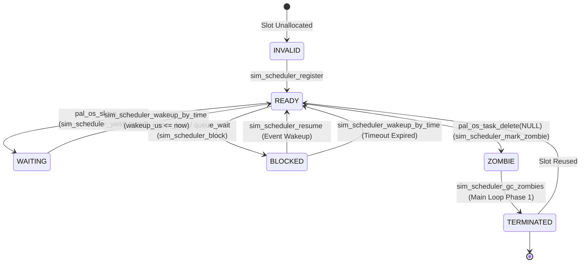

# 4.7 Simulation Cooperative Deterministic Scheduler Model

<!-- i18n-meta
source: docs/zh/design/04-wasm-simulation/archive/07-scheduler-model.md
translated: 2026-08-17
glossary-version: v1.0
translator: AI-assisted
sync-status: up-to-date
-->

> **SSOT Status**: This document records the design specifications for [ADR-0013 Cooperative Scheduler](../../../decisions/unisim/0013-sim-cooperative-scheduler.md) and [ADR-0014 Single Virtual Core Tradeoffs](../../../decisions/unisim/0014-sim-single-virtual-core.md).

---

## 1. Purpose

The **Cooperative Deterministic Scheduler** (Wink Sim Scheduler) implemented across Host and Wasm targets provides multitasking simulation:
1. **Multitasking Concurrency**: Supports `while(1) { sleep; }` loops and ring-buffer communications.
2. **Bit-Exact Determinism**: Identical task registration order + identical yield patterns $\rightarrow$ 100% reproducible execution traces.
3. **Zero Deployment Friction**: Runs in a single-threaded Wasm sandbox without `SharedArrayBuffer` or COOP/COEP headers.
4. **Single-Source Parity**: Aligns with FreeRTOS App-level APIs (`pal_os_task_create`, `pal_os_sleep_ms`, `pal_os_ringbuf`).

---

## 2. Task State Machine



| State | Semantics | Written By |
|---|---|---|
| `INVALID` | Slot unallocated (Zero-initialized) | `sim_scheduler_reset` |
| `READY` | Eligible for selection by `pick_next` | `register` / `wakeup_by_time` / `resume` |
| `WAITING` | Timed sleep; transitions to READY when `wakeup_us <= now` | `yield_timed` |
| `BLOCKED` | Waiting on mutex/queue; `timeout_fired` indicates TIMEOUT | `block` |
| `ZOMBIE` | Yielded; awaiting garbage collection in main loop | `mark_zombie` |
| `TERMINATED` | Freed slot available for reuse | `gc_zombies` |

---

## 3. Main Scheduler Loop Structure

```text
loop while (main_task not TERMINATED and max_ticks not reached):
  [Phase 0] Wasm target: poll pal_wasm_dispatch_pending_interrupts()
  [Phase 1] sim_scheduler_gc_zombies()  -> Transitions ZOMBIE to TERMINATED, frees fiber
  [Phase 2] sim_scheduler_wakeup_by_time(host_sim_time_us()) -> Transitions expired tasks to READY
  [Phase 3] next = sim_scheduler_pick_next()
     ├─ NO_READY: host_sim_advance_to(next_wakeup_us); continue
     └─ Otherwise:
  [Phase 4] sim_scheduler_set_current(next)
            wall_start = host_wall_clock_us()
            sim_ctx_switch(main_ctx, task_ctx)
            sim_scheduler_set_current(NO_READY)
            duration = host_wall_clock_us() - wall_start
            if duration > wcet_threshold: wink_runtime_fault(callbacks, 8002)
            if next == main_task_id: ticks_run++
```

---

## 4. Pure Decision Functions

- **`sim_scheduler_pick_next`**: Deterministic Round-Robin scanning across `tasks[0..MAX_TASKS-1]`.
- **`sim_scheduler_wakeup_by_time`**: Evaluates active deadlines against `now_us` and marks expired tasks `READY`.
- **`sim_scheduler_gc_zombies`**: Destroys fiber contexts in the main scheduler thread.

---

## 5. Host vs Wasm Comparison

| Dimension | Host (Windows) | Wasm (Emscripten) |
|---|---|---|
| Fiber API | `CreateFiber` / `SwitchToFiber` / `DeleteFiber` | `emscripten_fiber_init` / `emscripten_fiber_swap` |
| Sim Timebase | `host_sim_time_us()` (Static counter) | `pal_wasm_advance_virtual_clock(us)` |
| WCET Clock | `host_wall_clock_us()` (QPC) | `emscripten_get_now() * 1000` |
| Minimum Stack | `WINK_SIM_STACK_MIN = 32 KB` | `16 KB Stack` + `2 KB Asyncify Stack` |
| Interrupt Dispatch | No-op (No async IRQs) | `pal_wasm_dispatch_pending_interrupts()` per tick |

---

## 6. Known Behavioral Boundaries

1. **Un-preemptible CPU Computation**: Tasks exceeding execution timeslice limits without yielding trigger WCET Fault `8002`.
2. **Instruction-Level Concurrency Excluded**: Multicore instruction interleaving is excluded ([ADR-0014](../../../decisions/unisim/0014-sim-single-virtual-core.md)).
3. **Interrupt Latency**: Dispatched at scheduler tick boundaries ($O(\text{tick})$).
4. **`busy_wait_us` Advances Virtual Time**: Does not consume physical CPU cycles or trigger WCET Faults.
