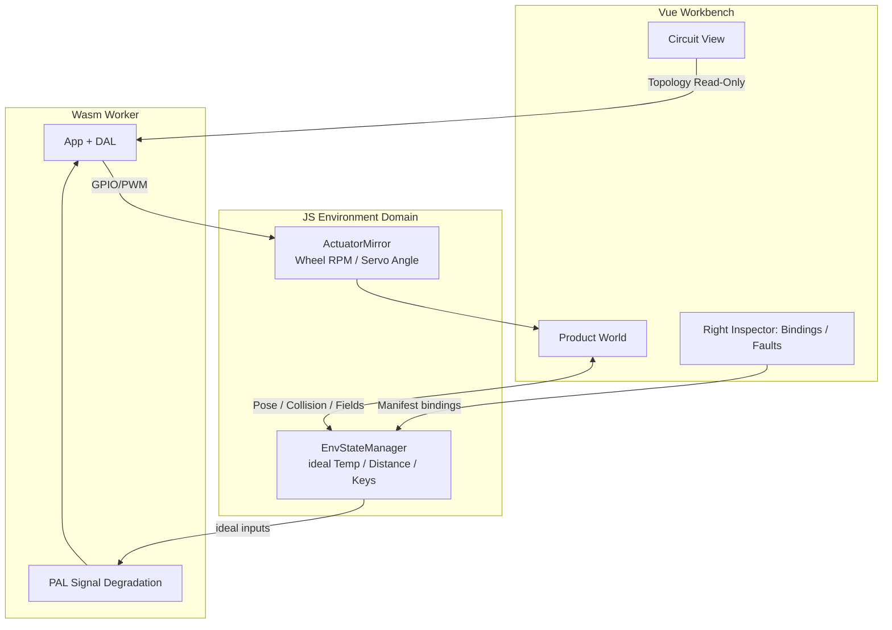

# 16. Dual-Viewport Product World Layout & 3D Mechanical Simulation Specification

<!-- i18n-meta
source: docs/zh/design/05-frontend-workbench/02-dual-viewport-product-world-layout.md
translated: 2026-08-17
glossary-version: v1.0
translator: AI-assisted
sync-status: up-to-date
-->

| Item | Content |
|---|---|
| Status | **Living Spec** |
| Date | 2026-07-09 |
| Scope Layer | ① Design Specification (`docs/design/05-frontend-workbench/`) |
| Associated Specs | [`01-frontend-workbench-architecture.md`](./01-frontend-workbench-architecture.md), [`../04-wasm-simulation/05-simulation-consistency-and-fidelity-spec.md`](../04-wasm-simulation/archive/05-simulation-consistency-and-fidelity-spec.md), [`../04-wasm-simulation/06-physical-degradation-engine.md`](../04-wasm-simulation/archive/06-physical-degradation-engine.md), [`../03-app-codegen/02-project-manifest-schema.md`](../03-app-codegen/02-project-manifest-schema.md) |
| Associated ADRs | [ADR-0003](../../decisions/unisim/0003-simulation-fidelity-boundary.md) (Behavioral High-Fidelity Boundary), [ADR-0009](../../decisions/unisim/0009-physical-behavior-simulation-fault-injection.md) (Dual-Domain Hybrid Architecture), [ADR-0014](../../decisions/unisim/0014-sim-single-virtual-core.md) (Single Worker Isolation) |
| Associated Implementation Plan | [`../../implementation-plans/frontend/2026-07-09-dual-viewport-layout-plan.md`](../../implementation-plans/frontend/2026-07-09-dual-viewport-layout-plan.md) (Archived) |
| Execution Detailed Design (SSOT) | [`03-dual-viewport-phased-design/`](./03-dual-viewport-phased-design/README.md) |
| Enhanced Design Details | [`03-dual-viewport-phased-design/`](./03-dual-viewport-phased-design/00-master-plan.md) (UI/UX Interaction Specs, Performance Budgets, Phased Deliverable Details) |
| Owner | TBD |

> **Positioning**: This document serves as a **supplemental specification** to [`01-frontend-workbench-architecture.md`](./01-frontend-workbench-architecture.md), defining the dual-domain layout ("Circuit Design Viewport + 3D Product/Environment Simulation Viewport"), workbench modes, Manifest schema extensions, and simulation bridging contracts. Upon implementation completion, Manifest field definitions should be backported to [`02-project-manifest-schema.md`](../03-app-codegen/02-project-manifest-schema.md).
>
> **Enhanced Design**: This specification defines the What & Why; detailed UI/UX interactions, performance constraints, migration strategies, and phased implementation plans reside in [`03-dual-viewport-phased-design/`](./03-dual-viewport-phased-design/00-master-plan.md).

---

## 0. TL;DR

**Problem**: The current workbench center workspace uses mutually exclusive tabs between `Circuit Canvas` and `Simulation View`; `Simulation View` is merely a grid of peripheral cards, incapable of expressing the 3D mechanical simulation requirements of "Product Enclosure + Environment Interaction".

**Decisions**:

1. Center workspace upgraded from **mutually exclusive tabs** to a **draggable split-pane dual viewport** (2D Circuit + 3D Product World).
2. Introduces **Workbench Modes** (`design` / `simulate` / `diagnose`) controlling layout ratios and editing permissions, replacing the "Canvas Tab vs Simulation Tab" mental model.
3. Extends Project Manifest with `mechanical`, `environment`, and `bindings` sections, placed alongside existing `devices` / `connections`.
4. 3D physics engine belongs to the **JavaScript Environment Domain** (Ideal Physical State); Wasm consumes ideal inputs and applies signal degradation (following the ADR-0009 dual-domain hybrid model).
5. Introduces a **Causal Chain Console** in the bottom bar, linking 3D events $\rightarrow$ JS ideal values $\rightarrow$ Wasm signal degradation $\rightarrow$ App logic $\rightarrow$ GPIO outputs $\rightarrow$ 3D actuator feedback.

**Out of Scope** (consistent with system overview):

- ngspice-level electrical simulation
- Complex multi-joint robotic arm inverse kinematics
- STM32 / multi-board co-simulation
- Complete hardware WebUSB DFU replacement

---

## 1. Background & Motivation

### 1.1 Current Implementation Baseline (Phase C)

`../../../../wink-ai/packages/embedded-frontend/src/views/EmbeddedWorkbench.vue` already provides:

| Capability | Status |
|---|---|
| 3-column + bottom bar IDE skeleton | ✅ |
| Circuit canvas + HCTR orthogonal routing | ✅ (see §7.1 of 01 document) |
| Wasm Worker simulation client | ✅ |
| Virtual peripheral real-time rendering (Canvas layer + Wokwi Elements) | ✅ |
| Property Inspector + Fault Injector | ✅ |
| Trace / Logs bottom bar | ✅ |

Gaps:

| Gap | Impact |
|---|---|
| Canvas / Simulation **mutually exclusive tabs** | Users cannot observe wire voltages and 3D product motion simultaneously during simulation |
| Simulation View is a peripheral card grid | Ultrasonic distance relies on manual sliders in the right panel without environment coupling |
| No mechanical assembly or actuator binding UI | Motor PWM cannot drive 3D wheels; sensors cannot mount to 3D poses |
| No environmental prop library | Fire sources, obstacles, thermal fields cannot be represented |
| No workbench modes in top bar | Design-time and runtime controls mixed in the same toolbar (routing mode and simulation transport) |

### 1.2 Product Goal Alignment

Users need to co-simulate two coupled domains:

1. **Circuit Design**: Development board + peripherals + wiring topology (existing canvas).
2. **3D Mechanical Structure Simulation**: Packaging embedded systems into movable products interacting with physics environments (motor-driven wheels, ultrasonic obstacle avoidance, thermal alarm on fire proximity), running **single-source firmware business logic in wink-micro-os Wasm**.

The causal chain between both domains must be **visible, traceable, and debuggable** in the UI.

---

## 2. Design Goals

1. **Dual-Domain Co-Screen**: Circuit topology and 3D product world displayed simultaneously during simulation, supporting selection linking and highlights.
2. **Mode-Driven Layouts**: Design / Simulate / Diagnose modes automatically adjust split ratios, editing permissions, and panel visibilities.
3. **Manifest Single Source of Truth**: Mechanical parts, environmental props, and circuit-mechanical bindings persisted to Project Manifest, supporting undo/redo/AI patches.
4. **Architectural Discipline**: 3D engine never writes directly to GPIOs; Wasm remains independent of Three.js; unified timebase on SimTime (`pal_timer_get_us()`).
5. **Incremental Delivery**: Split-pane skeleton lands first; 3D templates (obstacle-avoidance car) populated progressively without blocking HCTR canvas iterations.
6. **Testability**: Layout state machines, binding validation, and environmental ideal value calculations unit-testable without WebGL.

---

## 3. Seven-Zone IDE Layout

Building on [`01-frontend-workbench-architecture.md`](./01-frontend-workbench-architecture.md) §2 "Three columns + bottom bar", the center workspace is expanded into a **Dual Viewport**, with left asset library sectioning:

```text
┌─────────────────────────────────────────────────────────────────────────────┐
│ ① TOP BAR                                                                    │
│    Project / Workbench Mode / Target / Transport / SimTime / Safety Gates   │
├──────────┬──────────────────────────────────────────────────┬─────────────┤
│ ② LEFT   │ ③ CENTER — Dual-Viewport Workspace               │ ④ RIGHT     │
│ ASSET    │  ┌─ Circuit View (2D) ────┐ ┌─ Product World (3D) ┐ │ CONTEXT     │
│ LIBRARY  │  │ Board + Peripherals    │ │ Product + Physics   │ │ INSPECTOR   │
│          │  └────────────────────────┘ └─────────────────────┘ │             │
│          │         ▲ Selection Sync / Voltage Glow ▲ Feedback  │             │
├──────────┴──────────────────────────────────────────────────┴─────────────┤
│ ⑤ BOTTOM CONSOLE — Trace / Causal Chain / Logs / Build / Static Check      │
└─────────────────────────────────────────────────────────────────────────────┘
  ⑥ FLOATING — Virtual input controls, 3D Transform Gizmos (Fire/Obstacles)
  ⑦ PIP      — Optional Picture-in-Picture: shrinks circuit view to corner preview
```

### 3.1 ① Top Bar (Global Command Bar)

| Control Group | Design Mode | Simulate Mode | Diagnose Mode |
|---|---|---|---|
| Project Name / Save | ✅ | ✅ Read-only Save | ✅ |
| Workbench Mode Switch | ✅ | ✅ | ✅ |
| Target Board | ✅ Editable | 🔒 | 🔒 |
| Play / Pause / Step / Reset | Grayed out | ✅ | ✅ |
| SimSpeed | Grayed out | ✅ | ✅ |
| SimTime Display | Grayed out | ✅ | ✅ Highlighted |
| Routing Mode (Auto/Manual) | ✅ | 🔒 Read-only | — |
| Consistency Label (Causal / Faulted) | — | ✅ | ✅ Enlarged |
| Safety Level (S0–S4) | ✅ | ✅ | ✅ |

**Principle**: Design mode highlights editing tools; Simulate mode highlights transport + time; Diagnose mode highlights faults + consistency.

### 3.2 ② Left Bar (Layered Asset Library)

Left panel uses **Accordion folding sections**, replacing the single Device Library:

| Section | Contents | Drag & Drop Target |
|---|---|---|
| `Boards` | ESP32 DevKit and development boards | Circuit View (Fixed anchor) |
| `Peripherals` | LED / Button / OLED / HC-SR04, etc. | Circuit View |
| `Mechanical` | Chassis, drive wheels, caster wheels, servo arms, sensor mounts | 3D Viewport |
| `Environment` | Walls, obstacles, fire sources, ground, lighting zones | 3D Viewport |
| `Templates` | Obstacle-avoidance car, thermal alarm one-click templates | Dual-viewport batch assembly |
| `Active` | Object tree of current placed items (Circuit + Mechanical + Environment) | Click to sync selection |

Left bar is **collapsed by default** during simulation runtime (expandable on demand) to yield pixels to the dual viewport.

### 3.3 ③ Center Workspace (Dual-Viewport Workspace)

**Deprecated**: `activeTab = 'canvas' | 'sim'` mutually exclusive tabs (legacy fallback via `VITE_LEGACY_SIM_TAB=true` during migration).

**Adopted**: Horizontal or vertical draggable split-pane (`split-pane`), minimum 280px width on either side.

| Viewport | Technology Stack | Responsibility |
|---|---|---|
| **Circuit View** | SVG + HCTR + Wokwi Elements | Circuit topology, wiring, pin voltage animation |
| **Product World** | Three.js + Lightweight Physics (Rapier or equivalent) | Product rigid bodies, joints, environmental collisions, sensor rays, actuator animation |

**Split-Pane Ratios (Default)**:

| Workbench Mode | Circuit : World | Description |
|---|---|---|
| `design` (Wiring priority) | 70 : 30 | 3D provides assembly preview |
| `design` (Structure priority) | 30 : 70 | User toggles manually or enters via templates |
| `simulate` | 40 : 60 | Emphasizes product motion and environment |
| `diagnose` | 25 : 25 (Console expanded) | Dual viewport compressed; Causal Chain takes primary view |

**Picture-in-Picture (PiP)**: In simulation mode, Circuit View can collapse to a floating bottom-right window (~25% area); double-click restores split view.

### 3.4 ④ Right Bar (Context Inspector)

Right panel splits from a single "Properties & Faults" into **Context Tabs**, auto-switching default tab based on selected object:

| Tab | Visibility Condition | Content |
|---|---|---|
| `Circuit` | Selected circuit peripheral or board pin | Pin connections, component properties, rotation (Property Inspector) |
| `Mechanical` | Selected 3D mechanical part | Mass, friction, collider type, joint limits |
| `Bindings` | Selected bindable object, actuator, or sensor | Circuit-mechanical mapping table (see §8.4) |
| `Environment` | Selected environmental prop | Heat power, thermal radius, obstacle dimensions |
| `Faults` | Simulate / Diagnose mode | Fault Injector (ADR-0009 parameters) |
| `Diagnostics` | Validation failed or Diagnose mode | Static checks, wiring warnings, missing bindings |

**Migration Requirement**: Ultrasonic `distance` manual slider moves out of `Circuit` properties, supplied automatically by `Bindings` + 3D Raycasting (retaining "Override ideal value" debug switch in design mode).

### 3.5 ⑤ Bottom Bar (Observability Console)

Expanded on top of existing Trace / Logs:

| Tab | Priority | Content |
|---|---|---|
| `Trace` | MVP | Semantic trace events (01 doc §10) |
| `Causal` | Phase 2 | Causal chain timeline (see §11) |
| `Logs` | MVP | Worker / build logs |
| `Static` | Phase 3 | Static check results |
| `Build` | MVP-1 | Compilation outputs |

Default views: `simulate` mode $\rightarrow$ `Trace`; `diagnose` mode $\rightarrow$ `Causal`.

### 3.6 ⑥ Floating Layer & ⑦ Picture-in-Picture

- **Virtual Inputs**: Buttons, DIP switches attach to circuit peripherals or 3D product enclosure (Wokwi style), injecting ideal GPIO levels via JS environment domain.
- **3D Gizmo**: Fire sources and obstacles support Transform Gizmo dragging; pose mutations persist to `environment.props[].transform`.
- **Linked Highlights**: Selecting circuit HC-SR04 $\rightarrow$ 3D sensor mount outlines; selecting 3D drive wheel $\rightarrow$ right panel `Bindings` displays corresponding PWM pin and duty cycle.

---

## 4. Workbench Mode State Machine

Workbench modes represent the **primary control dimension** for layout and editing permissions:

| 01 Doc Mode | This Doc Mode | Description |
|---|---|---|
| `design` | `design` | Merges circuit topology design and mechanical assembly |
| `simulate` | `simulate` | Dual-viewport linked runtime |
| `diagnose` | `diagnose` | Entered from simulate or triggered by Fault |
| `logic` | `design` Sub-state | Logic editing serves as 3rd center view (future) |
| `build` | Standalone Wizard | Retains current mode, presented as Modal / Right Wizard |

```text
                    ┌─────────────┐
         ┌─────────│   design    │─────────┐
         │         │ Editable    │         │
         │         └──────┬──────┘         │
         │                │ static check OK │
         │                ▼                │
         │         ┌─────────────┐         │
         │         │  simulate   │         │
         │         │ Dual View   │         │
         │         └──────┬──────┘         │
         │                │ fault / user   │
         │                ▼                │
         │         ┌─────────────┐         │
         └────────►│  diagnose   │◄────────┘
                   │ Causal Chain│
                   └─────────────┘
```

### 4.1 Mode Transition Rules

| Transition | Condition | Side Effects |
|---|---|---|
| design $\rightarrow$ simulate | Static check passes; bindings have no blocking errors | Freezes Manifest edits; starts/resumes Worker |
| simulate $\rightarrow$ design | User confirms stopping simulation | Stops Worker; unfreezes edits |
| simulate $\rightarrow$ diagnose | Fault triggered or user manual toggle | Auto-pauses; bottom bar switches to Causal |
| diagnose $\rightarrow$ simulate | User resumes simulation | Retains Causal history |
| any $\rightarrow$ design | Reset | Clears runtime state, preserves Manifest |

---

## 5. Dual-Viewport Linked Contracts

### 5.1 Selection Sync

```typescript
interface WorkbenchSelection {
  domain: 'circuit' | 'mechanical' | 'environment';
  componentId: string;       // manifest devices / mechanical.parts / environment.props
  sourceViewport: 'circuit' | 'world';
}
```

Rules:

1. Single selection by default; Ctrl/Cmd multi-selection used only for batch deletion in `design` mode.
2. Objects linked in `bindings` form a **Binding Group**; selecting any member highlights the entire group across dual viewports.
3. When nothing is selected, right panel displays project summary (board, peripheral count, binding completeness).

### 5.2 Visual Feedback

| Signal | Circuit View | Product World |
|---|---|---|
| GPIO HIGH | Pin/wire glow | — |
| PWM Duty Cycle | Oscilloscope bar | Wheel RPM / Servo angle |
| Ultrasonic Range | Distance label on module | Raycast line + hit point |
| Temperature Exceeded | — | Heat field + sensor reading bubble |
| Fault | Open-circuit / Hi-Z badge | Collision exception / sensor failure badge |

### 5.3 Editing Permission Matrix

| Object | design | simulate | diagnose |
|---|---|---|---|
| Wiring / HCTR waypoints | Editable | Read-only | Read-only |
| Peripheral Position (2D) | Editable | Read-only | Read-only |
| Mechanical Part Transform | Editable | Read-only | Read-only |
| Environment Prop Transform | Editable | Editable (Runtime tweak) | Editable |
| Fault Injection Parameters | Configurable | Hot-updatable | Hot-updatable |
| Bindings Table | Editable | Read-only | Read-only |

---

## 6. Product World (3D Viewport) Specification

### 6.1 Scene Graph Structure

```text
Scene
├── Environment
│   ├── Ground (static collider)
│   ├── Walls / Obstacles (static)
│   └── HeatSources (volumetric field, no rigid body required)
├── Product
│   ├── Chassis (dynamic or kinematic root)
│   ├── Wheels (revolute joints ← PWM bindings)
│   ├── SensorMounts (raycast origins ← device bindings)
│   └── Enclosure (visual only, optional)
└── Debug
    ├── Ray helpers
    └── COM / joint axes
```

### 6.2 Physics Fidelity Boundaries

Following [ADR-0003](../../decisions/unisim/0003-simulation-fidelity-boundary.md):

| Simulation Layer | Implementation | Non-Goals |
|---|---|---|
| Kinematics | Wheel speed integration, servo angle mapping | Tire deformation, suspension dynamics |
| Collisions | AABB / Convex hull + simple friction | Soft bodies, fluid dynamics |
| Range Finding | Raycaster $\rightarrow$ distance cm | Precise acoustic wave dispersion cone |
| Thermal Fields | Distance-attenuated ideal temperature | Thermal PDE conduction |

### 6.3 Frame Loop & Worker Isolation

Following [ADR-0014](../../decisions/unisim/0014-sim-single-virtual-core.md):

```text
requestAnimationFrame (Main Thread)
  ├── Three.js render + physics step (dt clamped)
  ├── EnvStateManager.tick(simTimeUs) → ideal sensor values
  ├── postMessage → Worker: setIdealInputs(...)
  └── ← Worker: actuatorOutputs (GPIO/PWM)

Worker (Wasm)
  ├── pal_wasm_advance_virtual_clock
  ├── App loop / DAL / PAL degradation
  └── → postMessage: pinStates, traces, framebuffer
```

**Discipline**:

1. Physics stepping uses **SimTime deltas**, never `Date.now()`.
2. Wasm executes in Web Worker; Three.js renders on main thread.
3. Per-frame JS $\leftrightarrow$ Wasm exchange batches **ideal inputs** and **actuator outputs**, eliminating high-frequency per-GPIO cross-thread traffic.

### 6.4 Built-in Product Templates (MVP)

| Template ID | Circuit Default | Mechanical Default | Environment Default |
|---|---|---|---|
| `tpl_avoidance_car` | ESP32 + HC-SR04 + Dual Motor Driver | Differential chassis + 2 Drive wheels + Ultrasonic mount | 4 bounding walls |
| `tpl_temp_alarm` | ESP32 + DHT + LED + Buzzer | Sensor chamber + Indicator window | Draggable fire source |

Template insertion = Batch Manifest patch + auto-suggested `bindings`.

---

## 7. Dual-Domain Data Flow (UI Perspective)

Aligned with [`04-wasm-simulation/06-physical-degradation-engine.md`](../04-wasm-simulation/archive/06-physical-degradation-engine.md) §1:



**Prohibited**:

- `ProductWorld` directly calling `Module.js_pal_gpio_write`
- Wasm C code importing Three.js or accessing DOM
- Driving PAL degradation algorithms via `setTimeout`

---

## 8. Manifest Schema Extensions

The following fields define the **Workbench SSOT**, backported to [`02-project-manifest-schema.md`](../03-app-codegen/02-project-manifest-schema.md) upon implementation:

### 8.1 Top-Level Added Sections

```json
{
  "schemaVersion": 2,
  "devices": [],
  "connections": [],
  "mechanical": {
    "parts": [],
    "joints": []
  },
  "environment": {
    "props": [],
    "fields": []
  },
  "bindings": {
    "actuators": [],
    "sensors": [],
    "displays": []
  },
  "logic": {},
  "simulation": {}
}
```

`schemaVersion: 1 → 2` Migration: Missing sections default to empty arrays, preserving compatibility.

### 8.2 `mechanical` — Mechanical Assembly

```json
{
  "mechanical": {
    "parts": [
      {
        "partId": "chassis_main",
        "modelId": "diff_drive_chassis_v1",
        "displayName": "Main Chassis",
        "transform": {
          "position": { "x": 0, "y": 0, "z": 0 },
          "rotation": { "x": 0, "y": 0, "z": 0 },
          "scale": { "x": 1, "y": 1, "z": 1 }
        },
        "physics": {
          "massKg": 0.8,
          "friction": 0.6,
          "collider": "box"
        }
      },
      {
        "partId": "wheel_left",
        "modelId": "drive_wheel_v1",
        "parentPartId": "chassis_main",
        "transform": { "position": { "x": -0.12, "y": 0.05, "z": 0 } },
        "physics": { "massKg": 0.05, "collider": "cylinder" }
      }
    ],
    "joints": [
      {
        "jointId": "joint_wheel_left",
        "type": "revolute",
        "parentPartId": "chassis_main",
        "childPartId": "wheel_left",
        "axis": { "x": 0, "y": 0, "z": 1 },
        "limits": { "minRad": null, "maxRad": null }
      }
    ]
  }
}
```

### 8.3 `environment` — Environmental Props & Fields

```json
{
  "environment": {
    "props": [
      {
        "propId": "wall_north",
        "modelId": "env_wall_segment",
        "transform": { "position": { "x": 0, "y": 1, "z": 2 }, "rotation": { "x": 0, "y": 0, "z": 0 } },
        "physics": { "static": true, "collider": "box" }
      },
      {
        "propId": "fire_01",
        "modelId": "env_heat_source",
        "transform": { "position": { "x": 1.2, "y": 0, "z": 0.5 } },
        "properties": {
          "coreTemperatureC": 80,
          "falloffRadiusM": 1.5
        }
      }
    ],
    "fields": [
      {
        "fieldId": "ambient",
        "type": "uniform_temperature",
        "valueC": 25
      }
    ]
  }
}
```

### 8.4 `bindings` — Circuit ↔ Mechanical ↔ Environment Mapping

```json
{
  "bindings": {
    "actuators": [
      {
        "bindingId": "bind_motor_left",
        "deviceComponentId": "motor_driver",
        "pin": "PWM_LEFT",
        "mechanicalJointId": "joint_wheel_left",
        "mapping": {
          "type": "pwm_to_angular_velocity",
          "maxRpm": 200,
          "deadband": 0.05,
          "invert": false
        }
      }
    ],
    "sensors": [
      {
        "bindingId": "bind_radar_front",
        "deviceComponentId": "front_radar",
        "mechanicalPartId": "mount_ultrasonic",
        "mapping": {
          "type": "raycast_range_cm",
          "maxRangeCm": 400,
          "rayOriginOffset": { "x": 0, "y": 0, "z": 0.02 },
          "rayDirection": { "x": 1, "y": 0, "z": 0 }
        }
      },
      {
        "bindingId": "bind_dht_temp",
        "deviceComponentId": "env_sensor",
        "environmentPropId": "fire_01",
        "mapping": {
          "type": "temperature_field_sample",
          "fallbackAmbientFieldId": "ambient"
        }
      }
    ],
    "displays": [
      {
        "bindingId": "bind_oled_ui",
        "deviceComponentId": "oled_main",
        "mechanicalPartId": "enclosure_window",
        "mapping": { "type": "framebuffer_texture" }
      }
    ]
  }
}
```

### 8.5 Binding Validation Rules

| Rule ID | Check | Severity |
|---|---|---|
| B-01 | `deviceComponentId` must exist in `devices` | Error |
| B-02 | `mechanicalJointId` / `mechanicalPartId` must exist in `mechanical` | Error |
| B-03 | Same PWM pin must not bind to multiple conflicting actuators | Error |
| B-04 | Ultrasonic binding missing `mechanicalPartId` triggers Warning in design mode, blocks Simulate | Warning / Error |
| B-05 | Thermal sensor binding missing `environmentPropId` falls back to `ambient` field | Info |
| B-06 | Bound pin signal type incompatible with `mapping.type` | Error |
| B-07 / B-07s | Actuator/sensor mapping matches target reference type | Error |
| B-08 | Unbound optional peripherals prompt coverage notices | Info |
| B-09 | Peripherals with `worldCoupling: required` in Catalog require bindings | Warning (design) / Error (simulate) |
| B-10 | Binding exists but connections fail to resolve required pins | Warning (design) / Error (simulate) |

Implementation details and mode-aware gating rules see [03-dual-viewport-phased-design/02-phase-w2-binding-model.md](./03-dual-viewport-phased-design/02-phase-w2-binding-model.md) §3.

Validation results populate right panel `Diagnostics` and govern design $\rightarrow$ simulate transitions.

### 8.6 Relationship with `simulation` Section

Existing `simulation.faultScenarios` and `workerLimits` remain unchanged. Optional extensions:

```json
{
  "simulation": {
    "worldStepHz": 60,
    "physicsBackend": "rapier",
    "deterministicSeed": 42,
    "overrideIdealInputs": false
  }
}
```

`overrideIdealInputs: true` permits manual debugging overrides for ideal values.

---

## 9. Frontend Module Boundaries (Target Architecture)

Evolved from 01 document §4:

```text
../../../../wink-ai/packages/embedded-frontend/src/
├── views/
│   └── EmbeddedWorkbench.vue          # Shell: Layout + Mode State Machine
├── components/
│   ├── circuit/
│   │   └── CircuitCanvas.vue          # Extracted SVG Canvas
│   ├── world/
│   │   ├── ProductWorld3D.vue         # Three.js Viewport
│   │   ├── EnvStateManager.ts         # JS Ideal State Manager
│   │   ├── ActuatorMirror.ts          # Actuator Feedback Mirror
│   │   └── templates/                 # Product Templates
│   ├── layout/
│   │   ├── SplitPane.vue
│   │   └── ViewportPiP.vue
│   ├── inspector/
│   │   ├── CircuitInspector.vue
│   │   ├── MechanicalInspector.vue
│   │   ├── BindingsInspector.vue
│   │   └── EnvironmentInspector.vue
│   ├── asset-library/
│   │   └── LayeredAssetLibrary.vue
│   ├── causal/
│   │   └── CausalChainConsole.vue
│   └── trace-console/                 # Bottom Bar Component
├── stores/
│   ├── project.store.ts
│   ├── workbench-mode.store.ts        # design | simulate | diagnose
│   ├── selection.store.ts
│   ├── layout.store.ts                # Split ratios, PiP
│   └── ...                            # canvas / simulation / trace stores
├── services/
│   ├── simulation-client.ts           # Extended ideal/actuator protocols
│   ├── binding-validation.service.ts
│   └── manifest-patch.service.ts
└── workers/
    └── wasm-simulation.worker.ts
```

---

## 10. Simulation Client Protocol Extensions

Extending 01 document §9:

### 10.1 UI $\rightarrow$ Worker Commands

```typescript
type SimulationCommand =
  | { type: 'loadProject'; manifest: EmbeddedProjectManifest; registryLockHash: string }
  | { type: 'start' }
  | { type: 'pause' }
  | { type: 'resume' }
  | { type: 'stop' }
  | { type: 'injectFault'; scenarioId: string }
  | { type: 'setFaultParams'; faults: SimFaultsConfig }
  | { type: 'setIdealInputs'; inputs: IdealInputBatch }   // Added
  | { type: 'exportTrace' };

interface IdealInputBatch {
  simTimeUs: bigint;
  sensors: Array<{
    bindingId: string;
    value: number | boolean;
    unit?: 'cm' | 'celsius' | 'percent' | 'bool';
  }>;
  virtualGpio?: Array<{ pin: number; level: boolean }>;
}
```

### 10.2 Worker $\rightarrow$ UI Events

```typescript
type SimulationEvent =
  | { type: 'heartbeat'; timestampMs: number; loopCount: number; memoryBytes: number }
  | { type: 'stateChanged'; state: 'ready' | 'running' | 'paused' | 'faulted' | 'terminated' }
  | { type: 'traceEvent'; event: TraceEvent }
  | { type: 'diagnostic'; diagnostic: Diagnostic }
  | { type: 'virtualPeripheralUpdate'; componentId: string; patch: unknown }
  | { type: 'actuatorOutput'; outputs: ActuatorOutputBatch }  // Added
  | { type: 'causalStep'; step: CausalChainStep };            // Added (diagnose)

interface ActuatorOutputBatch {
  simTimeUs: bigint;
  gpio: Record<number, boolean>;
  pwm: Record<number, number>;   // 0..1 duty
}
```

### 10.3 Causal Chain Telemetry

```typescript
interface CausalChainStep {
  simTimeUs: bigint;
  layer: 'world' | 'env' | 'pal' | 'app' | 'actuator' | 'world_feedback';
  summary: string;
  data?: Record<string, unknown>;
}
```

Example Sequence:

```text
[world]  Raycast hit wall @ 32cm
  → [env]  ideal_distance_cm = 32
  → [pal]  +noise → 31.7cm, warmup OK
  → [app]  if (dist < 40) stop motors
  → [actuator] PWM_L=0, PWM_R=0
  → [world_feedback] wheel_angular_vel = 0
```

---

## 11. Causal Chain Console

### 11.1 Presentation Rules

1. Low-level `pal` noise collapsed by default, displaying pre/post degradation deltas.
2. Fault triggers automatically scroll to the initial `pal` or `app` exception step.
3. Clicking any step highlights related objects (Binding Groups) across dual viewports.
4. Supports exporting JSON traces for Golden Trace comparisons.

### 11.2 Performance

- Circular buffer capped at 500 steps; sequential continuous `world_feedback` steps compressed.
- `causalStep` streaming disabled by default in `simulate` mode (enabled in `diagnose` or with `?causal=verbose`).

---

## 12. Phased Delivery Roadmap

| Phase | Deliverables | Acceptance Criteria |
|---|---|---|
| **W1 Layout Skeleton** | SplitPane + Workbench Modes + Inspector Tabs | Draggable split screen; mode changes update permissions; legacy tab fallback |
| **W2 Binding Model** | Manifest v2 sections + validation service + Bindings tab | Configurable ultrasonic raycast binding; unmapped bindings block simulation |
| **W3 Minimal 3D** | ProductWorld3D + `tpl_avoidance_car` | PWM drives wheel rotation; Raycaster supplies HC-SR04 ideal values |
| **W4 Environment Interaction** | Fire sources + Thermal fields + `tpl_temp_alarm` | Moving fire source $\rightarrow$ DHT ideal temp updates $\rightarrow$ App alarm triggers |
| **W5 Causal Chain** | Causal Console MVP | $\ge 5$-step causal tracing; active in diagnose mode |
| **W6 Documentation Backport** | Manifest schema v2, 01 doc cross-references | Schema migration scripts + design spec synchronization |

---

## 13. Migration & Compatibility

| Existing Component | Migration Action |
|---|---|
| `activeTab: canvas \| sim` | Deprecated; `sim` grid migrated into ProductWorld or removed |
| `VirtualUltrasonic distance` slider | Migrated to `bindings` + EnvState; preserved via `overrideIdealInputs` |
| `EmbeddedWorkbench.vue` Monolith | Extracted into `CircuitCanvas.vue` and `ProductWorld3D.vue` |
| Top bar routing controls | Visible in design mode; hidden during simulation |
| HCTR `routing/` | Unchanged; consumed strictly by Circuit View |

**Feature Flags**:

| Variable | Effect |
|---|---|
| `VITE_LEGACY_SIM_TAB=true` | Preserves legacy tab-switching behavior |
| `VITE_ENABLE_PRODUCT_WORLD=false` | Displays placeholder in 3D viewport |
| `VITE_MANIFEST_SCHEMA_V2=false` | Ignores mechanical / environment / bindings sections |

---

## 14. MVP Scope Updates (Relative to 01 Doc §14)

### MVP-0.5 (Layout Enhancements, Phase W1)

1. Dual-viewport split-pane skeleton + workbench mode state machine.
2. Right-panel Inspector tab structure.
3. `workbench-mode.store` / `layout.store`.

### MVP-1.5 (3D Capabilities, Phases W2–W4)

1. Obstacle-avoidance car template end-to-end (Circuit + 3D + Wasm).
2. Ultrasonic Raycaster binding replacing manual sliders.
3. Fire environment + thermal alarm template (parallel with MVP-1).

### Preserved for MVP-2 and Later

1. WebSerial flashing.
2. Hardware trace comparison.
3. Main project route integration.
4. OLED framebuffer textures bound to 3D enclosure windows.

---

## 15. Compliance & Follow-up

| Action | Owner | Status |
|---|---|---|
| Create implementation plan `implementation-plans/2026-07-09-dual-viewport-layout-plan.md` | TBD | ✅ Archived (v1.1) |
| Phased detailed design in `03-dual-viewport-phased-design/` | TBD | ✅ Created (Execution SSOT) |
| Backport `02-project-manifest-schema.md` §mechanical / §environment / §bindings | TBD | Pending (W6) |
| Update `01-frontend-workbench-architecture.md` §2–§3 cross-references | Upon creation | In Progress |
| Update `docs/design/README.md` navigation | Upon creation | In Progress |
| Assess 3D bridge API for potential ADR requirements (Three.js domain boundaries) | TBD | Under Evaluation |

---

*Document Revision History:*

- 2026-07-09: Initial creation (Dual-viewport layout, Manifest v2 extensions, dual-domain data flow, phased roadmap).
- 2026-07-09: Linked `03-dual-viewport-phased-design/` as execution SSOT; archived implementation plan v1.1.
