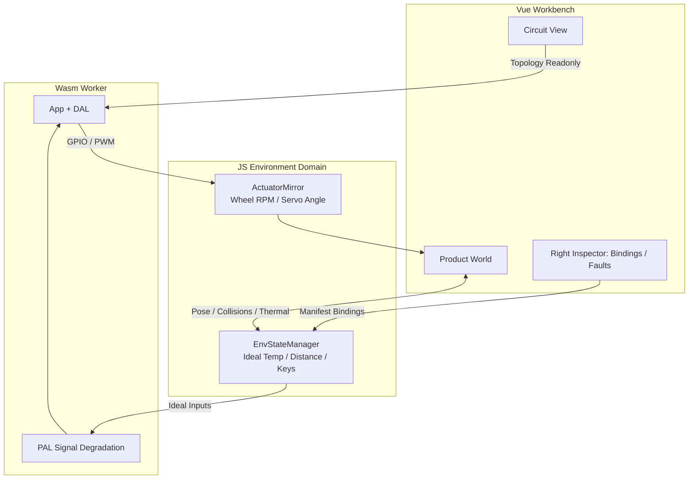

# 16. Dual-Viewport Product World Layout & 3D Mechanical Simulation Specification

<!-- i18n-meta
source: docs/zh/design/05-frontend-workbench/02-dual-viewport-product-world-layout.md
translated: 2026-08-17
glossary-version: v1.0
translator: AI-assisted
sync-status: up-to-date
-->

| Item | Content |
|---|---|
| Status | **Living Spec** |
| Date | 2026-07-09 |
| Scope Layer | ① Design Specification (`docs/design/05-frontend-workbench/`) |
| Associated Specs | [`01-frontend-workbench-architecture.md`](./01-frontend-workbench-architecture.md), [`../04-wasm-simulation/05-simulation-consistency-and-fidelity-spec.md`](../04-wasm-simulation/archive/05-simulation-consistency-and-fidelity-spec.md), [`../04-wasm-simulation/06-physical-degradation-engine.md`](../04-wasm-simulation/archive/06-physical-degradation-engine.md), [`../03-app-codegen/02-project-manifest-schema.md`](../03-app-codegen/02-project-manifest-schema.md) |
| Associated ADRs | [ADR-0003](../../decisions/unisim/0003-simulation-fidelity-boundary.md), [ADR-0009](../../decisions/unisim/0009-physical-behavior-simulation-fault-injection.md), [ADR-0014](../../decisions/unisim/0014-sim-single-virtual-core.md) |
| Execution SSOT | [`03-dual-viewport-phased-design/`](./03-dual-viewport-phased-design/README.md) |

> **Positioning**: This document serves as a supplemental specification to [`01-frontend-workbench-architecture.md`](./01-frontend-workbench-architecture.md), defining the dual-domain layout ("Circuit Design Viewport + 3D Product/Environment Simulation Viewport"), workbench modes, Manifest v2 schema extensions, and simulation bridging contracts.

---

## 0. Executive Summary

1. Center workspace upgraded from **mutually exclusive tabs** to a **draggable split-pane dual viewport** (2D Circuit + 3D Product World).
2. Introduces **Workbench Modes** (`design` / `simulate` / `diagnose`) controlling layout ratios and editing permissions.
3. Extends Project Manifest with `mechanical`, `environment`, and `bindings` sections.
4. Hosts the 3D physics engine within the **JavaScript Environment Domain** (Ideal Physical State), where Wasm consumes ideal inputs and applies signal degradation (ADR-0009).
5. Introduces a **Causal Chain Console** linking 3D events $\rightarrow$ JS ideal values $\rightarrow$ Wasm signal degradation $\rightarrow$ App logic $\rightarrow$ GPIO outputs $\rightarrow$ 3D actuator feedback.

---

## 1. Background & Motivation

Users need to co-simulate two coupled domains:
1. **Circuit Design**: Board + peripherals + wiring topology.
2. **3D Mechanical Structure Simulation**: Packaging embedded circuits into movable products interacting with physics environments, running single-source C firmware in WebAssembly.

---

## 2. Design Goals

1. **Dual-Domain Co-Simulation**: Simultaneous presentation of circuit topology and 3D product world.
2. **Mode-Driven Layouts**: Automatic adjustment of split ratios, permissions, and panel visibilities.
3. **Manifest Single Source of Truth**: Persistent mechanical parts, environmental props, and bindings.
4. **Architectural Separation**: 3D engines never write directly to GPIOs; Wasm remains independent of Three.js.

---

## 3. Seven-Zone IDE Layout

```text
┌─────────────────────────────────────────────────────────────────────────────┐
│ ① TOP BAR                                                                    │
│    Project / Workbench Mode / Target / Transport / SimTime / Safety Gates   │
├──────────┬──────────────────────────────────────────────────┬─────────────┤
│ ② LEFT   │ ③ CENTER — Dual-Viewport Workspace               │ ④ RIGHT     │
│ ASSET    │  ┌─ Circuit View (2D) ────┐ ┌─ Product World (3D) ┐ │ CONTEXT     │
│ LIBRARY  │  │ Board + Peripherals    │ │ Product + Physics   │ │ INSPECTOR   │
│          │  └────────────────────────┘ └─────────────────────┘ │             │
│          │         ▲ Selection Sync / Voltage Glow ▲ Feedback  │             │
├──────────┴──────────────────────────────────────────────────┴─────────────┤
│ ⑤ BOTTOM CONSOLE — Trace / Causal Chain / Logs / Build / Static Check      │
└─────────────────────────────────────────────────────────────────────────────┘
  ⑥ FLOATING — Virtual input controls, 3D Transform Gizmos
  ⑦ PIP      — Picture-in-Picture circuit view in simulation mode
```

### 3.1 Split-Pane Ratios

| Workbench Mode | Circuit : World | Description |
|---|---|---|
| `design` (Wiring priority) | 70 : 30 | 3D provides assembly preview |
| `design` (Structure priority) | 30 : 70 | 3D mechanical modeling |
| `simulate` | 40 : 60 | Emphasizes movement and environment |
| `diagnose` | 25 : 25 (Console expanded) | Causal chain takes primary focus |

---

## 4. Workbench Mode State Machine

```text
                    ┌─────────────┐
         ┌─────────│   design    │─────────┐
         │         │ Editable    │         │
         │         └──────┬──────┘         │
         │                │ static check OK │
         │                ▼                │
         │         ┌─────────────┐         │
         │         │  simulate   │         │
         │         │ Dual View   │         │
         │         └──────┬──────┘         │
         │                │ fault / user   │
         │                ▼                │
         │         ┌─────────────┐         │
         └────────►│  diagnose   │◄────────┘
                   │ Causal Chain│
                   └─────────────┘
```

---

## 5. Dual-Viewport Interaction Contracts

- **Selection Sync**: Selecting an ultrasonic sensor in the 2D Circuit View highlights the corresponding sensor mount in the 3D Product World.
- **Visual Feedback**: Real-time voltage glows on wires, wheel rotation velocities, sensor raycast lines, and thermal heat field bubbles.
- **Editing Matrix**: Netlist wiring and mechanical transforms are editable in `design` mode and read-only in `simulate` mode; environmental props can be adjusted during runtime.

---

## 6. Product World (3D Viewport) Specification

### 6.1 Scene Graph
```text
Scene
├── Environment (Ground, Walls, Obstacles, HeatSources)
├── Product (Chassis, Wheels, SensorMounts, Enclosure)
└── Debug (Ray helpers, Joint axes)
```

### 6.2 Frame Loop & Worker Isolation
```text
requestAnimationFrame (Main Thread)
  ├── Three.js render + physics step (SimTime dt)
  ├── EnvStateManager.tick(simTimeUs) -> Calculate ideal sensor values
  ├── postMessage -> Worker: setIdealInputs(...)
  └── <- Worker: actuatorOutputs (GPIO/PWM)

Worker (Wasm)
  ├── pal_wasm_advance_virtual_clock
  ├── App loop / DAL / PAL degradation
  └── -> postMessage: pinStates, traces, framebuffer
```

---

## 7. Dual-Domain Data Flow



---

## 8. Project Manifest v2 Schema Extensions

```json
{
  "schemaVersion": 2,
  "devices": [],
  "connections": [],
  "mechanical": {
    "parts": [
      {
        "partId": "chassis_main",
        "modelId": "diff_drive_chassis_v1",
        "displayName": "Main Chassis",
        "transform": { "position": { "x": 0, "y": 0, "z": 0 }, "rotation": { "x": 0, "y": 0, "z": 0 }, "scale": { "x": 1, "y": 1, "z": 1 } },
        "physics": { "massKg": 0.8, "friction": 0.6, "collider": "box" }
      }
    ],
    "joints": [
      {
        "jointId": "joint_wheel_left",
        "type": "revolute",
        "parentPartId": "chassis_main",
        "childPartId": "wheel_left",
        "axis": { "x": 0, "y": 0, "z": 1 }
      }
    ]
  },
  "environment": {
    "props": [
      {
        "propId": "wall_north",
        "modelId": "env_wall_segment",
        "transform": { "position": { "x": 0, "y": 1, "z": 2 } },
        "physics": { "static": true, "collider": "box" }
      }
    ],
    "fields": [
      {
        "fieldId": "ambient",
        "type": "uniform_temperature",
        "valueC": 25
      }
    ]
  },
  "bindings": {
    "actuators": [
      {
        "bindingId": "bind_motor_left",
        "deviceComponentId": "motor_driver",
        "pin": "PWM_LEFT",
        "mechanicalJointId": "joint_wheel_left",
        "mapping": { "type": "pwm_to_angular_velocity", "maxRpm": 200 }
      }
    ],
    "sensors": [
      {
        "bindingId": "bind_radar_front",
        "deviceComponentId": "front_radar",
        "mechanicalPartId": "mount_ultrasonic",
        "mapping": { "type": "raycast_range_cm", "maxRangeCm": 400 }
      }
    ]
  }
}
```

---

## 9. Simulation Client Protocol Extensions

### 9.1 UI $\rightarrow$ Worker Commands
```typescript
interface IdealInputBatch {
  simTimeUs: bigint;
  sensors: Array<{
    bindingId: string;
    value: number | boolean;
    unit?: 'cm' | 'celsius' | 'percent' | 'bool';
  }>;
  virtualGpio?: Array<{ pin: number; level: boolean }>;
}
```

### 9.2 Worker $\rightarrow$ UI Events
```typescript
interface ActuatorOutputBatch {
  simTimeUs: bigint;
  gpio: Record<number, boolean>;
  pwm: Record<number, number>; // 0.0 .. 1.0 duty
}
```

---

## 10. Causal Chain Console

Visualizes the end-to-end causality timeline across 6 discrete simulation layers:
```text
[world]  Raycast hit obstacle @ 32cm
  → [env]  ideal_distance_cm = 32
  → [pal]  +noise -> 31.7cm, warmup OK
  → [app]  if (dist < 40) stop motors
  → [actuator] PWM_L=0, PWM_R=0
  → [world_feedback] wheel_angular_vel = 0
```

---

## 11. Phased Delivery Plan

- **W1**: SplitPane Layout & Mode State Machine.
- **W2**: Manifest v2 Schema, Validation Engine & Bindings Inspector.
- **W3**: Three.js Product World & Obstacle Avoidance Car Template.
- **W4**: Environmental Prop Interactions (Heat sources & thermal alarms).
- **W5**: Causal Chain Console.
- **W6**: Schema Synchronization & Documentation Finalization.
