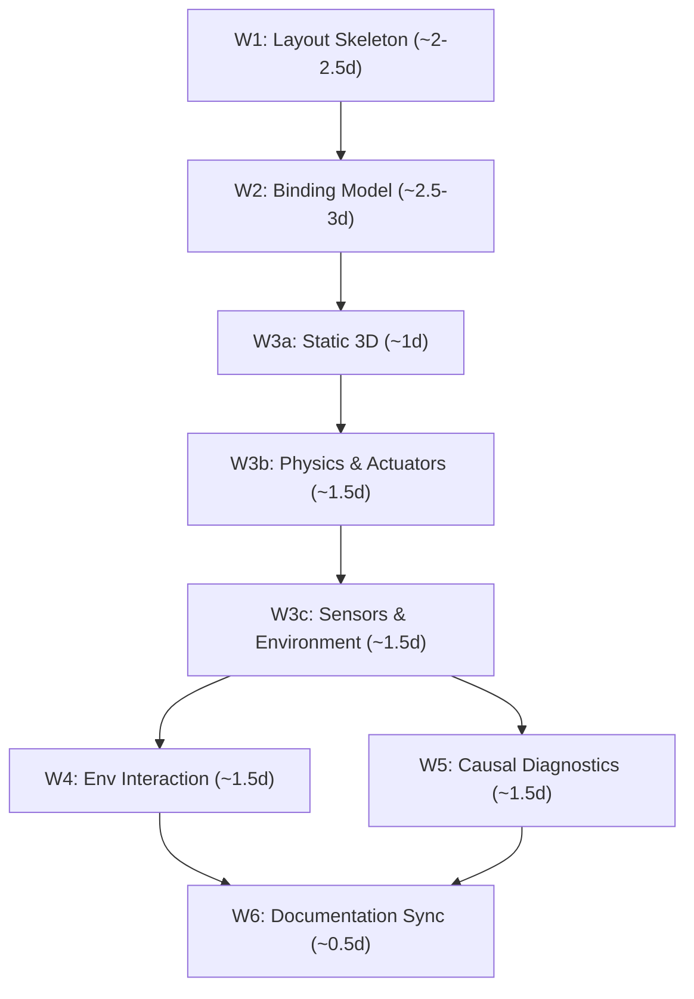

# Dual-Viewport Product World Enhanced Design — Master Plan

<!-- i18n-meta
source: docs/zh/design/05-frontend-workbench/03-dual-viewport-phased-design/00-master-plan.md
translated: 2026-08-17
glossary-version: v1.0
translator: AI-assisted
sync-status: up-to-date
-->

| Item | Content |
|---|---|
| Status | **Living Spec** |
| Date | 2026-07-09 |
| Scope Layer | ① Design Specification (`docs/design/05-frontend-workbench/03-dual-viewport-phased-design/`) |
| Upstream Spec | [`02-dual-viewport-product-world-layout.md`](../02-dual-viewport-product-world-layout.md) (Architecture SSOT) |
| Associated ADRs | [ADR-0003](../../../decisions/unisim/0003-simulation-fidelity-boundary.md), [ADR-0009](../../../decisions/unisim/0009-physical-behavior-simulation-fault-injection.md), [ADR-0014](../../../decisions/unisim/0014-sim-single-virtual-core.md) |

> **Positioning**: This document provides detailed design specifications for [`02-dual-viewport-product-world-layout.md`](../02-dual-viewport-product-world-layout.md), outlining UI/UX interaction standards, performance budgets, migration strategies, and phased delivery plans.

---

## 1. Vision & User Personas

### 1.1 Product Vision
Elevates the Wink-AI Embedded Workbench from a 2D circuit wiring canvas to a **Full Embedded Product Simulation IDE** where users complete circuit topology design, 3D mechanical assembly, environment construction, Wasm simulation, and causal debugging in a single unified interface.

### 1.2 User Personas & Tolerance
- **Educational Users**: Needs guided onboarding and progressive disclosure.
- **Makers / Prototypers**: Values split-screen views and intuitive wiring-to-3D bindings.
- **AI-Prompt Users**: Focuses on instant verification and safety gates.
- **Professional Engineers**: Relies on trace timelines, causal chain logs, and fault injection.

---

## 2. Architectural Overview

### 2.1 Seven-Zone IDE Layout & Space Allocation

| Mode | Center Height | Center Split (Circuit : World) | Bottom Console Height | Notes |
|---|---|---|---|---|
| `design` (Wiring priority) | 75% | 70 : 30 | 25% | Default design view |
| `design` (Structure priority)| 75% | 30 : 70 | 25% | Mechanical focus |
| `simulate` | 70% | 40 : 60 | 30% | Left asset panel collapsed |
| `diagnose` | **50%** | **50 : 50** | **50%** | Console expanded for causal debugging |

### 2.2 Dual-Domain Dataflow & SimTime Master
1. **Main Thread is Time Master**: Advances `simTimeUs` frame-by-frame; Worker catches up passively.
2. **Actuator Feedback**: 1-frame latency applied in the physics simulation.
3. **Batch Exchanging**: `IdealInputBatch` and `ActuatorOutputBatch` prevent per-GPIO message thrashing.

---

## 3. Performance Budget

### 3.1 Main Thread Frame Budget (60 FPS $\approx$ 16.67ms)
- Three.js render: $\le 8\text{ms}$
- Rapier physics step: $\le 3\text{ms}$
- `EnvState.tick()`: $\le 1\text{ms}$
- `postMessage` batching: $\le 1\text{ms}$
- Vue reactive updates: $\le 3\text{ms}$
- **Total Budget**: $\le 16\text{ms}$

---

## 4. Global Interaction & State Matrix

- **Hover**: 2px outline glow on components / parts.
- **Selected**: 3px blue outline with Transform Gizmo in 3D.
- **Binding Group**: Linked circuit and 3D items highlight simultaneously with `#3B82F6/20%` tint.
- **Error**: Static red border with 2Hz blink (disabled when `prefers-reduced-motion` is active).

---

## 5. Refactoring & Migration Strategy

### 5.1 Strangler Fig Plan for `EmbeddedWorkbench.vue`
Extracts monolithic components progressively into modular subcomponents:
- `CircuitCanvas.vue` (2D SVG canvas)
- `TopBar.vue` & `ContextInspector.vue`
- `LayeredAssetLibrary.vue`
- `ProductWorld3D.vue` (Three.js integration)

### 5.2 Pinia Store Hierarchy
- `workbench-mode.store.ts` (`design` | `simulate` | `diagnose`)
- `layout.store.ts` (Split ratios, panel heights)
- `selection.store.ts` (Dual-viewport selections)
- `canvas.store.ts` (2D positions, routing state)
- `project.store.ts` (Manifest SSOT)
- `inspector.store.ts` & `simulation.store.ts`

---

## 6. Phased Delivery Roadmap

---

## 7. Manifest Field Alignment Table (SSOT)

| Concept | Formal Field | Forbidden Draft Aliases | Origin |
|---|---|---|---|
| Project ID | `id` | — | `02-project-manifest-schema.md` |
| Project Name | `name` | `projectName` | `02-project-manifest-schema.md` |
| Device Instance ID | `devices[].componentId` | `devices[].id` | `02-project-manifest-schema.md` |
| Thermal Field Scalar | `environment.fields[].valueC` | `intensity` | `02-dual-viewport-product-world-layout.md` |
| Binding $\rightarrow$ Device | `bindings.*.deviceComponentId` | `deviceId` | `02-dual-viewport-product-world-layout.md` |
| Binding $\rightarrow$ Joint | `bindings.actuators[].mechanicalJointId`| — | `02-dual-viewport-product-world-layout.md` |
| Binding $\rightarrow$ Part | `bindings.sensors[].mechanicalPartId` | — | `02-dual-viewport-product-world-layout.md` |
| Binding $\rightarrow$ Prop | `bindings.sensors[].environmentPropId` | — | `02-dual-viewport-product-world-layout.md` |
