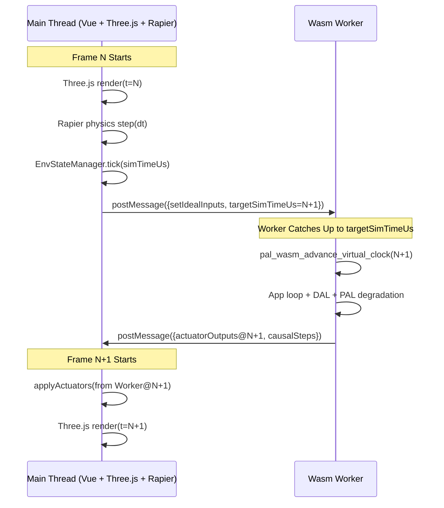
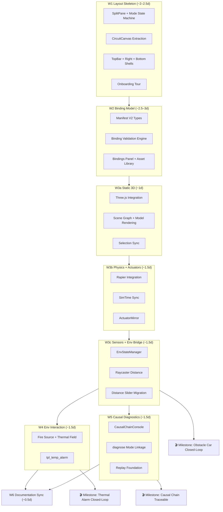

# Dual-Viewport Product World Enhanced Design — Master Plan

<!-- i18n-meta
source: docs/zh/design/05-frontend-workbench/03-dual-viewport-phased-design/00-master-plan.md
translated: 2026-08-17
glossary-version: v1.0
translator: AI-assisted
sync-status: up-to-date
-->

| Item | Content |
|---|---|
| Status | **Living Spec** |
| Date | 2026-07-09 |
| Scope Layer | ① Design Specification (`docs/design/05-frontend-workbench/03-dual-viewport-phased-design/`) |
| Upstream Spec | [`02-dual-viewport-product-world-layout.md`](../02-dual-viewport-product-world-layout.md) (Architecture SSOT) |
| Upstream Implementation Plan | [`../../../implementation-plans/frontend/2026-07-09-dual-viewport-layout-plan.md`](../../../implementation-plans/frontend/2026-07-09-dual-viewport-layout-plan.md) |
| Associated ADRs | [ADR-0003](../../../decisions/unisim/0003-simulation-fidelity-boundary.md), [ADR-0009](../../../decisions/unisim/0009-physical-behavior-simulation-fault-injection.md), [ADR-0014](../../../decisions/unisim/0014-sim-single-virtual-core.md) |
| Owner | TBD |

> **Positioning**: This directory contains the **enhanced design details** for [`02-dual-viewport-product-world-layout.md`](../02-dual-viewport-product-world-layout.md). The upstream specification defines the What & Why (architectural constraints, data flows, Manifest contracts); this directory defines **How in detail** (UI/UX interaction standards, performance constraints, migration strategies, phased delivery specifications). The phase documents can be used directly as development guidelines during implementation.

---

## 1. Vision & User Personas

### 1.1 Product Vision

Elevate the Wink-AI Embedded Workbench from a **circuit topology design tool** to a **Full Embedded Product Simulation IDE**—enabling users to complete the entire closed loop of circuit wiring, 3D product assembly, environment construction, Wasm simulation, and causal debugging within a single browser interface, with firmware business logic executing homologously throughout (wink-micro-os Wasm).

### 1.2 Target User Personas

| Role | Characteristics | Core Needs | UI Complexity Tolerance |
|---|---|---|---|
| **Educational Users** | High school / college students, beginners in embedded systems | Drag in templates $\rightarrow$ observe motion $\rightarrow$ understand causality | Low: Needs guidance and progressive disclosure |
| **Makers / Prototypers** | Experienced with Arduino, rapid prototyping | Wire $\rightarrow$ assemble $\rightarrow$ simulate $\rightarrow$ validate ideas | Medium: Accepts split-screen, values intuitiveness |
| **AI-Prompt Users** | Generates logic via conversational AI | Generate $\rightarrow$ sandbox validation $\rightarrow$ safe flashing | Medium: Cares about simulation outcomes over operations |
| **Professional Developers** | Embedded engineers, debugging and profiling | Trace / causal chain / fine-tuning degradation parameters | High: Welcomes complex panels in diagnose mode |

> **Design Principle**: Default experience caters to educational/maker users (progressive disclosure); professional capabilities are exposed progressively via mode switching and panel expansion.

### 1.3 Core Scenarios

| # | Scenario | Phases Involved | Acceptance Milestone |
|---|---|---|---|
| S1 | Open obstacle-avoidance car template $\rightarrow$ run simulation $\rightarrow$ observe car stop before a wall | W1–W3c | W3c |
| S2 | Drag fire source in 3D $\rightarrow$ thermal sensor detects high temperature $\rightarrow$ App alarm triggers | W4 | W4 |
| S3 | Motor fails to rotate $\rightarrow$ enter diagnose mode $\rightarrow$ causal chain traces to PWM output of 0 | W5 | W5 |
| S4 | New user opens workbench for the first time $\rightarrow$ guided onboarding $\rightarrow$ sees running simulation within 3 steps | W1 | W1 |
| S5 | AI generates obstacle avoidance logic $\rightarrow$ auto-suggests bindings $\rightarrow$ one-click simulation validation | W2+ | W2 |

### 1.4 Success Metrics (KPIs)

| Metric | Target | Measurement Method | Acceptance Phase |
|---|---|---|---|
| **Time-to-First-Simulation** (New User) | $\le 3\text{ minutes}$ | Onboarding completed $\rightarrow$ first successful Play | W1 (S4) |
| **M4 Obstacle Avoidance Closed-Loop Demo Pass Rate** | $\ge 95\%$ | Standard desktop setup (1440px / Chrome) across 20 consecutive runs | W3c |
| **simulate Mode 60fps Compliance Rate** | $\ge 80\%\text{ of frames}$ | Chrome Performance: `frameBudget.total <= 16ms` | W3b+ |
| **W1 Circuit Regression Zero-Breakage** | 100% HCTR snapshot pass rate | CI Vitest snapshots | W1 |
| **design $\rightarrow$ simulate False Clearance Rate** | 0 (Includes bindings post-W2) | Projects missing bindings blocked from simulate | W2 |

---

## 2. Architectural Overview

### 2.1 Seven-Zone IDE Final State

```text
┌─────────────────────────────────────────────────────────────────────────────┐
│ ① TOP BAR (Two-row layout)                                                  │
│   Row 1: Project Name / Target / Safety Level / Consistency Badge           │
│   Row 2: [design|simulate|diagnose] Mode Toolbar (Context switches per mode)│
├──────────┬──────────────────────────────────────────────────┬─────────────┤
│ ② LEFT   │ ③ CENTER — Dual-Viewport Workspace               │ ④ RIGHT     │
│ ASSET    │  ┌─ Circuit View (2D) ────┐ ┌─ Product World (3D)─┐│ CONTEXT     │
│ LIBRARY  │  │ Board + Peripherals    │ │ Product + Physics   ││ INSPECTOR   │
│ (Accord.)│  └────────────────────────┘ └─────────────────────┘│ (6 Tabs)    │
│          │         ▲ Selection Sync / Voltage Glow ▲ Feedback │             │
├──────────┴──────────────────────────────────────────────────┴─────────────┤
│ ⑤ BOTTOM CONSOLE — Trace / Causal Chain / Logs / Build / Static Check     │
└─────────────────────────────────────────────────────────────────────────────┘
  ⑥ FLOATING — Virtual input controls, 3D Gizmos (Fire/Obstacle dragging)
  ⑦ PIP      — Optional PiP: Collapses circuit to corner preview during simulation (**Phase 2**, see §12)
```

#### 2.1.1 Workbench Mode Space Allocation (Excluding Top Bar)

> Ratios such as `70 : 30` represent Circuit : World width split **inside the center dual viewport**; **diagnose** represents a ternary allocation (center + bottom), distinct from `splitRatio` numerical values.

| Mode | Center Height | Center Circuit : World | Bottom Console Height | Notes |
|---|---|---|---|---|
| `design` (Wiring priority) | 75% | 70 : 30 | 25% | Default |
| `design` (Structure priority)| 75% | 30 : 70 | 25% | See W1 §2.4 |
| `simulate` | 70% | 40 : 60 | 30% | Left panel collapsed by default |
| `diagnose` | **50%** | **50 : 50** | **50%** | Causal chain takes primary focus; `splitRatio = 0.5` |

```text
diagnose Mode (Schematic with sidebars collapsed):
┌────────────────────────────────────────┐
│ Top Bar                                │
├──────────────────┬─────────────────────┤
│ Circuit (50%)    │ Product World (50%) │  ← Center = 50% Viewport Height
├──────────────────┴─────────────────────┤
│ BOTTOM — Causal Chain / Trace / Logs   │  ← Bottom = 50% Viewport Height
└────────────────────────────────────────┘
```

### 2.2 Dual-Domain Dataflow (Enhanced Version)

Extends upstream spec §7 with SimTime synchronization and double-buffering details:



**Key Constraints**:

1. **Main Thread is Time Master**: Increments `simTimeUs += dtUs` each frame; Worker catches up passively.
2. **Actuator Feedback Latency $\le 1\text{ frame}$**: Acceptable as physics consumes output on the subsequent frame.
3. **Worker Catch-Up Timeout**: If Worker fails to respond for 3 consecutive frames, main thread automatically reduces SimSpeed and displays a ⚠ warning.
4. **Batch Exchanges**: JS $\rightarrow$ Wasm passes `IdealInputBatch` (all sensors) and Wasm $\rightarrow$ JS passes `ActuatorOutputBatch` (all GPIO/PWM) per frame, preventing per-pin high-frequency cross-thread traffic.

### 2.3 Alignment with Wasm Simulation Readiness & 8 ABI Gaps

This enhanced design aligns with the **8 TypeScript data structure / contract gaps** and **Host-Worker bridge gaps** identified in readiness assessments, distributing them across delivery waves to ensure 100% ABI alignment between presentation and Wasm runtime:

| # | ABI / TS Gap | Core Responsibility & Mapping | Delivery Wave & Spec |
|---|---|---|---|
| **1** | Interrupt bridge queue & registration mapping | Establish Wasm interrupt Poll queue for UI $\leftrightarrow$ Wasm async notices | **W3b** (`04-phase-w3b-physics-actuators.md`) |
| **2** | Protocol-level I2C bypass & bus engine | Abstract `I2CDevice`/Bus contracts for virtual OLED protocol bypass | **W6+ (Phase 2)** (Predefined in `WasmImports`) |
| **3** | Fault audit log reader & parser | Pull faults from C `s_fault_log` ring buffer into causal chain | **W5** (`07-phase-w5-causal-diagnostics.md`) |
| **4** | Power model & energy telemetry bridge types | Provide `PinPowerModel` for component-level energy property editing | **W2** (`02-phase-w2-binding-model.md`) |
| **5** | Fault domain isolation framework & control types | Upgrade flat fault parameters to structured `FaultDomainControl` | **W5** (`07-phase-w5-causal-diagnostics.md`) |
| **6** | Orthogonal wire routing commands & wire path protocol | Provide orthogonal routing and path parsing types for SVG canvas | **W1** (`01-phase-w1-layout-skeleton.md`) |
| **7** | Project topology specification (`sim-project.json`) | Integrate legacy TS topology structures into `EmbeddedProjectManifest` V2 | **W2** (`02-phase-w2-binding-model.md`) |
| **8** | Wasm module instantiation glue imports contract | Standardize `WasmImports` interface for Emscripten glue type safety | **W3b** (`04-phase-w3b-physics-actuators.md`) |

---

## 3. Performance Budget

### 3.1 Main Thread Frame Budget (Target 60fps = 16.67ms/frame)

| Phase | Budget | Monitoring Tool | Overflow Degradation Strategy |
|---|---|---|---|
| Three.js render | $\le 8\text{ms}$ | `renderer.info` + `performance.mark` | Reduce rendering resolution (PiP 0.5x) |
| Rapier physics step | $\le 3\text{ms}$ | Timestamp deltas around step | Reduce physics sub-steps |
| `EnvState.tick()` | $\le 1\text{ms}$ | Inline timer | Cache raycast hits (update every 2 frames) |
| `postMessage` serialization | $\le 1\text{ms}$ | Transferable optimizations | Use SharedArrayBuffer (requires COOP/COEP) |
| Vue reactive updates | $\le 3\text{ms}$ | Vue DevTools perf | Coarsen reactive property granularity |
| **Total** | **$\le 16\text{ms}$** | Chrome Performance tab | Auto-throttle to 30fps with toast notification |

### 3.2 Resource Budget

| Resource | Budget | Governance |
|---|---|---|
| Three.js bundle size (gzip) | $\le 150\text{KB}$ | Dynamic `import()`, not loaded in W1 |
| Rapier WASM (gzip) | $\le 500\text{KB}$ | Dynamic `import()`, not loaded in W3a |
| Rigid body cap | $\le 50$ | Warning on overflow + block creation |
| Active raycasts | $\le 10$ | Poll inactive rays every 2 frames |
| Causal chain ring buffer | 500 steps | Merge sequential identical steps on overflow |

### 3.3 Responsive Breakpoints

| Breakpoint | Window Width | Layout Adjustments |
|---|---|---|
| Ultra-wide | $\ge 1920\text{px}$ | Dual viewport + both sidebars fully expanded |
| Standard Desktop | 1440–1919px | Dual viewport + left sidebar narrowed (200px) |
| Laptop Screen | 1280–1439px | Right panel collapsed to icon mode by default |
| Minimum Supported | 1280px | Dual viewports min 280px each + single sidebar |
| **Unsupported** | < 1280px | Displays "Please use a desktop browser" overlay |

---

## 4. Global Interaction Standards

### 4.1 Selection Sync Visual State Matrix

| State | Circuit View | Product World | Right Panel |
|---|---|---|---|
| **Hover** | Component/pin 2px glow border | Part outline highlight | — |
| **Selected** | Blue 3px border + magnified pin labels | Blue outline + Transform Gizmo | Auto-switches to matching tab |
| **Binding Group** | Light blue (`#3B82F6/20%`) background on group | Light blue contour on group | Highlights all bound table rows |
| **Error** | Red 2Hz pulsing border (static box if `prefers-reduced-motion`) | Red pulsing + ⚠ badge (same as left) | Diagnostics Tab pops open |
| **Disabled (sim)** | Grayscale + 🔒 badge | — | Editing controls disabled |
| **No Selection** | — | — | Project-level summary |

### 4.2 Keyboard Shortcuts

| Shortcut | Function | Applicable Modes |
|---|---|---|
| `Ctrl+1` | Focus Circuit Viewport | Global |
| `Ctrl+2` | Focus 3D Viewport | Global |
| `Ctrl+\` | Toggle Split Orientation (Horizontal/Vertical) | Global |
| `Space` | Play / Pause | simulate / diagnose |
| `Ctrl+Shift+R` | Reset Simulation | simulate / diagnose |
| `Ctrl+Shift+D` | Switch to diagnose mode | simulate |
| `F` | Focus 3D camera on selection | 3D Viewport Active |
| `G` / `R` / `S` | Gizmo Translate / Rotate / Scale | design + 3D Viewport |
| `Ctrl+Z` / `Ctrl+Y` | Undo / Redo | **Phase 2 (Not in W1)** |
| `Delete` | Delete selected object | design |
| `Escape` | Cancel current operation / clear selection | Global |

### 4.3 Drag & Drop Interaction Matrix

| Drag Scenario | Visual Feedback | Release Action |
|---|---|---|
| Mechanical part $\rightarrow$ Circuit View | ❌ Forbidden icon + arrow pointing to 3D | No-op |
| Peripheral $\rightarrow$ 3D Viewport | ❌ + "Please add in Circuit View first" toast | No-op |
| Mechanical part $\rightarrow$ 3D Viewport | ✅ Semi-transparent ghost + snap grid | Creates `mechanical.parts` entry |
| Environment prop $\rightarrow$ 3D Viewport | ✅ Ghost + placement preview | Creates `environment.props` entry |
| Template $\rightarrow$ Anywhere | Dual viewport simultaneous ghost preview | Confirmation modal $\rightarrow$ batch Manifest patch |
| Dragging across split divider | Divider highlights + active viewport switches | — |

### 4.4 Error & Edge Case Handling

| Scenario | Handling Strategy |
|---|---|
| WebGL Unavailable / GPU degraded | 3D viewport degrades to 2D top-down diagram + Toast |
| Rapier WASM load failure | 3D viewport displays static preview (no physics), blocks simulate |
| Worker OOM (Heartbeat timeout) | Auto-pause + Bottom Bar Error + suggestion to reduce objects |
| `visibilitychange` tab hidden | Pauses Three.js rendering; **Worker pauses catch-up synchronously** |
| Chrome background `rAF` throttling | Pauses SimTime advancement; resumes on active visibility without catch-up burst |
| Browser window < 1280px | Displays full-screen mask overlay |

### 4.5 Accessibility (a11y) Standards

| Item | Specification |
|---|---|
| Motion | Honors `prefers-reduced-motion`; error states default to static red boxes |
| Focus | Focus lands on primary control upon mode change (design $\rightarrow$ canvas, simulate $\rightarrow$ Play) |
| Keyboard | SplitPane supports `ArrowLeft/Right` adjustments (5% step, `Shift` for 20%) |
| Contrast | Error/warning text against background $\ge \text{WCAG 2.1 AA (4.5:1)}$ |
| i18n | UI copy uses i18n keys (`t('workbench.*')`); MVP defaults to `zh-CN`, structured for `en-US` |

### 4.6 Phased `simulate` Gating (W1 / W2 Transition)

| Phase | `design $\rightarrow$ simulate` Gate | Bindings Checks |
|---|---|---|
| **W1** | **Static Check Only** (existing `static-check` logic) | **Does not validate** bindings; consistency badge hidden or displays "—" |
| **W2+** | **First** `static-check` **then** `binding-validation.service` | `validateBindings(manifest, { targetMode:'simulate', blockingOnly:true })`; expands Diagnostics on block |

---

## 5. Onboarding & Progressive Disclosure

### 5.1 First-Time User Guided Onboarding (3-Step Tour)

```text
Step 1: "Meet the Dual Viewports"
  - Highlights Circuit View: "Design circuit wiring here"
  - Highlights 3D Viewport: "Assemble products and environments here"

Step 2: "Select a Template"
  - Left panel Templates expands automatically
  - Highlights "Obstacle-Avoidance Car" template: "Click to start quickly"

Step 3: "Run Your First Simulation"
  - Top bar Play button pulses
  - Text: "Click Run to observe how the car avoids obstacles"
```

- Skips via `localStorage` flag `onboarding_completed`.
- Settings panel can reset onboarding status.

### 5.2 Progressive Disclosure Triggers

| Condition | Interface Mutation |
|---|---|
| Project lacks `mechanical` data | 3D Viewport displays onboarding card instead of empty canvas |
| User adds first mechanical part | 3D Viewport auto-expands to $\ge 40\%$ width |
| User enters simulate mode first time | Bottom bar auto-expands Trace tab |
| Fault triggered first time | Diagnose mode prompt banner + Causal Chain tab pulses |
| All bindings complete | Top bar consistency badge displays ✅ Causal OK |

### 5.3 Empty State Designs

| Zone | Empty State Content |
|---|---|
| 3D Viewport (No mechanical parts) | Illustration + "Drag a chassis to begin building" + template shortcuts |
| Right Bar Bindings (No bindings) | "Circuit peripherals and 3D parts unlinked" + Auto-suggest button |
| Causal Chain Panel (No data) | "Run simulation to visualize the causal chain here" |
| Left Bar Active Tree (Empty project) | "Drag components from libraries above" |

### 5.4 Bottom Console Default Behavior

| Workbench Mode | Bottom Bar State | Active Tab | Auto-Expand Trigger |
|---|---|---|---|
| `design` | Collapsed or 25% height | `Static Check` | Static check warnings/errors present |
| `simulate` | Expanded to 30% height | `Trace` | First time entering simulate (§5.2) |
| `diagnose` | Expanded to **50%** height | `Causal Chain` | Entering diagnose or Fault triggered |

---

## 6. Refactoring & Migration Strategy

### 6.1 `EmbeddedWorkbench.vue` Strangler Fig Plan

[`EmbeddedWorkbench.vue`](../../../../../wink-ai/packages/embedded-frontend/src/views/EmbeddedWorkbench.vue) is a **3234-line monolith**. Deconstructed progressively via Strangler Fig:

| Step | Wave | Action | Validation |
|---|---|---|---|
| S1 | Pre-W1 | Author E2E tests covering critical user flows (add peripheral $\rightarrow$ wire $\rightarrow$ simulate $\rightarrow$ trace) | Playwright / Cypress |
| S2 | W1 | Introduce `<SplitPane>` wrapping existing canvas and new empty 3D placeholder | Zero regression on existing features |
| S3 | W1 | Extract SVG canvas logic (~1200 lines) $\rightarrow$ `CircuitCanvas.vue` | Canvas behavior identical |
| S4 | W1 | Extract top bar $\rightarrow$ `TopBar.vue` + right bar $\rightarrow$ `ContextInspector.vue` | Standalone testability |
| S5 | W2 | Extract left bar $\rightarrow$ `LayeredAssetLibrary.vue` | Accordion sections functional |
| S6 | W3a | Introduce `ProductWorld3D.vue` (New code, not extracted) | Three.js rendering nominal |
| S7 | Ongoing | `Workbench.vue` retains only layout shell + mode state machine (< 300 lines) | Clean component dependency tree |

### 6.2 Store Migration

Migrates loose `ref()` exports from [`simulation-client.ts`](../../../../../wink-ai/packages/embedded-frontend/src/services/simulation-client.ts) to **Pinia**:

| Existing Module | Target Store | Wave |
|---|---|---|
| `simulation-client.ts` state refs | `simulation.store.ts` (Pinia) | W1 Task 1.0 |
| Workbench internal UI state | `workbench-mode.store.ts` + `layout.store.ts` | W1 |
| Selection states | `selection.store.ts` | W1 |
| Canvas states (Component positions, etc.) | `canvas.store.ts` | W1 |
| Manifest data | `project.store.ts` (W1 shell, W2 full Manifest v2) | W1 + W2 |
| Right bar tab / pin states | `inspector.store.ts` | W1 |

### 6.3 Worker Protocol Backward Compatibility

```typescript
// Worker Startup Handshake
Main → Worker: { type: 'HANDSHAKE', protocolVersion: 2 }
Worker → Main: { type: 'HANDSHAKE_ACK', supportedVersions: [1, 2] }
```

### 6.4 Testing Strategy

```text
Unit (Vitest)
  → Store state machines, binding validation, ConnectionRouting parsing, EnvState pure functions
Integration
  → Worker mock + postMessage protocol v2, SimTime catch-up timeouts, layout/mode syncing
E2E (Playwright)
  → W1 smoke (Task 1.6): Dual viewports + simulate without crashes + Onboarding
  → W3c regression: Full obstacle-avoidance closed-loop M4
```

| Layer | Tool | Initial Wave | CI Strategy |
|---|---|---|---|
| Unit | Vitest | W1 | Every PR |
| Snapshots | Vitest + SVG paths | W1 (HCTR) | Every PR |
| Integration | Vitest + Worker mock | W2 / W3b | Every PR |
| E2E Smoke | Playwright | W1 Task 1.6–1.7 | `main` nightly |
| E2E Regression | Playwright | W3c | Pre-release mandatory |

---

## 7. Phased Delivery Roadmap Overview

### 7.1 Phased Dependency Graph



### 7.2 Demonstrable Milestones

| Milestone | Phase End | Demonstration Scenario | Recording Duration |
|---|---|---|---|
| **M0: Draggable Split View** | W1 | Onboarding 3 steps $\rightarrow$ design wiring $\rightarrow$ simulate dual viewport visible $\rightarrow$ Play without crashes | 45s |
| **M1: Configurable Bindings** | W2 | Configure ultrasonic raycast binding $\rightarrow$ unmapped bindings block simulate $\rightarrow$ clear to proceed | 45s |
| **M2: 3D Visible** | W3a | Obstacle car chassis rendered in 3D $\rightarrow$ OrbitControls rotation inspection $\rightarrow$ selection sync | 30s |
| **M3: Rotating Wheels** | W3b | PWM output $\rightarrow$ 3D wheels rotate per duty cycle $\rightarrow$ chassis translates | 30s |
| **M4: Obstacle Avoidance Loop** | W3c | Car advances $\rightarrow$ approaches wall $\rightarrow$ ultrasonic detects distance $\rightarrow$ App stops motor $\rightarrow$ car halts | 60s |
| **M5: Thermal Alarm Loop** | W4 | Dragging fire source closer $\rightarrow$ DHT temperature increases $\rightarrow$ App alarm triggers $\rightarrow$ LED lights up | 45s |
| **M6: Causal Tracing** | W5 | M4 full flow traced forward/backward across $\ge 5$ steps in Causal Chain console | 60s |

### 7.3 Feature Flag Matrix

| Flag | W1 | W2 | W3a | W3b | W3c | W4 | W5 | Final |
|---|---|---|---|---|---|---|---|---|
| `VITE_LEGACY_SIM_TAB` | true | true | true | true | false | false | false | Removed |
| `VITE_ENABLE_PRODUCT_WORLD` | false | false | true | true | true | true | true | Removed |
| `VITE_MANIFEST_SCHEMA_V2` | false | true | true | true | true | true | true | Removed |
| `VITE_ENABLE_CAUSAL_CHAIN` | — | — | — | — | — | — | true | Removed |
| `VITE_ENABLE_3D_PHYSICS` | — | — | false | true | true | true | true | Removed |

### 7.4 Schedule Estimates & Buffer

| Item | Ideal Person-Days | With Buffer ($\times 1.35$) | Description |
|---|---|---|---|
| W1–W6 Total | ~11.5d | **~15.5d** | Includes monolith extraction, 3D, causal chain |
| Per-Phase Buffer | — | +0.5d / phase | Allocated for E2E, regressions, doc patches |

**Phase Kill Criteria**:

| Phase | If Unmet | Fallback Plan |
|---|---|---|
| W3c | M4 closed-loop unproven within 2 days | Retain distance slider + static 3D, move physics loop to W3c.1 |
| W3b | Rapier WASM failure rate > 10% | Static 3D + Actuator mirror (no rigid body collisions) |
| W1 | `CircuitCanvas` extraction breaks within 2 days | Postpone extraction to W1.5, deliver SplitPane + Mode machine first |

### 7.5 Risk Register

| ID | Risk | Probability | Impact | Mitigation | Responsible Phase |
|---|---|---|---|---|---|
| R1 | `EmbeddedWorkbench.vue` extraction causes wiring regression | High | High | HCTR snapshots + `VITE_LEGACY_SIM_TAB` + W1 E2E smoke | W1 |
| R2 | Rapier WASM loading failure / bundle size bloat | Medium | High | Dynamic import + static preview fallback + Kill criteria | W3b |
| R3 | Worker catch-up timeout causes SimTime drift | Medium | High | 3-frame throttle + `visibilitychange` synchronous pause | W3b |
| R4 | WebGL unavailable (School lab legacy GPUs) | Medium | Medium | 2D top-down fallback + Toast | W3a |
| R5 | Overly strict binding validation blocks educational users | Medium | Medium | Warning / Error tiers; templates prefill bindings | W2 |
| R6 | 11.5d ideal duration insufficient | High | Medium | §7.4 buffers + P0/P1 task triage (W1) | Throughout |
| R7 | Unimplemented OLED I2C bypass disappoints users | Low | Medium | §12 marks 2D card fallback; ADR Gap #2 deferred | W2+ |

---

## 8. Phase Document Navigation

| Document | Phase | Core Contents |
|---|---|---|
| [01-phase-w1-layout-skeleton.md](./01-phase-w1-layout-skeleton.md) | W1 | SplitPane, mode state machine, `CircuitCanvas` extraction, Top/Right/Bottom shells, Onboarding |
| [02-phase-w2-binding-model.md](./02-phase-w2-binding-model.md) | W2 | Manifest V2 types, binding validation, mapping registry, asset library Accordion |
| [03-phase-w3a-static-3d-preview.md](./03-phase-w3a-static-3d-preview.md) | W3a | Three.js integration, scene graph, OrbitControls, WebGL fallback |
| [04-phase-w3b-physics-actuators.md](./04-phase-w3b-physics-actuators.md) | W3b | Rapier physics, SimTime sync protocol, ActuatorMirror, frame budget monitoring |
| [05-phase-w3c-sensors-env-bridge.md](./05-phase-w3c-sensors-env-bridge.md) | W3c | EnvStateManager, Raycaster rangefinding, distance slider migration, noise visualization |
| [06-phase-w4-environment-interaction.md](./06-phase-w4-environment-interaction.md) | W4 | Fire sources & thermal fields, environment props, `tpl_temp_alarm`, EnvironmentInspector |
| [07-phase-w5-causal-diagnostics.md](./07-phase-w5-causal-diagnostics.md) | W5 | Causal chain data models, forward/backward tracing, diagnose mode linkage, replay foundation |
| [08-phase-w6-documentation-schema.md](./08-phase-w6-documentation-schema.md) | W6 | Manifest schema backport, implementation plan archiving, migration script acceptance |

Directory index see [README.md](./README.md).

---

## 9. W6 Documentation Backport Checklist

| Action | Target Document | Status |
|---|---|---|
| Backport `mechanical` / `environment` / `bindings` schema definitions | [`02-project-manifest-schema.md`](../../03-app-codegen/02-project-manifest-schema.md) | Pending |
| Update §2–§3 cross-references + center workspace description | [`01-frontend-workbench-architecture.md`](../01-frontend-workbench-architecture.md) | Pending |
| Add directory navigation entries | [`../../README.md`](../../README.md) | Pending |
| Assess need for new ADR (Three.js domain boundaries) | `decisions/` | Evaluating (Default: covered by ADR-0009) |
| Archive implementation plan pointing to phased-design | [`2026-07-09-dual-viewport-layout-plan.md`](../../../implementation-plans/frontend/2026-07-09-dual-viewport-layout-plan.md) | ✅ v1.1 |
| Phased detailed design directory | [`03-dual-viewport-phased-design/`](./README.md) | ✅ |
| Validate Manifest schema v2 migration script | `../../../../../wink-ai/packages/embedded-frontend/src/services/manifest-migration.ts` | Pending (W6) |

---

## 10. Manifest Field Alignment Table (SSOT)

Phase documents, TypeScript types, and JSON files **must strictly adhere to this table**. Legacy draft aliases are permitted only in migration layers:

| Concept | Formal Field (JSON / Schema) | Forbidden Draft Aliases | Origin |
|---|---|---|---|
| Project ID | `id` | — | `02-project-manifest-schema.md` |
| Project Name | `name` | `projectName` | Same as above |
| Device Instance ID | `devices[].componentId` | `devices[].id` | Same as above |
| Thermal Field Scalar | `environment.fields[].valueC` | `intensity` | [`02-dual-viewport-product-world-layout.md`](../02-dual-viewport-product-world-layout.md) §8.3 |
| Binding $\rightarrow$ Device | `bindings.*.deviceComponentId` | `deviceId` | 02-layout §8.4 |
| Binding $\rightarrow$ Mechanical Joint | `bindings.actuators[].mechanicalJointId` | — | 02-layout §8.4 |
| Binding $\rightarrow$ Mechanical Part | `bindings.sensors[].mechanicalPartId` etc. | — | 02-layout §8.4 |
| Binding $\rightarrow$ Environment Prop | `bindings.sensors[].environmentPropId` | — | 02-layout §8.4 |
| Pin Resolver | `binding-pin-resolver.ts` (W2 interface, W3c Worker impl) | — | W2 §2.5 |

**TypeScript Convention**: `types/manifest-v2.ts` field names match this table; `migrateManifest()` normalizes historical aliases (mapping read-only `intensity` to `valueC`).

---

## 11. Store Architecture & Creation Phases

| Store | Responsibility | Creation Phase | Persisted |
|---|---|---|---|
| `workbench-mode.store` | design / simulate / diagnose | W1 | No |
| `layout.store` | Split ratios, sidebar collapse, bottom console height | W1 | `localStorage` |
| `selection.store` | Dual-viewport selection, binding group highlights | W1 | No |
| `canvas.store` | 2D peripheral positions, routing UI state | W1 | No |
| `project.store` | Manifest SSOT, patch / template application | W1 shell + W2 full | Future `wink-project.json` |
| `inspector.store` | Right panel active tab, pin states | W1 | No |
| `simulation.store` | Migrated from `simulation-client.ts` refs | W1 | No |
| `causal-chain.store` | Causal chain buffer, filtering | W5 | No |

**State Management Decision (W1 Final)**: Adopts **Pinia** + `pinia-plugin-persistedstate` (for `layout.store` UI preferences). Rationale: Cross-panel linkage, DevTools debugging, seamless Vue 3 ecosystem alignment.

---

## 12. Explicitly Deferred Capabilities (Non-MVP)

| Capability | Deferred To | Description |
|---|---|---|
| Undo / Redo (`Ctrl+Z`) | Phase 2 | Requires Manifest command stack; shortcut reserved in W1 |
| SharedArrayBuffer Zero-Copy | Phase 3 | Requires COOP/COEP; currently uses structured clone + batch messages |
| Simulation Replay Scrubbing | Phase 3 | W5 reserves UI; details in W5 §7 |
| OLED framebuffer $\rightarrow$ 3D Texture | MVP-2 | Details in 02-layout §14 |
| glTF Custom Meshes | Phase 2 | W3a uses geometric primitives only |
| Full E2E (Playwright) | W1 smoke + W3c regression | Details in W1 Task 1.6–1.7 |
| PiP Picture-in-Picture Mode | Phase 2 | W1 reserves fields in `layout.store`; no UI |
| Multi-Tab Pin (Inspector) | Phase 2 | W1 supports single pin |
| i18n Multilingual UI | Phase 2 | UI strings use i18n keys from W1, loading `zh-CN` |
| AI Binding Auto-Suggest UI | W2 | Scenario S5; logic in `binding-suggestion.service` |

---

## 13. 2D Circuit Coordinates vs 3D World Coordinates

| Domain | Coordinate System | Unit |
|---|---|---|
| Circuit View | SVG Canvas, Top-Left Origin, Y Downward | px |
| Product World | Three.js Right-Handed, Y Upward | m |

**During Template Assembly**: `manifest-patch.service` writes default 3D transforms without requiring 2D peripheral pixel positions to geometrically match 3D parts. Binding relationships express semantic associations via `bindings`, not geometric co-location.

Future option: `devices[].position` $\rightarrow$ heuristic 3D placement (Phase 2, non-MVP).

---

*Document Revision History:*

- 2026-07-09: Initial creation (Enhanced master plan: user personas, performance budgets, interaction standards, onboarding, migration strategy, phased roadmap).
- 2026-07-09: Review revisions—§10 Manifest alignment table, §11 Store architecture, §12 deferred capabilities, §13 coordinate systems, W6 navigation, implementation plan SSOT notes.
- 2026-07-09: Secondary review revisions—§1.4 KPIs, §2.1.1 diagnose layout, §4.5–4.6, §5.4 bottom console, §6.4 test strategy, §7.4–7.5 duration/risks, W1 bindings transition, §12 PiP/i18n/AI.
- 2026-07-09: W2 review backports—§4.6 gate ordering & B-09/10; §10 pin resolver SSOT.
