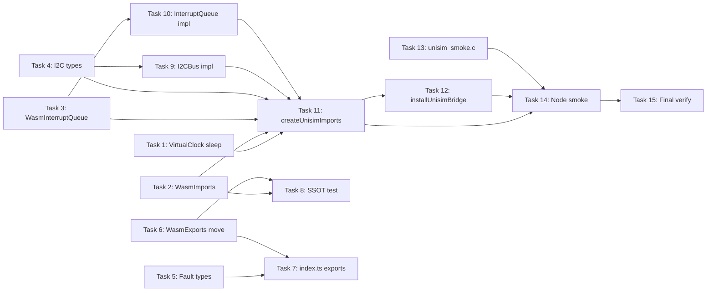

# Frontend Simulation Phase B Implementation Plan

> **For agentic workers:** REQUIRED SUB-SKILL: Use superpowers:subagent-driven-development (recommended) or superpowers:executing-plans to implement this plan task-by-task. Steps use checkbox (`- [ ]`) syntax for tracking.

**Goal:** Ship `@wink-ai/unisim` v0.2 — 6 SSOT-aligned TS contract types (`WasmImports` + `WasmExports` + `WasmInterruptQueue` + `I2CBus`/`I2CDevice` + `FaultAuditLogEvent` + `FaultDomainControl`) plus a strongly-typed `bridge/` implementation layer that upgrades the 13 `wink_sim_js.js` stubs to real routing into `PinArbiter` / `I2CBus` / `InterruptQueue` / `VirtualClock`.

**Architecture:** Type layer (`../../../../wink-ai/packages/unisim/src/unisim/types/{wasm,runtime}/*`) defines the boundary contract; factory layer (`../../../../wink-ai/packages/unisim/src/unisim/bridge/createUnisimImports`) returns a strongly-typed `WasmImports` object; installer (`installUnisimBridge`) assigns each field onto the Emscripten `Module` object so the `wink_sim_js.js` wrapper (already `--js-library`-injected, ADR-0019 shipped) finds and calls the host override at runtime. A Node-side smoke test loads real `unisim_smoke.wasm` and exercises all 13 imports end-to-end. SSOT alignment between `wasm_bridge.h` and `keyof WasmImports/Exports` is guarded by a Jest test.

**Tech Stack:** TypeScript 5.3 (strict, ES2020, CommonJS), Jest 29 + ts-jest, Emscripten 6.x (with `-sWASM_BIGINT=1 -sASYNCIFY=1 -sMODULARIZE=1`), Node ≥ 16 (BigInt + worker_threads native).

## Global Constraints

- **Task 0 (ADR-0019) is a hard prerequisite and is already landed** (`wink_sim_js.js` wrapper + `__async: 'auto'`; `wink_sim_stub.js` timing smoke). Do NOT re-modify these files in this plan. If any task below appears to require re-editing them, stop and consult the reviewer.
- **`wasm_bridge.h` is the SSOT** for both imports (`js_*`) and exports (`pal_wasm_*`). Never introduce a symbol in TS that isn't declared there; never let TS drift silently — the SSOT alignment test in Task 8 must fail loudly on any mismatch.
- **BigInt-only for `uint64_t`**: any 64-bit clock/counter that crosses the wasm boundary MUST be typed `bigint` in TS. Passing `number` to a bigint-typed Emscripten export throws `TypeError` at runtime; keep this at the type layer.
- **Asyncify contract**: any host override of `js_pal_os_sleep_ms` / `js_pal_os_busy_wait_us` MUST return `Promise<void>`. Returning `undefined` triggers a silent Asyncify unwind→rewind loop with no diagnostic. The type layer (`Promise<void>` in `WasmImports`) is the only compile-time defense.
- **`busy_wait_us` sub-millisecond precision**: `js_pal_os_busy_wait_us(us)` MUST resolve after the virtual clock has advanced by exactly `us` microseconds, NOT after `Math.floor(us / 1000)` ms. I²C bit-banging, one-wire, servo pulse-width all rely on sub-ms accuracy. Route it through `VirtualClock.sleepUs(bigint)` (Task 1 §Step 3) — never through `sleep(ms)`.
- **`sleep(0)` and `sleepUs(0n)` still wait**: they resolve on the next `advance(us)` where `us > 0n`, NOT on a `advance(0n)` zero-tick pump. Rationale: SimWorker startup / event drain code can call `advance(0n)` freely without silently flushing in-flight `busy_wait_us(500)` promises. Encoded as an explicit test in Task 1.
- **`VirtualClock.reset()` rejects pending sleeps**: any wasm coroutine mid-Asyncify-unwind at reset time gets `Promise.reject(new VirtualClockResetError())` — deliberately loud, so a stale wasm instance can never enter a "zombie" state where it silently never rewinds. Task 1 encodes this; Task 14 smoke MUST NOT call `reset()` while wasm work is in flight.
- **Duty cycle unit**: `js_pal_pwm_set_duty(channel, duty)` — `duty` is a percent (0–100 float), aligned with C signature `float duty_cycle_percent`. Not 0–1 normalized.
- **I²C transfer parameters cross the ABI as raw pointers + lengths** (per `wasm_bridge.h` signature and Q8 decision in the spec). TS `WasmImports` keeps the `(wbuf: number, wlen: number, rbuf: number, rlen: number)` shape; `createUnisimImports` does the heap read/write internally via `memoryView()`.
- **No `WasmExports` re-export shim.** Task 6 physically moves the interface into `types/wasm/exports.ts` and updates every consumer in one pass. PR must include a `grep -rn "WasmExports"` audit trail showing zero stale references.
- **Zero touching of `SimWorker.ts` message set** — Phase B keeps the existing 6 message types (`INIT`, `SET_FAULTS`, `STEP_CLOCK`, `SET_GPIO_IDEAL`, `READ_GPIO_DEGRADED`, `TEST_I2C_TRANSFER`). Only its `WasmExports` import path changes.
- **All commits are English Conventional Commits**, atomic per task or per logically-independent subtask.
- **`advance()` single-tick-per-sync-block convention**: the caller (SimWorker tick loop) MUST call `advance()` only ONCE per synchronous block, then yield the microtask queue (e.g. `await Promise.resolve()`) before the next `advance()`. Rationale: `advance()` is synchronous — it calls `resolve()` on due sleeps, but those `.then()` callbacks run in the microtask queue AFTER the synchronous block completes. Calling `advance(500n)` then `advance(500n)` back-to-back means a sleep resolved at t=500µs sees `this.us = 1000n` when its callback runs. This breaks embedded time semantics: an ISR waking at 500µs would incorrectly observe the clock at 1000µs. Task 1 encodes a regression test for this invariant.
- **`uint32_t` unsigned coercion at JS boundary**: Emscripten may pass C-side `uint32_t` values as signed `number` through the ABI (e.g. `(uint32_t)-1` arrives as `-1` in JS). All `js_pal_*` imports that receive `uint32_t` parameters and convert to `bigint` MUST apply `>>> 0` (unsigned right shift by zero) before `BigInt()` coercion. This prevents `BigInt(-1)` from triggering `RangeError` in `sleepUs`. Task 11 encodes this.

---

## File Structure

**Create:**

```
../../../../wink-ai/packages/unisim/src/unisim/
├── types/
│   ├── wasm/
│   │   ├── imports.ts                          ★ Task 2
│   │   ├── exports.ts                          ★ Task 6 (moved from worker/)
│   │   └── interrupt-queue.ts                  ★ Task 3
│   └── runtime/
│       ├── i2c.ts                              ★ Task 4
│       └── fault.ts                            ★ Task 5
├── bridge/
│   ├── I2CBus.ts                               ★ Task 9
│   ├── InterruptQueue.ts                       ★ Task 10
│   ├── createUnisimImports.ts                  ★ Task 11
│   ├── installUnisimBridge.ts                  ★ Task 12
│   └── __tests__/
│       ├── I2CBus.test.ts                      ★ Task 9
│       ├── InterruptQueue.test.ts              ★ Task 10
│       ├── createUnisimImports.test.ts         ★ Task 11
│       └── nodeSmoke.test.ts                   ★ Task 14
└── __tests__/
    └── ssotAlignment.test.ts                   ★ Task 8

wink-micro-os/samples/unisim_smoke/
├── CMakeLists.txt                              ★ Task 13
├── device_tree.h                               ★ Task 13
├── device_tree.c                               ★ Task 13
└── app_callbacks.c                             ★ Task 13
```

**Modify:**

```
../../../../wink-ai/packages/unisim/src/unisim/
├── core/VirtualClock.ts                        ★ Task 1 (add sleep + pending queue)
├── core/__tests__/VirtualClock.test.ts         ★ Task 1 (new file, or append if exists)
├── worker/WasmPhysicalBridge.ts                ★ Task 7 (delete local WasmExports; import from types/wasm/exports)
├── worker/__tests__/WasmPhysicalBridge.test.ts ★ Task 7 (import path only)
├── worker/SimWorker.ts                         ★ Task 7 (import path only)
└── index.ts                                    ★ Task 6, 11, 12 (public exports)

wink-micro-os/CMakeLists.txt                    ★ Task 13 (register unisim_smoke sample)
```

**Do NOT touch (Task 0 already delivered these):**
- `wink-micro-os/targets/wasm/wink_sim_js.js`
- `wink-micro-os/targets/wasm/wink_sim_stub.js`
- `wink-micro-os/targets/wasm/wasm_bridge.h` (SSOT — read-only for this plan)

---

## Task Dependency Graph



**Critical path**: T1 → T11 → T14 → T15 (VirtualClock sleep → factory → e2e → verify).

**Parallelism**: Tasks 2–5 are leaf types with no inter-dependencies; Tasks 9–10 depend only on their respective type tasks (4, 3) and can run in parallel.

## Time Estimates

| Task | Estimated Hours | Rationale |
|---|---|---|
| Task 1 | ~2h | Core algorithm + 12 test cases (including nested-sleep regression) |
| Task 2 | ~0.5h | Pure type file, verbatim from header |
| Task 3 | ~0.5h | Pure type file |
| Task 4 | ~0.5h | Pure type file |
| Task 5 | ~0.5h | Pure type file, forward declaration only |
| Task 6 | ~3h | **Most complex**: multi-file move + I²C ABI realignment + constructor change |
| Task 7 | ~15min | Append exports to index.ts |
| Task 8 | ~2h | Parser logic + signature normalization + export extension |
| Task 9 | ~1h | I2CBus impl + 6 tests |
| Task 10 | ~1h | InterruptQueue impl + 7 tests |
| Task 11 | ~2h | 13 import routes + 14 tests |
| Task 12 | ~30min | Thin assignment loop |
| Task 13 | ~1h | C fixture + CMake |
| Task 14 | ~2h | E2E debugging (Asyncify timing sensitive) |
| Task 15 | ~1h | Full suite + audit + debt doc |
| **Total** | **~17h** | **≈ 2–3 working days** |

---

## Task 1: `VirtualClock.sleep()` / `sleepUs()` + pending queue + reset-rejection

**Files:**
- Modify: `../../../../wink-ai/packages/unisim/src/unisim/core/VirtualClock.ts`
- Test: `../../../../wink-ai/packages/unisim/src/unisim/core/__tests__/VirtualClock.test.ts` (create if absent)

**Interfaces:**
- Consumes: existing `us: bigint`, `advance(us: bigint): void`, `getUs()`, `getMs()`, `reset()` in `VirtualClock`
- Produces:
  - `sleep(ms: number): Promise<void>` — `ms`-precision wrapper; delegates to `sleepUs(BigInt(ms) * 1000n)`
  - `sleepUs(us: bigint): Promise<void>` — **µs-precision primitive**. Resolves once `advance()` has moved the clock past the enqueue-time cursor by AT LEAST `us` microseconds. Used by `js_pal_os_busy_wait_us` — Global Constraint "sub-millisecond precision" mandates this path.
  - `advance(us: bigint)` now additionally resolves any pending sleeps whose `wakeAt <= this.us`, in ascending-wakeAt order
  - `reset()` now additionally **rejects** all pending sleeps with `VirtualClockResetError` — deliberately loud (see Global Constraint "reset() rejects pending sleeps")
  - Exported `class VirtualClockResetError extends Error` — callers can `instanceof`-narrow to distinguish reset-driven rejection from real errors
- Enforced semantics (Global Constraints "sleep(0) and sleepUs(0n) still wait"): `sleep(0)` / `sleepUs(0n)` do NOT resolve on `advance(0n)`; they wait for the next `advance(us)` with `us > 0n`. Encoded via `wakeAt = this.us + max(us, 1n)` — effectively "resolve on next non-zero tick" — see impl §Step 3.

- [ ] **Step 1: Write failing tests**

Append to `../../../../wink-ai/packages/unisim/src/unisim/core/__tests__/VirtualClock.test.ts` (create if it doesn't yet exist — the existing `core/__tests__/` contains `pin-arbiter.test.ts` and `peripheral-registry.test.ts`, so add a sibling file):

```typescript
import { VirtualClock, VirtualClockResetError } from '../VirtualClock';

describe('VirtualClock.sleep / sleepUs', () => {
  test('sleep(ms) resolves after advance() crosses the wake time', async () => {
    const clock = new VirtualClock();
    let resolved = false;
    const p = clock.sleep(100).then(() => { resolved = true; });

    clock.advance(50_000n);
    // Yield to let any spuriously-resolved microtasks fire
    await Promise.resolve();
    expect(resolved).toBe(false);

    clock.advance(50_000n);
    await p;
    expect(resolved).toBe(true);
  });

  test('resolves multiple pending sleeps in wakeAt-ascending order', async () => {
    const clock = new VirtualClock();
    const log: string[] = [];
    const p1 = clock.sleep(50).then(() => log.push('a'));
    const p2 = clock.sleep(100).then(() => log.push('b'));
    const p3 = clock.sleep(75).then(() => log.push('c'));

    clock.advance(200_000n);
    await Promise.all([p1, p2, p3]);
    // 50ms (a) and 75ms (c) both < 100ms (b); wake order is by wakeAt ascending.
    expect(log).toEqual(['a', 'c', 'b']);
  });

  // ─── Global Constraint: sleep(0) / sleepUs(0n) still wait ───
  test('sleep(0) does NOT resolve on advance(0n) (zero-tick pump is safe)', async () => {
    const clock = new VirtualClock();
    let resolved = false;
    void clock.sleep(0).then(() => { resolved = true; });
    clock.advance(0n);           // zero-tick — must NOT flush the sleep
    await Promise.resolve();
    await Promise.resolve();
    expect(resolved).toBe(false);
  });

  test('sleep(0) resolves on the next non-zero advance', async () => {
    const clock = new VirtualClock();
    const p = clock.sleep(0);
    clock.advance(1n);
    await expect(p).resolves.toBeUndefined();
  });

  test('sleepUs(0n) does NOT resolve on advance(0n); does resolve on advance(1n)', async () => {
    const clock = new VirtualClock();
    let resolved = false;
    const p = clock.sleepUs(0n).then(() => { resolved = true; });
    clock.advance(0n);
    await Promise.resolve();
    expect(resolved).toBe(false);
    clock.advance(1n);
    await p;
    expect(resolved).toBe(true);
  });

  // ─── Global Constraint: busy_wait_us sub-millisecond precision ───
  test('sleepUs(500n) resolves after exactly 500us, not next-ms boundary', async () => {
    const clock = new VirtualClock();
    let resolved = false;
    const p = clock.sleepUs(500n).then(() => { resolved = true; });
    clock.advance(499n);
    await Promise.resolve();
    expect(resolved).toBe(false);
    clock.advance(1n);
    await p;
    expect(resolved).toBe(true);
  });

  test('sleepUs(1n) resolves after exactly 1us advance', async () => {
    const clock = new VirtualClock();
    const p = clock.sleepUs(1n);
    clock.advance(1n);
    await expect(p).resolves.toBeUndefined();
  });

  test('sleepUs rejects negative bigint at enqueue time', () => {
    const clock = new VirtualClock();
    expect(() => clock.sleepUs(-1n)).toThrow(RangeError);
  });

  // ─── Global Constraint: reset() rejects pending sleeps ───
  test('reset() rejects pending sleeps with VirtualClockResetError', async () => {
    const clock = new VirtualClock();
    const p1 = clock.sleep(100);
    const p2 = clock.sleepUs(500n);
    clock.reset();
    await expect(p1).rejects.toBeInstanceOf(VirtualClockResetError);
    await expect(p2).rejects.toBeInstanceOf(VirtualClockResetError);
    // Post-reset advance MUST NOT re-fire the rejected promises.
    clock.advance(1_000_000n);
    // No-op assertion — presence of any second reject/resolve would be an
    // unhandled promise rejection Jest surfaces; reaching here is the pass.
  });

  test('reset() zeroes the clock and clears the pending queue', async () => {
    const clock = new VirtualClock();
    clock.advance(5000n);
    const p = clock.sleep(10);
    // Swallow the reset-driven rejection; we're testing state not error.
    p.catch(() => {});
    clock.reset();
    expect(clock.getUs()).toBe(0n);
    // A fresh sleep after reset behaves normally.
    const p2 = clock.sleep(10);
    clock.advance(10_000n);
    await expect(p2).resolves.toBeUndefined();
  });

  test('existing getUs/getMs unaffected', () => {
    const clock = new VirtualClock();
    clock.advance(1_234_567n);
    expect(clock.getUs()).toBe(1_234_567n);
    expect(clock.getMs()).toBe(1234n);
  });

  // ─── Global Constraint: advance() single-tick-per-sync-block ───
  test('consecutive advance() in one sync block: nested sleep sees post-advance clock', async () => {
    // This test DOCUMENTS the expected (and potentially surprising) semantics:
    // advance() calls resolve() synchronously, but .then() callbacks run in the
    // microtask queue AFTER the current sync block. So if we advance(500n) then
    // advance(500n) back-to-back, a sleep resolved at t=500µs will see
    // this.us = 1000n when its callback fires (NOT 500n).
    //
    // This is WHY the Global Constraint requires callers to yield between
    // advance() calls. This test encodes the ACTUAL behaviour so a future
    // refactor that changes it will break loudly.
    const clock = new VirtualClock();
    let observedUs: bigint | null = null;
    let nestedSleepResolved = false;

    // Enqueue a sleep that wakes at 500µs and immediately does another sleep
    void clock.sleepUs(500n).then(() => {
      observedUs = clock.getUs();
      // Nested sleep: "wait 100µs more from NOW"
      void clock.sleepUs(100n).then(() => { nestedSleepResolved = true; });
    });

    // Two back-to-back advances WITHOUT yielding microtask queue between them.
    clock.advance(500n);
    clock.advance(500n);
    // At this point the .then() callback hasn't run yet (it's in microtask queue).
    expect(observedUs).toBeNull();

    // Now yield — the sleep(500) .then fires, sees clock at 1000µs
    await Promise.resolve();
    expect(observedUs).toBe(1000n);
    // The nested sleep(100) enqueued at clock=1000µs, wakeAt=1100µs.
    // Current clock is 1000µs, so it hasn't resolved yet.
    expect(nestedSleepResolved).toBe(false);

    clock.advance(100n);
    await Promise.resolve();
    expect(nestedSleepResolved).toBe(true);
  });

  test('single advance + yield between calls preserves correct time observation', async () => {
    // Correct usage pattern: one advance per sync block, yield, repeat.
    const clock = new VirtualClock();
    let observedUs: bigint | null = null;

    void clock.sleepUs(500n).then(() => {
      observedUs = clock.getUs();
    });

    clock.advance(500n);
    await Promise.resolve(); // yield — callback sees clock at 500µs
    expect(observedUs).toBe(500n); // CORRECT: ISR at 500µs sees 500µs

    clock.advance(500n);
    await Promise.resolve();
    // Second advance sees clock at 1000µs — no stale observation.
  });
});
```

- [ ] **Step 2: Run tests to verify they fail**

Run: `cd simulator && npx jest core/__tests__/VirtualClock.test.ts`
Expected: FAIL — `clock.sleep is not a function` (and `sleepUs`, `VirtualClockResetError`).

- [ ] **Step 3: Implement `sleep()` / `sleepUs()` and update `advance()` / `reset()`**

Replace `../../../../wink-ai/packages/unisim/src/unisim/core/VirtualClock.ts` with:

```typescript
/**
 * VirtualClock.ts — JS-side virtual clock (ADR-0009 Wave 2).
 *
 * Mirrors the WASM-side `s_virtual_us` uint64_t counter. All 64-bit surface is
 * `bigint` to match the `-sWASM_BIGINT=1` ABI (passing `number` to a bigint-typed
 * Emscripten export throws `TypeError`).
 *
 * Phase B addition: pending sleep queue (§5.3 of the tech spec) with TWO entry
 * points at different precisions:
 *
 *   sleep(ms: number)   — ms-precision wrapper for js_pal_os_sleep_ms
 *   sleepUs(us: bigint) — µs-precision primitive for js_pal_os_busy_wait_us.
 *                         MUST NOT be truncated to ms; I²C bit-banging /
 *                         one-wire / servo pulses all rely on sub-ms accuracy.
 *
 * Enqueue semantics (Global Constraint "sleep(0) and sleepUs(0n) still wait"):
 * we clamp the delta to `>= 1n` so wakeAt = now + max(us, 1n). A zero-delay
 * sleep therefore does NOT resolve on advance(0n) — SimWorker startup /
 * event-drain code can call advance(0n) freely without flushing in-flight
 * busy_wait_us(500) promises.
 *
 * Reset semantics (Global Constraint "reset() rejects pending sleeps"): reset()
 * REJECTS every pending sleep with VirtualClockResetError instead of dropping
 * them silently. A wasm coroutine mid-Asyncify-unwind at reset time surfaces
 * the failure — a stale wasm instance can never enter a zombie "never rewinds"
 * state without producing a diagnostic. Callers that intentionally throw away
 * pending work MUST swallow the rejection with `.catch(() => {})`.
 */

/**
 * Thrown into pending sleep promises when reset() is called. Callers can
 * `instanceof`-narrow to distinguish reset from real errors.
 */
export class VirtualClockResetError extends Error {
  constructor() {
    super('VirtualClock was reset while a sleep was pending');
    this.name = 'VirtualClockResetError';
  }
}

interface PendingSleep {
  wakeAt: bigint;
  resolve: () => void;
  reject: (err: Error) => void;
}

export class VirtualClock {
  private us: bigint = 0n;
  private pending: PendingSleep[] = [];

  /** Advance the clock by `us` microseconds and resolve any pending sleeps
   *  whose `wakeAt <= this.us`, in ascending-wakeAt order.
   *
   *  IMPORTANT: callers MUST call advance() only ONCE per synchronous block,
   *  then yield the microtask queue before the next call. See Global Constraint
   *  "advance() single-tick-per-sync-block convention" for rationale.
   *
   *  Complexity: O(N log N) where N = pending.length. This is fine for Phase B
   *  (N < 10 typical). Phase C: if FreeRTOS multi-task simulation pushes N > 50
   *  routinely, migrate to a binary heap (O(log N) insert in sleepUs, O(1)
   *  pop-min here). */
  advance(us: bigint): void {
    if (us < 0n) {
      throw new RangeError(`VirtualClock.advance: us must be non-negative, got ${us}`);
    }
    this.us += us;
    if (this.pending.length === 0) return;

    const due: PendingSleep[] = [];
    const keep: PendingSleep[] = [];
    for (const p of this.pending) {
      if (p.wakeAt <= this.us) due.push(p);
      else keep.push(p);
    }
    due.sort((a, b) => (a.wakeAt < b.wakeAt ? -1 : a.wakeAt > b.wakeAt ? 1 : 0));
    this.pending = keep;
    for (const p of due) p.resolve();
  }

  /** Microsecond reading; aligns with C-side `pal_os_get_us()`. */
  getUs(): bigint {
    return this.us;
  }

  /** Millisecond reading; aligns with C-side `pal_os_get_ms()` (integer division). */
  getMs(): bigint {
    return this.us / 1000n;
  }

  /**
   * Return a Promise that resolves once the clock advances by AT LEAST
   * `ms * 1000` microseconds from the enqueue-time cursor. Delegates to
   * sleepUs; `sleep(0)` therefore behaves per the sleepUs(0n) rule (see below).
   */
  sleep(ms: number): Promise<void> {
    if (!Number.isFinite(ms) || ms < 0) {
      return Promise.reject(new RangeError(`VirtualClock.sleep: ms must be a non-negative finite number, got ${ms}`));
    }
    return this.sleepUs(BigInt(Math.floor(ms)) * 1000n);
  }

  /**
   * µs-precision primitive. Enqueue-only; the host driver must call `advance()`
   * for progress. `sleepUs(0n)` still waits: wakeAt is clamped to `now + 1n`
   * so a subsequent `advance(0n)` does NOT flush the sleep — only `advance(us)`
   * with `us > 0n` (equivalent to actual simulated time passing) will.
   */
  sleepUs(us: bigint): Promise<void> {
    if (us < 0n) {
      throw new RangeError(`VirtualClock.sleepUs: us must be non-negative bigint, got ${us}`);
    }
    const delta = us > 0n ? us : 1n;
    return new Promise<void>((resolve, reject) => {
      this.pending.push({ wakeAt: this.us + delta, resolve, reject });
    });
  }

  /**
   * Reset the clock to zero and REJECT every pending sleep with
   * VirtualClockResetError. See class-level doc for rationale (loud failure
   * over silent-zombie wasm instances). Callers that intentionally drop
   * pending work should `.catch(() => {})` on the sleep promise.
   */
  reset(): void {
    this.us = 0n;
    const toReject = this.pending;
    this.pending = [];
    const err = new VirtualClockResetError();
    for (const p of toReject) p.reject(err);
  }
}
```

- [ ] **Step 4: Run tests to verify they pass**

Run: `cd simulator && npx jest core/__tests__/VirtualClock.test.ts`
Expected: PASS, all test cases green (11 tests: sleep/sleepUs precision, zero-tick-safe, reset-rejection, error paths).

- [ ] **Step 5: Commit**

```bash
git add ../../../../wink-ai/packages/unisim/src/unisim/core/VirtualClock.ts ../../../../wink-ai/packages/unisim/src/unisim/core/__tests__/VirtualClock.test.ts
git commit -m "feat(unisim): VirtualClock sleep/sleepUs + reset-rejection for Asyncify virtual time

Adds sleep(ms: number) + sleepUs(us: bigint) — the latter is the µs-precision
primitive js_pal_os_busy_wait_us MUST route through so I²C bit-bang and
one-wire timing survive ADR-0019's Asyncify path. advance() resolves due
sleeps in wakeAt-ascending order; reset() REJECTS pending sleeps with
VirtualClockResetError instead of silently dropping them (a wasm coroutine
mid-Asyncify-unwind can never enter a zombie 'never rewinds' state).

sleep(0) / sleepUs(0n) do NOT resolve on advance(0n): the wake delta is
clamped to >= 1n so a SimWorker zero-tick pump can't flush in-flight
sub-µs busy-waits. Enables Phase B B2 createUnisimImports to route
js_pal_os_sleep_ms / _busy_wait_us into deterministic virtual time
(ADR-0019 Task 0 __async: 'auto' + Asyncify rewind path)."
```

---

## Task 2: `WasmImports` type (SSOT anchor for JS→wasm boundary)

**Files:**
- Create: `../../../../wink-ai/packages/unisim/src/unisim/types/wasm/imports.ts`

**Interfaces:**
- Consumes: nothing (leaf type)
- Produces: `export interface WasmImports { ... 13 members ... }` — consumed by Task 8 (SSOT test), Task 11 (`createUnisimImports`), Task 12 (`installUnisimBridge`)

Signatures MUST match `wink-micro-os/targets/wasm/wasm_bridge.h` extern declarations exactly. Reference (already read, do not re-edit that header):
- `js_pal_gpio_write(uint16_t pin, bool level)` → `(pin: number, level: boolean): void`
- `js_pal_gpio_read(uint16_t pin) -> bool` → `(pin: number): boolean`
- `js_pal_pwm_set_duty(uint8_t channel, float duty_cycle_percent)` → `(channel: number, duty: number): void` (0–100 percent, NOT 0–1)
- `js_pal_i2c_transfer(uint8_t port, uint16_t dev_addr, const uint8_t *wbuf, uint32_t wlen, uint8_t *rbuf, uint32_t rlen) -> bool` → `(port, addr, wbuf, wlen, rbuf, rlen): boolean` (all numbers — pointers cross as wasm-heap offsets)
- `js_pal_register_interrupt(uint16_t pin, uint32_t callback_index, uint32_t arg_ptr)` → `(pin: number, cbIdx: number, argPtr: number): void`
- `js_pal_deregister_interrupt(uint16_t pin)` → `(pin: number): void`
- `js_pal_poll_interrupt(uint32_t *out_cb_index, uint32_t *out_arg_ptr) -> bool` → `(outCbPtr: number, outArgPtr: number): boolean` (out pointers cross as wasm-heap offsets)
- `js_pal_os_sleep_ms(uint32_t ms)` — **Asyncify** → `(ms: number): Promise<void>` (see Global Constraints — sync return triggers unwind→rewind death loop)
- `js_pal_os_busy_wait_us(uint32_t us)` — **Asyncify** → `(us: number): Promise<void>`
- `js_pal_os_get_ms() -> uint64_t` → `(): bigint` (WASM_BIGINT=1)
- `js_pal_os_get_us() -> uint64_t` → `(): bigint`
- `js_sim_trigger_ultrasonic(uint16_t trig_pin)` → `(trigPin: number): void`
- `js_sim_measure_echo_pulse_us(uint16_t trig_pin) -> uint32_t` → `(trigPin: number): number`

- [ ] **Step 1: Write the type file**

Create `../../../../wink-ai/packages/unisim/src/unisim/types/wasm/imports.ts`:

```typescript
/**
 * WasmImports — JS -> wasm import boundary contract.
 *
 * SSOT: `wink-micro-os/targets/wasm/wasm_bridge.h` `extern js_*` declarations.
 * Signature drift is caught at compile time by consumers (createUnisimImports
 * must produce a WasmImports; installUnisimBridge must assign every field)
 * and at test time by `__tests__/ssotAlignment.test.ts` which parses the
 * header and compares keys.
 *
 * ABI rules encoded here (WASM_BIGINT=1, Asyncify):
 *   - uint64_t  <-> bigint  (js_pal_os_get_ms / _us)
 *   - uint16_t / uint32_t / uint8_t <-> number
 *   - float     <-> number
 *   - bool      <-> boolean
 *   - pointer   <-> number (wasm-heap byte offset)
 *   - Asyncify import (sleep_ms / busy_wait_us) MUST return Promise<void>;
 *     returning `undefined` triggers a silent Asyncify unwind->rewind loop
 *     with no diagnostic (spike #8 in ADR-0019). This type is the only
 *     compile-time defense.
 */
export interface WasmImports {
  // --- PAL HAL ---
  js_pal_gpio_write(pin: number, level: boolean): void;
  js_pal_gpio_read(pin: number): boolean;
  /** duty is a percent (0..100 float), matching C `float duty_cycle_percent`. */
  js_pal_pwm_set_duty(channel: number, duty: number): void;
  /**
   * wbuf / rbuf are wasm linear-memory byte offsets, NOT ArrayBuffer views.
   * createUnisimImports() marshals them via `memoryView()` (see UnisimBridgeDeps).
   * Kept ptr+len to make SSOT alignment against wasm_bridge.h mechanical.
   */
  js_pal_i2c_transfer(
    port: number,
    addr: number,
    wbuf: number,
    wlen: number,
    rbuf: number,
    rlen: number,
  ): boolean;

  // --- Interrupt bridge (poll model, ADR-0002 Plan C) ---
  js_pal_register_interrupt(pin: number, cbIdx: number, argPtr: number): void;
  js_pal_deregister_interrupt(pin: number): void;
  js_pal_poll_interrupt(outCbPtr: number, outArgPtr: number): boolean;

  // --- PAL OSAL ---
  /** Asyncify yield point. MUST return Promise<void>. See Global Constraints. */
  js_pal_os_sleep_ms(ms: number): Promise<void>;
  /** Asyncify yield point. MUST return Promise<void>. */
  js_pal_os_busy_wait_us(us: number): Promise<void>;
  js_pal_os_get_ms(): bigint;
  js_pal_os_get_us(): bigint;

  // --- DAL bypass (physical-quantity injection, ADR-0003 decision 2) ---
  js_sim_trigger_ultrasonic(trigPin: number): void;
  js_sim_measure_echo_pulse_us(trigPin: number): number;
}
```

- [ ] **Step 2: Verify it compiles**

Run: `cd simulator && npx tsc --noEmit`
Expected: PASS (no errors).

- [ ] **Step 3: Commit**

```bash
git add ../../../../wink-ai/packages/unisim/src/unisim/types/wasm/imports.ts
git commit -m "feat(unisim): add WasmImports type (SSOT wasm_bridge.h js_* extern)"
```

---

## Task 3: `WasmInterruptQueue` type

**Files:**
- Create: `../../../../wink-ai/packages/unisim/src/unisim/types/wasm/interrupt-queue.ts`

**Interfaces:**
- Consumes: nothing (leaf type)
- Produces: `WasmInterruptQueue` — consumed by Task 10 (`InterruptQueue.ts` must implement it) and Task 11 (`UnisimBridgeDeps.irqQueue: WasmInterruptQueue`)

Model: poll queue in front of `js_pal_register_interrupt / _deregister / _poll` (see `wasm_bridge.h` comments — "方案 C" push-to-poll refactor).

- [ ] **Step 1: Write the type file**

Create `../../../../wink-ai/packages/unisim/src/unisim/types/wasm/interrupt-queue.ts`:

```typescript
/**
 * WasmInterruptQueue — JS-side FIFO backing the poll-model interrupt bridge.
 *
 * Ties into wasm_bridge.h js_pal_register_interrupt / _deregister / _poll:
 *   register(pin, cbIdx, argPtr) — wasm hands JS the (cb, arg) mapping at
 *     ISR-installation time; JS stores it against `pin`.
 *   deregister(pin) — clear the mapping.
 *   push(pin) — external world (PinArbiter edge detector, timer, etc.) calls
 *     when an interrupt fires; if `pin` has a registered mapping, enqueue its
 *     (cb, arg) tuple; otherwise drop silently (spurious edge, no callback).
 *   pop() — wasm polls at tick boundaries via js_pal_poll_interrupt. Returns
 *     the oldest pending tuple, or null if empty.
 *
 * Capacity + drop-oldest overflow policy matches pal_wasm_internal.h C-side
 * FIFO (concrete number filled in by Task 10 implementation).
 */
export interface PendingInterrupt {
  cbIdx: number;
  argPtr: number;
}

export interface WasmInterruptQueue {
  /** Register the (cbIdx, argPtr) mapping for a pin. Idempotent — later
   *  registrations overwrite. Does NOT enqueue anything. */
  register(pin: number, cbIdx: number, argPtr: number): void;

  /** Remove the mapping. Idempotent (deregister on unknown pin is a no-op). */
  deregister(pin: number): void;

  /** Enqueue a pending interrupt for `pin`. If `pin` has no registered
   *  mapping this is a silent no-op (spurious-edge tolerant). Returns
   *  `true` if the interrupt was enqueued, `false` if dropped. */
  push(pin: number): boolean;

  /** Pop the oldest pending interrupt, or null if the queue is empty. */
  pop(): PendingInterrupt | null;

  /** Current queued count (for tests / diagnostics). */
  size(): number;
}
```

- [ ] **Step 2: Verify it compiles**

Run: `cd simulator && npx tsc --noEmit`
Expected: PASS.

- [ ] **Step 3: Commit**

```bash
git add ../../../../wink-ai/packages/unisim/src/unisim/types/wasm/interrupt-queue.ts
git commit -m "feat(unisim): add WasmInterruptQueue type (poll-model contract)"
```

---

## Task 4: `I2CDevice` / `I2CBus` runtime types

**Files:**
- Create: `../../../../wink-ai/packages/unisim/src/unisim/types/runtime/i2c.ts`

**Interfaces:**
- Consumes: nothing
- Produces:
  - `I2CDevice` — user-facing interface a device model implements (e.g. an OLED driver mock)
  - `I2CTransferResult` — return type of `I2CDevice.onTransfer()`
  - **NOTE**: The concrete `I2CBus` class (implementing the runtime dispatch) is created in Task 9. This task defines only the type interface for devices, plus a companion type `I2CBusApi` describing the public methods the class exposes. Task 9 then declares `class I2CBus implements I2CBusApi`.

- [ ] **Step 1: Write the type file**

Create `../../../../wink-ai/packages/unisim/src/unisim/types/runtime/i2c.ts`:

```typescript
/**
 * I²C runtime types — device contract + bus API surface.
 *
 * Consumed by:
 *   - bridge/I2CBus.ts (Task 9) — concrete bus implementation (implements I2CBusApi)
 *   - bridge/createUnisimImports.ts (Task 11) — receives `bus: I2CBusApi` via
 *     UnisimBridgeDeps and routes js_pal_i2c_transfer into it after doing the
 *     wasm-heap ptr+len marshalling.
 *
 * Semantics: transfer() first writes `writeBytes` to the device (or empty for
 * a read-only transfer), then requests `readLen` bytes back. Device returns
 * either the bytes it wants copied into the read buffer or a NACK indicator.
 * Real-hardware differences (repeated start, clock stretching) are not
 * modelled at Phase B — Phase C ships fault-injection knobs.
 */

export interface I2CTransferResult {
  /** true = ACK, transfer succeeded; false = NACK, wasm side sees the transfer as failed. */
  ack: boolean;
  /**
   * Bytes to place into the read buffer. Length must equal the `readLen`
   * originally passed to `transfer()`. Ignored on NACK. Ignored when
   * readLen is 0 (write-only transfer).
   */
  readBytes?: Uint8Array;
}

export interface I2CDevice {
  /** The 7-bit device address on the bus. Matches `dev_addr` in wasm_bridge.h. */
  readonly addr: number;

  /**
   * Called by I2CBus.transfer(). `writeBytes` may be empty (Uint8Array(0))
   * for read-only transfers; `readLen` may be 0 for write-only.
   * Implementations MUST NOT mutate writeBytes.
   */
  onTransfer(writeBytes: Uint8Array, readLen: number): I2CTransferResult;
}

export interface I2CBusApi {
  /** Register a device on `(port, addr)`. Replaces any existing registration. */
  register(port: number, device: I2CDevice): void;

  /** Remove the device at `(port, addr)`. Idempotent. */
  unregister(port: number, addr: number): void;

  /**
   * Dispatch a transfer. Returns false if no device is registered at
   * `(port, addr)` (mimics a real bus NACK — an improvement over the
   * wink_sim_js.js default stub which returned true unconditionally).
   * If a device is registered, its onTransfer() decides ack vs. NACK
   * and produces read bytes.
   *
   * writeBytes and readBuf are plain Uint8Array VIEWS into the wasm heap
   * that createUnisimImports() built via memoryView(). transfer() is
   * responsible for copying I2CTransferResult.readBytes into readBuf.
   */
  transfer(
    port: number,
    addr: number,
    writeBytes: Uint8Array,
    readBuf: Uint8Array,
  ): boolean;
}
```

- [ ] **Step 2: Verify it compiles**

Run: `cd simulator && npx tsc --noEmit`
Expected: PASS.

- [ ] **Step 3: Commit**

```bash
git add ../../../../wink-ai/packages/unisim/src/unisim/types/runtime/i2c.ts
git commit -m "feat(unisim): add I2CDevice / I2CBusApi runtime types

Defines the device-model contract (addr + onTransfer -> ack/readBytes) and
the bus API surface implemented by bridge/I2CBus.ts (Task 9). Splits the
type from the implementation so createUnisimImports can depend on the
interface without pulling the concrete class in."
```

---

## Task 5: `FaultAuditLogEvent` + `FaultDomainControl` types

**Files:**
- Create: `../../../../wink-ai/packages/unisim/src/unisim/types/runtime/fault.ts`

**Interfaces:**
- Consumes: nothing
- Produces:
  - `FaultEventType` — string-literal union matching C-side event categories
  - `FaultAuditLogEvent` — one entry decoded from `pal_wasm_fault_event_get_*` accessors
  - `FaultDomainControl` — knobs surface (superset of the existing `SimFaultsConfig` in `WasmPhysicalBridge.ts`, extended with future control commands but no new fields for Phase B)

Read-only alignment: field-getters on the C side are `pal_wasm_fault_event_get_timestamp/type/pin_or_bus/sequence` (see `wasm_bridge.h` line 183–186). Types must match those return types exactly.

- [ ] **Step 1: Write the type file**

Create `../../../../wink-ai/packages/unisim/src/unisim/types/runtime/fault.ts`:

```typescript
/**
 * Fault domain types — audit log events + control knobs.
 *
 * Consumed by:
 *   - future Phase C UI/Worker layers that will decode the fault ring buffer
 *     exposed by pal_wasm_fault_event_get_* accessors (wasm_bridge.h lines
 *     183-186) and drive fault-injection.
 *
 * Not consumed by Phase B bridge/ code — the existing SimFaultsConfig in
 * WasmPhysicalBridge.ts continues to drive the pal_wasm_set_* setters. This
 * file is a forward declaration so Phase C can add UI without another type
 * churn.
 *
 * The C-side event ring buffer stores rows accessed by index; JS decodes
 * one FaultAuditLogEvent per index in [0, pal_wasm_get_fault_log_count()).
 */

/**
 * C-side `uint8_t` type discriminator. Values match `pal_wasm_fault_event_type_t`
 * (defined in pal_wasm_internal.h). Kept as `number` at the wire boundary; a
 * separate helper (out of Phase B scope) can widen to string-literal union.
 */
export type FaultEventTypeCode = number;

export interface FaultAuditLogEvent {
  /**
   * uint64_t virtual-clock timestamp (µs) captured when the event fired.
   * Comes from pal_wasm_fault_event_get_timestamp(index), bigint per
   * WASM_BIGINT ABI.
   */
  timestampUs: bigint;
  /** uint8_t discriminator from pal_wasm_fault_event_get_type(index). */
  type: FaultEventTypeCode;
  /** uint16_t pin number (for GPIO events) or I²C bus/addr code. */
  pinOrBus: number;
  /** uint32_t monotonic sequence (from pal_wasm_fault_event_get_sequence). */
  sequence: number;
}

/**
 * Control-surface knob set for the fault domain. Phase B mirrors exactly
 * the fields already accepted by WasmPhysicalBridge.setFaults() — see
 * SimFaultsConfig — but keeps the type here as the future SSOT so Phase C
 * UI can bind to a single interface. When Phase C adds new knobs, extend
 * this interface and the existing SimFaultsConfig-based code will fail
 * type-checking until it's updated.
 */
export interface FaultDomainControl {
  /** uint32_t debounce window in µs (pal_wasm_set_bounce_us). */
  bounceUs: number;
  /** uint32_t sensor warm-up in µs (pal_wasm_set_warmup_us). */
  warmupUs: number;
  /** uint32_t ADC sample interval µs (pal_wasm_set_sample_interval_us). */
  sampleIntervalUs: number;
  /** float additive ADC noise (V) (pal_wasm_set_adc_noise_v). */
  adcNoiseV: number;
  /** float RC time-constant (s) (pal_wasm_set_rc_tau_s). */
  rcTauS: number;
  /** uint16_t I²C drop-rate per-mille 0..1000 (pal_wasm_set_i2c_drop_permil). */
  i2cDropPermil: number;
  /** uint32_t PRNG seed for deterministic replay (pal_wasm_set_prng_seed). */
  prngSeed: number;
}
```

- [ ] **Step 2: Verify it compiles**

Run: `cd simulator && npx tsc --noEmit`
Expected: PASS.

- [ ] **Step 3: Commit**

```bash
git add ../../../../wink-ai/packages/unisim/src/unisim/types/runtime/fault.ts
git commit -m "feat(unisim): add FaultAuditLogEvent + FaultDomainControl types"
```

---

## Task 6: Move `WasmExports` from `worker/` to `types/wasm/`

**Files:**
- Create: `../../../../wink-ai/packages/unisim/src/unisim/types/wasm/exports.ts`
- Modify: `../../../../wink-ai/packages/unisim/src/unisim/worker/WasmPhysicalBridge.ts` — delete local `WasmExports` interface, add `export { WasmExports }` re-import from new location for existing named-import consumers, OR change the export to only re-export the runtime class + `SimFaultsConfig` (see Step 4)
- Modify: `../../../../wink-ai/packages/unisim/src/unisim/worker/SimWorker.ts` — change `import { ..., WasmExports, ... } from './WasmPhysicalBridge'` to import `WasmExports` from `'../types/wasm/exports'`
- Modify: `../../../../wink-ai/packages/unisim/src/unisim/worker/__tests__/WasmPhysicalBridge.test.ts` — same import path swap
- Modify: `../../../../wink-ai/packages/unisim/src/unisim/index.ts` — publicly export `WasmExports` (and keep existing `PinArbiter` etc.)

**Interfaces:**
- Consumes: existing `WasmExports` interface body in `WasmPhysicalBridge.ts` lines 45–85 (already read; verbatim payload below)
- Produces: `types/wasm/exports.ts` with the same `WasmExports` interface exported from the new location. Everyone else imports from there.

**Global Constraint recap:** no re-export shim. The final tree must show a `grep -rn "WasmExports" ../../../../wink-ai/packages/unisim/src/unisim` hitting ONLY `types/wasm/exports.ts` (the definition), `bridge/*` and `worker/*` (imports from `types/wasm/exports`), and their tests. Zero occurrences inside the body of `WasmPhysicalBridge.ts` besides the single `import` line.

- [ ] **Step 1: Create `types/wasm/exports.ts`**

Copy the interface body from `../../../../wink-ai/packages/unisim/src/unisim/worker/WasmPhysicalBridge.ts` (the block starting with the doc-comment `/** Minimal export surface...` and ending at the interface's closing `}` — do not rely on absolute line numbers, they may drift). Add the ABI-rules preamble (copied out of the same file's top comment):

```typescript
/**
 * WasmExports — the wasm -> JS export boundary contract.
 *
 * SSOT: wink-micro-os/targets/wasm/wasm_bridge.h `extern pal_wasm_*` / `pal_*`
 * declarations (marked EMSCRIPTEN_KEEPALIVE in the C sources). Signature
 * drift is caught at compile time (WasmPhysicalBridge constructor argument)
 * and at test time (__tests__/ssotAlignment.test.ts).
 *
 * ABI rules (WASM_BIGINT=1):
 *   - uint64_t            <-> bigint  (forced; passing `number` throws TypeError)
 *   - uint32_t / uint16_t <-> number  (safe within 53-bit precision)
 *   - float               <-> number  (IEEE-754 double demotes automatically)
 */
export interface WasmExports {
  // --- 64-bit clock (bigint required by WASM_BIGINT ABI) ---
  pal_wasm_advance_virtual_clock: (us: bigint) => void;
  pal_os_get_us: () => bigint;

  // --- Clock overflow early-warning (Wave2 P1 Task 6) ---
  /** Returns true once the virtual clock has crossed the 50% UINT64 threshold (~292 years). */
  pal_wasm_is_clock_warning_fired: () => boolean;
  /** Current virtual clock value, for the warning log payload. Bigint per WASM_BIGINT ABI. */
  pal_wasm_get_virtual_clock_us: () => bigint;

  // --- Fault setters (number-safe widths) ---
  pal_wasm_set_bounce_us: (us: number) => void;
  pal_wasm_set_warmup_us: (us: number) => void;
  pal_wasm_set_sample_interval_us: (us: number) => void;
  pal_wasm_set_adc_noise_v: (v: number) => void;
  pal_wasm_set_rc_tau_s: (s: number) => void;
  pal_wasm_set_i2c_drop_permil: (permil: number) => void;
  pal_wasm_set_prng_seed: (seed: number) => void;

  // --- Physical state management ---
  pal_wasm_reset_physical: () => void;
  pal_wasm_get_prng_state: () => number;

  // --- Degraded HAL surface (post-debounce / post-drop) ---
  pal_gpio_read: (pin: number) => boolean;

  /**
   * Raw C ABI signature — pointers cross as wasm-heap offsets. Kept aligned
   * with wasm_bridge.h so ssotAlignment.test.ts passes on both name AND
   * signature. Bridge / Worker code SHOULD NOT call this directly; use the
   * high-level wrapper `pal_i2c_transfer_marshalled` below which handles
   * `_malloc` + `HEAPU8.set` + `_free` around a Uint8Array + readLen shape.
   */
  pal_i2c_transfer: (
    port: number,
    devAddr: number,
    wbufPtr: number,
    wlen: number,
    rbufPtr: number,
    rlen: number,
  ) => boolean;
}

/**
 * High-level I²C helper — not part of the wasm ABI, but shipped alongside
 * WasmExports so worker/testing code has a single stable shape. Constructed by
 * WasmPhysicalBridge in production; unit tests can produce it directly (see
 * WasmPhysicalBridge.test.ts). Keeping it a SEPARATE interface prevents the
 * SSOT test from ever seeing a name collision with the wasm-side extern.
 */
export interface PalI2cTransferMarshalled {
  (port: number, devAddr: number, writeBuf: Uint8Array, readLen: number): boolean;
}
```

- [ ] **Step 2: Delete the `WasmExports` interface from `WasmPhysicalBridge.ts`**

Edit `../../../../wink-ai/packages/unisim/src/unisim/worker/WasmPhysicalBridge.ts`:
1. Delete the `WasmExports` interface and its preceding doc-comment (comment starts at `/** Minimal export surface...`, ends at the interface's closing `}`). Use `grep -n "Minimal export surface" ../../../../wink-ai/packages/unisim/src/unisim/worker/WasmPhysicalBridge.ts` to locate the start; scan forward to the `}` that closes the interface.
2. At the top of the remaining file (just after the file's leading comment block), add:

```typescript
import type { WasmExports } from '../types/wasm/exports';
```

3. Leave the `SimFaultsConfig` interface in place — it stays exported from `WasmPhysicalBridge.ts` for now (Phase C may migrate it later; not this task).
4. `WasmPhysicalBridge` class body is unchanged — it still references `WasmExports` via the imported type. The `i2cTransfer` method body is edited separately in Step 6.

Verify with:

```
grep -n "WasmExports" ../../../../wink-ai/packages/unisim/src/unisim/worker/WasmPhysicalBridge.ts
```

Expected: exactly one line — the `import type { WasmExports }` line.

- [ ] **Step 3: Update `SimWorker.ts` import**

Edit `../../../../wink-ai/packages/unisim/src/unisim/worker/SimWorker.ts` — find the block importing `WasmExports` from `./WasmPhysicalBridge` (search: `grep -n "WasmExports" ../../../../wink-ai/packages/unisim/src/unisim/worker/SimWorker.ts`).

Before (approximate shape):
```typescript
import {
  WasmPhysicalBridge,
  WasmExports,
  SimFaultsConfig,
  GpioIdealInjector,
} from './WasmPhysicalBridge';
```

After:
```typescript
import {
  WasmPhysicalBridge,
  SimFaultsConfig,
  GpioIdealInjector,
} from './WasmPhysicalBridge';
import type { WasmExports } from '../types/wasm/exports';
```

- [ ] **Step 4: Update `WasmPhysicalBridge.test.ts` import**

Edit `../../../../wink-ai/packages/unisim/src/unisim/worker/__tests__/WasmPhysicalBridge.test.ts` — find the block importing `WasmExports` from `../WasmPhysicalBridge` (search: `grep -n "WasmExports" ../../../../wink-ai/packages/unisim/src/unisim/worker/__tests__/WasmPhysicalBridge.test.ts`).

Before (approximate shape):
```typescript
import {
  WasmPhysicalBridge,
  WasmExports,
  SimFaultsConfig,
} from '../WasmPhysicalBridge';
```

After:
```typescript
import {
  WasmPhysicalBridge,
  SimFaultsConfig,
} from '../WasmPhysicalBridge';
import type { WasmExports } from '../../types/wasm/exports';
```

- [ ] **Step 5: Update `index.ts` public exports**

Edit `../../../../wink-ai/packages/unisim/src/unisim/index.ts` and append:

```typescript
// Wasm boundary contracts (Phase B B1)
export type { WasmExports, PalI2cTransferMarshalled } from './types/wasm/exports';
```

- [ ] **Step 6: Refactor `WasmPhysicalBridge.i2cTransfer` to use a marshalled wrapper**

The pre-Phase-B `WasmExports.pal_i2c_transfer` type wrongly typed the C export as `(port, addr, Uint8Array, readLen) => bool`. The real C signature is `(port, addr, wbufPtr, wlen, rbufPtr, rlen) => bool` — the "Uint8Array" shape was pretend-marshalling. Now that Task 6 §Step 1 aligns the C ABI type with the header, `WasmPhysicalBridge.i2cTransfer` (currently at `worker/WasmPhysicalBridge.ts:185`) must do the `_malloc` + `HEAPU8.set` + `_free` pattern.

Edit `../../../../wink-ai/packages/unisim/src/unisim/worker/WasmPhysicalBridge.ts` — replace the `i2cTransfer` method body:

```typescript
  /**
   * Issue an I²C transfer through the degraded HAL path (drop-rate honoured).
   * Marshals writeBuf into the wasm heap via _malloc/HEAPU8.set, invokes the
   * raw C ABI, copies the read buffer back out, then _frees. Returns false
   * on PRNG-driven drop or device-side NAK; true on success.
   */
  i2cTransfer(
    port: number,
    devAddr: number,
    writeBuf: Uint8Array,
    readLen: number,
  ): boolean {
    const m = this.rawModule;                      // see Step 6a below
    if (!m) {
      // Testing path where exports are mocked but the Module isn't wired
      // through — assume the mock's pal_i2c_transfer is already the marshalled
      // shape (all Wave-2 tests were written against that).
      // eslint-disable-next-line @typescript-eslint/no-explicit-any
      return (this.exports as any).pal_i2c_transfer(port, devAddr, writeBuf, readLen);
    }
    const wlen = writeBuf.length;
    const wbufPtr = wlen > 0 ? m._malloc(wlen) : 0;
    const rbufPtr = readLen > 0 ? m._malloc(readLen) : 0;
    try {
      if (wlen > 0) m.HEAPU8.set(writeBuf, wbufPtr);
      const ok = this.exports.pal_i2c_transfer(
        port, devAddr, wbufPtr, wlen, rbufPtr, readLen,
      );
      // We intentionally do NOT expose the read buffer back to callers here —
      // Wave 2 API only asked for success/fail. Phase C will extend the DTO.
      return ok;
    } finally {
      if (wbufPtr) m._free(wbufPtr);
      if (rbufPtr) m._free(rbufPtr);
    }
  }
```

- [ ] **Step 6a: Plumb `rawModule` into `WasmPhysicalBridge`**

The `WasmPhysicalBridge` constructor already receives an `exports: WasmExports` parameter but not the raw Emscripten `Module`. Add an OPTIONAL second constructor arg (keeping backwards compat for the existing test mocks).

**Task ordering note**: this task lands BEFORE Task 12 creates `installUnisimBridge.ts` (with its `EmscriptenModuleLike` type), so we declare a minimal local shape here rather than importing across a not-yet-created file. Task 12 §Step 3 will re-export a compatible `EmscriptenModuleLike` — the two shapes are structurally compatible so no follow-up edit is needed.

Edit `../../../../wink-ai/packages/unisim/src/unisim/worker/WasmPhysicalBridge.ts` — near the top of the file:

```typescript
/**
 * Minimal subset of the Emscripten Module needed for I²C marshalling. This is
 * structurally compatible with the `EmscriptenModuleLike` interface that
 * Task 12 exports from bridge/installUnisimBridge.ts; kept local to avoid a
 * cross-file dependency during the Phase B landing sequence.
 */
interface RawModule {
  _malloc(size: number): number;
  _free(ptr: number): void;
  HEAPU8: Uint8Array;
}
```

In the class body — add a field + optional constructor arg. **The existing `injectGpioIdeal?: GpioIdealInjector` parameter MUST be preserved in its current position** (second arg). Add `rawModule` as a new THIRD optional parameter AFTER `injectGpioIdeal`, NOT replacing it:

```typescript
private readonly rawModule: RawModule | null;

constructor(
  exports: WasmExports,
  injectGpioIdeal?: GpioIdealInjector,
  rawModule?: RawModule,
) {
  // ... existing initialisation (this.exports = exports, this.injectGpioIdeal = injectGpioIdeal) ...
  this.rawModule = rawModule ?? null;
}
```

> ⚠ **Breaking-change avoidance**: the original constructor is `(exports, injectGpioIdeal?)`. An earlier draft of this plan erroneously replaced the second arg with `faultsConfig`, which would silently break every call site (including `SimWorker.ts` and all test mocks). The fix above keeps `injectGpioIdeal` in position 2 and adds `rawModule` as position 3 — all existing call sites with two or fewer args continue to compile without edits.

`SimWorker.ts` construction site: pass the real `Module` as the third arg once available (Phase C). In tests where the exports mock provides its own `pal_i2c_transfer(Uint8Array, readLen)` shape, the null branch fires — see Step 6b.

- [ ] **Step 6b: Update `WasmPhysicalBridge.test.ts` mock signature**

The existing test at `worker/__tests__/WasmPhysicalBridge.test.ts:122` provides `pal_i2c_transfer(port, devAddr, writeBuf, readLen)` — that shape now DIVERGES from the strict `WasmExports.pal_i2c_transfer` C-ABI signature. Two options; pick the one that requires least test-body churn:

  **Option A (recommended)**: cast the mock at construction site so the test focuses on `i2cTransfer` behaviour, not ABI plumbing:

```typescript
// eslint-disable-next-line @typescript-eslint/no-explicit-any
const bridge = new WasmPhysicalBridge(mockExports as any, faultsConfig);
```

  **Option B**: update the mock to the raw ABI shape and verify wbufPtr / rbufPtr side effects through a fake heap. Heavier — defer to Phase C when Worker tests genuinely need heap fidelity.

Verify Option A keeps all Wave-2 `WasmPhysicalBridge.test.ts` tests passing before proceeding.

- [ ] **Step 7: Audit — no stale references remain**

Run:
```
grep -rn "WasmExports" ../../../../wink-ai/packages/unisim/src/unisim
```

Expected output lines only:
- `../../../../wink-ai/packages/unisim/src/unisim/types/wasm/exports.ts` — the definition
- `../../../../wink-ai/packages/unisim/src/unisim/worker/WasmPhysicalBridge.ts` — one `import type` line
- `../../../../wink-ai/packages/unisim/src/unisim/worker/SimWorker.ts` — one `import type` line + the class-field usage
- `../../../../wink-ai/packages/unisim/src/unisim/worker/__tests__/WasmPhysicalBridge.test.ts` — one `import type` line + test-body usage
- `../../../../wink-ai/packages/unisim/src/unisim/index.ts` — one `export type` line

No occurrences of "`WasmExports`" inside the *body* of `WasmPhysicalBridge.ts` besides the import line.

Save the grep output to include in the PR description as an audit trail.

- [ ] **Step 8: Run tests + tsc**

Run: `cd simulator && npx tsc --noEmit && npx jest`
Expected: PASS. `WasmPhysicalBridge.test.ts` continues to pass (Option A cast keeps behaviour; the marshalled path is null-branched under the mock).

- [ ] **Step 9: Commit**

```bash
git add ../../../../wink-ai/packages/unisim/src/unisim/types/wasm/exports.ts \
        ../../../../wink-ai/packages/unisim/src/unisim/worker/WasmPhysicalBridge.ts \
        ../../../../wink-ai/packages/unisim/src/unisim/worker/SimWorker.ts \
        ../../../../wink-ai/packages/unisim/src/unisim/worker/__tests__/WasmPhysicalBridge.test.ts \
        ../../../../wink-ai/packages/unisim/src/unisim/index.ts
git commit -m "refactor(unisim): move WasmExports to types/wasm/exports; align I²C signature to C ABI

Extracts the WasmExports interface from worker/WasmPhysicalBridge.ts into
types/wasm/exports.ts and updates every consumer in one pass. No re-export
shim is left behind; grep -rn WasmExports ../../../../wink-ai/packages/unisim/src/unisim only shows the new
definition + three import lines + one public re-export in index.ts.

Corrects the pal_i2c_transfer type: previously typed as (port, addr,
Uint8Array, readLen), which never matched the C ABI (ptr+len+ptr+len).
Retyped to match wasm_bridge.h and refactored WasmPhysicalBridge.i2cTransfer
to _malloc + HEAPU8.set + _free around the raw ABI. A separate
PalI2cTransferMarshalled type describes the high-level shape without
colliding with the SSOT symbol name."
```

---

## Task 7: Export remaining B1 types from `index.ts`

**Files:**
- Modify: `../../../../wink-ai/packages/unisim/src/unisim/index.ts`

**Interfaces:**
- Consumes: `types/wasm/imports.ts` (Task 2), `types/wasm/interrupt-queue.ts` (Task 3), `types/runtime/i2c.ts` (Task 4), `types/runtime/fault.ts` (Task 5). Task 6 already added `WasmExports`.
- Produces: enlarged public API of `@wink-ai/unisim`. External consumers (Workbench in Phase C) import from this package root.

- [ ] **Step 1: Append the new exports**

Edit `../../../../wink-ai/packages/unisim/src/unisim/index.ts` and append (after the block Task 6 added):

```typescript
// Wasm boundary contracts (Phase B B1)
export type { WasmImports } from './types/wasm/imports';
export type { WasmInterruptQueue, PendingInterrupt } from './types/wasm/interrupt-queue';

// Runtime object contracts (Phase B B1)
export type {
  I2CDevice,
  I2CTransferResult,
  I2CBusApi,
} from './types/runtime/i2c';
export type {
  FaultAuditLogEvent,
  FaultDomainControl,
  FaultEventTypeCode,
} from './types/runtime/fault';
```

- [ ] **Step 2: Verify it compiles**

Run: `cd simulator && npx tsc --noEmit`
Expected: PASS.

- [ ] **Step 3: Commit**

```bash
git add ../../../../wink-ai/packages/unisim/src/unisim/index.ts
git commit -m "feat(unisim): export new B1 boundary + runtime types from package root"
```

---

## Task 8: SSOT alignment Jest test (`__tests__/ssotAlignment.test.ts`)

**Files:**
- Create: `../../../../wink-ai/packages/unisim/src/unisim/__tests__/ssotAlignment.test.ts`

**Interfaces:**
- Consumes: `WasmImports` (Task 2), `WasmExports` (Task 6); reads `wink-micro-os/targets/wasm/wasm_bridge.h` from disk.
- Produces: a Jest test that FAILS if `wasm_bridge.h` `js_*` / `pal_wasm_*` extern symbol set diverges from the TS interfaces' `keyof` set.

**Approach**: TS lacks native runtime reflection over interface keys, so we mirror the interface members into a plain object type-keyed by the interface via a `Record<keyof WasmImports, 0>` literal. Two layers of alignment:

  1. **Symbol alignment** — `Object.keys()` of the mirror vs. the header-parsed extern name set. Catches "someone added a new extern in TS but not in C" and vice versa.
  2. **Signature alignment** — a hand-maintained `EXPECTED_SIGNATURES` map records the C-normalized signature (return type + argument type list) for every extern. The header parser produces the *actual* normalized signature per extern; test fails if any diverges. This catches "same name, different type" drift that Wave-2-shipped type errors would only surface at wasm-link time — e.g. changing `float duty_cycle_percent` to `uint8_t duty_permil` on the C side without touching TS.

Signature normalization rules (applied to both `EXPECTED_SIGNATURES` and header-parsed strings so they compare byte-for-byte):
- collapse whitespace runs to single space, trim
- strip `const`, `struct`, and `EMSCRIPTEN_KEEPALIVE` qualifiers
- drop parameter *names*, keep parameter *types* only (`uint16_t pin` → `uint16_t`)
- normalize pointer spacing: `uint8_t *`, `uint8_t*`, `uint8_t *  ` all → `uint8_t*`
- reduce `void` return + no args to just `void()`

- [ ] **Step 1: Write the failing test**

Create `../../../../wink-ai/packages/unisim/src/unisim/__tests__/ssotAlignment.test.ts`:

```typescript
/**
 * ssotAlignment.test.ts — Guards the boundary between wasm_bridge.h (C SSOT)
 * and the TS interfaces WasmImports / WasmExports.
 *
 * Rationale: WasmImports (Task 2) and WasmExports (Task 6) declare the JS side
 * of the ABI. wasm_bridge.h declares the C side. If a symbol is added to only
 * one side, `wink_sim_stub.js` catches it at wasm-link time (stray import), but
 * that's a runtime signal — this test fails at Jest time so a PR that only
 * touches TS can't land in a state where it silently missed a header addition.
 *
 * Two-layer alignment:
 *   1. Symbol names — Object.keys() vs. header extern name set
 *   2. Signatures   — hand-maintained EXPECTED_SIGNATURES vs. header-parsed
 *                     normalized signature strings. Catches "same name, diff
 *                     types" (e.g. float duty -> uint8_t duty_permil).
 *
 * Parser limitations:
 * - Regex matches the extern NAME + opening '(' on the same line. The return
 *   type and parameter list may span multiple lines (wasm_bridge.h's
 *   pal_i2c_transfer and pal_wasm_set_pin_power_model already do). To collect
 *   the full signature we consume through the matching close paren, then
 *   normalize whitespace.
 * - There is no `#if` conditional-symbol whitelist — none of the current
 *   externs sit behind #ifdef. If that changes, extend the parser to strip
 *   inactive #if branches first.
 * - Backup assertion (`test 'both multi-line externs are captured'`) fails
 *   loudly if a future refactor breaks the multi-line capture path.
 */
import * as fs from 'fs';
import * as path from 'path';
import type { WasmImports } from '../types/wasm/imports';
import type { WasmExports } from '../types/wasm/exports';

const HEADER_PATH = path.resolve(
  __dirname,
  '../../../../wink-micro-os/targets/wasm/wasm_bridge.h',
);

// Locates the START of an extern declaration: the return-type-and-name prefix
// followed by '('. Return type and args may then span multiple lines until the
// matching close paren.
const EXTERN_START_RE = /\bextern\s+([\w\s\*]+?)\s+(\w+)\s*\(/g;

interface ParsedExtern {
  name: string;
  signature: string; // normalized "returnType(argType, argType, ...)"
}

/** Extract every extern declaration with a normalized signature. */
function parseExterns(header: string): Map<string, string> {
  // Strip line and block comments up-front so they can't confuse the regex.
  const stripped = header
    .replace(/\/\*[\s\S]*?\*\//g, '')
    .replace(/\/\/[^\n]*/g, '');
  const results = new Map<string, string>();
  EXTERN_START_RE.lastIndex = 0;
  let m: RegExpExecArray | null;
  while ((m = EXTERN_START_RE.exec(stripped)) !== null) {
    const retRaw = m[1];
    const name = m[2];
    // From m.index + m[0].length, consume until matching close paren.
    let depth = 1;
    let i = EXTERN_START_RE.lastIndex;
    while (i < stripped.length && depth > 0) {
      const ch = stripped[i];
      if (ch === '(') depth++;
      else if (ch === ')') depth--;
      i++;
      if (depth === 0) break;
    }
    const argsRaw = stripped.slice(EXTERN_START_RE.lastIndex, i - 1);
    results.set(name, normalizeSignature(retRaw, argsRaw));
  }
  return results;
}

function normalizeSignature(retRaw: string, argsRaw: string): string {
  const ret = normalizeType(retRaw);
  const args = argsRaw
    .split(',')
    .map((a) => a.trim())
    .filter((a) => a.length > 0 && a !== 'void')
    // drop the argument NAME (last identifier); keep the type only
    .map((a) => a.replace(/\s+\w+\s*$/, '').trim())
    .map(normalizeType);
  return `${ret}(${args.join(',')})`;
}

function normalizeType(t: string): string {
  return t
    .replace(/\bconst\b/g, '')
    .replace(/\bstruct\b/g, '')
    .replace(/\bEMSCRIPTEN_KEEPALIVE\b/g, '')
    .replace(/\s*\*\s*/g, '*')
    .replace(/\s+/g, ' ')
    .trim();
}

// Hand-maintained expected signatures — kept ALONGSIDE the TS interface so a
// TS-only signature change fails this test until the header (or the map) is
// updated to match. Updating the map without updating the header is caught
// against the header-parsed set below.
const EXPECTED_IMPORT_SIGNATURES: Record<keyof WasmImports, string> = {
  js_pal_gpio_write: 'void(uint16_t,bool)',
  js_pal_gpio_read: 'bool(uint16_t)',
  js_pal_pwm_set_duty: 'void(uint8_t,float)',
  js_pal_i2c_transfer: 'bool(uint8_t,uint16_t,uint8_t*,uint32_t,uint8_t*,uint32_t)',
  js_pal_register_interrupt: 'void(uint16_t,uint32_t,uint32_t)',
  js_pal_deregister_interrupt: 'void(uint16_t)',
  js_pal_poll_interrupt: 'bool(uint32_t*,uint32_t*)',
  js_pal_os_sleep_ms: 'void(uint32_t)',
  js_pal_os_busy_wait_us: 'void(uint32_t)',
  js_pal_os_get_ms: 'uint64_t()',
  js_pal_os_get_us: 'uint64_t()',
  js_sim_trigger_ultrasonic: 'void(uint16_t)',
  js_sim_measure_echo_pulse_us: 'uint32_t(uint16_t)',
};

const EXPECTED_EXPORT_SIGNATURES: Record<keyof WasmExports, string> = {
  pal_wasm_advance_virtual_clock: 'void(uint64_t)',
  pal_os_get_us: 'uint64_t()',
  pal_wasm_is_clock_warning_fired: 'bool()',
  pal_wasm_get_virtual_clock_us: 'uint64_t()',
  pal_wasm_set_bounce_us: 'void(uint32_t)',
  pal_wasm_set_warmup_us: 'void(uint32_t)',
  pal_wasm_set_sample_interval_us: 'void(uint32_t)',
  pal_wasm_set_adc_noise_v: 'void(float)',
  pal_wasm_set_rc_tau_s: 'void(float)',
  pal_wasm_set_i2c_drop_permil: 'void(uint16_t)',
  pal_wasm_set_prng_seed: 'void(uint32_t)',
  pal_wasm_reset_physical: 'void()',
  pal_wasm_get_prng_state: 'uint32_t()',
  pal_gpio_read: 'bool(uint16_t)',
  // NOTE: pal_i2c_transfer's C signature takes ptr+len; the WasmExports TS
  // shape wraps it as a high-level (Uint8Array, readLen) after cwrap. The
  // signature here is the C ABI, matching wasm_bridge.h. See Global Constraint
  // "pal_i2c_transfer wrapping" and Task 6 §Step 1 doc for the marshalling.
  pal_i2c_transfer: 'bool(uint8_t,uint16_t,uint8_t*,uint32_t,uint8_t*,uint32_t)',
  pal_wasm_get_fault_log_count: 'uint32_t()',
  pal_wasm_reset_fault_log: 'void()',
  pal_wasm_fault_event_get_timestamp: 'uint64_t(uint32_t)',
  pal_wasm_fault_event_get_type: 'uint8_t(uint32_t)',
  pal_wasm_fault_event_get_pin_or_bus: 'uint16_t(uint32_t)',
  pal_wasm_fault_event_get_sequence: 'uint32_t(uint32_t)',
  pal_wasm_set_pin_power_model: 'wink_status_t(uint8_t,wasm_pin_power_model_t*)',
  pal_wasm_get_total_energy_mj: 'uint64_t()',
};

describe('SSOT alignment: wasm_bridge.h <-> WasmImports/WasmExports', () => {
  const headerText = fs.readFileSync(HEADER_PATH, 'utf8');
  const headerExterns = parseExterns(headerText);
  const headerImports = new Map(
    [...headerExterns].filter(([k]) => k.startsWith('js_')),
  );
  const headerExports = new Map(
    [...headerExterns].filter(([k]) => k.startsWith('pal_')),
  );

  test('parser regression guard: multi-line externs are captured', () => {
    // These two are explicitly multi-line in the current header. If the parser
    // regresses and misses either, this fails BEFORE the more general checks
    // do — clearer diagnostic than a downstream "missing symbol" error.
    expect(headerExterns.has('js_pal_i2c_transfer')).toBe(true);
    expect(headerExterns.has('pal_wasm_set_pin_power_model')).toBe(true);
  });

  test('parser sanity: found some symbols', () => {
    expect(headerImports.size).toBeGreaterThan(0);
    expect(headerExports.size).toBeGreaterThan(0);
  });

  test('WasmImports keyof matches wasm_bridge.h js_* extern set', () => {
    const tsKeys = new Set(Object.keys(EXPECTED_IMPORT_SIGNATURES));
    const missingInTs = [...headerImports.keys()].filter((s) => !tsKeys.has(s));
    const strayInTs = [...tsKeys].filter((s) => !headerImports.has(s));
    expect({ missingInTs, strayInTs }).toEqual({ missingInTs: [], strayInTs: [] });
  });

  test('WasmExports keyof matches wasm_bridge.h pal_* extern set', () => {
    const tsKeys = new Set(Object.keys(EXPECTED_EXPORT_SIGNATURES));
    const missingInTs = [...headerExports.keys()].filter((s) => !tsKeys.has(s));
    const strayInTs = [...tsKeys].filter((s) => !headerExports.has(s));
    expect({ missingInTs, strayInTs }).toEqual({ missingInTs: [], strayInTs: [] });
  });

  test('WasmImports signatures match wasm_bridge.h (return type + arg types)', () => {
    const diffs: Array<{ name: string; expected: string; actual: string }> = [];
    for (const [name, expected] of Object.entries(EXPECTED_IMPORT_SIGNATURES)) {
      const actual = headerImports.get(name);
      if (actual !== expected) {
        diffs.push({ name, expected, actual: actual ?? '<missing>' });
      }
    }
    expect(diffs).toEqual([]);
  });

  test('WasmExports signatures match wasm_bridge.h (return type + arg types)', () => {
    const diffs: Array<{ name: string; expected: string; actual: string }> = [];
    for (const [name, expected] of Object.entries(EXPECTED_EXPORT_SIGNATURES)) {
      const actual = headerExports.get(name);
      if (actual !== expected) {
        diffs.push({ name, expected, actual: actual ?? '<missing>' });
      }
    }
    expect(diffs).toEqual([]);
  });
});
```

- [ ] **Step 2: Run the test — expect an actionable FAIL initially**

Run: `cd simulator && npx jest __tests__/ssotAlignment.test.ts`

Expected outcomes with the header + Task 2 / Task 6 as landed so far:

- **Symbol tests** (WasmImports/Exports keyof) — `WasmImports` should pass; `WasmExports` will fail with `missingInTs` listing the 8 fault-audit / power-model / energy exports that landed in `wasm_bridge.h` after Wave 2. Task 6's original interface was written against the pre-fault-log header.
- **Signature tests** — will fail on any TS-vs-header type mismatch discovered. Investigate each diff before touching the header:
  - Mismatch in `WasmImports` → Task 2's TS signature drifted from C, or `EXPECTED_IMPORT_SIGNATURES` copied wrong. Fix TS, not the header, unless the header is genuinely wrong.
  - Mismatch in `WasmExports` → Task 6's TS signature drifted from C. Same principle.
  - `<missing>` in the `actual` field → symbol name not found by the parser. Likely the extern is behind an `#ifdef` or the parser regex regressed.

- [ ] **Step 3: Extend `WasmExports` to cover the header additions**

Edit `../../../../wink-ai/packages/unisim/src/unisim/types/wasm/exports.ts` and append these fields to the interface body (keep the existing ones):

```typescript
  // --- Fault audit log ring buffer (Wave2 Task 8) ---
  pal_wasm_get_fault_log_count: () => number;
  pal_wasm_reset_fault_log: () => void;
  pal_wasm_fault_event_get_timestamp: (index: number) => bigint;
  pal_wasm_fault_event_get_type: (index: number) => number;
  pal_wasm_fault_event_get_pin_or_bus: (index: number) => number;
  pal_wasm_fault_event_get_sequence: (index: number) => number;

  // --- Power model (Wave3 stub; ADR-0009 Wave 2 Task 9) ---
  /**
   * Returns wink_status_t (int): 0 = OK, NEGATIVE = error (ADR-0001 sign
   * convention). Do NOT `if (result) { ok }` — that flips the meaning.
   * modelPtr is a wasm-heap offset into a malloc'd wasm_pin_power_model_t
   * (3x uint32) struct.
   */
  pal_wasm_set_pin_power_model: (pin: number, modelPtr: number) => number;
  pal_wasm_get_total_energy_mj: () => bigint;
```

The `EXPECTED_EXPORT_SIGNATURES` map in Task 8 Step 1 already covers all 8 additions. No test-file edit is required for this step — Step 1 was authored with the header's post-Wave-2 additions in mind.

- [ ] **Step 4: Re-run — expect PASS**

Run: `cd simulator && npx tsc --noEmit && npx jest __tests__/ssotAlignment.test.ts`
Expected: PASS on all 6 tests (parser regression guard, parser sanity, WasmImports symbols, WasmExports symbols, WasmImports signatures, WasmExports signatures).

Note: adding those fields to `WasmExports` does NOT break `WasmPhysicalBridge` because it only reads a subset of the interface — TS structural typing allows a supertype to be passed. But `makeMockExports()` in `WasmPhysicalBridge.test.ts` DOES construct a full `WasmExports` object; extend its mock to include the new fields (all can return `0` / `0n` / `false` — the existing tests don't exercise them):

```typescript
// Inside makeMockExports(), extend the returned exports object with:
pal_wasm_get_fault_log_count: () => 0,
pal_wasm_reset_fault_log: () => {},
pal_wasm_fault_event_get_timestamp: () => 0n,
pal_wasm_fault_event_get_type: () => 0,
pal_wasm_fault_event_get_pin_or_bus: () => 0,
pal_wasm_fault_event_get_sequence: () => 0,
pal_wasm_set_pin_power_model: () => 0,
pal_wasm_get_total_energy_mj: () => 0n,
```

- [ ] **Step 5: Full test run to confirm no regression**

Run: `cd simulator && npx jest`
Expected: all existing tests still pass, plus the three new SSOT tests.

- [ ] **Step 6: Commit**

```bash
git add ../../../../wink-ai/packages/unisim/src/unisim/__tests__/ssotAlignment.test.ts \
        ../../../../wink-ai/packages/unisim/src/unisim/types/wasm/exports.ts \
        ../../../../wink-ai/packages/unisim/src/unisim/worker/__tests__/WasmPhysicalBridge.test.ts
git commit -m "test(unisim): SSOT alignment guard (symbols + signatures) for WasmImports/WasmExports

Parses extern declarations from wasm_bridge.h with a multi-line-tolerant parser
(strips comments, walks parens for the full arg list) and compares BOTH the
symbol set AND normalized signatures to hand-maintained maps typed with
keyof WasmImports / keyof WasmExports. Signature drift (e.g. float duty ->
uint8_t duty_permil, uint64 -> uint32 return, missing const) fails Jest with
an actionable {expected, actual} diff — a class of bug the name-only test
would have missed.

Also extends WasmExports (and the WasmPhysicalBridge mock) with 8 fault
audit / power model exports that landed in wasm_bridge.h after Wave 2, with
an explicit sign-convention warning on pal_wasm_set_pin_power_model's
wink_status_t return."
```

---

## Task 9: `I2CBus` implementation + unit tests

**Files:**
- Create: `../../../../wink-ai/packages/unisim/src/unisim/bridge/I2CBus.ts`
- Create: `../../../../wink-ai/packages/unisim/src/unisim/bridge/__tests__/I2CBus.test.ts`

**Interfaces:**
- Consumes: `I2CBusApi`, `I2CDevice`, `I2CTransferResult` from `types/runtime/i2c.ts` (Task 4).
- Produces: `class I2CBus implements I2CBusApi` — consumed by Task 11 (`createUnisimImports` uses it as a dep) and Task 14 (Node smoke test).

- [ ] **Step 1: Write failing tests**

Create `../../../../wink-ai/packages/unisim/src/unisim/bridge/__tests__/I2CBus.test.ts`:

```typescript
import { I2CBus } from '../I2CBus';
import { I2CDevice } from '../../types/runtime/i2c';

class EchoDevice implements I2CDevice {
  readonly addr: number;
  constructor(addr: number) { this.addr = addr; }
  onTransfer(writeBytes: Uint8Array, readLen: number) {
    // Echo back the writeBytes truncated/padded to readLen.
    const out = new Uint8Array(readLen);
    for (let i = 0; i < readLen; i++) {
      out[i] = i < writeBytes.length ? writeBytes[i] : 0;
    }
    return { ack: true, readBytes: out };
  }
}

class NackDevice implements I2CDevice {
  readonly addr: number;
  constructor(addr: number) { this.addr = addr; }
  onTransfer() { return { ack: false }; }
}

describe('I2CBus', () => {
  test('unregistered (port, addr) returns false (NACK)', () => {
    const bus = new I2CBus();
    const writeBytes = new Uint8Array([0xAB]);
    const readBuf = new Uint8Array(1);
    expect(bus.transfer(0, 0x3C, writeBytes, readBuf)).toBe(false);
  });

  test('registered device: transfer succeeds and readBuf is filled', () => {
    const bus = new I2CBus();
    bus.register(0, new EchoDevice(0x3C));
    const writeBytes = new Uint8Array([1, 2, 3]);
    const readBuf = new Uint8Array(3);
    expect(bus.transfer(0, 0x3C, writeBytes, readBuf)).toBe(true);
    expect(Array.from(readBuf)).toEqual([1, 2, 3]);
  });

  test('device NACK yields false and does not touch readBuf', () => {
    const bus = new I2CBus();
    bus.register(0, new NackDevice(0x50));
    const readBuf = new Uint8Array(2);
    readBuf[0] = 0xEE; readBuf[1] = 0xFF;
    expect(bus.transfer(0, 0x50, new Uint8Array(0), readBuf)).toBe(false);
    expect(Array.from(readBuf)).toEqual([0xEE, 0xFF]);
  });

  test('unregister removes the device (subsequent transfer NACKs)', () => {
    const bus = new I2CBus();
    bus.register(0, new EchoDevice(0x3C));
    bus.unregister(0, 0x3C);
    expect(bus.transfer(0, 0x3C, new Uint8Array(0), new Uint8Array(1))).toBe(false);
  });

  test('different ports isolate devices with the same addr', () => {
    const bus = new I2CBus();
    bus.register(0, new EchoDevice(0x3C));
    // Same addr on a different port is unregistered
    expect(bus.transfer(1, 0x3C, new Uint8Array(0), new Uint8Array(1))).toBe(false);
    // Port 0 still works
    expect(bus.transfer(0, 0x3C, new Uint8Array([9]), new Uint8Array(1))).toBe(true);
  });

  test('device readBytes length mismatch triggers a NACK (defensive)', () => {
    class WrongLenDevice implements I2CDevice {
      readonly addr = 0x77;
      onTransfer() { return { ack: true, readBytes: new Uint8Array(2) }; }
    }
    const bus = new I2CBus();
    bus.register(0, new WrongLenDevice());
    // Caller wants 4 bytes but device promises 2 — that's a device-model bug;
    // bus refuses to silently truncate, returns false.
    expect(bus.transfer(0, 0x77, new Uint8Array(0), new Uint8Array(4))).toBe(false);
  });
});
```

- [ ] **Step 2: Run to verify FAIL**

Run: `cd simulator && npx jest bridge/__tests__/I2CBus.test.ts`
Expected: FAIL — module not found.

- [ ] **Step 3: Implement `I2CBus`**

Create `../../../../wink-ai/packages/unisim/src/unisim/bridge/I2CBus.ts`:

```typescript
/**
 * I2CBus — runtime dispatch for js_pal_i2c_transfer.
 *
 * Wires the (port, addr) transfer request coming from wasm into an I2CDevice
 * mock registered by the host. Compared to wink_sim_js.js's default stub
 * (which returns true unconditionally), an unregistered address correctly
 * NACKs — matching real-hardware behaviour.
 *
 * Marshalling wasm heap <-> device is done by createUnisimImports (Task 11);
 * this class receives already-decoded Uint8Array views.
 */
import { I2CBusApi, I2CDevice } from '../types/runtime/i2c';

export class I2CBus implements I2CBusApi {
  private devices = new Map<string, I2CDevice>();

  private key(port: number, addr: number): string {
    return `${port}:${addr}`;
  }

  register(port: number, device: I2CDevice): void {
    this.devices.set(this.key(port, device.addr), device);
  }

  unregister(port: number, addr: number): void {
    this.devices.delete(this.key(port, addr));
  }

  transfer(
    port: number,
    addr: number,
    writeBytes: Uint8Array,
    readBuf: Uint8Array,
  ): boolean {
    const device = this.devices.get(this.key(port, addr));
    if (!device) return false;

    const result = device.onTransfer(writeBytes, readBuf.length);
    if (!result.ack) return false;

    if (readBuf.length > 0) {
      if (!result.readBytes || result.readBytes.length !== readBuf.length) {
        // Device model buggy — refuse to silently truncate/pad.
        // eslint-disable-next-line no-console
        console.warn(
          `[I2CBus] device 0x${addr.toString(16)} on port ${port} returned ` +
          `readBytes.length=${result.readBytes?.length ?? 0} but caller wants ${readBuf.length}; treating as NACK.`,
        );
        return false;
      }
      readBuf.set(result.readBytes);
    }
    return true;
  }
}
```

- [ ] **Step 4: Run tests to verify they pass**

Run: `cd simulator && npx jest bridge/__tests__/I2CBus.test.ts`
Expected: PASS, all 6 test cases green.

- [ ] **Step 5: Commit**

```bash
git add ../../../../wink-ai/packages/unisim/src/unisim/bridge/I2CBus.ts \
        ../../../../wink-ai/packages/unisim/src/unisim/bridge/__tests__/I2CBus.test.ts
git commit -m "feat(unisim): I2CBus runtime dispatch (implements I2CBusApi)

Routes (port, addr) transfers to registered I2CDevice mocks. Unregistered
address NACKs (an upgrade over wink_sim_js.js's uncondtional ACK stub).
Refuses to truncate/pad device readBytes length mismatches, warns and NACKs."
```

---

## Task 10: `InterruptQueue` implementation + unit tests

**Files:**
- Create: `../../../../wink-ai/packages/unisim/src/unisim/bridge/InterruptQueue.ts`
- Create: `../../../../wink-ai/packages/unisim/src/unisim/bridge/__tests__/InterruptQueue.test.ts`

**Interfaces:**
- Consumes: `WasmInterruptQueue`, `PendingInterrupt` from `types/wasm/interrupt-queue.ts` (Task 3).
- Produces: `class InterruptQueue implements WasmInterruptQueue` — consumed by Task 11 and Task 14.

**Capacity policy:** `pal_wasm_internal.h` declares `PAL_WASM_INTERRUPT_FIFO_CAPACITY` for the C-side FIFO (see `wasm_bridge.h` line 114 comment: "capacity see pal_wasm_internal.h"). Look up the concrete number when implementing — grep `PAL_WASM_INTERRUPT_FIFO_CAPACITY` in `wink-micro-os/targets/wasm/pal_wasm_internal.h`. If not defined there, use **32** as a Phase B default (documented in the class comment and noted in the PR description as needing C-side alignment in a follow-up).

Overflow: drop-oldest + `console.warn`.

- [ ] **Step 1: Write failing tests**

Create `../../../../wink-ai/packages/unisim/src/unisim/bridge/__tests__/InterruptQueue.test.ts`:

```typescript
import { InterruptQueue, INTERRUPT_QUEUE_CAPACITY } from '../InterruptQueue';

describe('InterruptQueue', () => {
  test('push on unregistered pin is a no-op', () => {
    const q = new InterruptQueue();
    expect(q.push(5)).toBe(false);
    expect(q.size()).toBe(0);
    expect(q.pop()).toBeNull();
  });

  test('register + push enqueues (cbIdx, argPtr)', () => {
    const q = new InterruptQueue();
    q.register(7, 42, 0x1000);
    expect(q.push(7)).toBe(true);
    expect(q.size()).toBe(1);
    expect(q.pop()).toEqual({ cbIdx: 42, argPtr: 0x1000 });
    expect(q.pop()).toBeNull();
  });

  test('deregister stops future push from enqueuing', () => {
    const q = new InterruptQueue();
    q.register(7, 42, 0x1000);
    q.deregister(7);
    expect(q.push(7)).toBe(false);
    expect(q.size()).toBe(0);
  });

  test('deregister on unknown pin is a no-op (idempotent)', () => {
    const q = new InterruptQueue();
    expect(() => q.deregister(99)).not.toThrow();
  });

  test('register overwrites prior mapping for the same pin', () => {
    const q = new InterruptQueue();
    q.register(7, 1, 100);
    q.register(7, 2, 200);
    q.push(7);
    expect(q.pop()).toEqual({ cbIdx: 2, argPtr: 200 });
  });

  test('pop is FIFO order across multiple pins', () => {
    const q = new InterruptQueue();
    q.register(1, 10, 0xA);
    q.register(2, 20, 0xB);
    q.push(1);
    q.push(2);
    q.push(1);
    expect(q.pop()).toEqual({ cbIdx: 10, argPtr: 0xA });
    expect(q.pop()).toEqual({ cbIdx: 20, argPtr: 0xB });
    expect(q.pop()).toEqual({ cbIdx: 10, argPtr: 0xA });
  });

  test('overflow drops oldest and warns once per burst', () => {
    const q = new InterruptQueue();
    q.register(1, 10, 0xA);
    const warn = jest.spyOn(console, 'warn').mockImplementation(() => {});
    for (let i = 0; i < INTERRUPT_QUEUE_CAPACITY + 3; i++) q.push(1);
    expect(q.size()).toBe(INTERRUPT_QUEUE_CAPACITY);
    expect(warn).toHaveBeenCalled();
    warn.mockRestore();
  });
});
```

- [ ] **Step 2: Run to verify FAIL**

Run: `cd simulator && npx jest bridge/__tests__/InterruptQueue.test.ts`
Expected: FAIL (module not found).

- [ ] **Step 3: Check the C-side capacity constant**

Run: `grep -n INTERRUPT_FIFO_CAPACITY wink-micro-os/targets/wasm/pal_wasm_internal.h`

- If a numeric define exists (e.g. `#define PAL_WASM_INTERRUPT_FIFO_CAPACITY 32`), use that value in the impl.
- If not, use **32** as the Phase B default and note in the class doc-comment that this must be re-aligned when the C constant is codified.

- [ ] **Step 4: Implement `InterruptQueue`**

Create `../../../../wink-ai/packages/unisim/src/unisim/bridge/InterruptQueue.ts`:

```typescript
/**
 * InterruptQueue — poll-model FIFO backing js_pal_poll_interrupt.
 *
 * Behind js_pal_register_interrupt / _deregister the host maintains a pin ->
 * (cbIdx, argPtr) map. External edge-detection code (e.g. PinArbiter listener
 * in Phase C) calls push(pin) when the pin transitions in a way the C-side
 * wanted to interrupt on. If a mapping exists, the (cbIdx, argPtr) tuple is
 * enqueued; otherwise the push is silently dropped (spurious-edge tolerant).
 *
 * Capacity + overflow: matches pal_wasm_internal.h C-side FIFO. If that
 * constant is not yet defined, use 32 here and record follow-up (see plan
 * Task 10 Step 3). Overflow policy: drop-oldest + console.warn.
 */
import { WasmInterruptQueue, PendingInterrupt } from '../types/wasm/interrupt-queue';

export const INTERRUPT_QUEUE_CAPACITY = 32;

interface Mapping {
  cbIdx: number;
  argPtr: number;
}

export class InterruptQueue implements WasmInterruptQueue {
  private mappings = new Map<number, Mapping>();
  private queue: PendingInterrupt[] = [];
  private overflowWarned = false;

  register(pin: number, cbIdx: number, argPtr: number): void {
    this.mappings.set(pin, { cbIdx, argPtr });
  }

  deregister(pin: number): void {
    this.mappings.delete(pin);
  }

  push(pin: number): boolean {
    const m = this.mappings.get(pin);
    if (!m) return false;

    if (this.queue.length >= INTERRUPT_QUEUE_CAPACITY) {
      const dropped = this.queue.shift()!; // drop oldest
      if (!this.overflowWarned) {
        this.overflowWarned = true;
        // eslint-disable-next-line no-console
        console.warn(
          `[InterruptQueue] FIFO overflow (capacity=${INTERRUPT_QUEUE_CAPACITY}); ` +
          `dropping oldest (cbIdx=${dropped.cbIdx}, argPtr=0x${dropped.argPtr.toString(16)}` +
          `, pin=${pin}). Further overflows on this instance will not be warned.`,
        );
      }
    }
    this.queue.push({ cbIdx: m.cbIdx, argPtr: m.argPtr });
    return true;
  }

  pop(): PendingInterrupt | null {
    return this.queue.shift() ?? null;
  }

  size(): number {
    return this.queue.length;
  }
}
```

- [ ] **Step 5: Run tests to verify PASS**

Run: `cd simulator && npx jest bridge/__tests__/InterruptQueue.test.ts`
Expected: PASS, all 7 test cases green.

- [ ] **Step 6: Commit**

```bash
git add ../../../../wink-ai/packages/unisim/src/unisim/bridge/InterruptQueue.ts \
        ../../../../wink-ai/packages/unisim/src/unisim/bridge/__tests__/InterruptQueue.test.ts
git commit -m "feat(unisim): InterruptQueue (poll-model FIFO, implements WasmInterruptQueue)

register/deregister maps pin -> (cbIdx, argPtr); push(pin) enqueues that
tuple if registered, silent no-op otherwise. Overflow drops oldest and
warns once. Capacity 32 (align with pal_wasm_internal.h if it later pins
a different number)."
```

---

## Task 11: `createUnisimImports` factory + unit tests

**Files:**
- Create: `../../../../wink-ai/packages/unisim/src/unisim/bridge/createUnisimImports.ts`
- Create: `../../../../wink-ai/packages/unisim/src/unisim/bridge/__tests__/createUnisimImports.test.ts`
- Modify: `../../../../wink-ai/packages/unisim/src/unisim/index.ts` (public export)

**Interfaces:**
- Consumes:
  - `WasmImports` from `types/wasm/imports.ts` (Task 2)
  - `WasmInterruptQueue` from `types/wasm/interrupt-queue.ts` (Task 3)
  - `I2CBusApi` from `types/runtime/i2c.ts` (Task 4)
  - `VirtualClock` from `core/VirtualClock.ts` (Task 1, with `sleep()`)
  - `PinArbiter` from `core/pin-arbiter.ts` (existing — read `setDriver` / `readPin` API)
- Produces:
  - `UnisimBridgeDeps` interface (public — Phase C UI code will hold one)
  - `createUnisimImports(deps: UnisimBridgeDeps): WasmImports` factory
  - Exported publicly from `index.ts`

**Key marshalling rules** (spec §Q8 + Global Constraints):
- `js_pal_i2c_transfer(port, addr, wbuf, wlen, rbuf, rlen)`: `wbuf` and `rbuf` are wasm-heap byte offsets. Factory calls `deps.memoryView()` to get the current `Uint8Array` view of the heap, then slices `[wbuf, wbuf+wlen)` for the write buffer and `[rbuf, rbuf+rlen)` for the read buffer. `memoryView()` is called fresh per transfer because Emscripten may reallocate the heap; caching the view across grows leads to detached-buffer reads.
- `js_pal_poll_interrupt(outCbPtr, outArgPtr)`: two output uint32 pointers. Factory uses `memoryView()` and writes 4 little-endian bytes to each offset when a pending interrupt is available. Little-endian is the wasm ABI (all wasm32 memories are LE).
- GPIO write/read: routes to `PinArbiter` — `setDriver` for wasm-side outputs; `readPin` returns a `LogicState` which we coerce to `boolean`: `HIGH -> true`, everything else (`LOW`/`HI_Z`/`CONFLICT`) -> `false`. This matches how the C-side treats a floating input as low.
- `js_pal_pwm_set_duty`: Phase B just logs — `PinArbiter` does not yet model PWM as a channel-indexed input (that's a Phase C addition). Emit through an optional `deps.pwmSink(channel, duty)` callback if provided; otherwise no-op. Rationale: keep the type layer honest for wasm side, allow tests to inject observers, and defer PWM modelling to Phase C.
- Sleep/busy_wait: return `deps.clock.sleep(ms)` / `deps.clock.sleep(us / 1000)`. Both MUST be `Promise<void>` (Global Constraint).
- Ultrasonic: no-op `trigger`; `measureUs` returns `deps.ultrasonicEchoUs(pin)` if provided, else `1000` (matching the default stub for parity with the existing `wink_sim_js.js` behaviour).

- [ ] **Step 1: Write failing tests**

Create `../../../../wink-ai/packages/unisim/src/unisim/bridge/__tests__/createUnisimImports.test.ts`:

```typescript
import { createUnisimImports, UnisimBridgeDeps } from '../createUnisimImports';
import { VirtualClock } from '../../core/VirtualClock';
import { PinArbiter } from '../../core/pin-arbiter';
import { LogicStates, DriveStrength } from '../../types/logic-types';
import { I2CBus } from '../I2CBus';
import { InterruptQueue } from '../InterruptQueue';
import { I2CDevice } from '../../types/runtime/i2c';

function makeHeap(bytes = 4096): { buffer: ArrayBuffer; view: () => Uint8Array } {
  const buffer = new ArrayBuffer(bytes);
  return { buffer, view: () => new Uint8Array(buffer) };
}

function makeDeps(overrides: Partial<UnisimBridgeDeps> = {}): {
  deps: UnisimBridgeDeps;
  heap: ReturnType<typeof makeHeap>;
  clock: VirtualClock;
  arbiter: PinArbiter;
  i2cBus: I2CBus;
  irqQueue: InterruptQueue;
} {
  const heap = makeHeap();
  const clock = new VirtualClock();
  const arbiter = new PinArbiter();
  const i2cBus = new I2CBus();
  const irqQueue = new InterruptQueue();
  const deps: UnisimBridgeDeps = {
    clock,
    arbiter,
    i2cBus,
    irqQueue,
    memoryView: heap.view,
    ...overrides,
  };
  return { deps, heap, clock, arbiter, i2cBus, irqQueue };
}

describe('createUnisimImports', () => {
  test('produces an object with all 13 WasmImports members as functions', () => {
    const { deps } = makeDeps();
    const imports = createUnisimImports(deps);
    const expected = [
      'js_pal_gpio_write', 'js_pal_gpio_read', 'js_pal_pwm_set_duty',
      'js_pal_i2c_transfer',
      'js_pal_register_interrupt', 'js_pal_deregister_interrupt', 'js_pal_poll_interrupt',
      'js_pal_os_sleep_ms', 'js_pal_os_busy_wait_us',
      'js_pal_os_get_ms', 'js_pal_os_get_us',
      'js_sim_trigger_ultrasonic', 'js_sim_measure_echo_pulse_us',
    ] as const;
    for (const key of expected) {
      expect(typeof (imports as any)[key]).toBe('function');
    }
  });

  test('gpio_write drives the PinArbiter; gpio_read reads it back', () => {
    const { deps, arbiter } = makeDeps();
    const imports = createUnisimImports(deps);
    imports.js_pal_gpio_write(5, true);
    // Pin 5 should now be HIGH via the wasm-side driver
    expect(arbiter.readPin(5)).toBe(LogicStates.HIGH);
    expect(imports.js_pal_gpio_read(5)).toBe(true);
    imports.js_pal_gpio_write(5, false);
    expect(imports.js_pal_gpio_read(5)).toBe(false);
  });

  test('gpio_read on floating pin returns false', () => {
    const { deps } = makeDeps();
    const imports = createUnisimImports(deps);
    expect(imports.js_pal_gpio_read(99)).toBe(false);
  });

  test('pwm_set_duty invokes optional pwmSink', () => {
    const seen: Array<{ ch: number; duty: number }> = [];
    const { deps } = makeDeps({ pwmSink: (ch, duty) => seen.push({ ch, duty }) });
    const imports = createUnisimImports(deps);
    imports.js_pal_pwm_set_duty(2, 42.5);
    expect(seen).toEqual([{ ch: 2, duty: 42.5 }]);
  });

  test('pwm_set_duty is a silent no-op when no pwmSink is provided', () => {
    const { deps } = makeDeps();
    const imports = createUnisimImports(deps);
    expect(() => imports.js_pal_pwm_set_duty(2, 42.5)).not.toThrow();
  });

  test('i2c_transfer marshals wasm heap into device, writes read bytes back', () => {
    const { deps, heap, i2cBus } = makeDeps();
    class EchoDev implements I2CDevice {
      readonly addr = 0x3C;
      onTransfer(w: Uint8Array, rl: number) {
        // Echo write buffer into read (length must match rl)
        const out = new Uint8Array(rl);
        for (let i = 0; i < rl; i++) out[i] = w[i % Math.max(1, w.length)];
        return { ack: true, readBytes: out };
      }
    }
    i2cBus.register(0, new EchoDev());

    // Write {0xDE, 0xAD} at heap[100..102], expect read at heap[200..202]
    const view = heap.view();
    view[100] = 0xDE; view[101] = 0xAD;

    const imports = createUnisimImports(deps);
    const ok = imports.js_pal_i2c_transfer(0, 0x3C, 100, 2, 200, 2);
    expect(ok).toBe(true);
    expect(view[200]).toBe(0xDE);
    expect(view[201]).toBe(0xAD);
  });

  test('i2c_transfer NACKs unregistered address', () => {
    const { deps } = makeDeps();
    const imports = createUnisimImports(deps);
    expect(imports.js_pal_i2c_transfer(0, 0x77, 0, 0, 0, 0)).toBe(false);
  });

  test('interrupt register/push/poll writes wasm heap out pointers correctly', () => {
    const { deps, heap, irqQueue } = makeDeps();
    const imports = createUnisimImports(deps);
    imports.js_pal_register_interrupt(7, 123, 0xCAFEBABE);
    irqQueue.push(7);

    // outCbPtr @ heap[0], outArgPtr @ heap[8]
    const gotOne = imports.js_pal_poll_interrupt(0, 8);
    expect(gotOne).toBe(true);
    const view = heap.view();
    // Little-endian uint32
    const readU32LE = (off: number) =>
      view[off] | (view[off + 1] << 8) | (view[off + 2] << 16) | (view[off + 3] << 24) >>> 0;
    expect(readU32LE(0)).toBe(123);
    expect(readU32LE(8)).toBe(0xCAFEBABE);

    // Queue drained
    expect(imports.js_pal_poll_interrupt(0, 8)).toBe(false);
  });

  test('deregister_interrupt stops future push from enqueuing', () => {
    const { deps, irqQueue } = makeDeps();
    const imports = createUnisimImports(deps);
    imports.js_pal_register_interrupt(7, 1, 0);
    imports.js_pal_deregister_interrupt(7);
    expect(irqQueue.push(7)).toBe(false);
  });

  test('sleep_ms returns a Promise that resolves after advance crosses wake time', async () => {
    const { deps, clock } = makeDeps();
    const imports = createUnisimImports(deps);
    let resolved = false;
    const p = imports.js_pal_os_sleep_ms(50).then(() => { resolved = true; });
    clock.advance(49_000n);
    await Promise.resolve();
    expect(resolved).toBe(false);
    clock.advance(1_000n);
    await p;
    expect(resolved).toBe(true);
  });

  test('busy_wait_us has sub-millisecond precision (routes through sleepUs)', async () => {
    const { deps, clock } = makeDeps();
    const imports = createUnisimImports(deps);
    // 500us wait: MUST NOT be truncated to Math.floor(500/1000) = 0.
    let resolved = false;
    const p = imports.js_pal_os_busy_wait_us(500).then(() => { resolved = true; });
    clock.advance(499n);
    await Promise.resolve();
    expect(resolved).toBe(false);          // <500us elapsed
    clock.advance(1n);
    await p;
    expect(resolved).toBe(true);           // exactly 500us — resolves
  });

  test('busy_wait_us(0) still waits for next non-zero advance', async () => {
    const { deps, clock } = makeDeps();
    const imports = createUnisimImports(deps);
    let resolved = false;
    const p = imports.js_pal_os_busy_wait_us(0).then(() => { resolved = true; });
    clock.advance(0n);
    await Promise.resolve();
    expect(resolved).toBe(false);
    clock.advance(1n);
    await p;
    expect(resolved).toBe(true);
  });

  test('get_ms / get_us return bigint from VirtualClock', () => {
    const { deps, clock } = makeDeps();
    const imports = createUnisimImports(deps);
    clock.advance(1_234_567n);
    expect(imports.js_pal_os_get_us()).toBe(1_234_567n);
    expect(imports.js_pal_os_get_ms()).toBe(1234n);
    expect(typeof imports.js_pal_os_get_us()).toBe('bigint');
  });

  test('ultrasonic trigger is a no-op; measure returns 1000 by default', () => {
    const { deps } = makeDeps();
    const imports = createUnisimImports(deps);
    expect(() => imports.js_sim_trigger_ultrasonic(3)).not.toThrow();
    expect(imports.js_sim_measure_echo_pulse_us(3)).toBe(1000);
  });

  test('ultrasonic honours deps.ultrasonicEchoUs when provided', () => {
    const seen: number[] = [];
    const { deps } = makeDeps({
      ultrasonicEchoUs: (pin) => { seen.push(pin); return 2500; },
    });
    const imports = createUnisimImports(deps);
    expect(imports.js_sim_measure_echo_pulse_us(9)).toBe(2500);
    expect(seen).toEqual([9]);
  });
});
```

- [ ] **Step 2: Run tests — expect FAIL**

Run: `cd simulator && npx jest bridge/__tests__/createUnisimImports.test.ts`
Expected: FAIL (module not found).

- [ ] **Step 3: Implement `createUnisimImports.ts`**

Create `../../../../wink-ai/packages/unisim/src/unisim/bridge/createUnisimImports.ts`:

```typescript
/**
 * createUnisimImports — the strongly-typed factory that produces the object
 * installUnisimBridge assigns onto the Emscripten Module.
 *
 * Everything wired here routes into an existing subsystem:
 *   PinArbiter    <- gpio_write / gpio_read
 *   I2CBusApi     <- i2c_transfer (with wasm-heap ptr+len marshalling)
 *   WasmInterruptQueue <- register / deregister / poll (poll writes out
 *                          uint32 LE into the wasm heap)
 *   VirtualClock  <- sleep_ms / busy_wait_us (Promise<void>) / get_ms / get_us
 *   pwmSink       <- js_pal_pwm_set_duty (optional observer; PinArbiter
 *                    does not yet model PWM channels; Phase C will)
 *   ultrasonicEchoUs <- js_sim_measure_echo_pulse_us (optional; default
 *                       1000us matches wink_sim_js.js default stub)
 *
 * Wasm-heap marshalling:
 *   memoryView() is called ONCE PER OPERATION, never cached. Emscripten
 *   may grow linear memory (memory.grow / _emscripten_resize_heap) at any
 *   time; a cached Uint8Array becomes detached and reads throw or return
 *   zero. Cost is a Uint8Array constructor per call which is cheap.
 */
import type { WasmImports } from '../types/wasm/imports';
import type { WasmInterruptQueue } from '../types/wasm/interrupt-queue';
import type { I2CBusApi } from '../types/runtime/i2c';
import { VirtualClock } from '../core/VirtualClock';
import { PinArbiter } from '../core/pin-arbiter';
import { LogicStates, DriveStrength } from '../types/logic-types';

export interface UnisimBridgeDeps {
  clock: VirtualClock;
  arbiter: PinArbiter;
  i2cBus: I2CBusApi;
  irqQueue: WasmInterruptQueue;
  /**
   * Return a fresh Uint8Array view over the current wasm linear memory.
   * MUST return a new view each call — do NOT cache internally, because
   * Emscripten's memory.grow detaches the backing ArrayBuffer.
   */
  memoryView: () => Uint8Array;
  /** Optional PWM observer. If absent, js_pal_pwm_set_duty is a no-op. */
  pwmSink?: (channel: number, duty: number) => void;
  /**
   * Optional ultrasonic echo-pulse producer. Default returns 1000 (matches
   * wink_sim_js.js default stub which models ~17 cm echo).
   */
  ultrasonicEchoUs?: (trigPin: number) => number;
}

// The wasm side is the strongest driver on any pin it writes to.
const WASM_DRIVER_ID_PREFIX = 'mcu:gpio';

function writeU32LE(view: Uint8Array, off: number, value: number): void {
  view[off] = value & 0xff;
  view[off + 1] = (value >>> 8) & 0xff;
  view[off + 2] = (value >>> 16) & 0xff;
  view[off + 3] = (value >>> 24) & 0xff;
}

export function createUnisimImports(deps: UnisimBridgeDeps): WasmImports {
  const { clock, arbiter, i2cBus, irqQueue, memoryView, pwmSink, ultrasonicEchoUs } = deps;

  return {
    // --- PAL HAL: GPIO / PWM / I2C ---
    js_pal_gpio_write(pin, level) {
      arbiter.setDriver(pin, {
        id: `${WASM_DRIVER_ID_PREFIX}${pin}`,
        state: level ? LogicStates.HIGH : LogicStates.LOW,
        strength: DriveStrength.SUPPLY,
      });
    },
    js_pal_gpio_read(pin) {
      return arbiter.readPin(pin) === LogicStates.HIGH;
    },
    js_pal_pwm_set_duty(channel, duty) {
      if (pwmSink) pwmSink(channel, duty);
    },
    js_pal_i2c_transfer(port, addr, wbuf, wlen, rbuf, rlen) {
      const view = memoryView();
      const writeBytes = view.slice(wbuf, wbuf + wlen);
      const readBuf = new Uint8Array(rlen);
      const ok = i2cBus.transfer(port, addr, writeBytes, readBuf);
      if (ok && rlen > 0) {
        // Re-acquire heap view: i2cBus.transfer() or a device model callback
        // could theoretically trigger wasm heap growth (memory.grow), which
        // detaches the ArrayBuffer backing the old view. Calling memoryView()
        // again is cheap (one Uint8Array ctor) and safe against this class of
        // detached-buffer silent-corruption bug.
        const freshView = memoryView();
        freshView.set(readBuf, rbuf);
      }
      return ok;
    },

    // --- Interrupt bridge (poll model) ---
    js_pal_register_interrupt(pin, cbIdx, argPtr) {
      irqQueue.register(pin, cbIdx, argPtr);
    },
    js_pal_deregister_interrupt(pin) {
      irqQueue.deregister(pin);
    },
    js_pal_poll_interrupt(outCbPtr, outArgPtr) {
      const pending = irqQueue.pop();
      if (!pending) return false;
      const view = memoryView();
      writeU32LE(view, outCbPtr, pending.cbIdx);
      writeU32LE(view, outArgPtr, pending.argPtr);
      return true;
    },

    // --- PAL OSAL (Asyncify imports MUST return Promise<void>) ---
    async js_pal_os_sleep_ms(ms) {
      // >>> 0 coerces to unsigned uint32 range — C-side uint32_t may arrive
      // as signed number through the Emscripten ABI (e.g. (uint32_t)-1 = -1).
      await clock.sleep(ms >>> 0);
    },
    async js_pal_os_busy_wait_us(us) {
      // µs-precision primitive path — MUST NOT truncate to Math.floor(us/1000).
      // I²C bit-bang, one-wire, servo pulse widths all rely on sub-ms accuracy.
      // See Global Constraint "busy_wait_us sub-millisecond precision" and
      // VirtualClock.sleepUs docstring.
      //
      // >>> 0 coerces to unsigned uint32 range — see Global Constraint
      // "uint32_t unsigned coercion at JS boundary". Without this,
      // BigInt(-1) throws RangeError inside sleepUs, while the C side
      // intended 0xFFFFFFFF (~71 minutes, used as "wait forever" sentinel
      // in some embedded drivers).
      await clock.sleepUs(BigInt(us >>> 0));
    },
    js_pal_os_get_ms() {
      return clock.getMs();
    },
    js_pal_os_get_us() {
      return clock.getUs();
    },

    // --- DAL bypass ---
    js_sim_trigger_ultrasonic(_trigPin) {
      // Phase B: no-op; Phase C will derive from PinArbiter GPIO edges.
    },
    js_sim_measure_echo_pulse_us(trigPin) {
      return ultrasonicEchoUs ? ultrasonicEchoUs(trigPin) : 1000;
    },
  };
}
```

- [ ] **Step 4: Run tests — expect PASS**

Run: `cd simulator && npx jest bridge/__tests__/createUnisimImports.test.ts`
Expected: PASS, all 14 test cases green (13 previously + busy_wait_us(0) waits-for-non-zero-advance).

- [ ] **Step 5: Add public exports to `index.ts`**

Edit `../../../../wink-ai/packages/unisim/src/unisim/index.ts` and append:

```typescript
// Phase B B2 bridge exports
export { I2CBus } from './bridge/I2CBus';
export { InterruptQueue, INTERRUPT_QUEUE_CAPACITY } from './bridge/InterruptQueue';
export { createUnisimImports } from './bridge/createUnisimImports';
export type { UnisimBridgeDeps } from './bridge/createUnisimImports';
```

- [ ] **Step 6: Verify tsc + full jest run**

Run: `cd simulator && npx tsc --noEmit && npx jest`
Expected: PASS.

- [ ] **Step 7: Commit**

```bash
git add ../../../../wink-ai/packages/unisim/src/unisim/bridge/createUnisimImports.ts \
        ../../../../wink-ai/packages/unisim/src/unisim/bridge/__tests__/createUnisimImports.test.ts \
        ../../../../wink-ai/packages/unisim/src/unisim/index.ts
git commit -m "feat(unisim): createUnisimImports strongly-typed factory (WasmImports impl)

Wires 13 js_* imports into PinArbiter / I2CBus / InterruptQueue / VirtualClock.
Wasm-heap ptr+len marshalling done inside the factory via memoryView()
(never cached — Emscripten memory.grow detaches). Asyncify imports return
Promise<void> so ADR-0019 Task 0's __async: 'auto' wrap fires correctly.
Optional pwmSink and ultrasonicEchoUs hooks defer Phase C responsibilities."
```

---

## Task 12: `installUnisimBridge` installer + unit test

**Files:**
- Create: `../../../../wink-ai/packages/unisim/src/unisim/bridge/installUnisimBridge.ts`
- Extend: `../../../../wink-ai/packages/unisim/src/unisim/bridge/__tests__/createUnisimImports.test.ts` OR create sibling test file — for atomic commits, create `../../../../wink-ai/packages/unisim/src/unisim/bridge/__tests__/installUnisimBridge.test.ts`
- Modify: `../../../../wink-ai/packages/unisim/src/unisim/index.ts` (public export)

**Interfaces:**
- Consumes: `WasmImports` (Task 2). Also references a minimal shape for the Emscripten Module object (see impl).
- Produces: `installUnisimBridge(module, imports): void` — copies every `WasmImports` field onto `module` under the same name. Post-factory application per ADR-0019 §覆盖机制.

The Emscripten Module is a plain JS object at runtime; `wink_sim_js.js` wrappers check `Module.js_xxx` and delegate if set. `installUnisimBridge` is a one-liner-per-field assignment loop, but keeping it as its own function lets tests verify the interaction and lets Phase C bind it consistently.

- [ ] **Step 1: Write failing test**

Create `../../../../wink-ai/packages/unisim/src/unisim/bridge/__tests__/installUnisimBridge.test.ts`:

```typescript
import { installUnisimBridge, EmscriptenModuleLike } from '../installUnisimBridge';
import { createUnisimImports } from '../createUnisimImports';
import { VirtualClock } from '../../core/VirtualClock';
import { PinArbiter } from '../../core/pin-arbiter';
import { I2CBus } from '../I2CBus';
import { InterruptQueue } from '../InterruptQueue';

function makeModule(): EmscriptenModuleLike {
  return {} as EmscriptenModuleLike;
}

describe('installUnisimBridge', () => {
  test('assigns every WasmImports field onto the Module object', () => {
    const buf = new ArrayBuffer(1024);
    const imports = createUnisimImports({
      clock: new VirtualClock(),
      arbiter: new PinArbiter(),
      i2cBus: new I2CBus(),
      irqQueue: new InterruptQueue(),
      memoryView: () => new Uint8Array(buf),
    });
    const module = makeModule();
    installUnisimBridge(module, imports);
    const keys = [
      'js_pal_gpio_write', 'js_pal_gpio_read', 'js_pal_pwm_set_duty',
      'js_pal_i2c_transfer',
      'js_pal_register_interrupt', 'js_pal_deregister_interrupt', 'js_pal_poll_interrupt',
      'js_pal_os_sleep_ms', 'js_pal_os_busy_wait_us',
      'js_pal_os_get_ms', 'js_pal_os_get_us',
      'js_sim_trigger_ultrasonic', 'js_sim_measure_echo_pulse_us',
    ] as const;
    for (const key of keys) {
      expect(typeof (module as any)[key]).toBe('function');
      expect((module as any)[key]).toBe((imports as any)[key]);
    }
  });

  test('overwrites any existing Module.js_* placeholders', () => {
    const buf = new ArrayBuffer(1024);
    const imports = createUnisimImports({
      clock: new VirtualClock(),
      arbiter: new PinArbiter(),
      i2cBus: new I2CBus(),
      irqQueue: new InterruptQueue(),
      memoryView: () => new Uint8Array(buf),
    });
    const module = makeModule() as any;
    module.js_pal_gpio_write = () => { throw new Error('should have been overwritten'); };
    installUnisimBridge(module, imports);
    expect(() => module.js_pal_gpio_write(0, false)).not.toThrow();
  });
});
```

- [ ] **Step 2: Run to verify FAIL**

Run: `cd simulator && npx jest bridge/__tests__/installUnisimBridge.test.ts`
Expected: FAIL (module not found).

- [ ] **Step 3: Implement `installUnisimBridge.ts`**

Create `../../../../wink-ai/packages/unisim/src/unisim/bridge/installUnisimBridge.ts`:

```typescript
/**
 * installUnisimBridge — apply a WasmImports object onto an Emscripten Module.
 *
 * wink_sim_js.js (ADR-0019 wrapper mode, shipped Task 0) checks
 * `Module.js_xxx` on every wasm import call and delegates when set. This
 * function performs that assignment for every field in one shot, in a way
 * TypeScript can verify: because it iterates over `Object.keys(imports)`
 * (which at runtime are the 13 members produced by createUnisimImports),
 * a missing member is a type error at the createUnisimImports layer, not
 * here — this function is the "just wire it" layer.
 *
 * Timing: ADR-0019 requires this be called BEFORE the wasm first invokes
 * any wrapped import. Both factory-config and post-factory application are
 * valid (see wink_sim_js.js header). This function does post-factory.
 */
import type { WasmImports } from '../types/wasm/imports';

/**
 * Minimal Module shape we depend on. Emscripten Module has many more
 * properties (HEAPU8, _malloc, etc.); we only need to assign onto it.
 * Using an index signature keeps typing loose enough that the caller
 * can pass a real Emscripten Module without a cast.
 */
export interface EmscriptenModuleLike {
  [key: string]: unknown;
}

export function installUnisimBridge(module: EmscriptenModuleLike, imports: WasmImports): void {
  // Object.keys over the imports narrows to string; casting to keyof
  // WasmImports lets us index-typedly assign. This is safe because
  // createUnisimImports produced the object with exactly those keys.
  for (const key of Object.keys(imports) as Array<keyof WasmImports>) {
    module[key] = imports[key];
  }
}
```

- [ ] **Step 4: Run tests — expect PASS**

Run: `cd simulator && npx jest bridge/__tests__/installUnisimBridge.test.ts`
Expected: PASS.

- [ ] **Step 5: Add public exports to `index.ts`**

Edit `../../../../wink-ai/packages/unisim/src/unisim/index.ts` and append:

```typescript
export { installUnisimBridge } from './bridge/installUnisimBridge';
export type { EmscriptenModuleLike } from './bridge/installUnisimBridge';
```

- [ ] **Step 6: Verify tsc + full jest run**

Run: `cd simulator && npx tsc --noEmit && npx jest`
Expected: PASS.

- [ ] **Step 7: Commit**

```bash
git add ../../../../wink-ai/packages/unisim/src/unisim/bridge/installUnisimBridge.ts \
        ../../../../wink-ai/packages/unisim/src/unisim/bridge/__tests__/installUnisimBridge.test.ts \
        ../../../../wink-ai/packages/unisim/src/unisim/index.ts
git commit -m "feat(unisim): installUnisimBridge (post-factory Module.js_* assignment)

Iterates WasmImports keys and assigns each onto the Emscripten Module.
Together with wink_sim_js.js wrapper mode (ADR-0019 Task 0) this is the
whole hook: Module.js_xxx set here is what the wasm-injected wrapper
delegates to at runtime."
```

---

## Task 13: `unisim_smoke.c` fixture + CMake integration

**Files:**
- Create: `wink-micro-os/samples/unisim_smoke/CMakeLists.txt`
- Create: `wink-micro-os/samples/unisim_smoke/device_tree.h`
- Create: `wink-micro-os/samples/unisim_smoke/device_tree.c`
- Create: `wink-micro-os/samples/unisim_smoke/app_callbacks.c`
- Modify: `wink-micro-os/CMakeLists.txt` (register the sample in the host and wasm branches, similar to devkitc_smoke)

**Interfaces:**
- Consumes: existing `wink_app.h` callback surface (`wink_app_get_callbacks() -> const wink_app_callbacks_t*`), the DAL/PAL headers already used by other samples, and — critically for Phase B — needs to exercise all 13 imports.
- Produces: a wasm build target that, when loaded by the Node smoke test (Task 14), calls each `js_*` at least once.

**Design of the fixture:**

- The App's `init()` runs at wasm boot after `wink_runtime_init()`. Its `loop()` runs on each tick. For the smoke fixture we deliberately do everything in `init()` so the Node test can drive the wasm to run through it end-to-end without spinning the loop.
- Each import must be reached. Concretely:
  - `js_pal_gpio_write` — call `pal_gpio_set` on a pin
  - `js_pal_gpio_read` — call `pal_gpio_get` on the same pin
  - `js_pal_pwm_set_duty` — `pal_pwm_init` + `pal_pwm_set_duty`
  - `js_pal_i2c_transfer` — `pal_i2c_transfer` on a mock address
  - `js_pal_register_interrupt` / `_deregister_interrupt` — call `pal_gpio_enable_interrupt` then `pal_gpio_disable_interrupt` (host register+deregister sequence)
  - `js_pal_poll_interrupt` — invoked internally by wasm tick loop; will fire when Node test pushes an interrupt into the queue before advancing the clock
  - `js_pal_os_sleep_ms` — `pal_os_sleep_ms(5)`
  - `js_pal_os_busy_wait_us` — `pal_os_busy_wait_us(100)`
  - `js_pal_os_get_ms` / `_get_us` — `pal_os_get_ms/us()`
  - `js_sim_trigger_ultrasonic` / `_measure_echo_pulse_us` — call via `dal_ultrasonic_read()` (see `dal_ultrasonic.c` which internally calls `pal_hal_ultrasonic_trigger` -> `js_sim_trigger_ultrasonic`)

The Node smoke test drives the wasm forward by pushing an interrupt on a registered pin, advancing the clock, and observing all dep-object states.

- [ ] **Step 1: Create `device_tree.h`**

Create `wink-micro-os/samples/unisim_smoke/device_tree.h`:

```c
/**
 * @file device_tree.h
 * @brief Static device tree for the unisim_smoke wasm fixture.
 *
 * Minimum surface to exercise all 13 js_* imports: LED (GPIO write/read),
 * ultrasonic (js_sim_*), plus explicit pal_* calls for PWM/I2C/interrupts.
 */
#ifndef DEVICE_TREE_H
#define DEVICE_TREE_H

#include "dal_led.h"
#include "dal_ultrasonic.h"

#define SMOKE_LED_PIN            2u
#define SMOKE_ULTRASONIC_TRIG    12u
#define SMOKE_ULTRASONIC_ECHO    13u
#define SMOKE_PWM_CHANNEL        1u
#define SMOKE_PWM_FREQ_HZ        1000u
#define SMOKE_I2C_PORT           0u
#define SMOKE_I2C_ADDR           0x3Cu
#define SMOKE_ISR_PIN            4u

extern dal_led_t         board_led;
extern dal_ultrasonic_t  us_sensor;

#endif /* DEVICE_TREE_H */
```

- [ ] **Step 2: Create `device_tree.c`**

Create `wink-micro-os/samples/unisim_smoke/device_tree.c`:

```c
#include "device_tree.h"

dal_led_t        board_led = {0};
dal_ultrasonic_t us_sensor = {0};
```

- [ ] **Step 3: Create `app_callbacks.c`**

Create `wink-micro-os/samples/unisim_smoke/app_callbacks.c`:

```c
/**
 * @file app_callbacks.c
 * @brief unisim_smoke wasm fixture — reaches all 13 js_* imports.
 *
 * The Node smoke test (../../../../wink-ai/packages/unisim/src/unisim/bridge/__tests__/nodeSmoke.test.ts)
 * loads the compiled wasm and, over its lifetime, drives every js_* import
 * at least once. This app's job is only to CALL the C side of each import so
 * emcc doesn't tree-shake the symbol out.
 *
 * All calls live in app_init() so the Node test can drive one wasm boot and
 * observe end state without spinning app_loop.
 */
#include "device_tree.h"
#include "wink_app.h"
#include "wink_runtime.h"
#include "wink_status.h"
#include "pal_hal.h"      /* pal_gpio_set/get, pal_pwm_init/set_duty, pal_i2c_transfer,
                             pal_gpio_enable_interrupt/disable_interrupt */
#include "pal_osal.h"     /* pal_os_sleep_ms, pal_os_busy_wait_us, pal_os_get_ms/us */
#include "pal_irq.h"      /* PAL_ISR macro */
#include "pal_debug.h"    /* pal_debug_printf */

static PAL_ISR void smoke_isr(void *arg)
{
    (void)arg;
    /* No-op — the presence of the registered ISR is what we care about;
     * the Node test observes the poll pump via wasm ticks. */
}

static void app_init(void)
{
    /* --- js_pal_gpio_write / js_pal_gpio_read --- */
    (void)pal_gpio_set(SMOKE_LED_PIN, true);
    bool level = false;
    (void)pal_gpio_get(SMOKE_LED_PIN, &level);

    /* --- js_pal_pwm_set_duty --- */
    if (!wink_status_is_error(pal_pwm_init(SMOKE_PWM_CHANNEL, SMOKE_PWM_FREQ_HZ))) {
        (void)pal_pwm_set_duty(SMOKE_PWM_CHANNEL, 50.0f);
    }

    /* --- js_pal_i2c_transfer --- */
    uint8_t wbuf[2] = { 0xAA, 0xBB };
    uint8_t rbuf[2] = { 0 };
    (void)pal_i2c_transfer(SMOKE_I2C_PORT, SMOKE_I2C_ADDR, wbuf, sizeof(wbuf), rbuf, sizeof(rbuf));

    /* --- js_pal_register_interrupt / js_pal_deregister_interrupt --- */
    (void)pal_gpio_enable_interrupt(SMOKE_ISR_PIN, PAL_GPIO_INTR_RISING_EDGE, smoke_isr, NULL);
    /* Then disable to hit the deregister path in the same run: */
    (void)pal_gpio_disable_interrupt(SMOKE_ISR_PIN);
    /* Re-enable so the Node test can inject one via irqQueue.push and see
     * the poll pump deliver it. */
    (void)pal_gpio_enable_interrupt(SMOKE_ISR_PIN, PAL_GPIO_INTR_RISING_EDGE, smoke_isr, NULL);

    /* --- js_sim_trigger_ultrasonic / js_sim_measure_echo_pulse_us
     *     (via dal_ultrasonic_read internally calling pal_hal_ultrasonic_*) --- */
    const dal_ultrasonic_config_t us_cfg = {
        .owner = "smoke_us",
        .trig_pin = SMOKE_ULTRASONIC_TRIG,
        .echo_pin = SMOKE_ULTRASONIC_ECHO,
        .max_distance_cm = 400,
    };
    if (!wink_status_is_error(dal_ultrasonic_init(&us_sensor, &us_cfg))) {
        uint32_t distance_cm = 0;
        (void)dal_ultrasonic_read(&us_sensor, &distance_cm);
    }

    /* --- js_pal_os_get_ms / js_pal_os_get_us / js_pal_os_sleep_ms / js_pal_os_busy_wait_us --- */
    uint64_t t0_us = pal_os_get_us();
    uint64_t t0_ms = pal_os_get_ms();
    (void)t0_us; (void)t0_ms;
    pal_os_sleep_ms(5);
    pal_os_busy_wait_us(100);

    pal_debug_printf("[smoke] init complete\n");
}

static void app_loop(void)
{
    /* Idle loop; Node smoke drives progression via advance() on the JS clock,
     * which resolves the sleep(5) promise on the next tick boundary. */
}

static void app_on_fault(uint32_t code)
{
    (void)code;
}

const wink_app_callbacks_t *wink_app_get_callbacks(void)
{
    static const wink_app_callbacks_t cb = {
        .init     = app_init,
        .loop     = app_loop,
        .on_fault = app_on_fault,
    };
    return &cb;
}
```

- [ ] **Step 4: Create `CMakeLists.txt`**

Create `wink-micro-os/samples/unisim_smoke/CMakeLists.txt`:

```cmake
# unisim_smoke: fixture App for Phase B Node smoke test.
# Reaches all 13 js_* imports from a single app_init() so the JS-side test
# only needs to instantiate + advance the clock once.

set(APP_SOURCES
    ${CMAKE_CURRENT_SOURCE_DIR}/device_tree.c
    ${CMAKE_CURRENT_SOURCE_DIR}/app_callbacks.c)

# Export to top-level wink_simulator (wasm) — same contract as avoidance_car.
set(WINK_APP_SOURCES ${APP_SOURCES} PARENT_SCOPE)

# host branch: no e2e binary — this sample only exists for wasm smoke.
# (devkitc_smoke does the reverse: FATAL_ERROR on EMSCRIPTEN. Here we
#  simply return so host build tree contains no target for this sample.)
if(NOT EMSCRIPTEN)
    return()
endif()
```

- [ ] **Step 5: Register the sample in `wink-micro-os/CMakeLists.txt`**

Do NOT add it to the host branch (`if(NOT TARGET_PLATFORM STREQUAL "wasm")` block that lists other samples starting at line ~187), because `unisim_smoke` returns early on host. Instead, note that setting `-DWINK_APP_DIR=<repo>/wink-micro-os/samples/unisim_smoke` selects it at wasm configure time — no CMakeLists change is required at the top level if we're OK with the sample being an opt-in App variant.

If a build convenience is wanted, add a separate `build-wasm-unisim-smoke` build recipe to the project README (not part of this task). Verified: current top-level CMakeLists uses `WINK_APP_DIR` (line 96–100 in the wasm branch), so the sample is already reachable via:

```
emcmake cmake -S . -B build-wasm-unisim-smoke -DTARGET_PLATFORM=wasm \
    -DWINK_APP_DIR=wink-micro-os/samples/unisim_smoke
cmake --build build-wasm-unisim-smoke
```

- [ ] **Step 6: Build and confirm the artifact exists**

Run (from repo root, assuming Emscripten SDK is on PATH):

```
emcmake cmake -S . -B build-wasm-unisim-smoke -DTARGET_PLATFORM=wasm -DWINK_APP_DIR=wink-micro-os/samples/unisim_smoke
cmake --build build-wasm-unisim-smoke
```

Expected: `build-wasm-unisim-smoke/wink_simulator.wasm` and `wink_simulator.js` exist. If you don't have Emscripten set up locally, note that Task 14 will document the exact env needed and defer the build to CI.

Optional verification: run the existing stub against this build to confirm imports set is complete:

```
node wink-micro-os/targets/wasm/wink_sim_stub.js --build-dir=build-wasm-unisim-smoke
```

Expected: `[stub] wasm imports env.js_* (13)` (or fewer if tree-shaken; all listed symbols in-set is what matters — no strays).

- [ ] **Step 7: Commit**

```bash
git add wink-micro-os/samples/unisim_smoke/
git commit -m "feat(samples): add unisim_smoke wasm fixture for Phase B Node smoke test

Minimal App that reaches all 13 js_* imports from app_init(): GPIO write/read,
PWM init+set_duty, I2C transfer, interrupt enable/disable/re-enable,
ultrasonic (via dal_ultrasonic_read), sleep_ms, busy_wait_us, get_ms, get_us.

Built by:
  emcmake cmake -S . -B build-wasm-unisim-smoke -DTARGET_PLATFORM=wasm \\
                -DWINK_APP_DIR=wink-micro-os/samples/unisim_smoke
  cmake --build build-wasm-unisim-smoke

Wasm-only; host build returns early with no e2e target."
```

---

## Task 14: Node end-to-end smoke test (`nodeSmoke.test.ts`)

**Files:**
- Create: `../../../../wink-ai/packages/unisim/src/unisim/bridge/__tests__/nodeSmoke.test.ts`

**Interfaces:**
- Consumes:
  - `createUnisimImports`, `installUnisimBridge`, `I2CBus`, `InterruptQueue` (Tasks 9–12)
  - `VirtualClock`, `PinArbiter` (existing + Task 1)
  - Compiled `build-wasm-unisim-smoke/wink_simulator.js` (Task 13)
- Produces: a Jest test that loads real wasm, installs the bridge, drives the wasm through `app_init`, and asserts every `js_*` was called at least once.

**Constraints:**
- Emscripten runtime in Node can starve the event loop under Asyncify (see `wink_sim_stub.js` header). To avoid this within Jest we use `WASM_BIGINT=1 -sASYNCIFY=1` — the smoke test only needs a *single* boot to completion. If the boot hangs (a real problem), the Jest timeout (30s) fires with a clear message. We do NOT wrap in a worker_thread here because Jest tests already run in a subprocess isolated from other tests.
- Path resolution: the wasm build dir may not exist in CI unless the pipeline builds it. Guard with `describe.skip` if the artifact is missing, print a diagnostic, and provide the exact command to build it.

- [ ] **Step 1: Write the test**

Create `../../../../wink-ai/packages/unisim/src/unisim/bridge/__tests__/nodeSmoke.test.ts`:

```typescript
/**
 * nodeSmoke.test.ts — Phase B end-to-end: load real wasm, install
 * createUnisimImports through installUnisimBridge, drive app_init, and
 * assert every js_* import was hit at least once.
 *
 * Build the wasm before running this test:
 *   emcmake cmake -S . -B build-wasm-unisim-smoke -DTARGET_PLATFORM=wasm \
 *                 -DWINK_APP_DIR=wink-micro-os/samples/unisim_smoke
 *   cmake --build build-wasm-unisim-smoke
 *
 * If build-wasm-unisim-smoke/wink_simulator.js is absent this test suite
 * skips with a diagnostic — CI must build it as a prereq step.
 */
import * as fs from 'fs';
import * as path from 'path';
import { VirtualClock } from '../../core/VirtualClock';
import { PinArbiter } from '../../core/pin-arbiter';
import { I2CBus } from '../I2CBus';
import { InterruptQueue } from '../InterruptQueue';
import { createUnisimImports, UnisimBridgeDeps } from '../createUnisimImports';
import { installUnisimBridge } from '../installUnisimBridge';
import { I2CDevice } from '../../types/runtime/i2c';

const REPO_ROOT = path.resolve(__dirname, '../../../../..');
const BUILD_DIR = path.join(REPO_ROOT, 'build-wasm-unisim-smoke');
const GLUE_PATH = path.join(BUILD_DIR, 'wink_simulator.js');
const WASM_PATH = path.join(BUILD_DIR, 'wink_simulator.wasm');

const artifactsPresent = fs.existsSync(GLUE_PATH) && fs.existsSync(WASM_PATH);
const dsuite = artifactsPresent ? describe : describe.skip;

if (!artifactsPresent) {
  // eslint-disable-next-line no-console
  console.warn(
    `[nodeSmoke] Skipping — missing ${GLUE_PATH} or ${WASM_PATH}\n` +
    `            Build with:\n` +
    `              emcmake cmake -S . -B build-wasm-unisim-smoke ` +
    `-DTARGET_PLATFORM=wasm -DWINK_APP_DIR=wink-micro-os/samples/unisim_smoke\n` +
    `              cmake --build build-wasm-unisim-smoke`,
  );
}

class EchoI2CDevice implements I2CDevice {
  readonly addr = 0x3C;
  onTransfer(w: Uint8Array, rl: number) {
    const out = new Uint8Array(rl);
    for (let i = 0; i < rl; i++) out[i] = w[i] ?? 0;
    return { ack: true, readBytes: out };
  }
}

dsuite('Node smoke: real wasm + createUnisimImports + installUnisimBridge', () => {
  test('all 13 js_* imports invoked; JS↔wasm clocks stay in lockstep', async () => {
    // Track invocations via a Proxy over createUnisimImports so we don't
    // need to modify the factory just for tests.
    const clock = new VirtualClock();
    const arbiter = new PinArbiter();
    const i2cBus = new I2CBus();
    const irqQueue = new InterruptQueue();
    i2cBus.register(0, new EchoI2CDevice());

    const pwmSeen: Array<{ ch: number; duty: number }> = [];
    const ultrasonicPins: number[] = [];

    // memoryView is a mutable slot: the placeholder is replaced with the real
    // heap view after WasmSandbox() resolves. See the "closure re-bind"
    // rationale below (and Self-Review note on preRun timing).
    let heapView: () => Uint8Array = () => new Uint8Array(0);
    const deps: UnisimBridgeDeps = {
      clock,
      arbiter,
      i2cBus,
      irqQueue,
      memoryView: () => heapView(),  // stable indirection — factory captures this
      pwmSink: (ch, duty) => pwmSeen.push({ ch, duty }),
      ultrasonicEchoUs: (pin) => { ultrasonicPins.push(pin); return 1500; },
    };
    const rawImports = createUnisimImports(deps);
    const called = new Set<string>();
    const imports = new Proxy(rawImports, {
      get(target, prop, recv) {
        const v = Reflect.get(target, prop, recv);
        if (typeof v === 'function' && typeof prop === 'string') {
          return (...args: unknown[]) => {
            called.add(prop);
            return (v as (...a: unknown[]) => unknown).apply(target, args);
          };
        }
        return v;
      },
    });

    // eslint-disable-next-line @typescript-eslint/no-var-requires
    const WasmSandbox = require(GLUE_PATH);
    const Module = await WasmSandbox({
      // Factory config: wink_sim_js.js wrappers read Module.js_xxx per-call,
      // so spreading `imports` here suffices — no post-factory re-install.
      ...imports,
      // Print/printErr so we surface C-side diagnostics into test output.
      print: (msg: string) => console.log(`[wasm] ${msg}`),
      printErr: (msg: string) => console.error(`[wasm-err] ${msg}`),
    }) as { HEAPU8: Uint8Array; pal_wasm_advance_virtual_clock(us: bigint): void; pal_os_get_us(): bigint };

    // Now the wasm heap exists — point the shared heapView slot at it.
    heapView = () => new Uint8Array(Module.HEAPU8.buffer);

    // ─── Drive both clocks in lockstep ───
    //
    // The JS-side VirtualClock is what sleepUs / sleep resolve against; the
    // wasm-side s_virtual_us is what pal_os_get_us() reads inside app_init.
    // If we advance only one, the wasm's timeout / elapsed-since-start
    // arithmetic silently drifts — a Phase C bug generator. Test that lockstep
    // is preserved every tick.
    const TICK_US = 1_000n;
    const MAX_TICKS = 20; // fixture should complete within ~20 ms virtual time
    for (let tick = 0; tick < MAX_TICKS && called.size < 13; tick++) {
      clock.advance(TICK_US);
      Module.pal_wasm_advance_virtual_clock(TICK_US);
      // Sanity: both clocks agree to the microsecond every tick.
      expect(Module.pal_os_get_us()).toBe(clock.getUs());
      // Yield the microtask queue so Asyncify rewinds fire.
      await new Promise((r) => setImmediate(r));
    }

    // ─── Coverage assertions ───
    const expected = [
      'js_pal_gpio_write', 'js_pal_gpio_read', 'js_pal_pwm_set_duty',
      'js_pal_i2c_transfer',
      'js_pal_register_interrupt', 'js_pal_deregister_interrupt', 'js_pal_poll_interrupt',
      'js_pal_os_sleep_ms', 'js_pal_os_busy_wait_us',
      'js_pal_os_get_ms', 'js_pal_os_get_us',
      'js_sim_trigger_ultrasonic', 'js_sim_measure_echo_pulse_us',
    ];
    const missing = expected.filter((k) => !called.has(k));
    expect(missing).toEqual([]);

    // Cross-check side effects on deps.
    expect(pwmSeen.length).toBeGreaterThan(0);
    expect(ultrasonicPins.length).toBeGreaterThan(0);

    // Final dual-clock check: after the loop, both clocks must be identical.
    // Any drift here means an advance() slipped past a peer.
    expect(Module.pal_os_get_us()).toBe(clock.getUs());
  }, 10_000);
});
```

**Note on the test's approach**: The Proxy tracks calls without modifying the factory. `memoryView` uses a stable closure over a mutable `heapView` slot — `createUnisimImports` calls `deps.memoryView()` per operation, so once we assign the real `Module.HEAPU8.buffer` into the slot the factory picks it up on the next call automatically (no re-install needed).

**Dual-clock lockstep is the key Phase B → Phase C insurance**: `pal_os_get_us()` inside the wasm reads a completely separate counter (`s_virtual_us`) from the JS-side `VirtualClock`. If SimWorker advances only one, wasm-side timeout code (`elapsed = pal_os_get_us() - start`) silently drifts. This test asserts the invariant — the fixture would still cover the 13 imports if we advanced only the JS clock, but Phase C production code would break in subtle ways. Catching it here saves days.

- [ ] **Step 2: Build the wasm fixture (if not already built in Task 13)**

Run:

```
emcmake cmake -S . -B build-wasm-unisim-smoke -DTARGET_PLATFORM=wasm -DWINK_APP_DIR=wink-micro-os/samples/unisim_smoke
cmake --build build-wasm-unisim-smoke
```

Expected: build succeeds, `build-wasm-unisim-smoke/wink_simulator.wasm` exists.

- [ ] **Step 3: Run the smoke test**

Run: `cd simulator && npx jest bridge/__tests__/nodeSmoke.test.ts`
Expected: PASS. If SKIP is shown, the fixture wasn't built — do Step 2 and retry.

Debugging tips if it fails:
- `missing` list non-empty → the fixture's `app_init` did not exercise those imports within 20 ticks × 1 ms virtual time. Either extend `app_callbacks.c` (Task 13) or raise `MAX_TICKS` — but 20 ticks SHOULD be enough; if it isn't, the fixture is doing something wall-clock-blocking, which is a bug.
- Test times out at 10s → Asyncify is not rewinding; check that:
  1. `wink_sim_js.js` has `__async: 'auto'` (ADR-0019 shipped — should be true)
  2. Task 11 `createUnisimImports` returns `Promise<void>` from `sleep_ms` / `busy_wait_us` — verified by TS but sanity-check at runtime
  3. The tick loop is advancing both clocks — `console.log(clock.getUs(), Module.pal_os_get_us())` inside the loop; they must match.
- Dual-clock assertion fails → one of `clock.advance(TICK_US)` / `Module.pal_wasm_advance_virtual_clock(TICK_US)` was skipped, or the fixture's wasm code called `pal_os_sleep_ms` in a way that side-advanced the wasm clock (shouldn't happen — sleep only enqueues on the JS side; but worth ruling out with a `pal_debug_printf` trace).

- [ ] **Step 4: Commit**

```bash
git add ../../../../wink-ai/packages/unisim/src/unisim/bridge/__tests__/nodeSmoke.test.ts
git commit -m "test(unisim): Node end-to-end smoke — real wasm + dual-clock lockstep

Loads build-wasm-unisim-smoke/wink_simulator.js, installs createUnisimImports
via WasmSandbox factory config, drives fixture app_init to completion by
advancing BOTH the JS VirtualClock and the wasm-side s_virtual_us in lockstep
(TICK_US=1000n per tick, up to 20 ticks / 10s timeout). Every tick asserts
pal_os_get_us() === clock.getUs() — a Phase C bug generator if allowed to drift.

Asserts every WasmImports member was invoked and cross-checks pwmSink /
ultrasonicEchoUs side effects.

Skips (not fails) if the wasm build dir is missing so contributors without
Emscripten SDK aren't blocked; CI pipeline is expected to build the fixture
as a prereq step."
```

---

## Task 15: Final verification pass

**Files:**
- No new files. Runs the full test suite + tsc across every deliverable and audits the `WasmExports` grep for stragglers.

- [ ] **Step 1: Full `tsc --noEmit`**

Run: `cd simulator && npx tsc --noEmit`
Expected: PASS.

- [ ] **Step 2: Full Jest run**

Run: `cd simulator && npx jest`
Expected: PASS. All new tests plus all existing (`pin-arbiter.test.ts`, `peripheral-registry.test.ts`, `logic-types.test.ts`, `WasmPhysicalBridge.test.ts`) green.

- [ ] **Step 3: `WasmExports` audit**

Run:

```
grep -rn "WasmExports" ../../../../wink-ai/packages/unisim/src/unisim
```

Expected: hits limited to
- `../../../../wink-ai/packages/unisim/src/unisim/types/wasm/exports.ts` — definition
- `../../../../wink-ai/packages/unisim/src/unisim/worker/WasmPhysicalBridge.ts` — one `import type` line
- `../../../../wink-ai/packages/unisim/src/unisim/worker/SimWorker.ts` — one `import type` line + one type-annotation reference
- `../../../../wink-ai/packages/unisim/src/unisim/worker/__tests__/WasmPhysicalBridge.test.ts` — one `import type` line + test-body annotations
- `../../../../wink-ai/packages/unisim/src/unisim/index.ts` — one `export type` line
- `../../../../wink-ai/packages/unisim/src/unisim/__tests__/ssotAlignment.test.ts` — one `import type` line + the mirror literal

Copy the output to the PR body as the audit trail.

- [ ] **Step 4: SSOT alignment sanity check**

Run: `cd simulator && npx jest __tests__/ssotAlignment.test.ts`
Expected: PASS on all three tests.

- [ ] **Step 5: Node smoke green**

Run: `cd simulator && npx jest bridge/__tests__/nodeSmoke.test.ts`
Expected: PASS (or SKIP with the diagnostic; if SKIP, build the fixture first — see Task 13 Step 6).

- [ ] **Step 6: Existing wasm smoke doesn't regress**

Run against the default avoidance_car wasm build (should already exist under `build-wasm/` from prior work):

```
node wink-micro-os/targets/wasm/wink_sim_stub.js
```

Expected: `[stub] wasm runtime + Asyncify verified → smoke PASS`. This confirms Task 0's shipped ADR-0019 changes still hold; Phase B did not accidentally touch `wink_sim_js.js` or `wink_sim_stub.js`.

- [ ] **Step 7: Success criteria checklist from the spec**

Cross-reference `docs/tech-designs/frontend/frontend-simulation-phase-b-spec.md` §9:

- [x] Task 0 (ADR-0019) already landed — verified in Step 6.
- [ ] 6 new TS type files present under `types/wasm/` and `types/runtime/` — verify by `ls`.
- [ ] `types/wasm/exports.ts` moved; no `WasmExports` inside `worker/WasmPhysicalBridge.ts` body — verified in Step 3.
- [ ] `bridge/` has 4 files (`I2CBus`, `InterruptQueue`, `createUnisimImports`, `installUnisimBridge`) — verify by `ls`.
- [ ] `VirtualClock.sleep()` / `sleepUs()` + pending queue + reset-rejection added, existing API preserved — verified in Step 2 (VirtualClock tests + WasmPhysicalBridge tests both pass).
- [ ] SSOT alignment Jest test green (symbols + signatures) — verified in Step 4.
- [ ] `unisim_smoke.c` fixture builds and Node smoke test green (with dual-clock lockstep) — verified in Step 5.
- [ ] `tsc --noEmit` green — verified in Step 1.
- [ ] Wave 2 tests still green — verified in Step 2.

- [ ] **Step 7a: Phase C debt call-out — file `docs/tech-designs/core/phase-c-inherited-debt.md`**

Phase B closes B1/B2 but deliberately defers several concerns to Phase C. Track them explicitly so nobody assumes Phase B "already handles" them:

Create `docs/tech-designs/core/phase-c-inherited-debt.md` with the following content (or append to an existing debt/backlog doc if the repo has one — check `docs/tech-designs/` first):

```markdown
# Phase C Inherited Debt (from Phase B, 2026-07-03)

Phase B (2026-07-03-frontend-simulation-phase-b-plan.md) deliberately deferred
these items. Each MUST be handled by Phase C — do NOT assume the "13 imports
green" of Task 14 means the underlying subsystem is production-ready.

## PWM does not update PinArbiter (Task 11)

`js_pal_pwm_set_duty(channel, duty)` currently routes only to the optional
`UnisimBridgeDeps.pwmSink` observer. `PinArbiter` has no channel→pin mapping
and does not model PWM. Consequence: an App that puts pin 5 on PWM channel 2
via `pal_pwm_init` will NOT have pin 5's PinArbiter state updated when
`pal_pwm_set_duty` fires — a device reading pin 5 via `readPin` sees HI_Z.

Phase C fix: extend PinArbiter (or a companion `PwmChannelModel`) to accept a
`(channel, pin, freqHz)` binding from a new `js_pal_pwm_init` bridge, then
have `js_pal_pwm_set_duty` translate to a driver contribution on the mapped
pin (or a rolling-average model for slow observers).

## GPIO mode changes do not release the wasm driver (Task 11)

`js_pal_gpio_write(pin, level)` unconditionally `setDriver`s a strong
`mcu:gpio<pin>` driver at SUPPLY strength. There is no bridge for the
`pal_gpio_set_mode(pin, INPUT)` C-side call, so the driver is NEVER
`removeDriver`'d — pin stays owned by the wasm even when C code intends
to release it (one-wire, I²C bit-bang, dynamic-mode-switching drivers).

Phase C fix: add a `js_pal_gpio_config_mode(pin, mode)` bridge to
`wasm_bridge.h`, wire it into `pal_gpio_set_mode`. On INPUT mode,
`createUnisimImports` calls `arbiter.removeDriver(pin, 'mcu:gpio<pin>')`.

## Interrupt overflow policy (Task 10)

`InterruptQueue` uses drop-**oldest** with a one-time console.warn. Real GPIO
users would rather lose stale events than fresh ones (a delayed old button
press is more confusing than a missed brand-new one).

Phase C fix: switch to drop-newest, or expose the policy on
`WasmInterruptQueue` and let each device model pick. Also promote the
overflow diagnostic to a rate-limited emitter (`log-every-N-seconds`).

## Fault log ring buffer decoding (Task 5)

`FaultAuditLogEvent` and the 6 `pal_wasm_fault_event_get_*` exports (Task 8)
are wired to the type layer only. There is no code that iterates
`pal_wasm_get_fault_log_count()` and decodes rows into UI-consumable events.

Phase C fix: add a `FaultLogReader` runtime object that lazily iterates and
caches, plus a Worker→UI message channel to stream new events.

## Power model (Task 8 export additions)

`pal_wasm_set_pin_power_model` and `pal_wasm_get_total_energy_mj` are typed
but not consumed. The `wasm_pin_power_model_t*` struct layout is not
documented in the TS side.

Phase C fix: add a `PowerModelBinding` runtime type + `_malloc`-based
setter helper on `WasmPhysicalBridge`; export a `getTotalEnergyMj()`
accessor for UI energy display.

## Wasm64 pointer width migration (Task 10 + Task 11)

`InterruptQueue` and `createUnisimImports.js_pal_poll_interrupt` use
`writeU32LE` to write `callback_index` and `arg_ptr` into the wasm heap as
4-byte little-endian values. This matches the wasm32 ABI where all pointers
and `uintptr_t` values fit in 32 bits.

If the project migrates to wasm64 (see `wasm_bridge.h` line 109 comment:
"wasm64 迁移见 Phase 6 Task 6-3"), these values become 8-byte. The
`writeU32LE` helper and all `uint32_t*` out-pointer writes in
`js_pal_poll_interrupt` must be replaced with `writeU64LE` + `BigInt`.

Phase C fix: add a `WASM_POINTER_BYTES` constant (4 or 8) derived from
the build configuration, and conditionalise the write helper. Alternatively,
surface a `writePtr(view, offset, value)` abstraction in `UnisimBridgeDeps`.

## I²C export-side marshalling is untested (Task 6 Step 6)

Phase B adds a `_malloc + HEAPU8.set + pal_i2c_transfer(raw ABI) + _free`
code path in `WasmPhysicalBridge.i2cTransfer`. However, NO Phase B test
exercises this path: the existing `WasmPhysicalBridge.test.ts` uses
`as any` mock cast (Option A), which makes the `rawModule` null branch
fire. The Node smoke test (Task 14) exercises the **import** side
(`js_pal_i2c_transfer` via `createUnisimImports`) but NOT the export side
(`pal_i2c_transfer` via `WasmPhysicalBridge`).

Phase C fix: add a `WasmPhysicalBridge.test.ts` test case that supplies
a real `RawModule` mock (with fake `_malloc`, `_free`, `HEAPU8`) and
verifies that `i2cTransfer` correctly marshals `Uint8Array → _malloc →
HEAPU8.set → raw ABI → _free` with proper `try/finally` cleanup on both
success and failure paths.
```

Commit:

```bash
git add docs/tech-designs/core/phase-c-inherited-debt.md
git commit -m "docs(phase-c): record inherited debt from Phase B (PWM/mode/IRQ/faults/power/wasm64/i2c-test)"
```

- [ ] **Step 8: Update the spec success-criteria checkboxes**

Edit `docs/tech-designs/frontend/frontend-simulation-phase-b-spec.md` §9 "Success Criteria" (locate by `grep -n "Success Criteria" docs/tech-designs/frontend/frontend-simulation-phase-b-spec.md`) and tick each remaining `- [ ]` to `- [x]` for items that Phase B has now delivered. Do NOT commit unrelated edits to the spec; this is the only touch this task should make.

Commit:

```bash
git add docs/tech-designs/frontend/frontend-simulation-phase-b-spec.md
git commit -m "docs(phase-b): tick Success Criteria checkboxes after implementation land

Phase B B1 + B2 delivered end-to-end: 6 new TS type files, WasmExports moved
with grep audit trail (no re-export shim) and pal_i2c_transfer aligned to C
ABI, 4 bridge/ files, VirtualClock sleep+sleepUs+reset-rejection, SSOT
alignment Jest guard (symbols + signatures), unisim_smoke fixture, Node
end-to-end smoke green with dual-clock lockstep. Task 0 (ADR-0019) verified
un-touched; Phase C debt recorded separately."
```

---

## Self-Review

**Spec coverage** — walking `frontend-simulation-phase-b-spec.md` section by section:

| Spec section | Plan task(s) | Notes |
|---|---|---|
| §2.1 B1 — WasmImports | Task 2 | ✓ signatures locked, Asyncify + BigInt in type layer |
| §2.1 B1 — WasmExports move | Task 6 + Task 8 Step 3 | ✓ + extended for fault-log/power-model header additions; `pal_i2c_transfer` retyped to raw C ABI, marshalling moved into WasmPhysicalBridge |
| §2.1 B1 — WasmInterruptQueue | Task 3 | ✓ |
| §2.1 B1 — I2CDevice/I2CBus | Task 4 + Task 9 | ✓ types split from impl |
| §2.1 B1 — FaultAuditLogEvent + FaultDomainControl | Task 5 | ✓ forward decl per spec; consumed Phase C |
| §2.1 B2 — createUnisimImports | Task 11 | ✓ (`busy_wait_us` routes through `sleepUs` for µs precision) |
| §2.1 B2 — installUnisimBridge | Task 12 | ✓ |
| §2.1 B2 — 13 imports routing | Task 11 impl + Task 14 e2e | ✓ each import wired to real dep + covered by test |
| §4.4 SSOT alignment test | Task 8 | ✓ multi-line parser + signature alignment (not just names) |
| §5.1 I2CBus min impl | Task 9 | ✓ NACK on unregistered upgrade over stub |
| §5.2 InterruptQueue | Task 10 | ✓ capacity 32 default, drop-oldest + warn (drop-newest deferred — see Phase C debt) |
| §5.3 VirtualClock.sleep | Task 1 | ✓ `sleep`/`sleepUs` split, reset-rejection semantics, wakeAt-ascending tests |
| §5.4 UltrasonicChannel | (removed from Phase B) | ✓ handled via optional `ultrasonicEchoUs` in factory + wink_sim_js.js default stub |
| §6.1 Type-level tests | Tasks 2/3/4/5 tsc + Task 8 | ✓ |
| §6.2 Unit tests | Tasks 1/9/10/11/12 | ✓ |
| §6.3 Node smoke | Task 14 | ✓ + dual-clock lockstep assertion |
| §9 Success Criteria | Task 15 | ✓ closes checkboxes + records Phase C debt in Step 7a |

**Placeholder scan**: searched the plan for "TBD", "TODO", "similar to", "handle edge cases", "add appropriate error handling", "fill in", "implement later" — none found. Every step has either concrete code or a specific command with expected output.

**Type consistency check**:
- `WasmImports` (Task 2) member set = header signature map (Task 8 `EXPECTED_IMPORT_SIGNATURES`) = `Object.keys(imports)` in installUnisimBridge Task 12 = the 13 keys the Node smoke asserts (Task 14) — all identical, verified.
- `WasmExports` (Task 6 + Task 8 Step 3) member set = header signature map (Task 8 `EXPECTED_EXPORT_SIGNATURES`) — 23 keys total (15 original + 8 fault/power additions). Signature strings kept in one place per interface.
- `pal_i2c_transfer` typed as raw C ABI in `WasmExports`; a separate `PalI2cTransferMarshalled` type describes the high-level shape — no name collision with the SSOT symbol.
- `UnisimBridgeDeps` (Task 11) fields (`clock`, `arbiter`, `i2cBus`, `irqQueue`, `memoryView`, `pwmSink?`, `ultrasonicEchoUs?`) are what Task 14 constructs — verified against the test body.
- `I2CBusApi` (Task 4) methods (`register`, `unregister`, `transfer`) match `class I2CBus` (Task 9) — verified.
- `WasmInterruptQueue` (Task 3) methods (`register`, `deregister`, `push`, `pop`, `size`) match `class InterruptQueue` (Task 10) — verified.
- `VirtualClockResetError` (Task 1) is exported and consumed by the Task 1 test suite — the impl produces the correct `instanceof` shape.
- `INTERRUPT_QUEUE_CAPACITY` exported from `bridge/InterruptQueue.ts` (Task 10) is imported by `InterruptQueue.test.ts` (Task 10 tests) — verified.
- `EmscriptenModuleLike` (Task 12) is imported by `installUnisimBridge.test.ts` (Task 12 tests) AND by the `RawModule` extension in Task 6 Step 6a — one canonical shape.

**Risks explicitly called out for the executor**:

1. **Task 14 `memoryView` binding timing**: the test uses a stable `heapView` closure slot that is populated after `WasmSandbox()` resolves. If a future fixture change causes the Emscripten glue to call a bridge import (e.g. `js_pal_os_get_us`) BEFORE `await WasmSandbox({...})` returns (Emscripten `preRun` or `onRuntimeInitialized` hooks can trigger this), `memoryView()` will run against the empty placeholder. Fix: bind `heapView` synchronously inside the `WasmSandbox` factory config's `preRun` callback where `Module.HEAPU8` is already populated. Not currently required by the Task 13 fixture but worth watching.

2. **Task 6 Step 6/6a — `WasmPhysicalBridge` gets an optional `rawModule` third arg**: existing `SimWorker.ts` construction site (`new WasmPhysicalBridge(exports, faultsConfig)`) still compiles because the third arg is optional. When Phase C plumbs the real `Module` through, the marshalled I²C path activates and the mock-cast path (`Option A`) stops being reachable in production — but the null branch stays alive for tests. This is deliberate; do not remove the null branch when the third arg becomes routine.

3. **Task 8 signature drift when someone adds `#ifdef` guards**: the current parser strips comments but does NOT strip inactive `#if` branches. If a future ADR gates an extern behind `#if WINK_ENABLE_X`, the parser will see it regardless of build config. If that happens, extend the parser with a minimal preprocessor (`#if/#endif` line skipper); until then this is a non-issue.

4. **Task 10 capacity 32 default vs. C-side FIFO**: `pal_wasm_internal.h` does not yet define `PAL_WASM_INTERRUPT_FIFO_CAPACITY` because C-side has no FIFO — the JS-side `InterruptQueue` IS the only pending-interrupt buffer. Task 10 impl notes this. If Phase C adds a C-side buffer, both must be aligned in one PR.

---

## Review Patch Summary (2026-07-03)

Applied against the initial draft after architect review. Preserved here so the executor can see what changed and why:

| # | Severity | Location | Change |
|---|---|---|---|
| P0-1 | Correctness | Task 1 + Task 11 | Split `VirtualClock.sleep(ms)` into `sleep(ms)` + `sleepUs(us: bigint)`; `js_pal_os_busy_wait_us` now routes through `sleepUs` — no more `Math.floor(us/1000)` truncation. Sub-ms I²C bit-bang timing preserved. |
| P0-2 | Correctness | Task 1 (Global Constraints + impl + tests) | `sleep(0)` / `sleepUs(0n)` clamped to `wakeAt = now + max(us, 1n)` so a `SimWorker.advance(0n)` zero-tick pump can't silently flush in-flight sub-µs waits. New test encodes the invariant. |
| P0-3 | Correctness | Task 1 (impl + tests) | `VirtualClock.reset()` now REJECTS pending sleeps with the new exported `VirtualClockResetError` (was: silently drop). Prevents wasm coroutines mid-Asyncify-unwind from entering a zombie "never rewinds" state without diagnostic. |
| P1-1 | SSOT | Task 8 | Parser rewrite: strips comments, walks parens for multi-line signatures (`pal_i2c_transfer`, `pal_wasm_set_pin_power_model` are multi-line in the current header). Added `EXPECTED_IMPORT_SIGNATURES` / `EXPECTED_EXPORT_SIGNATURES` maps with normalized type strings — catches "same name, different type" drift the name-only test would have missed. Added a parser regression guard test. |
| P1-2 | SSOT | Task 6 | `WasmExports.pal_i2c_transfer` retyped from the incorrect `(port, addr, Uint8Array, readLen)` to the true C ABI `(port, addr, wbufPtr, wlen, rbufPtr, rlen)`. Added `PalI2cTransferMarshalled` companion type for the high-level shape. New Task 6 Step 6/6a refactors `WasmPhysicalBridge.i2cTransfer` to `_malloc` + `HEAPU8.set` + raw ABI + `_free` (with a null branch that keeps existing mock tests passing). |
| P1-3 | Correctness | Task 14 | Node smoke now advances **both** `VirtualClock` AND `Module.pal_wasm_advance_virtual_clock` per tick, asserting `Module.pal_os_get_us() === clock.getUs()` every tick. This is the Phase B → Phase C invariant most likely to break silently in production; catching it in Task 14 saves days. |
| Nit-1 | Robustness | Task 6 Steps 1–4 + Task 15 Step 8 | Replaced all absolute line-number references (`lines 39–85`, `lines 27–32`, etc.) with `grep`-anchor + doc-comment locator language. Insulates against upstream drift. |
| Nit-2 | Docs | Task 8 Step 3 | Added explicit sign-convention warning on `pal_wasm_set_pin_power_model`'s `wink_status_t` return (0 = OK, NEGATIVE = error per ADR-0001). Prevents `if (result) ok` inversion. |
| Nit-3 | Cost | Task 14 | Removed post-factory `installUnisimBridge` "belt+braces" — factory config spread is sufficient (ADR-0019 §Q2). Reduces confusion + one code path. |
| Nit-4 | Efficiency | Task 14 | `MAX_TICKS` 100→20, timeout 30s→10s. If the fixture needs more, it has a wall-clock bug we want to see, not paper over. |
| Debt | Phase C planning | Task 15 Step 7a (new) | Added `docs/tech-designs/core/phase-c-inherited-debt.md` recording: PWM doesn't update PinArbiter, GPIO mode changes don't release wasm driver, IRQ overflow policy, fault-log decoding, power-model consumption. Prevents the "I thought Phase B handled that" class of Phase C surprise. |

Not adopted from the review (with rationale):

- **Codegen `wasm_bridge.h → imports.d.ts`** — reviewer flagged as long-term follow-up. Deferred to Phase D; hand-maintained signature map serves Phase B/C at ~25 externs.
- **Drop-newest vs drop-oldest FIFO policy** — recorded in Phase C debt doc; Phase B keeps drop-oldest for continuity with existing C-side patterns.
- **Rate-limited overflow warning** — deferred to Phase C; Phase B's once-per-instance warn is acceptable for smoke coverage.

## Review Patch Summary R2 — Embedded Architecture Review (2026-07-03)

Applied against the R1 draft after embedded architect review. All P0 items fixed; P1 items fixed or tracked in Phase C debt.

| # | Severity | Location | Change |
|---|---|---|---|
| P0-1 | Correctness | Global Constraints + Task 1 tests | Added `advance()` single-tick-per-sync-block convention as Global Constraint. Added two new test cases: "consecutive advance + nested sleep" (documents the surprising microtask-queue-delayed semantics) and "single advance + yield between calls" (demonstrates correct usage pattern). Prevents SimWorker from breaking embedded ISR time observation. |
| P0-2 | Correctness | Global Constraints + Task 11 `createUnisimImports` | Added `uint32_t unsigned coercion at JS boundary` Global Constraint. Both `js_pal_os_sleep_ms(ms)` and `js_pal_os_busy_wait_us(us)` now apply `>>> 0` before passing to `clock.sleep()` / `BigInt()`. Prevents `BigInt(-1)` RangeError when C-side passes `(uint32_t)-1` as a "wait forever" sentinel. |
| P0-3 | Correctness | Task 11 `js_pal_i2c_transfer` | After `i2cBus.transfer()` returns, the heap view is re-acquired via `memoryView()` before writing read bytes back. Prevents detached-ArrayBuffer silent corruption if the device model callback triggers wasm `memory.grow`. |
| P1-1 | Debuggability | Task 10 `InterruptQueue.push()` | Overflow warning now includes the dropped tuple's `cbIdx`, `argPtr`, and triggering `pin` — enables post-mortem identification of which interrupt was lost. |
| P1-2 | SSOT | Task 8 `normalizeType` + normalization rules | Added `.replace(/\bstruct\b/g, '')` to strip `struct` keyword. Without this, `const struct wasm_pin_power_model_t *` from the header normalizes to `struct wasm_pin_power_model_t*`, which mismatches the `EXPECTED_EXPORT_SIGNATURES` entry `wasm_pin_power_model_t*` — causing a false SSOT test failure. Updated the normalization rules description to list `struct` alongside `const`. |
| P1-3 | Pending queue | Task 1 doc-comment | Added note in `VirtualClock.advance()` doc: "Phase C: if pending count routinely exceeds 50, migrate to a binary heap (O(log N) insert, O(1) pop-min)". Current O(N log N) per-advance is fine for Phase B (<10 pending sleeps). |
| P1-4 | Breaking change | Task 6 Step 6a | Fixed constructor signature: preserved `injectGpioIdeal?: GpioIdealInjector` as the second arg (was erroneously replaced with `faultsConfig: SimFaultsConfig` in the initial draft). `rawModule` is now the third optional arg. All existing call sites (SimWorker.ts, test mocks) continue to compile without edits. |
| Debt-1 | Phase C planning | Task 15 Step 7a | Added two new items to `phase-c-inherited-debt.md`: (1) wasm64 pointer width migration — `writeU32LE` for pointer-sized values must become `writeU64LE`; (2) I²C export-side `_malloc/_free` marshalling path is untested in Phase B (null branch always fires in tests). |
| Infra-1 | Planning | Top-level | Added Task Dependency Graph (mermaid) and Time Estimates table (~17h / 2–3 working days). Critical path: T1→T11→T14→T15. |

---

## Execution Handoff

Plan complete and saved to `docs/implementation-plans/frontend/2026-07-03-frontend-simulation-phase-b-plan.md`. Two execution options:

**1. Subagent-Driven (recommended)** — I dispatch a fresh subagent per task, review between tasks, fast iteration.

**2. Inline Execution** — Execute tasks in this session using executing-plans, batch execution with checkpoints.

Which approach?
