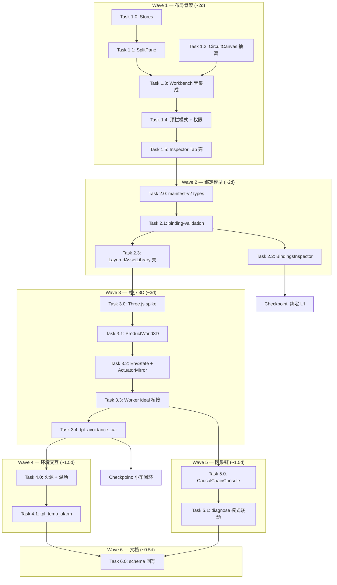

# 双视窗产品世界布局实施计划

> **归档说明（2026-07-09）**：任务级执行细节已拆分至
> [`03-dual-viewport-phased-design/`](../scripts/README.md)。
> **以分阶段设计目录为执行 SSOT**；本文保留背景、风险登记与工时汇总。

| 字段 | 内容 |
|------|------|
| **计划编号** | `PLAN-20260709-DUAL-VIEWPORT` |
| **创建日期** | 2026-07-09 |
| **目标平台** | `host`（浏览器 Vue 3 工作台） |
| **工具链** | TypeScript 6.x · Vite 8.x · Vue 3.5 · Three.js · Vitest |
| **计划状态** | 📦 **已归档（v1.1）** → 执行见 phased-design |
| **优先级** | 🟠 P0（产品仿真核心路径，阻塞 3D 机械/环境交互 MVP） |
| **计划版本** | v1.1 |
| **关联设计规范** | [`02-dual-viewport-product-world-layout.md`](../../design/05-frontend-workbench/02-dual-viewport-product-world-layout.md)、[`03-dual-viewport-phased-design/`](../scripts/README.md)（**执行 SSOT**）、[`01-frontend-workbench-architecture.md`](../../design/05-frontend-workbench/01-frontend-workbench-architecture.md) |
| **关联技术设计** | 无（本波次以设计规范 02 为 SSOT；W3 启动前可补 `tech-designs/2026-07-09-product-world-3d-bridge-design.md`） |
| **关联 ADR** | [ADR-0003](../../decisions/unisim/0003-simulation-fidelity-boundary.md)、[ADR-0009](../../decisions/unisim/0009-physical-behavior-simulation-fault-injection.md)、[ADR-0014](../../decisions/unisim/0014-sim-single-virtual-core.md) |
| **前置依赖计划** | [`2026-07-09-frontend-wire-routing-hctr-plan.md`](./2026-07-09-frontend-wire-routing-hctr-plan.md)（✅ 已完成，电路画布稳定） |
| **计划负责人** | TBD |

---

## 1. 背景与目标

### 1.1 问题陈述

Embedded Workbench 当前中心区域通过 Tab 在 `Circuit Canvas` 与 `Simulation View` 之间**互斥切换**；`Simulation View` 仅为外设卡片网格。用户无法在同一界面观察「电路连线电平」与「3D 产品运动/环境交互」的因果联动，也无法将电机 PWM、超声测距、温感等语义通过 wink-micro-os Wasm 闭环仿真。

### 1.2 技术目标

按设计规范 02 的 W1–W6 分波交付：

| 波次 | 目标 | 必须达成 |
|------|------|----------|
| **W1** | 双视窗分屏骨架 + 工作模式状态机 | ✅ |
| **W2** | Manifest v2 类型 + 绑定校验 + Bindings 面板 | ✅ |
| **W3** | 最小 3D 世界 + 避障小车模板 + ideal/actuator 桥接 | ✅ → **拆为 W3a / W3b / W3c**（见 phased-design） |
| **W4** | 火源温场 + 温感报警模板 | ✅ |
| **W5** | 因果链控制台 MVP | ✅ |
| **W6** | Manifest schema 文档回写 + 设计规范闭环 | ✅ |

### 1.3 成功指标

| 指标 | 通过标准 | 验证方法 |
|------|----------|----------|
| 类型检查 | 0 error | `npm run build` |
| 单元测试 | 100% pass | `npm run test` |
| 分屏交互 | 拖拽分割条调整比例；最小宽 280px | 手动 + 组件测试 |
| 模式权限 | `simulate` 态连线不可编辑；顶栏布线控件隐藏 | 手动 |
| Legacy 回退 | `VITE_LEGACY_SIM_TAB=true` 恢复 Tab 行为 | env 切换 |
| 绑定门禁 | 缺超声 `mechanicalPartId` 时 simulate 阻塞 | Vitest + 手动 |
| 3D 闭环（W3） | PWM 输出 → 轮子转；Raycast → HC-SR04 ideal 距离 | 手动 + 集成测试 |
| 温场闭环（W4） | 拖拽火源 → DHT ideal 温度变化 | 手动 |
| 因果链（W5） | diagnose 模式 ≥5 步可追溯 | 手动 |
| 性能 | 仿真运行 60fps 目标；主线程不掉帧 >500ms | Chrome Performance |
| 架构纪律 | ProductWorld 不直接调 `js_pal_gpio_write` | 代码审查 + grep |

### 1.4 不在范围

- ngspice 电气仿真
- 复杂机械臂 IK / 软体 / 流体
- STM32 / 多板联合仿真
- WebSerial 烧录、硬件 Golden Trace 对比（属 MVP-2）
- OLED framebuffer 纹理贴到 3D 外壳（W6 后 P2）

---

## 2. 变更范围

### 2.1 文件变更清单（全波次汇总）

| 文件路径 | 波次 | 变更类型 | 说明 |
|----------|------|----------|------|
| `../../../../wink-ai/packages/embedded-frontend/src/components/layout/SplitPane.vue` | W1 | 🆕 | 可拖拽分屏 |
| `../../../../wink-ai/packages/embedded-frontend/src/components/layout/ViewportPiP.vue` | W1 | 🆕 | 画中画（P1，可 W1 末或 W3） |
| `../../../../wink-ai/packages/embedded-frontend/src/stores/workbench-mode.store.ts` | W1 | 🆕 | design / simulate / diagnose |
| `../../../../wink-ai/packages/embedded-frontend/src/stores/layout.store.ts` | W1 | 🆕 | 分屏比例、PiP 状态 |
| `../../../../wink-ai/packages/embedded-frontend/src/stores/selection.store.ts` | W1 | 🆕 | 双视窗选中同步 |
| `../../../../wink-ai/packages/embedded-frontend/src/components/circuit/CircuitCanvas.vue` | W1 | 🆕 | 从 Workbench 抽离画布 |
| `../../../../wink-ai/packages/embedded-frontend/src/components/world/ProductWorld3D.vue` | W3 | 🆕 | Three.js 场景入口 |
| `../../../../wink-ai/packages/embedded-frontend/src/components/world/ProductWorldPlaceholder.vue` | W1 | 🆕 | 3D 未启用时占位 |
| `../../../../wink-ai/packages/embedded-frontend/src/components/world/EnvStateManager.ts` | W3 | 🆕 | JS 环境域 ideal 状态 |
| `../../../../wink-ai/packages/embedded-frontend/src/components/world/ActuatorMirror.ts` | W3 | 🆕 | PWM/GPIO → 执行器 |
| `../../../../wink-ai/packages/embedded-frontend/src/components/world/templates/avoidance-car.ts` | W3 | 🆕 | 避障小车 Manifest patch |
| `../../../../wink-ai/packages/embedded-frontend/src/components/world/templates/temp-alarm.ts` | W4 | 🆕 | 温感报警模板 |
| `../../../../wink-ai/packages/embedded-frontend/src/components/inspector/*.vue` | W1–W2 | 🆕 | 右栏分 Tab |
| `../../../../wink-ai/packages/embedded-frontend/src/components/asset-library/LayeredAssetLibrary.vue` | W2 | 🆕 | 左栏 Accordion |
| `../../../../wink-ai/packages/embedded-frontend/src/components/causal/CausalChainConsole.vue` | W5 | 🆕 | 因果链底栏 |
| `../../../../wink-ai/packages/embedded-frontend/src/types/manifest-v2.ts` | W2 | 🆕 | mechanical/environment/bindings |
| `../../../../wink-ai/packages/embedded-frontend/src/services/binding-validation.service.ts` | W2 | 🆕 | B-01～B-06 规则 |
| `../../../../wink-ai/packages/embedded-frontend/src/services/manifest-patch.service.ts` | W2 | 🆕 | 模板批量 patch |
| `../../../../wink-ai/packages/embedded-frontend/src/services/simulation-client.ts` | W3 | ✏️ | setIdealInputs / actuatorOutput |
| `../../../../wink-ai/packages/embedded-frontend/src/workers/wasm-simulation.worker.ts` | W3 | ✏️ | 桥接 ideal 输入 |
| `../../../../wink-ai/packages/embedded-frontend/src/views/EmbeddedWorkbench.vue` | W1 | ✏️ | 壳化：布局 + 模式 |
| `../../../../wink-ai/packages/embedded-frontend/package.json` | W3 | ✏️ | three, @dimforge/rapier3d-compat（或等价） |
| `../../../../wink-ai/packages/embedded-frontend/src/**/__tests__/*.test.ts` | W1–W5 | 🆕 | 状态机、校验、EnvState |
| `docs/design/03-app-codegen/02-project-manifest-schema.md` | W6 | ✏️ | schema v2 回写 |
| `docs/design/05-frontend-workbench/02-dual-viewport-product-world-layout.md` | W6 | ✏️ | 实施状态更新 |

### 2.2 接口影响

| 接口层 | 破坏性变更 | 说明 |
|--------|------------|------|
| `EmbeddedWorkbench` 内部结构 | ⚠️ 大重构 | 对外 `App.vue` 入口不变 |
| `simulation-client` 公开 API | ⚠️ 扩展 | 新增 `setIdealInputs`；现有 init/start/stop 兼容 |
| Worker `postMessage` 协议 | ⚠️ 扩展 | 新增 `actuatorOutput` / `causalStep` 事件 |
| Manifest `schemaVersion` | ⚠️ v1→v2 | 缺省三节视为空；`VITE_MANIFEST_SCHEMA_V2=false` 可忽略 |
| HCTR `routing/` | ❌ 否 | 仅迁入 CircuitCanvas，逻辑不变 |

### 2.3 架构红线

1. **ProductWorld 不得**直接调用 `Module.js_pal_gpio_write` 或等价 Wasm 导出
2. **Wasm C 代码不得**依赖 Three.js / DOM
3. **PAL 退化算法**不得用 JS `setTimeout` 驱动（遵循 ADR-0009 / 路线图 §1.3）
4. **SimTime** 为唯一语义时间源；3D 物理步进与 Worker 交换对齐 `clockUs`
5. **Feature Flag** 必须保留：`VITE_LEGACY_SIM_TAB`、`VITE_ENABLE_PRODUCT_WORLD`、`VITE_MANIFEST_SCHEMA_V2`
6. **HCTR 布线**行为不得回归（抽离 CircuitCanvas 时零逻辑变更）

---

## 3. 依赖与风险

### 3.1 前置依赖

| 依赖ID | 内容 | 阻塞 | 状态 |
|--------|------|------|------|
| D-001 | HCTR 布线稳定（Phase C 画布） | W1 抽离画布 | ✅ 已完成 |
| D-002 | Wasm Worker 最小可运行 | W3 桥接 | ✅ 已有 |
| D-003 | 设计规范 02 评审确认 | W1 启动 | 📋 本计划即评审载体 |
| D-004 | Three.js + 物理库选型 spike | W3 启动 | 待办（Task 3.0） |
| D-005 | `js_sim_measure_echo_pulse_us` 或等价 bridge 在 wasm 侧可用 | W3 超声闭环 | 待验证 |

### 3.2 风险登记册

| 风险ID | 描述 | 概率 | 影响 | 严重度 | 缓解 |
|--------|------|------|------|--------|------|
| R-001 | `EmbeddedWorkbench.vue` 单体抽离回归 | 高 | 高 | 8 | W1 先 Copy-Extract；HCTR 快照测试；逐步替换 |
| R-002 | Three.js 包体积 + 首屏加载 | 中 | 中 | 4 | 动态 `import()`；W1 用 Placeholder |
| R-003 | 主线程 3D + UI 卡顿 | 中 | 高 | 6 | dt clamp；ideal 批量交换；PiP 降分辨率 |
| R-004 | Wasm bridge 无 ideal 输入 API | 中 | 高 | 7 | W3 前 spike；暂用手调 fallback + `overrideIdealInputs` |
| R-005 | Manifest v2 与现有内存态不同步 | 中 | 中 | 5 | 先 types + 校验；持久化 W2 末 |
| R-006 | 超声距离迁移用户困惑 | 低 | 中 | 3 | 保留 override 滑块至 W3 验收后移除 |
| R-007 | Rapier WASM 与 Vite 打包冲突 | 中 | 中 | 5 | Task 3.0 spike；备选纯运动学（无 Rapier） |

---

## 4. 执行路线图

### 4.1 波次依赖图



### 4.2 工时估算

| 波次 | Task 范围 | 估算工时 | 日历（1 人） |
|------|-----------|----------|--------------|
| W1 | T1.0–T1.5 | 16h | 2 工作日 |
| W2 | T2.0–T2.3 | 16h | 2 工作日 |
| W3 | T3.0–T3.4 | 24h | 3 工作日 |
| W4 | T4.0–T4.1 | 12h | 1.5 工作日 |
| W5 | T5.0–T5.1 | 12h | 1.5 工作日 |
| W6 | T6.0 | 4h | 0.5 工作日 |
| **合计** | **22 Task** | **~84h** | **~10.5 工作日** |

### 4.3 Checkpoint

| 检查点 | 时机 | 通过标准 |
|--------|------|----------|
| **CP-0** | W1 末 | 分屏可拖拽；模式切换改变编辑权限；HCTR 无回归；`npm run test` pass |
| **CP-1** | W2 末 | Bindings 可编辑并校验；simulate 门禁生效 |
| **CP-2** | W3 末 | 避障小车：PWM→轮子转；Raycast→距离→Wasm 可读 |
| **CP-3** | W5 末 | 火源温场 + 因果链 diagnose 可用 |
| **CP-FINAL** | W6 末 | schema 回写；全量测试 + build 通过 |

---

## 5. 详细任务

### Wave 1 — 布局骨架

#### Task 1.0：Pinia-less 状态 Store（Composable）

| 字段 | 内容 |
|------|------|
| 预估工时 | 2h |
| 优先级 | 🔴 P0 |
| 修改文件 | `stores/workbench-mode.store.ts`, `stores/layout.store.ts`, `stores/selection.store.ts` |

**步骤：**

- [ ] 实现 `useWorkbenchMode()`：`design` \| `simulate` \| `diagnose`；转换守卫（design→simulate 需校验钩子，先 stub）
- [ ] 实现 `useLayoutStore()`：`splitRatio`（默认 0.7 circuit）、`orientation`、`pipEnabled`；按模式写入默认比例（见设计规范 §3.3）
- [ ] 实现 `useSelectionStore()`：`WorkbenchSelection`；`selectFromCircuit` / `selectFromWorld`；绑定组高亮 ID 列表（先空实现）
- [ ] Vitest：`workbench-mode.store.test.ts` 覆盖非法转换拒绝

**验证：** `npm run test` 通过

---

#### Task 1.1：SplitPane 组件

| 字段 | 内容 |
|------|------|
| 预估工时 | 3h |
| 优先级 | 🔴 P0 |
| 前置 | Task 1.0 |
| 修改文件 | `components/layout/SplitPane.vue` |

**步骤：**

- [ ] 水平/垂直分屏；拖拽分割条；`minPaneSizePx=280`
- [ ] `v-model:ratio` 双向绑定 `layout.store`
- [ ] 双击分割条重置为当前模式默认比例
- [ ] 组件测试：ratio 钳制、emit 更新

**验证：** Storybook 或 dev 页面手动拖拽流畅

---

#### Task 1.2：CircuitCanvas 抽离

| 字段 | 内容 |
|------|------|
| 预估工时 | 6h |
| 优先级 | 🔴 P0 |
| 前置 | 无（可与 T1.0 并行） |
| 修改文件 | `components/circuit/CircuitCanvas.vue`, `EmbeddedWorkbench.vue` |

**步骤：**

- [ ] 将 `EmbeddedWorkbench.vue` 中 canvas 相关 template + script + style **原样迁移**至 `CircuitCanvas.vue`
- [ ] Props：`readonly: boolean`（simulate/diagnose 为 true）
- [ ] Emits：`select-component`, `canvas-click` 等保持原有契约
- [ ] **禁止**修改 HCTR / 布线 / 拖拽逻辑（纯搬迁）
- [ ] 对比迁移前后：同布局 `getWirePCBPath` 输出 hash 一致（Vitest 或 snapshot）

**验证：** 画布连线、拖拽、手动 waypoint 与迁移前一致

---

#### Task 1.3：Workbench 壳集成 + World 占位

| 字段 | 内容 |
|------|------|
| 预估工时 | 3h |
| 优先级 | 🔴 P0 |
| 前置 | Task 1.1, 1.2 |
| 修改文件 | `EmbeddedWorkbench.vue`, `ProductWorldPlaceholder.vue` |

**步骤：**

- [ ] 移除 `activeTab` canvas/sim 互斥（或 `VITE_LEGACY_SIM_TAB` 保留旧路径）
- [ ] 中心区域改为 `<SplitPane><CircuitCanvas /><ProductWorldPlaceholder /></SplitPane>`
- [ ] Placeholder 展示「Product World — 3D simulation preview」+ 模式说明
- [ ] `sim-grid` 虚拟外设网格 **删除或** 仅在 `VITE_LEGACY_SIM_TAB` 下保留

**验证：** 默认启动为左右分屏；legacy flag 可回退 Tab

---

#### Task 1.4：顶栏工作模式与权限

| 字段 | 内容 |
|------|------|
| 预估工时 | 1.5h |
| 优先级 | 🔴 P0 |
| 前置 | Task 1.3 |
| 修改文件 | `EmbeddedWorkbench.vue` |

**步骤：**

- [ ] 顶栏增加模式切换：`Design` / `Simulate` / `Diagnose`（Segmented control）
- [ ] `simulate`/`diagnose`：隐藏 Wire Style、Routing Mode、Tidy Wires（或 disabled）
- [ ] `CircuitCanvas :readonly="mode !== 'design'"`
- [ ] `design→simulate`：若仿真未初始化，沿用现有 init；校验门禁先 `console.warn` stub

**验证：** 切换模式顶栏控件符合设计规范 §3.1 矩阵

---

#### Task 1.5：右栏 Inspector Tab 壳

| 字段 | 内容 |
|------|------|
| 预估工时 | 2.5h |
| 优先级 | 🟡 P1 |
| 前置 | Task 1.4 |
| 修改文件 | `components/inspector/CircuitInspector.vue`, `BindingsInspector.vue`（空壳）, 等 |

**步骤：**

- [ ] 右栏 Tab：`Circuit` \| `Bindings` \| `Faults`（Mechanical/Environment/Diagnostics 先 disabled 占位）
- [ ] 将现有 Property Inspector + Fault Injector 迁入 `CircuitInspector` / `FaultsInspector`
- [ ] `BindingsInspector`：展示「No bindings configured」+ 链接文档
- [ ] 选中对象时自动切 Tab（电路外设 → Circuit）

**验证：** 现有属性编辑、故障注入无回归

---

### Wave 2 — 绑定模型

#### Task 2.0：Manifest v2 类型与默认值

| 字段 | 内容 |
|------|------|
| 预估工时 | 3h |
| 优先级 | 🔴 P0 |
| 修改文件 | `types/manifest-v2.ts`, `services/manifest-patch.service.ts` |

**步骤：**

- [ ] 定义 `MechanicalSection`, `EnvironmentSection`, `BindingsSection` TypeScript 接口（对齐设计规范 §8）
- [ ] `normalizeManifestV2(raw)`：v1 输入补空三节；`schemaVersion` 升级
- [ ] `createEmptyBindings()`, `applyTemplatePatch(templateId)`
- [ ] 单元测试：v1 JSON 加载不抛错

**验证：** Vitest 覆盖 normalize + 空默认值

---

#### Task 2.1：绑定校验服务

| 字段 | 内容 |
|------|------|
| 预估工时 | 4h |
| 优先级 | 🔴 P0 |
| 前置 | Task 2.0 |
| 修改文件 | `services/binding-validation.service.ts` |

**步骤：**

- [ ] 实现规则 B-01～B-06；返回 `Diagnostic[]`（level: error/warning/info）
- [ ] `canEnterSimulate(manifest): boolean` — 无 error 级诊断
- [ ] 集成到 `design→simulate` 门禁
- [ ] Vitest：每条规则正负用例

**验证：** 缺 `mechanicalPartId` 的超声绑定阻塞 simulate

---

#### Task 2.2：BindingsInspector UI

| 字段 | 内容 |
|------|------|
| 预估工时 | 5h |
| 优先级 | 🔴 P0 |
| 前置 | Task 2.1 |
| 修改文件 | `components/inspector/BindingsInspector.vue` |

**步骤：**

- [ ] 列表展示 actuators / sensors / displays
- [ ] 添加绑定向导（MVP：表单选择 device + mapping type + target part/joint）
- [ ] 超声 `raycast_range_cm` 表单项（mechanicalPartId 下拉）
- [ ] 校验结果 inline 展示
- [ ] 超声波距离滑块 **保留**在 CircuitInspector，标注 `overrideIdealInputs`（待 W3 移除）

**验证：** 可手动配置 HC-SR04 raycast 绑定并触发 B-04

---

#### Task 2.3：左栏 LayeredAssetLibrary 壳

| 字段 | 内容 |
|------|------|
| 预估工时 | 4h |
| 优先级 | 🟡 P1 |
| 前置 | Task 2.0 |
| 修改文件 | `components/asset-library/LayeredAssetLibrary.vue` |

**步骤：**

- [ ] Accordion：`Peripherals`（迁移现有 catalog）、`Mechanical`/`Environment`/`Templates`（占位列表）
- [ ] `Templates` 下展示 `tpl_avoidance_car`、`tpl_temp_alarm`（点击调用 `applyTemplatePatch`，W3/W4 填充）
- [ ] `simulate` 模式默认折叠左栏（按钮展开）

**验证：** 现有外设添加流程不变；模板按钮可 patch 内存 manifest（console 可打印）

---

### Wave 3 — 最小 3D

#### Task 3.0：Three.js + 物理 Spike

| 字段 | 内容 |
|------|------|
| 预估工时 | 4h |
| 优先级 | 🔴 P0 |
| 修改文件 | spike 目录或 `ProductWorld3D.vue` 原型 |

**步骤：**

- [ ] 评估 `three` + `@dimforge/rapier3d-compat` vs 纯运动学
- [ ] 验证 Vite 动态 import、包体积、`npm run build` 通过
- [ ] 产出决策记录于 Task 注释或短 ADR stub（若选运动学则更新 R-007 缓解为已关闭）
- [ ] **阻塞**：未通过 spike 不进入 Task 3.1

**验证：** 空白场景 60fps 旋转立方体；build 成功

---

#### Task 3.1：ProductWorld3D 场景

| 字段 | 内容 |
|------|------|
| 预估工时 | 8h |
| 优先级 | 🔴 P0 |
| 前置 | Task 3.0, W1 完成 |
| 修改文件 | `components/world/ProductWorld3D.vue` |

**步骤：**

- [ ] 替换 Placeholder；场景：地面 + 环境光 + 相机控制（OrbitControls）
- [ ] 从 manifest `mechanical` / `environment` 实例化 primitive（box/cylinder 即可，无 glTF 要求）
- [ ] `readonly` prop：设计态可选中；仿真态 Gizmo 禁用
- [ ] ResizeObserver 自适应 SplitPane 尺寸
- [ ] emit `select-part` / `select-prop` → selection store

**验证：** 手动添加 mechanical parts 后 3D 可见

---

#### Task 3.2：EnvStateManager + ActuatorMirror

| 字段 | 内容 |
|------|------|
| 预估工时 | 6h |
| 优先级 | 🔴 P0 |
| 前置 | Task 3.1, 2.1 |
| 修改文件 | `EnvStateManager.ts`, `ActuatorMirror.ts` |

**步骤：**

- [ ] `EnvStateManager.tick(simTimeUs, scene, bindings)` → `IdealInputBatch`
- [ ] 实现 `raycast_range_cm`：Three.js Raycaster
- [ ] `ActuatorMirror.apply(outputs, scene, bindings)`：`pwm_to_angular_velocity` 更新轮子角速度
- [ ] 单元测试：raycast 距离计算（mock 场景对象）

**验证：** 静态墙前超声绑定输出预期 cm

---

#### Task 3.3：Worker ideal / actuator 桥接

| 字段 | 内容 |
|------|------|
| 预估工时 | 4h |
| 优先级 | 🔴 P0 |
| 前置 | Task 3.2 |
| 修改文件 | `simulation-client.ts`, `wasm-simulation.worker.ts` |

**步骤：**

- [ ] UI：`setIdealInputs(batch)` postMessage
- [ ] Worker：转发至 wasm bridge（`js_sim_set_ultrasonic_cm` 或现有 ultrasonic 滑块等价路径）
- [ ] Worker → UI：`actuatorOutput` 事件（从 `pinStates`/PWM stub 聚合；若 wasm 暂无 PWM export，先用 GPIO 映射 stub）
- [ ] rAF 循环：`isRunning` 时每帧 tick EnvState → setIdealInputs；收到 actuatorOutput → ActuatorMirror
- [ ] **纪律检查**：grep 确认 ProductWorld 无 `pal_gpio_write`

**验证：** 仿真运行时距离随 3D 障碍物变化；电机输出可改变轮子转速

---

#### Task 3.4：tpl_avoidance_car 端到端

| 字段 | 内容 |
|------|------|
| 预估工时 | 2h |
| 优先级 | 🔴 P0 |
| 前置 | Task 3.3, 2.3 |
| 修改文件 | `templates/avoidance-car.ts` |

**步骤：**

- [ ] 模板 patch：devices（ESP32 已有 + HC-SR04 + 电机驱动占位）+ mechanical + environment（围墙）+ bindings
- [ ] 左栏 Templates 一键插入
- [ ] 默认分屏 `simulate` 比例 40:60
- [ ] 编写 CP-2 验收脚本（附录 B）

**验证：** CP-2 通过

---

### Wave 4 — 环境交互

#### Task 4.0：火源与温场采样

| 字段 | 内容 |
|------|------|
| 预估工时 | 6h |
| 优先级 | 🟡 P1 |
| 前置 | Task 3.2 |
| 修改文件 | `EnvStateManager.ts`, `ProductWorld3D.vue`, `EnvironmentInspector.vue` |

**步骤：**

- [ ] `env_heat_source` 可视化（球体 + 热力场 debug 环）
- [ ] 设计/仿真态可拖拽 Gizmo 更新 `environment.props[].transform`
- [ ] `temperature_field_sample`：距离衰减 `T = T_core - k * dist`（简化）
- [ ] `EnvironmentInspector`：编辑 `coreTemperatureC`, `falloffRadiusM`

**验证：** 拖拽火源，ideal 温度随距离变化

---

#### Task 4.1：tpl_temp_alarm 模板

| 字段 | 内容 |
|------|------|
| 预估工时 | 6h |
| 优先级 | 🟡 P1 |
| 前置 | Task 4.0 |
| 修改文件 | `templates/temp-alarm.ts` |

**步骤：**

- [ ] 模板 patch + DHT 绑定 `temperature_field_sample`
- [ ] 移除 Circuit 超声距离滑块对 DHT 的误导（若适用）
- [ ] 与 Wasm 温感读取路径联调（ideal → PAL warmup → App）

**验证：** 火源靠近 → 温度上升 → App 报警（LED/日志可观测）

---

### Wave 5 — 因果链

#### Task 5.0：CausalChainConsole

| 字段 | 内容 |
|------|------|
| 预估工时 | 8h |
| 优先级 | 🟡 P1 |
| 前置 | Task 3.3 |
| 修改文件 | `CausalChainConsole.vue`, `stores/causal.store.ts` |

**步骤：**

- [ ] 底栏新增 `Causal` Tab
- [ ] `CausalChainStep` 环形缓冲 500 步
- [ ] EnvState / ActuatorMirror / Worker 埋点推送 `causalStep`（diagnose 或 `?causal=verbose`）
- [ ] 点击步骤高亮 selection 绑定组
- [ ] 导出 JSON

**验证：** 超声闭环可展示 ≥5 步因果链

---

#### Task 5.1：Diagnose 模式联动

| 字段 | 内容 |
|------|------|
| 预估工时 | 4h |
| 优先级 | 🟡 P1 |
| 前置 | Task 5.0 |
| 修改文件 | `EmbeddedWorkbench.vue`, `workbench-mode.store.ts` |

**步骤：**

- [ ] `isFaulted` 自动切入 `diagnose`；暂停仿真；底栏切 Causal
- [ ] 布局比例切 diagnose 默认（25:25 + 底栏拉高）
- [ ] `diagnose→simulate` Resume 保留 Causal 历史

**验证：** 注入 fault 后进入 diagnose 且因果链可见

---

### Wave 6 — 文档闭环

#### Task 6.0：Manifest schema 与设计规范回写

| 字段 | 内容 |
|------|------|
| 预估工时 | 4h |
| 优先级 | 🟡 P1 |
| 前置 | CP-3 |
| 修改文件 | `02-project-manifest-schema.md`, `02-dual-viewport-product-world-layout.md` |

**步骤：**

- [ ] 将 §8 mechanical/environment/bindings 回写 manifest schema 正式章节
- [ ] 增加 `schemaVersion: 2` 迁移说明
- [ ] 更新设计规范 02 §15 实施状态为已完成
- [ ] 本计划状态改为 ✅ 已完成

**验证：** 文档交叉链接有效；schema 示例与 `types/manifest-v2.ts` 一致

---

## 6. Feature Flag 与环境变量

| 变量 | 默认值 | 作用 |
|------|--------|------|
| `VITE_LEGACY_SIM_TAB` | `false` | `true` 恢复 canvas/sim Tab 互斥 |
| `VITE_ENABLE_PRODUCT_WORLD` | `false`（W1–W2）→ `true`（W3+） | `false` 时右侧为 Placeholder |
| `VITE_MANIFEST_SCHEMA_V2` | `true`（W2+） | `false` 忽略 mechanical/environment/bindings |

`.env.development` 示例：

```env
VITE_ENABLE_PRODUCT_WORLD=true
VITE_MANIFEST_SCHEMA_V2=true
```

---

## 7. 测试策略

| 层级 | 范围 | 工具 |
|------|------|------|
| 单元 | mode store、layout store、binding-validation、EnvState raycast/温场 | Vitest |
| 组件 | SplitPane ratio、Inspector Tab 切换 | Vitest + @vue/test-utils（若引入） |
| 集成 | CircuitCanvas 抽离前后 wire path snapshot | Vitest |
| 手动 | CP-0～CP-3 场景脚本 | 浏览器 |
| 架构 | 无 `pal_gpio_write` in world/ | `rg` CI 可选 |

**回归清单（每波次末）：**

1. HCTR 布线视觉与手动 waypoint
2. Wasm Play/Pause/Reset/Fault 注入
3. OLED / LED / Button 电路层交互
4. `npm run build` + `npm run test`

---

## 8. 验收门禁

| 门禁 | 条件 |
|------|------|
| **G1 — W1 合并** | CP-0 通过；无 P0 bug；legacy flag 可用 |
| **G2 — W2 合并** | CP-1 通过；绑定校验 ≥12 单测 |
| **G3 — W3 合并** | CP-2 通过；Three.js 动态加载；包体积增量记录 |
| **G4 — 发布候选** | CP-3 + W6 完成；全量回归通过 |

---

## 9. 参考资料

- [双视窗布局设计规范](../../design/05-frontend-workbench/02-dual-viewport-product-world-layout.md)
- [前端工作台架构](../../design/05-frontend-workbench/01-frontend-workbench-architecture.md)
- [物理退化引擎](../../design/04-wasm-simulation/archive/06-physical-degradation-engine.md)
- [HCTR 实施计划（已完成）](./2026-07-09-frontend-wire-routing-hctr-plan.md)
- 现状代码：`../../../../wink-ai/packages/embedded-frontend/src/views/EmbeddedWorkbench.vue`

---

## 附录 A：开发环境

```powershell
cd D:\workspaces\ai-coding\wink-ai\wink-ai-embedded\embedded-frontend
npm install
npm run dev
```

## 附录 B：CP-2 避障小车验收步骤

1. 左栏 `Templates` → 插入 `Avoidance Car`
2. 确认电路视窗有 HC-SR04；3D 视窗有底盘、两轮、围墙
3. 右栏 `Bindings` 存在 `bind_radar_front`（raycast）与电机 PWM 绑定
4. 切换 `Simulate`，Play
5. 在 3D 中确认小车初始状态；移动墙体或观察小车接近墙
6. 确认右栏/日志中超声距离随 3D 距离变化（非手调滑块）
7. 若有电机驱动 App：确认 PWM 输出时 3D 轮子旋转
8. 切换 `Design`：连线不可编辑；切回需 Stop

## 附录 C：Legacy 回退验证

```powershell
# .env.local
VITE_LEGACY_SIM_TAB=true
VITE_ENABLE_PRODUCT_WORLD=false
npm run dev
```

确认恢复 Tab 互斥与外设网格 Simulation View。

---

### 计划版本变更记录

| 版本 | 日期 | 变更内容 |
|------|------|----------|
| v1.0 | 2026-07-09 | 初始版本：W1–W6 共 22 Task，~84h |
| v1.1 | 2026-07-09 | 归档：执行 SSOT 迁至 `03-dual-viewport-phased-design/`；W3→W3a/b/c |

---

**自检状态**：📦 已归档 · v1.1 · 2026-07-09

