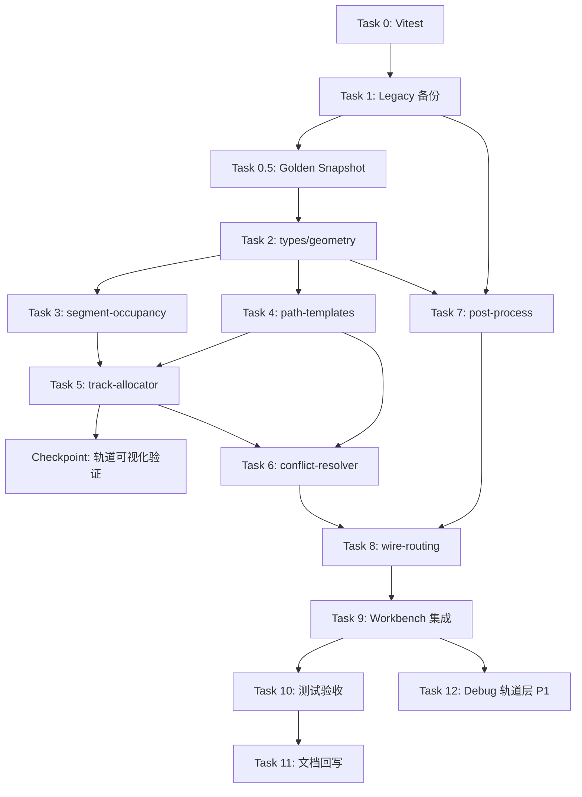

# 前端工作台连线布线 HCTR 重构实施计划

| 字段 | 内容 |
|------|------|
| **计划编号** | `PLAN-20260709-WIRE-HCTR` |
| **创建日期** | 2026-07-09 |
| **目标平台** | `host`（浏览器 Vue 3 工作台） |
| **工具链** | TypeScript 6.x · Vite 8.x · Vue 3.5 |
| **计划状态** | ✅ 已完成（v1.1） |
| **优先级** | 🟡 P1（体验提升，不阻塞仿真/编译主路径） |
| **计划版本** | v1.1 |
| **关联技术设计** | [`../../tech-designs/frontend/2026-07-09-frontend-wire-routing-hctr-design.md`](../../tech-designs/frontend/2026-07-09-frontend-wire-routing-hctr-design.md) |
| **关联设计规范** | [`../05-frontend-workbench/01-frontend-workbench-architecture.md`](../../design/05-frontend-workbench/01-frontend-workbench-architecture.md) |
| **关联 ADR** | 无 |
| **前置依赖计划** | 无 |
| **计划负责人** | TBD |

---

## 1. 背景与目标

### 1.1 问题陈述

Embedded Workbench 当前连线算法（`peripheral-pins.ts` 内 A* + 通道 fallback）在多器件场景下视觉效果不稳定：线间距不均、I2C 未平行成束、跨板路径风格不一致。用户反馈布线「不够美观」，需要在保留手动编辑能力的前提下重构自动布线。

### 1.2 技术目标

- ✅ 新算法 **HCTR**（分层通道轨道布线）上线，默认启用
- ✅ 原算法完整备份至 `wire-routing-legacy.ts`，支持 env 开关回退
- ✅ 对外 `WirePathResult` / `getWirePCBPath` 接口兼容，电源星型拓扑不变
- ✅ 手动 waypoint 拖拽/删除行为无回归
- ✅ Vitest 单元测试覆盖核心路由场景（**≥ 20 个用例**，含边界）
- ✅ 典型布局（LED + Button + OLED + Ultrasonic）视觉验收通过

### 1.3 成功指标

| 指标 | 通过标准 | 验证方法 |
|------|----------|----------|
| 类型检查 | 0 error | `npm run build`（vue-tsc） |
| 单元测试 | 100% pass | `npm run test` |
| 弯折一致性 | 跨侧线全部为 U 型模板（无自由锯齿） | 目视 + 单元测试断言弯折数 |
| I2C 平行 | SDA/SCL 全程 \|ΔX\| ≤ 8px（同水平段） | 单元测试 |
| 性能 | 20 线重算 avg < 16ms | Vitest benchmark（10 次平均） |
| 拖拽 | mousemove 无全画布闪烁 | 手动：拖 OLED 过板 |
| 回退 | env 或 `?legacy_routing=true` | 浏览器切换 |

---

## 2. 变更范围

### 2.1 文件变更清单

| 文件路径 | 变更类型 | 说明 |
|----------|----------|------|
| `../../../../wink-ai/packages/embedded-frontend/src/routing/types.ts` | 🆕 新增 | 路由类型定义 |
| `../../../../wink-ai/packages/embedded-frontend/src/routing/constants.ts` | 🆕 新增 | 间距/网格常量 |
| `../../../../wink-ai/packages/embedded-frontend/src/routing/geometry.ts` | 🆕 新增 | snap、碰撞检测 |
| `../../../../wink-ai/packages/embedded-frontend/src/routing/track-allocator.ts` | 🆕 新增 | 轨道分配 |
| `../../../../wink-ai/packages/embedded-frontend/src/routing/path-templates.ts` | 🆕 新增 | L/Z/U 模板 |
| `../../../../wink-ai/packages/embedded-frontend/src/routing/segment-occupancy.ts` | 🆕 新增 | 段级占用 |
| `../../../../wink-ai/packages/embedded-frontend/src/routing/conflict-resolver.ts` | 🆕 新增 | 障碍 + 段占用统一解析（H-4） |
| `../../../../wink-ai/packages/embedded-frontend/src/routing/post-process.ts` | 🆕 新增 | 圆角/teardrop/simplify |
| `../../../../wink-ai/packages/embedded-frontend/src/routing/wire-routing.ts` | 🆕 新增 | 新算法主入口 |
| `../../../../wink-ai/packages/embedded-frontend/src/routing/wire-routing-legacy.ts` | 🆕 新增 | 原算法备份 |
| `../../../../wink-ai/packages/embedded-frontend/src/routing/__tests__/*.test.ts` | 🆕 新增 | 单元测试 |
| `../../../../wink-ai/packages/embedded-frontend/src/types/peripheral-pins.ts` | ✏️ 修改 | 删除布线实现，re-export |
| `../../../../wink-ai/packages/embedded-frontend/src/views/EmbeddedWorkbench.vue` | ✏️ 修改 | 接入新分配器（小改） |
| `../../../../wink-ai/packages/embedded-frontend/package.json` | ✏️ 修改 | 添加 vitest |
| `../../../../wink-ai/packages/embedded-frontend/vite.config.ts` | ✏️ 修改 | vitest 配置 |
| `docs/design/05-frontend-workbench/01-frontend-workbench-architecture.md` | ✏️ 修改 | §7 画布连线补充 HCTR 说明 |

### 2.2 接口影响

| 接口层 | 破坏性变更 | 说明 |
|--------|------------|------|
| `generateSmartPCBPath` 签名 | ❌ 否 | 兼容包装保留 |
| `WirePathResult` 结构 | ❌ 否 | `vias` 恒为空 |
| `generatePowerBusTapPath/TrunkPath` | ❌ 否 | 原样保留 |
| `channelOccupancyMap` 参数 | ⚠️ 软废弃 | 仍接受但忽略；DEV warn；v2.0 硬移除 |

### 2.3 架构红线

1. **不得破坏** 电源星型拓扑（tap + trunk）的视觉与路径逻辑
2. **不得破坏** 用户手动 waypoint 的读写与拖拽交互
3. **必须保留** legacy 完整备份与一键回退能力
4. **所有路径** 必须保持正交（仅 H/V 线段）

---

## 3. 依赖与风险

### 3.1 前置依赖

| 依赖ID | 内容 | 阻塞 | 状态 |
|--------|------|------|------|
| D-001 | 技术设计评审通过 | ✅ 是 | ✅ 已完成（v1.1） |
| D-002 | 开放问题 Q1–Q5 确认 | ✅ 是 | ✅ 已确认 |

### 3.2 风险登记册

| 风险ID | 描述 | 概率 | 影响 | 严重度 | 缓解 |
|--------|------|------|------|--------|------|
| R-001 | Waypoint 拖拽回归 | 中 | 高 | 6 | `forcedPoints` 通道 + 专项手动测试 |
| R-002 | 密集布局轨道溢出 | 中 | 中 | 4 | 动态 bump + legacy fallback |
| R-003 | 与 peripheral-pins 耦合过深 | 低 | 中 | 2 | 分模块 + re-export |
| R-004 | 无 test runner 增加工期 | 高 | 低 | 2 | Task 0 引入 Vitest |
| R-005 | 拖拽时全画布线闪烁 | 中 | 中 | 4 | H-1 冻结分配策略 |

---

## 4. 执行路线图

### 4.1 任务依赖图



### 4.2 工时估算（评审后调整）

| 优先级 | Task | 原估算 | 修订估算 |
|--------|------|--------|----------|
| 🔴 P0 | T0–T9 | 14h | **17.5h** |
| 🟡 P1 | T10–T12 | 4h | **4.5h** |
| **总计** | **13 Task** | 16h | **~20h（3 工作日）** |

修订原因：legacy 抽出依赖复杂（Task 1 +2.5h）、I2C bundle 边界（Task 5 +1h）、Workbench 集成面大（Task 9 +1h）。

### 4.3 Checkpoint（Task 5 后）

- 用独立 HTML/SVG 或 Vitest 输出可视化 `buildTrackAssignments` 结果
- 确认 left/right/cross + I2C bundle 分配正确后，再推进 Task 6–9

---

## 5. 详细任务

### Task 0：引入 Vitest 测试脚手架

| 字段 | 内容 |
|------|------|
| 预估工时 | 1h |
| 优先级 | 🔴 P0 |
| 修改文件 | `package.json`, `vite.config.ts` |

**步骤：**

- [ ] 安装 `vitest` devDependency
- [ ] `vite.config.ts` 添加 `test: { environment: 'node' }`
- [ ] `package.json` 添加 `"test": "vitest run"`, `"test:watch": "vitest"`
- [ ] 添加 smoke test `src/routing/__tests__/smoke.test.ts` 验证环境

**验证：** `npm run test` 通过

---

### Task 0.5：Legacy Golden Snapshot 基准

| 字段 | 内容 |
|------|------|
| 预估工时 | 0.5h |
| 优先级 | 🔴 P0 |
| 前置 | Task 0, Task 1 |
| 修改文件 | `routing/__tests__/golden-baseline.test.ts` |

**步骤：**

- [ ] 对默认 LED / OLED 布局调用 `generateSmartPCBPathLegacy`，`toMatchSnapshot()`
- [ ] 作为新旧对比与 legacy 回退的客观基准

**验证：** snapshot 生成成功；`npm run test` 通过

---

### Task 1：Legacy 算法备份抽出

| 字段 | 内容 |
|------|------|
| 预估工时 | **2.5h** |
| 优先级 | 🔴 P0 |
| 前置 | Task 0 |
| 修改文件 | `routing/wire-routing-legacy.ts`, `peripheral-pins.ts` |

**步骤：**

- [ ] 将 `findAStarPath3D`、`AStarNode3D`、`AStarMinHeap`、`generateSmartPCBPath`、`generateChannelPath`、`generateFallbackOrthogonalPath` 原样移入 `wire-routing-legacy.ts`
- [ ] legacy 模块 export `generateSmartPCBPathLegacy`
- [ ] `peripheral-pins.ts` 临时 re-export legacy（保证行为不变）
- [ ] 确认 `npm run build` 通过

**验证：** 现有 UI 视觉效果与重构前一致

---

### Task 2：基础模块（types / constants / geometry）

| 字段 | 内容 |
|------|------|
| 预估工时 | 1.5h |
| 优先级 | 🔴 P0 |
| 前置 | Task 1 |
| 修改文件 | `routing/types.ts`, `constants.ts`, `geometry.ts` |

**步骤：**

- [ ] 定义 `WireTopology`, `TrackAssignment`, `OccupiedSegment`, `RoutingContext`
- [ ] 实现 `snapTrackCoord()` / `pinCoord()`（H-2）、`segmentIntersectsObstacle()`, `expandObstacle()`
- [ ] 实现 `rotateCardinalDirection()`（M-1）
- [ ] 常量按技术设计 §5.1 落地（含 `MAX_BUMP_COUNT`）

**验证：** geometry 单元测试 ≥ 4 用例

---

### Task 3：段级占用注册表

| 字段 | 内容 |
|------|------|
| 预估工时 | 1h |
| 优先级 | 🔴 P0 |
| 前置 | Task 2 |
| 修改文件 | `routing/segment-occupancy.ts`, `__tests__/segment-occupancy.test.ts` |

**步骤：**

- [ ] 实现 `SegmentOccupancyRegistry`：`register()`, `hasConflict()`, `extractSegmentsFromPoints()`
- [ ] 冲突判定：同 orientation + fixed ±1px + 区间重叠
- [ ] 测试：无冲突注册、同轨重叠、平行不重叠

**验证：** `segment-occupancy.test.ts` 全绿

---

### Task 4：路径模板

| 字段 | 内容 |
|------|------|
| 预估工时 | 2h |
| 优先级 | 🔴 P0 |
| 前置 | Task 2 |
| 修改文件 | `routing/path-templates.ts`, `__tests__/path-templates.test.ts` |

**步骤：**

- [ ] 实现 `templateLocal()`（H-6 四重条件）, `templateSameSide()`, `templateCrossSide()`
- [ ] 轨道/拐点经 `snapTrackCoord`；引脚用 `pinCoord`（H-2）
- [ ] 测试：三种模板弯折数、正交性、snap

**验证：** `path-templates.test.ts` 全绿

---

### Task 5：全局轨道分配器

| 字段 | 内容 |
|------|------|
| 预估工时 | **3h** |
| 优先级 | 🔴 P0 |
| 前置 | Task 3, Task 4 |
| 修改文件 | `routing/track-allocator.ts`, `__tests__/track-allocator.test.ts` |

**步骤：**

- [ ] 实现 `buildTrackAssignments(requests, channels, boardCenter)`
- [ ] 支持 left/right/cross 分桶 + priority 排序
- [ ] I2C bundle：1 lane 输出 2 条 assignment；bypassY 偏移 8px（H-3）
- [ ] **Checkpoint**：输出 SVG 或测试 fixture 可视化轨道分配

**验证：** OLED 双 I2C cross-side 水平段间距 = 8px；Checkpoint 通过

---

### Task 6：统一冲突解析器

| 字段 | 内容 |
|------|------|
| 预估工时 | 2h |
| 优先级 | 🔴 P0 |
| 前置 | Task 4, Task 5 |
| 修改文件 | `routing/conflict-resolver.ts` |

**步骤：**

- [ ] 合并障碍 nudge + 段占用 bump（H-4）
- [ ] bump 方向规则 + `MAX_BUMP_COUNT=5` + viewport 检查（H-7）
- [ ] 每次平移前查 `SegmentOccupancyRegistry`

**验证：** nudge 不踩已占用轨道；超限回退 legacy

---

### Task 7：后处理模块抽出

| 字段 | 内容 |
|------|------|
| 预估工时 | 1h |
| 优先级 | 🔴 P0 |
| 前置 | **Task 1 + Task 2**（M-5 修正） |
| 修改文件 | `routing/post-process.ts` |

**步骤：**

- [ ] 移入 `simplifyPath`, `pointsToRoundedSvgPath`, `generateTeardropPath`, `buildWirePathResultFrom2D`
- [ ] 移入 `generatePowerBusTapPath`, `generatePowerBusTrunkPath`（逻辑不变）
- [ ] `ROUND_RADIUS` 改为 6（可配置常量）

**验证：** 电源路径输出与重构前 SVG path 一致（snapshot 或字符串比较）

---

### Task 8：新算法主入口

| 字段 | 内容 |
|------|------|
| 预估工时 | 2h |
| 优先级 | 🔴 P0 |
| 前置 | Task 5, Task 6, Task 7 |
| 修改文件 | `routing/wire-routing.ts`, `__tests__/wire-routing.test.ts` |

**步骤：**

- [ ] 实现 `generateWirePath(opts)` 五阶段管线（含 Manual 模式 H-5）
- [ ] 实现兼容包装 `generateSmartPCBPath`；`channelOccupancyMap` DEV warn（M-3）
- [ ] env + `?legacy_routing=true` 回退（Q3）
- [ ] `vias` 恒 `[]`；`segments` 仅 layer 0
- [ ] 端到端测试：local / same-side / cross-side 三种拓扑

**验证：** `wire-routing.test.ts` 全绿

---

### Task 9：Workbench 集成

| 字段 | 内容 |
|------|------|
| 预估工时 | **2.5h** |
| 优先级 | 🔴 P0 |
| 前置 | Task 8 |
| 修改文件 | `EmbeddedWorkbench.vue`, `peripheral-pins.ts` |

**步骤：**

- [ ] `peripheral-pins.ts` 改为 re-export `routing/` 模块
- [ ] `buildGlobalLaneMap` 内部委托 `buildTrackAssignments`（Q4）
- [ ] 拖拽：mousemove 增量 / mouseup 全量重分配（H-1）
- [ ] `wiresToRender`：用 `SegmentOccupancyRegistry` 替代 `channelOccupancyMap`
- [ ] 确认 waypoint / draggingSegment / inactiveWireCache 逻辑未破坏

**验证：** `npm run dev` 目视默认布局；拖拽元器件线随动

---

### Task 10：测试与视觉验收

| 字段 | 内容 |
|------|------|
| 预估工时 | 2h |
| 优先级 | 🟡 P1 |
| 前置 | Task 9 |
| 修改文件 | 测试文件（补充） |

**步骤：**

- [x] 补充边界用例 UT-B01～B06（M-4）
- [x] Vitest benchmark：20 线 avg < 16ms（M-2）
- [x] 验证 `?legacy_routing=true` 与 golden snapshot 对比

**验证：** §1.3 成功指标全部满足

---

### Task 11：文档回写

| 字段 | 内容 |
|------|------|
| 预估工时 | 1h |
| 优先级 | 🟡 P1 |
| 前置 | Task 10 |
| 修改文件 | `05-frontend-workbench/01-frontend-workbench-architecture.md` |

**步骤：**

- [x] §7 画布设计补充「连线布线 HCTR」小节：拓扑分类、轨道、手动编辑
- [x] 本计划状态更新为 ✅ 已完成
- [x] 技术设计状态更新为 Stable

---

### Task 12：Debug 轨道可视化层（P1）

| 字段 | 内容 |
|------|------|
| 预估工时 | 0.5h |
| 优先级 | 🟡 P1 |
| 前置 | Task 9 |
| 修改文件 | `EmbeddedWorkbench.vue` |

**步骤：**

- [x] dev 开关渲染轨道虚线、占用段、topology 标签
- [x] 可通过 query `?routing_debug=true` 启用

**验证：** 轨道与分配结果一致

---

## 6. 测试策略与验收

### L0 编译门禁

- [ ] `cd ../../../../wink-ai/packages/embedded-frontend && bun run build` 零错误
- [ ] `npm run test` 全绿

### L1 单元测试用例清单

| ID | 场景 | 断言 |
|----|------|------|
| UT-01 | left 桶 3 条线 | `verticalTrackX` 等距递减 |
| UT-02 | cross 桶 2 条线 | `horizontalTrackY` 不同 |
| UT-03 | I2C bundle | 两线 X 差 = 8px |
| UT-04 | same-side 模板 | 仅 1 个竖直轨道段 |
| UT-05 | cross-side 模板 | 含 1 个水平 bypass 段 |
| UT-06 | local 短距 | 弯折 ≤ 1 |
| UT-07 | 段占用冲突 | bump 后不再重叠 |
| UT-08 | 障碍 nudge | 路径不穿过组件 |
| UT-09 | waypoint 插入 | 折点顺序保留 |
| UT-10 | 电源 tap | 与 legacy 输出一致 |
| UT-11 | snapTrackCoord | 轨道点 mod 4 === 0；引脚点不变 |
| UT-12 | legacy 回退 | env 或 `?legacy_routing=true` |
| UT-13 | Manual 模式 | 有 waypoint 时不走模板 |
| UT-14 | benchmark 20 线 | avg < 16ms |
| UT-B01 | `start.x === boardCenterX` | 归入 left 桶 |
| UT-B02 | 起终点 Y 相同 | Z 退化 |
| UT-B03 | 10 线全 left | bump 极限 |
| UT-B04 | 旋转 90°/180° | stub 方向正确 |
| UT-B05 | start === end | 空路径 |
| UT-B06 | I2C cross 水平段 | 间距 8px |

### L2 手动视觉验收

- [ ] 默认场景：4 种器件全部连线，线距均匀
- [ ] OLED：SDA/SCL 平行
- [ ] 拖拽 OLED 过板：mousemove 无全画布闪烁；mouseup 后整齐
- [ ] 点击线添加 waypoint → 拖拽 → 双击删除
- [ ] Tidy Wires 恢复自动布线
- [ ] 选中器件：相关线高亮，其他线 dim

---

## 7. 回滚方案

### 方案 1：环境变量或 URL（推荐，< 1 分钟）

```bash
# .env.local
VITE_LEGACY_WIRE_ROUTING=true
```

或浏览器访问 `?legacy_routing=true`，无需重启 dev server。

重启 dev server（仅 env 方式时），立即恢复 `wire-routing-legacy.ts`。

### 方案 2：Git revert

```bash
git revert <hctr-merge-commit>
```

影响范围：仅 `../../../../wink-ai/packages/embedded-frontend/src/routing/` 及 `peripheral-pins.ts` re-export。

### 回滚验证

- [ ] `VITE_LEGACY_WIRE_ROUTING=true` 后视觉与重构前一致
- [ ] `npm run build` 通过

---

## 8. 评审决议（2026-07-09）

| 项 | 状态 |
|----|------|
| HCTR 整体策略 | ✅ 采纳 |
| H-1～H-7 | ✅ 已并入技术设计 v1.1 |
| M-1～M-5 | ✅ 已并入实施计划 v1.1 |
| Q1–Q5 | ✅ 已确认（见技术设计 §12） |
| 工时 | ✅ 调整为 ~20h / 3 工作日 |
| Debug 轨道层 | ✅ 纳入 Task 12（P1） |

---

## 9. 参考资料

- [技术设计：HCTR](../../tech-designs/frontend/2026-07-09-frontend-wire-routing-hctr-design.md)
- [前端工作台架构](../../design/05-frontend-workbench/01-frontend-workbench-architecture.md)
- 现状代码：`../../../../wink-ai/packages/embedded-frontend/src/types/peripheral-pins.ts`
- 集成代码：`../../../../wink-ai/packages/embedded-frontend/src/views/EmbeddedWorkbench.vue`

---

### 计划版本变更记录

| 版本 | 日期 | 变更内容 |
|------|------|----------|
| v1.0 | 2026-07-09 | 初始版本 |
| v1.1 | 2026-07-09 | 专家评审修订：H-1～H-7、M-1～M-5、Task 0.5/12、工时 20h |

---

## 附录 A：验证操作手册

### A.1 开发环境

```powershell
cd D:\workspaces\ai-coding\wink-ai\wink-ai-embedded\embedded-frontend
npm install
npm run dev
```

浏览器打开 Vite 提示的本地地址（通常 `http://localhost:5173`）。

### A.2 运行测试

```powershell
npm run test
npm run build
```

### A.3 视觉验收步骤

1. 添加 LED、Button、OLED、Ultrasonic 到画布
2. 使用默认引脚连接
3. 观察连线是否平行、等距、无锯齿
4. 拖拽 OLED 到板子另一侧，观察 U 型 bypass
5. 点击某条线添加 waypoint，拖拽后确认形状保持
6. 双击 waypoint 删除，确认恢复

### A.4 Legacy 回退验证

```powershell
# 创建 .env.local
echo "VITE_LEGACY_WIRE_ROUTING=true" > .env.local
npm run dev
```

确认效果回到 A* 时代。

---

**自检状态**：✅ 评审通过 · v1.1 · 2026-07-09

