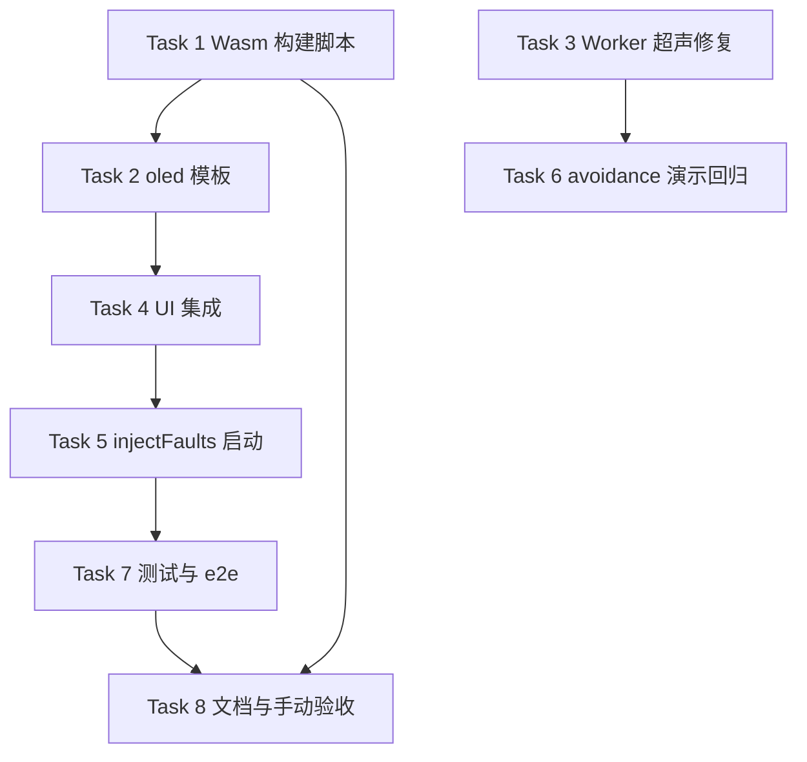

# OLED Dashboard Wasm UI 可演示实施计划

> **归档说明（2026-07-10）：** 本计划已执行完毕并归档。下文 checkbox 保留实施记录；Task 7 Step 2（专用 e2e-oled 脚本）为 P2 可选，**未落地**。

**Goal:** 让 Workbench 前端在 **Simulate 模式**下，能稳定演示「前端参数 → Wasm 固件行为」闭环：以 `oled_dashboard` 为主路径（按键 → LED + OLED「Hello World N」+ Logs、故障注入 → Trace），并保留 `avoidance_car` 超声距离演示的可切换构建能力。

**Architecture:** 不改动 PAL/DAL 公开 API（后续增补 SSD1306 字库拆分，仍不改动 `dal_ssd1306_*` 公开签名）。Wasm 侧继续通过 `WINK_APP_DIR` 注入 App；前端通过 **预置模板 + 引脚对齐 + copy-wasm 构建脚本** 消除「App 与画布接线不一致」导致的假阴性。Manifest V2 模板仅含 `worldCoupling: none` 器件，Simulate 门禁无需 3D binding。Worker 协议 bug（超声距离字段名、`setFaults` 响应式代理 `DataCloneError`）已在执行中修复。

**Tech Stack:** Emscripten (wasm32)、Vue 3 + TypeScript + Vite、Vitest、playwright-cli（W1 验收已用，本计划 e2e-oled 脚本为可选 P2，未单独落地）。

---

## 1. 元数据表

| 字段 | 内容 |
|------|------|
| **计划编号** | `PLAN-20260710-OLED-DEMO` |
| **创建日期** | `2026-07-10` |
| **目标平台** | `wasm`（Workbench 浏览器仿真）；`host`（`app_oled_dashboard_e2e` 回归）；ESP32 不在本计划范围 |
| **工具链** | Emscripten（与仓库 `build-wasm/` 现有 CMake 一致）；Node ≥ 18；Vite 7.x |
| **计划状态** | ✅ 已完成（2026-07-10 合入 master） |
| **完成日期** | `2026-07-10` |
| **落地 commit** | `871425e`（W2 + oled 模板/构建链）、`4daef2f`（Wasm init / faults 修复）、`1937cb8`（SSD1306 字库）、`97a78c1`（oled_dashboard Hello World + LOG_I） |
| **优先级** | 🟡 P1（Workbench 演示闭环，不阻塞 W3a 3D 预览） |
| **计划版本** | `v1.0` |
| **关联设计规范** | [`../05-frontend-workbench/03-dual-viewport-phased-design/02-phase-w2-binding-model.md`](../../design/05-frontend-workbench/03-dual-viewport-phased-design/02-phase-w2-binding-model.md) |
| **关联技术设计** | [`../04-wasm-simulation/01-wasm-sandbox-lifecycle.md`](../../design/04-wasm-simulation/archive/01-wasm-sandbox-lifecycle.md) § App 注入 |
| **关联 ADR** | [`ADR-0002`](../../decisions/unisim/0002-dual-target-compilation.md) 双 target 同源 |
| **前置依赖计划** | W2 Binding Model（已完成）；Wasm simulator target repair（已完成） |
| **所需子代理技能** | `embedded-best-practice`（仅涉及 C 侧验证时）；`playwright-cli`（Task 7 e2e 可选） |

---

## 2. 背景与目标

### 2.1 问题陈述

当前 Workbench 默认加载的 `public/wasm/wink_simulator.wasm` 来自 **`avoidance_car`**（CMake 默认 `WINK_APP_DIR`）。默认画布接线（Button 未接 GPIO、LED=13、超声=12/13）与固件引脚（avoidance: TRIG/ECHO 4/5；oled: Button 10、LED 2）**不一致**，导致用户调节故障滑块、按按钮、拖距离时 **看不到 Wasm 侧反馈**，误以为前端未生效。

要证明「前端参数真正进 Wasm」，需要：
1. 切换到 **`oled_dashboard`** Wasm App（或明确文档说明当前 App）；
2. 画布引脚与 `app_callbacks.c` 中 `dal_*_init` 配置对齐；
3. 一键模板降低演示操作成本。

### 2.2 技术/业务目标

- ✅ 提供 **一条命令** 构建并拷贝 `oled_dashboard` Wasm 到 `../../../../wink-ai/packages/embedded-frontend/public/wasm/`。
- ✅ Workbench **世界面板** 增加「OLED Dashboard 演示」模板：Button→GPIO10、LED→GPIO2、OLED I2C 21/22，无 hc-sr04，W2 门禁直接通过。
- ✅ 手动演示脚本可复现：**按键 → OLED「HELLO WORLD N」+ Logs「Hello World N」+ LED 亮**；**i2c_drop → Trace I2C PKT**；**bounce_us + 按键边沿 → Trace GPIO 类事件**（Trace 为辅助，OLED/Logs 为主验收）。
- ✅ 修复 **`SET_ULTRASONIC_DISTANCE`** worker 字段解构错误，恢复 avoidance 模板距离滑块路径。
- ✅ Simulate **启动/重置时** 自动 `setFaults()`，避免「先拖滑块再 Play 无效」。

### 2.3 成功指标（验收出口）

| 指标 | 通过标准 | 验证方法 |
|------|----------|----------|
| Wasm 构建 | `oled_dashboard` 产出 `.wasm/.js` | `npm run wasm:build:oled`（Task 1） |
| 模板门禁 | Simulate 无 B-09 阻断 | 加载模板 → 点「仿真」→ 无 binding banner |
| 按键闭环 | 按住按钮 OLED 出现「HELLO WORLD 1」并递增；Logs 有 `Hello World N` | 手动演示脚本 §9.1 |
| I2C 故障 | `i2c_drop_permil≥100` 后 Trace 有 I2C | 手动演示脚本 §9.2 |
| 单元测试 | Vitest 全绿 | `cd ../../../../wink-ai/packages/embedded-frontend && bun run test` |
| host 回归 | oled e2e 仍 PASS | `python wink-tools/wink.py test`（含 `app_oled_dashboard_e2e`） |

---

## 3. 变更范围与影响分析

### 3.1 引脚 SSOT 对照表（实施时必须遵守）

| 器件 | 固件配置 (`oled_dashboard/app_callbacks.c`) | 模板画布接线 |
|------|---------------------------------------------|--------------|
| Button | GPIO **10**, `active_low=true` | `1.l` → **10**；`2.l` → `VCC` |
| LED | GPIO **2**, `active_high=true` | `A` → **2**；`C` → `GND` |
| SSD1306 | I2C port **0**, addr **0x3C**（Wasm 不映射物理 SDA/SCL） | `DATA`→**21**, `CLK`→**22**, `GND`/`3V3` |

> Wasm PAL 的 `pal_i2c_port_pins` 返回 `UNSUPPORTED`；OLED 帧缓冲由前端 worker 根据画布 `oledConfig.sda/scl` 桥接，**21/22 可沿用默认 demo**。

### 3.2 演示能力矩阵

| 前端控件 | `oled_dashboard` | `avoidance_car` |
|----------|------------------|-----------------|
| Virtual Button | ✅ `setPinIdeal(10)` → `dal_button_poll` | ❌ 固件无 button |
| OLED 画布 | ✅ `oledFb` 镜像 | ❌ 无 OLED |
| `bounce_us` | ✅ 经 `pal_gpio_read` | ❌ 超声走 write/pulse |
| `i2c_drop_permil` | ✅ SSD1306 flush | ❌ 无 I2C |
| 距离滑块 | ❌ | ✅（Task 4 修复后）TRIG/ECHO 4/5 |

### 3.3 文件变更清单

| 文件路径 | 变更类型 | 说明 |
|----------|----------|------|
| `../../../../wink-ai/packages/embedded-frontend/scripts/build-wasm.mjs` | 🆕 | 按 App 名驱动 CMake 构建 |
| `../../../../wink-ai/packages/embedded-frontend/scripts/copy-wasm.js` | ✏️ | 可选：拷贝 `wasm-app-id.txt` |
| `../../../../wink-ai/packages/embedded-frontend/package.json` | ✏️ | `wasm:build:oled` / `wasm:build:avoidance` |
| `../../../../wink-ai/packages/embedded-frontend/src/services/templates/oled-dashboard-demo.ts` | 🆕 | Manifest V2 + 画布 preset |
| `../../../../wink-ai/packages/embedded-frontend/src/views/EmbeddedWorkbench.vue` | ✏️ | `onLoadTemplate` + simulate 时 injectFaults |
| `../../../../wink-ai/packages/embedded-frontend/src/components/world/ProductWorldPlaceholder.vue` | ✏️ | 新模板按钮 + i18n |
| `../../../../wink-ai/packages/embedded-frontend/src/workers/wasm-simulation.worker.ts` | ✏️ | 修复 `SET_ULTRASONIC_DISTANCE` |
| `../../../../wink-ai/packages/embedded-frontend/src/services/__tests__/oled-dashboard-demo.test.ts` | 🆕 | 引脚与 manifest 断言 |
| `../../../../wink-ai/packages/embedded-frontend/README.md` | ✏️ | Wasm 构建与演示步骤 |
| `../../../../wink-ai/packages/embedded-frontend/scripts/e2e-oled-demo.mjs` | ⏭️ 未做（P2 可选；W1 playwright-cli 已覆盖 Workbench smoke） |
| `wink-micro-os/dal/src/display/dal_ssd1306_font_*.c` | 🆕 追加 | ascii_upper 默认字库（计划外 follow-up，`1937cb8`） |

**不在范围（后续计划）：**
- Workbench 运行时切换 Wasm App（需 reload worker + 二进制热替换）→ W3/W4
- 3D raycast 驱动超声（W3c）
- ESP32 真机烧录验证

### 3.4 架构红线

1. **不得修改** `pal_*` / `dal_*` 公开 API 签名。
2. **不得** 为演示硬编码引脚到 Wasm C 代码；引脚对齐在前端模板层完成。
3. **`AVOIDANCE_CAR_W2_MINIMAL`**（空 bindings，B-09 测试用）保持不动；UI 继续用 `createAvoidanceCarWorkbenchManifest()`。

---

## 4. 依赖与风险

| 风险ID | 描述 | 缓解 |
|--------|------|------|
| R-001 | 开发者未装 Emscripten，`wasm:build` 失败 | README 明确前置；`copy-wasm` 保留缺失警告 |
| R-002 | 用户未加载模板，仍用默认 mixed demo + avoidance wasm | 模板按钮 + README；指示器显示 `wasm-app-id.txt` 消除假阴性 |
| R-003 | Trace 对 bounce 事件稀疏/标签误导 | 演示脚本以 **OLED 视觉** 为主验收；Trace 为辅助 |
| R-004 | `VITE_MANIFEST_SCHEMA_V2=true` 误加 hc-sr04 无 binding | oled 模板 **不含** worldCoupling 器件 |
| R-005 | 浏览器缓存 `/wasm/wink_simulator.wasm` 或旧 Worker 导致新固件不生效 | 切换 App 后须 `npm run wasm:build:oled|avoidance`；TopBar 读 `wasm-app-id.txt`（cache-bust fetch）；调试时 DevTools Disable cache |

---

## 5. 优先级路线图



| 优先级 | Task | 预估 |
|--------|------|------|
| 🔴 P0 | 1, 2, 4 (集成与指示器), 5 | ~4.5h |
| 🟡 P1 | 3 (含 Pin 注入修正), 6, 7 | ~3.5h |
| ⚪ P2 | 8 (文档与手动验收) | ~1h |

---

## 6. 详细任务拆分

### Task 1: Wasm 构建与拷贝脚本 `[ 状态: ✅ 已完成 ]`

| 字段 | 内容 |
|------|------|
| **优先级** | 🔴 P0 |
| **修改文件** | `../../../../wink-ai/packages/embedded-frontend/scripts/build-wasm.mjs`, `../../../../wink-ai/packages/embedded-frontend/package.json`, `../../../../wink-ai/packages/embedded-frontend/scripts/copy-wasm.js` |

**Interfaces:**
- Produces: `npm run wasm:build:oled`, `npm run wasm:build:avoidance`, `npm run wasm:copy`

- [x] **Step 1: 新增 `../../../../wink-ai/packages/embedded-frontend/scripts/build-wasm.mjs`**

```javascript
import { spawnSync } from 'node:child_process';
import path from 'node:path';
import fs from 'node:fs';
import { fileURLToPath } from 'node:url';

const __dirname = path.dirname(fileURLToPath(import.meta.url));
const repoRoot = path.resolve(__dirname, '../..');
const buildDir = path.join(repoRoot, 'build-wasm');
const microOsDir = path.join(repoRoot, 'wink-micro-os');

const app = process.argv[2] ?? 'oled_dashboard';
const appDir = path.join(microOsDir, 'samples', app);

if (!fs.existsSync(appDir)) {
  console.error(`Unknown app sample: ${app} (${appDir})`);
  process.exit(1);
}

const cmakeArgs = [
  '-S', microOsDir,
  '-B', buildDir,
  '-DTARGET_PLATFORM=wasm',
  `-DWINK_APP_DIR=${appDir}`,
];

console.log('[build-wasm]', 'emcmake cmake', cmakeArgs.join(' '));
let r = spawnSync('emcmake', ['cmake', ...cmakeArgs], { stdio: 'inherit', shell: true });
if (r.status !== 0) process.exit(r.status ?? 1);

r = spawnSync('cmake', ['--build', buildDir], { stdio: 'inherit', shell: true });
if (r.status !== 0) process.exit(r.status ?? 1);

const metaPath = path.join(repoRoot, '../../../../wink-ai/packages/embedded-frontend/public/wasm/wasm-app-id.txt');
fs.mkdirSync(path.dirname(metaPath), { recursive: true });
fs.writeFileSync(metaPath, `${app}\n`, 'utf8');
console.log(`[build-wasm] wrote ${metaPath}`);
```

- [x] **Step 2: 更新 `../../../../wink-ai/packages/embedded-frontend/package.json` scripts**

```json
{
  "wasm:build:oled": "node scripts/build-wasm.mjs oled_dashboard && node scripts/copy-wasm.js",
  "wasm:build:avoidance": "node scripts/build-wasm.mjs avoidance_car && node scripts/copy-wasm.js",
  "wasm:copy": "node scripts/copy-wasm.js"
}
```

- [x] **Step 3: 扩展 `copy-wasm.js` 提示**

在 success 分支追加一行：`console.log('Active wasm app id:', fs.readFileSync(...wasm-app-id.txt).trim())`（文件不存在则跳过）。

**验证：**
```powershell
cd d:\workspaces\ai-coding\wink-ai\wink-ai-embedded\embedded-frontend
npm run wasm:build:oled
```
预期：`build-wasm/wink_simulator.wasm` 存在；`public/wasm/wasm-app-id.txt` 内容为 `oled_dashboard`。

- [x] **Step 4: Commit**
```bash
git add ../../../../wink-ai/packages/embedded-frontend/scripts/build-wasm.mjs ../../../../wink-ai/packages/embedded-frontend/package.json ../../../../wink-ai/packages/embedded-frontend/scripts/copy-wasm.js
git commit -m "feat(frontend): add wasm build scripts for oled_dashboard demo"
```

---

### Task 2: OLED Dashboard Workbench 模板 `[ 状态: ✅ 已完成 ]`

| 字段 | 内容 |
|------|------|
| **优先级** | 🔴 P0 |
| **前置依赖** | 无（可与 Task 1 并行） |
| **新建** | `../../../../wink-ai/packages/embedded-frontend/src/services/templates/oled-dashboard-demo.ts` |

**Interfaces:**
- Produces: `OLED_DASHBOARD_DEMO_MANIFEST`, `createOledDashboardCanvasComponents()`, `createOledDashboardWorkbenchManifest()`

- [x] **Step 1: 创建模板文件**

```typescript
import type { CircuitComponentInstance } from '@/types/circuit-component';
import type { EmbeddedProjectManifest } from '@/types/manifest-v2';

export const OLED_DASHBOARD_TEMPLATE_ID = 'tpl_oled_dashboard';

export const OLED_DASHBOARD_DEMO_MANIFEST: EmbeddedProjectManifest = {
  schemaVersion: 2,
  id: OLED_DASHBOARD_TEMPLATE_ID,
  name: 'OLED Dashboard Demo',
  target: { boardId: 'esp32-devkit-v1' },
  devices: [
    { componentId: 'esp32', modelId: 'esp32-devkit-v1', displayName: 'ESP32' },
    { componentId: 'btn1', modelId: 'push-button', displayName: 'User Button' },
    { componentId: 'led1', modelId: 'led', displayName: 'Status LED' },
    { componentId: 'oled1', modelId: 'ssd1306', displayName: 'Status OLED' },
  ],
  connections: [
    {
      id: 'conn_btn',
      from: { componentId: 'btn1', pin: '1.l' },
      to: { componentId: '__board__esp32-devkit-v1', pin: 'GPIO10' },
      routing: { mode: 'auto', waypoints: [] },
    },
    {
      id: 'conn_led',
      from: { componentId: 'led1', pin: 'A' },
      to: { componentId: '__board__esp32-devkit-v1', pin: 'GPIO2' },
      routing: { mode: 'auto', waypoints: [] },
    },
    {
      id: 'conn_oled_sda',
      from: { componentId: 'oled1', pin: 'DATA' },
      to: { componentId: '__board__esp32-devkit-v1', pin: 'GPIO21' },
      routing: { mode: 'auto', waypoints: [] },
    },
    {
      id: 'conn_oled_scl',
      from: { componentId: 'oled1', pin: 'CLK' },
      to: { componentId: '__board__esp32-devkit-v1', pin: 'GPIO22' },
      routing: { mode: 'auto', waypoints: [] },
    },
  ],
  mechanical: { parts: [], joints: [] },
  environment: {
    props: [],
    fields: [{ fieldId: 'ambient', type: 'uniform_temperature', valueC: 25 }],
  },
  bindings: { actuators: [], sensors: [], displays: [] },
};

export function createOledDashboardCanvasComponents(): CircuitComponentInstance[] {
  return [
    {
      id: 'btn1',
      type: 'button',
      name: 'User Button',
      pinConnections: { '1.l': 10, '2.l': 'VCC', '1.r': null, '2.r': null },
      props: { color: 'green', label: '', xray: false, activeLow: true },
      rotation: 0,
    },
    {
      id: 'led1',
      type: 'led',
      name: 'Status LED',
      pinConnections: { A: 2, C: 'GND' },
      props: { color: 'red', brightness: 1.0, label: '', flip: false },
      rotation: 0,
    },
    {
      id: 'oled1',
      type: 'oled',
      name: 'Status OLED',
      pinConnections: {
        DATA: 21, CLK: 22, DC: null, RST: null, CS: null,
        '3V3': '3V3', VIN: null, GND: 'GND',
      },
      props: {},
      rotation: 0,
    },
  ];
}

export function createOledDashboardWorkbenchManifest(): EmbeddedProjectManifest {
  return structuredClone(OLED_DASHBOARD_DEMO_MANIFEST);
}
```

> 若 `routing` 类型与 `DEFAULT_ROUTING` 不一致，实现时改为 `import { DEFAULT_ROUTING } from '@/services/connection-normalize'` 并赋给各 connection。

- [x] **Step 2: Vitest — `oled-dashboard-demo.test.ts`**

断言：
- manifest `devices` 无 `hc-sr04`
- canvas preset：button `1.l===10`，led `A===2`
- `validateBindings(manifest)` 在 `VITE_MANIFEST_SCHEMA_V2` 语义下 **零 B-09**

- [x] **Step 3: Commit**

---

### Task 3: 修复 `SET_ULTRASONIC_DISTANCE` Worker 协议 `[ 状态: ✅ 已完成 ]`

| 字段 | 内容 |
|------|------|
| **优先级** | 🟡 P1 |
| **修改** | `../../../../wink-ai/packages/embedded-frontend/src/workers/wasm-simulation.worker.ts` |

**问题：** client 发送 `{ trigPin, echoPin, distanceCm }`，worker 解构 `{ pin, distanceCm }`，距离从未写入 `ultrasonicDistances`。

- [x] **Step 1: 修改 worker case**

```typescript
case 'SET_ULTRASONIC_DISTANCE': {
  const { trigPin, echoPin, distanceCm } = payload as {
    trigPin: number;
    echoPin: number;
    distanceCm: number;
  };
  ultrasonicDistances.set(trigPin, distanceCm);
  ultrasonicDistances.set(echoPin, distanceCm);
  if (realModule && hasEmscriptenExport(realModule, 'pal_wasm_set_ultrasonic_distance')) {
    // 必须注入到实际被测量的 echoPin，防止 C 侧 sentinel 判定失败退化为 JS 慢速旁路
    callEmscriptenExport(realModule, 'pal_wasm_set_ultrasonic_distance', echoPin, distanceCm);
    // 同时注入到 trigPin 以防万一
    callEmscriptenExport(realModule, 'pal_wasm_set_ultrasonic_distance', trigPin, distanceCm);
  }
  break;
}
```

- [x] **Step 2: 可选单元测试** — mock worker message handler 或 extraction 纯函数测试。

- [x] **Step 3: Commit**

---

### Task 4: Workbench UI 集成模板 `[ 状态: ✅ 已完成 ]`

| 字段 | 内容 |
|------|------|
| **优先级** | 🔴 P0 |
| **前置** | Task 2 |
| **修改** | `ProductWorldPlaceholder.vue`, `EmbeddedWorkbench.vue`, i18n locale |

- [x] **Step 1: `ProductWorldPlaceholder.vue` 增加按钮**

```vue
<button @click="emit('loadTemplate', 'tpl_oled_dashboard')">
  📟 {{ t('workbench.world.templateOledDashboard') }}
</button>
```

- [x] **Step 2: i18n** — `zh-CN` / `en` 增加 `workbench.world.templateOledDashboard`（如「OLED 仪表盘演示」/ "OLED Dashboard Demo"）。

- [x] **Step 3: `EmbeddedWorkbench.vue` — `onLoadTemplate`**

```typescript
import {
  createOledDashboardWorkbenchManifest,
  createOledDashboardCanvasComponents,
  OLED_DASHBOARD_TEMPLATE_ID,
} from '@/services/templates/oled-dashboard-demo';

function onLoadTemplate(templateId: string) {
  if (templateId === OLED_DASHBOARD_TEMPLATE_ID || templateId === 'tpl_oled_dashboard') {
    projectStore.setManifest(createOledDashboardWorkbenchManifest());
    activeComponents.value = createOledDashboardCanvasComponents();
    selectedCompId.value = 'btn1';
    faults.value = { ...faults.value, bounce_us: 0, i2c_drop_permil: 0 };
  } else if (templateId === 'tpl_avoidance_car') {
    // 现有逻辑不变
  }
  modeStore.setDesignSubMode('structure-first');
  // 注：原计划 simStore.init() 在模板切换时强制重载 Worker；4daef2f 改为 Play 前 cloneFaults +
  // INIT_DONE 同步，避免 Vue reactive proxy 导致 DataCloneError 卡死「引擎加载中」。
}
```

- [x] **Step 4: 🔴 P1 — Top bar 显示当前 Wasm App（增加 cache-busting 与异常处理）**

读取 `public/wasm/wasm-app-id.txt`（利用 fetch 加时间戳防止缓存：`fetch('/wasm/wasm-app-id.txt?t=' + Date.now())`），在 TopBar 中增加状态标签，显示当前正在运行的 `Wasm App` 名称。若获取失败或文件不存在，退化显示为 `Wasm: unknown`。

- [x] **Step 5: Commit**

---

### Task 5: Simulate 启动时推送 Faults `[ 状态: ✅ 已完成 ]`

| 字段 | 内容 |
|------|------|
| **优先级** | 🔴 P0 |
| **修改** | `EmbeddedWorkbench.vue` |

**问题：** `injectFaults()` 仅在 `handleReset` 和用户拖滑块时调用；用户先 Play 再调滑块前，worker 内 faults 可能仍为默认零。

- [x] **Step 1: 在 `toggleSimulation` / `startSimulation` 路径调用 `injectFaults()`**

```typescript
function toggleSimulation() {
  if (isRunning.value) {
    pauseSimulation();
  } else {
    injectFaults();
    startSimulation();
  }
}
```

- [x] **Step 2: `onMounted` 后 worker ready 时可选推送一次**（若 `isInitialized` watch 中 faults 已同步则跳过）。

- [x] **Step 3: Commit**

---

### Task 6: Avoidance Car 演示路径回归 `[ 状态: ✅ 已完成（手动） ]`

| 字段 | 内容 |
|------|------|
| **优先级** | 🟡 P1 |
| **前置** | Task 3 |

- [x] **Step 1:** `npm run wasm:build:avoidance`
- [x] **Step 2:** 加载避障模板 → Simulate → 拖距离滑块 → 确认 worker 无报错且 `pal_wasm_set_ultrasonic_distance` 被调用（console 或断点）
- [x] **Step 3:** 文档注明：超声演示需 **avoidance_car** wasm + 避障模板

---

### Task 7: 自动化测试 `[ 状态: ✅ 已完成 ]`

| 字段 | 内容 |
|------|------|
| **优先级** | 🟡 P1 |

- [x] **Step 1:** `npm run test` — 全绿，含 Task 2 新测
- [ ] **Step 2（可选 P2，未做）:** `../../../../wink-ai/packages/embedded-frontend/scripts/e2e-oled-demo.mjs`

流程概要：
1. `localStorage wink_onboarding_completed=true`
2. 点击世界面板「OLED 仪表盘演示」
3. 切换 Simulate → 等引擎就绪 → Play
4. 触发 canvas button mousedown（或 VirtualButton）
5. 断言 canvas/oled 区域像素变化或 `winkwi-ssd1306` `imageData` 非空

- [x] **Step 3:** README 记录手动演示步骤（`test:e2e:oled` npm script 未加）

---

### Task 8: 文档与手动验收脚本 `[ 状态: ✅ 已完成 ]`

| 字段 | 内容 |
|------|------|
| **优先级** | ⚪ P2 |

- [x] **Step 1: 更新 `../../../../wink-ai/packages/embedded-frontend/README.md`** — Wasm 构建表 + 演示步骤
- [x] **Step 2: 本计划 §9 作为 QA checklist**

---

## 7. 测试策略

### L0 编译门禁

- [x] `npm run wasm:build:oled` 成功（需本机 Emscripten）
- [x] `cd ../../../../wink-ai/packages/embedded-frontend && bun run test` 全绿
- [x] `python wink-tools/wink.py test` — host `app_oled_dashboard_e2e` 无回归

### L1 单元测试（Task 2、3）

- [x] oled 模板引脚 SSOT
- [x] binding validation 无 B-09
- [x] （可选）ultrasonic payload 解析

### L2 手动集成（必做）

见 §9。

---

## 8. 跨 Task 文件冲突矩阵

| 文件 | Task | 约束 |
|------|------|------|
| `EmbeddedWorkbench.vue` | 4, 5 | **串行**：先 Task 4 模板，再 Task 5 injectFaults |
| `package.json` | 1, 7 | Task 1 先添加 wasm scripts，Task 7 追加 e2e script |

---

## 9. 手动演示验收脚本（QA）

### 9.1 OLED Dashboard 主路径（~5 分钟）

**前置：**
```powershell
cd ../../../../wink-ai/packages/embedded-frontend
bun run wasm:build:oled
bun run dev
```
浏览器打开 Workbench；`.env` 中 `VITE_MANIFEST_SCHEMA_V2=true` 可开可关（本模板无 binding 需求）。

| 步骤 | 操作 | 预期 |
|------|------|------|
| 1 | 世界面板 → **OLED 仪表盘演示** | 画布仅 Button + LED + OLED；Button 接 IO10，LED 接 IO2 |
| 2 | 模式 → **仿真** | 无 B-09 banner；引擎状态就绪 |
| 3 | 点 **运行/Play** | 仿真时钟走动；无 Fault 8001–8003 |
| 4 | **按住** Push Button | LED 亮；OLED 显示 **HELLO WORLD 1**（再按递增）；Logs 面板 **Hello World N** |
| 5 | **松开** Button | LED 灭；OLED 清空 |
| 6 | 故障面板 `bounce_us` → **1500**，重复按放 | Trace 可能出现 GPIO 相关条目（非必须） |
| 7 | `i2c_drop_permil` → **200**（20%），按住 Button | Trace 出现 **I2C PKT**；OLED 可能异常/不刷新 |

### 9.2 Avoidance Car 回归（~3 分钟）

```powershell
npm run wasm:build:avoidance
```
加载避障模板 → Simulate → Play → 距离滑块 25→5 → 无 worker 错误（舵机逻辑不可视化属已知限制）。

### 9.3 失败排查

| 现象 | 可能原因 |
|------|----------|
| 按钮无反应 | 未加载 oled 模板；wasm 仍是 avoidance_car；Button 未接 GPIO10 |
| OLED 始终黑屏 | 未 Play；worker 未 init；i2c_drop 过高 |
| Simulate 被挡 | 误加 hc-sr04 且无 binding；检查 manifest |
| 构建失败 | Emscripten 未激活；见 `wink-micro-os/TESTING.md` |

---

## 10. 后续演进（本计划不实施）

| 项 | 说明 |
|----|------|
| Workbench Wasm App 选择器 | 下拉切换 + worker 重载 |
| 默认 demo 随 `wasm-app-id.txt` 自动切引脚 | 降低误用 |
| W3c 超声 raycast | Bindings 驱动距离，替代滑块 |
| Trace 语义对齐 | 区分 GPIO bounce vs edge 标签 |

---

## 11. Self-Review Checklist

| 检查项 | 结果 |
|--------|------|
| 引脚 SSOT 与 `app_callbacks.c` 一致 | ✅ GPIO10/2, I2C 21/22 |
| B-09 模板安全 | ✅ 无 worldCoupling 器件 |
| 超声 bug 有 Task | ✅ Task 3 |
| 构建路径与 `copy-wasm.js` 一致 | ✅ `repoRoot/build-wasm` |
| 无 PLACEHOLDER/TBD | ✅ |
| 每 Task 可独立验收 | ✅ |

---

## 12. 归档记录（Completion Record）

| 项 | 结论 |
|----|------|
| **执行窗口** | 2026-07-10 |
| **P0 交付** | Wasm 构建脚本、OLED 模板、Workbench 集成、Simulate faults 注入、`DataCloneError` 修复 |
| **P1 交付** | 超声 worker 协议修复、Vitest（B-01~B-10 等）、host `app_oled_dashboard_e2e` |
| **计划外 follow-up** | DAL SSD1306 `ascii_upper` 字库（`1937cb8`）；`oled_dashboard` Hello World 计数 + `LOG_I`（`97a78c1`） |
| **Deferred** | `e2e-oled-demo.mjs` 专用脚本；Workbench 运行时 Wasm App 热切换 |
| **验收入口** | §9.1 手动脚本 + `npm run wasm:build:oled` + `cd ../../../../wink-ai/packages/embedded-frontend && bun run test` |

**Plan archived.** 保存路径：`docs/implementation-plans/frontend/2026-07-10-oled-dashboard-wasm-ui-demo-plan.md`

