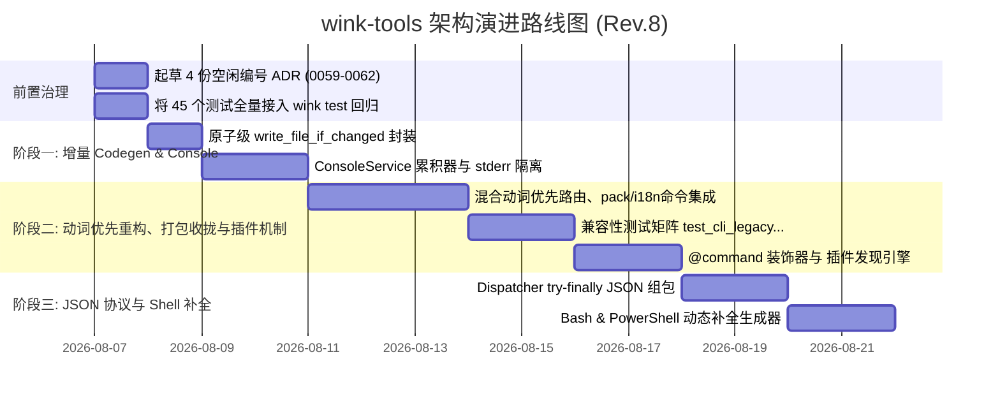

# `wink-tools` 架构升级与演进计划总纲 (Master Architecture Evolution Plan - Rev.8)

> **文档版本**：v8.0.0 (收拢 `pack` / `i18n` / `wasm-export` 独立脚本纳入统一 CLI 网关)  
> **关联评审**：[2026-08-06-wink-tools-architecture-evolution-plan-review.md](../../reviews/tools/2026-08-06-wink-tools-architecture-evolution-plan-review.md)  
> **创建日期**：2026-08-06  
> **状态**：Approved / Fully Unified & Ready for Implementation  
> **目标组件**：`wink-tools` / Wink Micro OS SDK CLI & Build Suite  

---

## 1. 背景与精准痛点归因 (Background & Precise Bottleneck Analysis)

`wink-tools` 作为 Wink Micro OS 的核心 SDK CLI 网关，负责编排构建 (GCC Host / Emscripten WASM / ESP-IDF)、设备树与配置代码生成 (Codegen)、静态架构治理检查 (ADR-0043 Linter) 及 SDK 发布打包。

在经过对代码库与 C 构建依赖图 (Build Graph) 以及 CLI 交互人体工程学 (CLI Ergonomics) 的深度审查后，确立了以下五个核心改进方向：

1. **全量独立脚本收拢纳入统一 CLI 网关 (100% Unified Gateway)**  
   原 `tools/pack/source.py` (Source SDK 打包)、`tools/pack/binary.py` (Binary SDK 打包)、`tools/i18n_scanner.py` (多语言扫描) 及 `tools/wasm_export_codegen.py` (WASM 导出生成) 为独立脚本。本计划将其全量收拢为 `wink pack source|binary`、`wink i18n scan` 与 `wink gen wasm-export`，达成真正 100% 的 SDK 统一入口。
2. **依赖抖动下的二次编译放大 (mtime Cascading Recompilation)**  
   CMake/Ninja 的构建依靠 `DEPENDS` 监听 `wink-app.json`、模板与驱动文件。当分支切换或 `git checkout` 导致依赖文件的时间戳 (mtime) 改变但内容未变时，CMake 会触发调用 `tools/codegen/app_codegen.py` 与 `tools/codegen/config_h.py`。由于原写入逻辑未做内容比对直接覆写，导致渲染产物 (如 `${CMAKE_CURRENT_BINARY_DIR}/generated/device_tree.h`) 的 mtime 被刷新，引发下游所有包含该头文件的 C 编译单元 (TU) 全量重编译。
3. **CLI 体系结构与 `app-schema` / `unisim-plugin` 显式命名重构 (Hybrid Verb-First Architecture)**  
   原 CLI 平铺了 14 个顶层命令，导致顶层空间污染且概念模糊。重构采用**工业级“混合动词优先”范式**，并使用极其直观的 **`app-schema`**（应用项目电路 Schema 描述）与 **`unisim-plugin`**（Unisim 虚拟外设插件），做到全面见名知意。
4. **CLI 控制台输出未标准化且无结构化收集通道**  
   全仓 CLI 命令分散存在 `print()` 与 `sys.stderr.write()`，缺乏统一的 Logger / Console 服务。Dispatcher 通过 `global_parent` 注册全局 Flag (`--json`, `--quiet`, `--verbose`)，并采用 `console.set_result(data)` 累积器，解决 `doctor --json` 报告等结构化结果的组包通信。
5. **测试回归全量闭环**  
   将 `tools/tests/` 下已有的 39 个测试文件及新增的测试文件（共计 45+ 个测试用例）全量接入 `wink test` 自动化回归网。

---

## 2. 演进目标与核心原则 (Architectural Principles)

- **100% 统一 CLI 网关 (100% Unified Gateway)**：消灭独立裸脚本，SDK 发布打包 (`wink pack`)、国际化扫描 (`wink i18n`)、WASM 导出全部收拢到 `wink` CLI。
- **混合动词优先范式 (Hybrid Verb-First CLI Ergonomics)**：保持构建/测试等高频操作路径极短（`wink build`, `wink test`），二级扩展统一规范命名。
- **`gen` 兼容叶子与组模式 (Optionally-Subparsed `gen`)**：无子命令时 `wink gen --app X` 默认跑代码生成；带子命令时支持 `gen app-schema` / `gen unisim-plugin-schema` / `gen wasm-export`。
- **`build` 独立二级 Parser 条件参数集**：`build host`, `build wasm`, `build unisim-plugin` 拥有各自独立的选项参数解析器。
- **精准增量 (Precise Content-Based Incremental Codegen)**：在 CMake 调用的 codegen 链路中引入 `write_file_if_changed`，原子比对内容，锁死相同内容的 mtime 节点。
- **零破坏性隐藏别名转发 (Zero-Breakage Backward Compatibility)**：旧顶层命令通过 argparse 隐藏 Parser 精准转发，打印 `DeprecationWarning` 但不影响既有 CI/CD。
- **结构分离 (Stdout/Stderr Separation)**：`stdout` 用于输出单一 JSON Envelope（在 `--json` 模式下）；`stderr` 始终保留人类可读日志，绝不吞掉错误。

---

## 3. 分阶段路线图 (Phased Roadmap Overview)

| 阶段 | 核心任务 | 关键交付物 | 验证手段 |
| :--- | :--- | :--- | :--- |
| **Phase 0** | 前置治理与测试补齐 | ADR-0059~0062 + `test.py` 扩充 | `python wink-tools/wink.py test` 执行全量 45 个测试 |
| **Phase 1** | 增量 Codegen & Console 累积器 | `write_file_if_changed` / `ConsoleService` | `touch` 依赖文件验证 Ninja 免重编译；stderr 日志隔离 |
| **Phase 2** | 混合动词 CLI、pack/i18n 集成 & 插件发现 | `wink pack`/`wink i18n`/隐藏 Parser | 验证 `wink pack source` 及 `test_cli_legacy_compatibility_matrix.py` PASS |
| **Phase 3** | JSON Envelope 封装 & Dual-Shell 补全 | Dispatcher Envelope / Bash+PowerShell Completion | `wink doctor --json` 验证 Schema，PowerShell/Bash 补全 |

---

## 4. 前置 ADR 治理要求 (Architecture Decision Records)

在全面动工前，需先在 `docs/decisions/` 起草以下 ADR（使用空闲编号 **ADR-0059~0062**）：

1. **ADR-0059**：`wink-tools` CLI 混合动词优先命令体系、SDK 打包/i18n 命令收拢与隐藏别名废弃策略。
2. **ADR-0060**：`ConsoleService` 接口规范、`global_parent` Flag 注册与 `--json` 严格分流协议。
3. **ADR-0061**：第三方 CLI 插件注册契约与信任边界（`wink_tools.plugins` entry_points 全信任模型）。
4. **ADR-0062**：`--json` 模式下的系统级 Telemetry Schema 定义（包含 `schema_version` 及 `result` 结构化载荷）。

---

## 5. 子计划导航 (Sub-Plan Navigation)

详细的阶段落地方案与遗留命令基准核对表请参阅以下各文档：

1. 📄 **[01-phase1-codegen-cache-and-cli-ergonomics.md](./01-phase1-codegen-cache-and-cli-ergonomics.md)** — **阶段一详细计划：原子级增量 Skip 与 Console 累积服务**
2. 📄 **[02-phase2-command-grouping-and-auto-discovery.md](./02-phase2-command-grouping-and-auto-discovery.md)** — **阶段二详细计划：混合动词优先 CLI 重构、pack/i18n 集成与插件发现**
3. 📄 **[03-phase3-json-telemetry-and-shell-completion.md](./03-phase3-json-telemetry-and-shell-completion.md)** — **阶段三详细计划：JSON Envelope 自动组包与 Bash/PowerShell 双端补全**
4. 🛡️ **[04-legacy-command-matrix-and-compatibility-verification.md](./04-legacy-command-matrix-and-compatibility-verification.md)** — **遗留命令功能基准矩阵与零失效校验契约**

