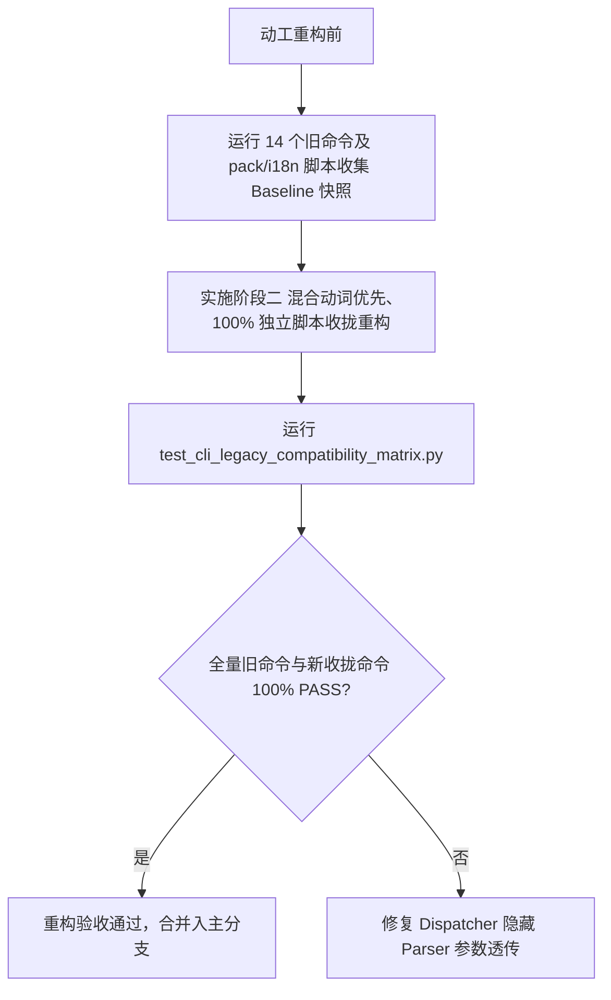

# 遗留命令功能基准矩阵与零失效校验计划 (Legacy Command Matrix & Compatibility Verification - Rev.5)

> **归属计划**：`2026-08-06-wink-tools-architecture-evolution-plan`  
> **实施目标**：全面盘点所有 14 个遗留 CLI 命令及新增收拢命令（`pack` / `i18n`），定义零破坏性向后兼容契约与自动化校验矩阵，确保重构不导致任何旧命令失效  

---

## 1. 为什么需要遗留命令基准校验？ (RATIONALE)

在将 `wink-tools` 重构为“混合动词优先”架构及 `gen app-schema` / `unisim-plugin` / `pack` / `i18n` 显式命名的过程中，最关键的技术风险是：**已有开发者习惯、CI/CD 自动化流水线、IDE 插件或第三方的构建脚本可能仍使用旧的顶层命令**。

为了达成 **“零失效、零破坏 (Zero-Breakage Guarantee)”** 承诺，必须建立一份详尽的旧命令功能基准清单，并在重构后通过自动化回归套件（共 45+ 个测试文件）逐一核对。

---

## 2. 14 个遗留命令功能契约与映射全景表 (Legacy Command Baseline Matrix)

| 编号 | 遗留命令 / 独立脚本 | 核心功能与参数契约 | 新架构对应命令 (New Command) | 兼容重定向策略 | 校验断言要点 |
| :--- | :--- | :--- | :--- | :--- | :--- |
| **1** | `wink gen` | 接受 `--app` 参数，渲染设备树与 C 配置宏 | `wink gen` (无子命令默认模式) | 保持原样 | 验证产物写至 `build/generated/` |
| **2** | `wink build` | 接受 `target` (`host`/`wasm`), `--app`, `--clean`, `--sdk-mode` | `wink build [host\|wasm]` (独立子 Parser) | 扩展 `unisim-plugin` 子动词 | 验证 Host 与 WASM 二进制生成目录 |
| **3** | `wink esp32` | 转发 `--app` 及 ESP-IDF 选项到 IDF 构建引擎 | `wink esp32` (保留) | 保持原样 | 验证透传参数 `--` 正常传给 idf.py |
| **4** | `wink web` | 启动 Vue Vite 前端 Web Workbench | `wink web` (保留) | 保持原样 | 验证 Dev Server 命令正确唤起 |
| **5** | `wink test` | 执行 Python/C 单元测试与 Linter 检查矩阵 | `wink test` (保留) | 包含扩充后的 `tools/tests/` 共 45+ 个用例 | 退出码 0 表示全量 PASS |
| **6** | `wink doctor` | 探针诊断工具链能力，支持 `--json` | `wink doctor` (保留) | 增加 `--json` 规范导出 (含 `result` 载荷) | 诊断输出不缺失项 |
| **7** | `wink setup` | 配置文件 `tools.json` 读写，接受 `--set`, `--workspace` | `wink setup` (保留) | 保持原样 | 验证配置写入 `~/.wink/tools.json` |
| **8** | `wink lint` | 执行 ADR-0043 静态分层规约检查，接受 `--changed`, `--baseline` | `wink lint` (保留) | 保持原样 | 违反规约时返回 Exit Code 1 |
| **9** | `wink new-dal` | 接受 `--type`, `--category` 渲染 DAL `.h`/`.c` 脚手架 | `wink create dal` | **隐藏 Parser 透明重定向** | 打印 Warning 并正常生成 C 脚手架 |
| **10** | `wink migrate-schema` | 接受 YAML 路径，写入 `.migrated.yaml` 侧车文件 | `wink schema migrate` | **隐藏 Parser 透明重定向** | 打印 Warning 并正常写入侧车文件 |
| **11** | `wink frontend-app-device-tree` | 导出 DeviceTree JSON 到 stdout 或 `--out` 指定文件 | **`wink gen app-schema`** | **隐藏 Parser 透明重定向** | stdout 或文件中的 JSON 校验 |
| **12** | `wink build-peripheral` | 接受 `--path`, `--out`, `--mode` 打包 Web 虚拟外设插件 | **`wink build unisim-plugin`** | **隐藏 Parser 透明重定向** | 打印 Warning 并正常生成 simulation.js |
| **13** | `wink dev-peripheral` | 接受 `--path`, `--port` 启动 Vite HMR 监听与广播 | **`wink dev unisim-plugin`** | **隐藏 Parser 透明重定向** | 打印 Warning 并成功开启 Dev HMR |
| **14** | `wink gen-peripheral-schema` | 接受 `--path`, `--out` 从 manifest 生成 `schema.json` | **`wink gen unisim-plugin-schema`** | **隐藏 Parser 透明重定向** | 打印 Warning 并更新 `schema.json` |
| **新增**| `tools/pack/source.py` | 独立裸脚本 $\rightarrow$ 统一 CLI | **`wink pack source`** | 统一为 CLI 命令 | 生成 `wink-sdk-source.tar.gz` |
| **新增**| `tools/pack/binary.py` | 独立裸脚本 $\rightarrow$ 统一 CLI | **`wink pack binary`** | 统一为 CLI 命令 | 生成 precompiled 二进制 SDK |
| **新增**| `tools/i18n_scanner.py` | 独立裸脚本 $\rightarrow$ 统一 CLI | **`wink i18n scan`** | 统一为 CLI 命令 | 输出未提取中文字符串报告 |
| **新增**| `tools/wasm_export_codegen.py` | 独立裸脚本 $\rightarrow$ 统一 CLI | **`wink gen wasm-export`** | 统一为 CLI 命令 | 生成 WASM 导出函数宏头文件 |

---

## 3. 隐藏 Parser 透明重定向契约 (Redirection Contract)

所有旧命令**绝不删除**，在 `dispatcher.py` 中通过 `help=argparse.SUPPRESS` 注册为隐藏 Parser，遵循如下 4 条硬性契约：

```python
# 1. 语法完全透明：接收旧命令的所有原生 Flag 参数与全局 Flag
wink frontend-app-device-tree --app avoidance_car --out ./tree.json

# 2. 行为完全一致：隐式转交执行新动词组合 (wink gen app-schema --app avoidance_car --out ./tree.json)
# 3. 警告仅走 stderr：将 DeprecationWarning 输出到 stderr，绝不污染 stdout 上的 JSON 数据或重定向文件
[wink] Warning: Command 'frontend-app-device-tree' is deprecated and will be removed in a future release. Please use 'wink gen app-schema' instead.

# 4. 退出码一模一样：继承新命令的真实 exit_code (0: Success, 非0: Failure)
```

---

## 4. 兼容性回归测试套件 (`tools/tests/test_cli_legacy_compatibility_matrix.py`)

在阶段二实施时，将创建专门的兼容性自动化测试文件：

```python
import subprocess
import sys
import unittest

class TestLegacyCommandCompatibilityMatrix(unittest.TestCase):
    def test_legacy_frontend_app_device_tree_redirection(self):
        """Verify old 'frontend-app-device-tree' redirects seamlessly to 'gen app-schema'."""
        cmd = [sys.executable, "wink-tools/wink.py", "frontend-app-device-tree", "--help"]
        res = subprocess.run(cmd, capture_output=True, text=True)
        self.assertEqual(res.returncode, 0)
        self.assertIn("Warning: Command 'frontend-app-device-tree' is deprecated", res.stderr)

    def test_legacy_build_peripheral_redirection(self):
        """Verify old 'build-peripheral' redirects seamlessly to 'build unisim-plugin'."""
        cmd = [sys.executable, "wink-tools/wink.py", "--skip-toolchain-check", "build-peripheral", "--help"]
        res = subprocess.run(cmd, capture_output=True, text=True)
        self.assertEqual(res.returncode, 0)
        self.assertIn("Warning: Command 'build-peripheral' is deprecated", res.stderr)

    def test_unified_pack_source(self):
        """Verify new unified 'wink pack source' command executes."""
        cmd = [sys.executable, "wink-tools/wink.py", "pack", "source", "--help"]
        res = subprocess.run(cmd, capture_output=True, text=True)
        self.assertEqual(res.returncode, 0)
```

---

## 5. 校验与核对策略流程



通过上述完备的基准矩阵与自动化测试网，可以 100% 保证现有的任何构建脚本、CI/CD 自动化以及开发者日常习惯在架构升级后**零失效、零报错、无缝平滑过渡**！
