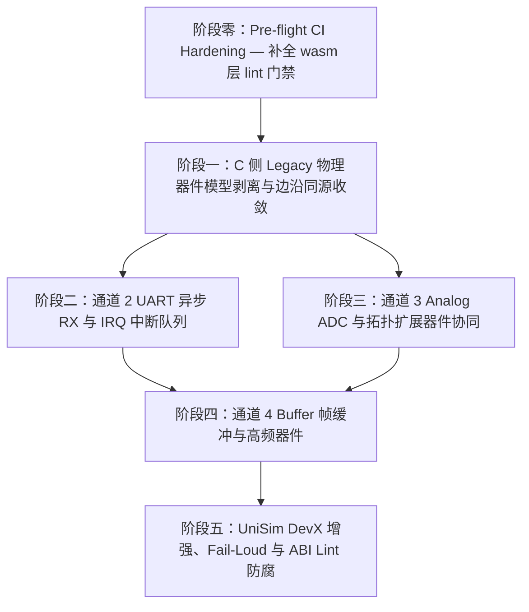

# WASM 仿真架构下沉与 UniSim 引擎全景演进计划总纲 (Master Execution Plan)

| 项 | 内容 |
|---|---|
| **文档类型** | 实施计划总纲 (Master Execution Plan) |
| **创建日期** | 2026-08-09 |
| **状态** | ✅ **Completed** — Phase 0~5 全部完成（2026-08-10）；TS 侧 P2 补齐进行中 |
| **目标范围** | `wink-micro-os/targets/wasm/`、`wink-micro-os/dal/`、`../wink-ai/packages/unisim/` |
| **关联 ADR/规范** | [ADR-0002](../../decisions/unisim/0002-dual-target-compilation.md)、[ADR-0003](../../decisions/unisim/0003-simulation-fidelity-boundary.md)、[ADR-0040](../../decisions/unisim/0040-arduino-semantic-sim-json-gate.md)、[ADR-0054](../../decisions/unisim/0054-sim-uart-async-rx-model-boundary.md)、[ADR-0057](../../decisions/core/0057-pal-adc-subsystem-and-channel-3-analog-contract.md)、[04-wasm-simulation](../../superpowers/plans/wink-micro-os-arch-restructure/00-README.md)、[`06-c-target-architecture-and-refactoring-proposal.md`](./06-c-target-architecture-and-refactoring-proposal.md) |

---

## 1. 演进背景与总体目标

在 `UniSim 3.0` 规范与 `@wink-ai/unisim` 引擎重构的背景下，WASM 仿真的核心原则已经明确：
1. **100% C 代码同源编译**：App / BAL / DAL 保持完全同源，零 `#ifdef SIMULATION` 业务控制宏。
2. **物理旁路 100% 下沉 PAL/HAL Wasm Target 层**：物理量算式、传感器退化、引脚电平仲裁只存在于 JS/TS 插件（`PluginHost` / `PinArbiter`）或 `targets/wasm` 底层转换桥。
3. **消除历史遗留捷径**：清理 early MVP 阶段在 C 侧残留的硬编码物理量计算（如 `wasm_dev_ultrasonic.c` 的 cm↔μs 换算），收敛为纯粹的事件边沿注入。
4. **补齐四通道与拓扑能力**：完成通道 2 (UART 异步 RX IRQ)、通道 3 (Analog ADC 物理退化全链条)、通道 4 (Buffer 帧缓冲) 以及基础拓扑扩展器件的端到端仿真。
5. **C 侧架构按保真轴与通道优雅拆分 (C-Target Architecture Decoupling)**：遵循 [`06-c-target-architecture-and-refactoring-proposal.md`](./06-c-target-architecture-and-refactoring-proposal.md)，消除 `pal_hal_wasm.c` 大一统单体，在 Phase 2~5 演进中渐进式拆分为 `pal_wasm_ch1_gpio.c` ~ `pal_wasm_ch4_buffer.c` 等专职模块，与 TS 侧 UniSim 3.0 A~F 保真轴精准 1:1 映射。

---

## 2. 阶段划分与依赖拓扑

总体演进计划分为 **5 个独立阶段**，各阶段文档独立存放于本目录下：

> [!CAUTION]
> **G4 串行化约束**：Phase 3 抽 PWM 段、Phase 4 抽 GPIO 段，二者都编辑 `pal_hal_wasm.c`，**不得并行**。必须 Phase 3 先合入 main，Phase 4 rebase 到最新 main 后再开工，否则两分支在同一文件上必然冲突。Phase 2 结束后 `pal_hal_wasm.c` 仍含 GPIO+PWM 两段；Phase 3 抽走 PWM 后，Phase 4 面对的是只剩 GPIO 段的版本。

### 阶段子计划一览表

| 阶段 | 计划文档路径 | 核心目标 | 预计成果 | 预计工时 | 目标完成日期 |
|---|---|---|---|---|---|
| **Phase 0** | [`00-phase-0-preflight-ci-hardening.md`](./00-phase-0-preflight-ci-hardening.md) | 补全 `targets/wasm/` 在 `wink lint` 中的覆盖盲区，将 `wink lint` 与 `pytest wink-tools` 挂入 CI | `WASM-DAL-ISOLATION` 规则上线，CI 对 `#ifdef SIMULATION` 漂移零容忍 | 0.5 人天 | 2026-08-10 |
| **Phase 1** | [`01-phase-1-c-legacy-dev-model-pruning-plan.md`](./01-phase-1-c-legacy-dev-model-pruning-plan.md) | 剥离 C 侧 Deprecated `wasm_dev_*` 物理捷径，收敛为前端 Plugin 脉冲边沿注入 | 删除 C 侧 cm↔μs 硬换算，超声波 100% 走同源 `pulse_in` 与 `PinArbiter` | 3 人天 | 2026-08-16 |
| **Phase 2** | [`02-phase-2-uart-async-rx-and-irq-plan.md`](./02-phase-2-uart-async-rx-and-irq-plan.md) | 落地 ADR-0054，实现 UART 异步 RX 字节流与中断队列模型 | 支撑 NMEA GPS / 蓝牙 AT 指令等异步串口仿真 | 4 人天 | 2026-08-20 |
| **Phase 3** | [`03-phase-3-analog-channel3-and-infrastructure-devices-plan.md`](./03-phase-3-analog-channel3-and-infrastructure-devices-plan.md) | 落地 ADR-0057，完善通道 3 Analog ADC 物理退化与 IO 扩展/总线开关拓扑支持 | `analog_knob`/`analog_sensor` 升 Landed，支持 PCF8574 / TCA9548A | 5 人天 | 2026-08-25 |
| **Phase 4** | [`04-phase-4-buffer-channel4-and-fast-framebuffer-plan.md`](./04-phase-4-buffer-channel4-and-fast-framebuffer-plan.md) | 设计落地通道 4 Buffer Payload 帧缓冲与零拷贝物理通道 | 支持 WS2812 炫彩灯条与摄像头帧捕获 | 4 人天 | 2026-08-29 |
| **Phase 5** | [`05-phase-5-unisim-devx-fail-loud-and-abi-lint-plan.md`](./05-phase-5-unisim-devx-fail-loud-and-abi-lint-plan.md) | 前端 IDE Fail-Loud 诊断卡片、`wink-app.json` 防错与 C↔TS ABI 自动化静态 Lint | 提升 DevX 体验，断绝 C 与 TS ABI 接口不一致风险 | 3 人天 | 2026-09-03 |

---

## 3. 全局质量门禁与 SSOT 铁律

在执行各阶段子计划时，必须严格遵守以下防腐铁律：
1. **DAL 零仿真宏 (Fail-Loud)**：禁止在 `wink-micro-os/dal/` 中添加任何 `#ifdef SIMULATION` 或 `#ifdef WASM` 条件编译。所有物理量拦截必须发生在 `targets/wasm/`。
2. **确定性虚拟时间 (STRICT_NONBLOCKING)**：所有仿真时间推进必须严格绑定 `s_virtual_us` / `VirtualClock`，禁止使用宿主墙钟（`Date.now()` / `performance.now()`）作为逻辑判断条件。
3. **ABI Hash 联动锁闭**：任何在 `wasm_bridge.h` 中新增或修改的导出/导入函数，必须同步更新 `PAL_WASM_ABI_HASH`，并更新 `@wink-ai/unisim` 对应的 `types/wasm/` 声明。
4. **单阶段可独立验证**：每个阶段必须包含明确的单元测试（C Unity 框架与 TS Bun Test）及回归测试，阶段间解耦，渐进式交付。
5. **并发安全铁律 (Concurrency Safety)**：所有跨 JS↔WASM 边界的共享数据结构（环形缓冲区、帧缓冲指针）必须在对应阶段首个 Pre-condition Task（`Task X.0`）中完成安全契约设计与文档化。未完成 Pre-condition Task，不得开始该阶段后续任何实现任务。具体约束：
   - JS→C 方向的写入（如 `pal_wasm_push_uart_rx_byte`）只能在 WASM 主循环让出控制权后发生，严禁在 C 侧同步调用链中途被重入。
   - 含 `const uint8_t *` 指针参数的 JS 导入实现，必须在函数返回前完成 `.slice()` 防御拷贝，严禁持有跨调用的 WASM 堆视图。

---

## 4. 总纲层面补充：已知遗漏项（Structural Gaps）

下列问题在各阶段子计划中分散处理，此处统一登记以便追踪：

| 编号 | 遗漏项 | 处理位置 | 状态 |
|---|---|---|---|
| M-1 | **回归基线（Baseline Snapshot）机制**：各阶段完成后须捕获仿真输出快照，CI 自动比对防止退化 | Phase 5 Task 5.5 | ☐ |
| M-2 | **多实例仿真隔离**：每个仿真实例须在独立 Worker 中运行，禁止跨 Worker 共享 `WebAssembly.Memory` | Phase 2 Task 2.0 设计文档中约定 | ☐ |
| M-3 | **WASM 内存上限与 OOM 处理**：Phase 4 引入帧缓冲后须在编译参数中明确 `INITIAL_MEMORY` / `MAXIMUM_MEMORY`，并实现 OOM 回调 | Phase 4 Task 4.0 | ☐ |
| M-4 | **热重载状态清理协议**：`SimEngine.reset()` 须保证插件、PinArbiter、UART FIFO、虚拟时钟全部归零 | Phase 5 Task 5.6 | ☐ |
| M-5 | **已知仿真局限性文档**：新建 [`99-known-limitations.md`](./99-known-limitations.md) 说明 NRZ 时序、时钟抖动等不仿真的特性 | 独立文档，已建立（Living Document，随各阶段更新） | ☑ |
| M-6 | **`targets/wasm/` wink lint 盲区**：现有 `layering.yaml` 仅覆盖 `bal/dal/runtime`，`targets/wasm/` 无任何规则约束，`#ifdef SIMULATION` 漂移进 `dal/` 无 CI 门禁拦截 | **Phase 0 Task 0.1**（已完成 ✅） | ☑ |

