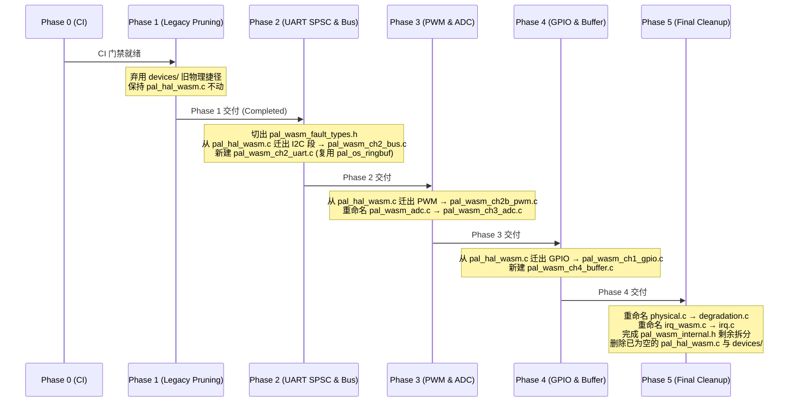

# WASM Target C 侧架构目录解耦与渐进融入方案 (Architecture Spec & Refactoring Proposal)

| 项 | 内容 |
|---|---|
| **文档类型** | 架构设计与重构融入规范 (Architecture Specification) |
| **所属总纲** | [`00-master-execution-plan.md`](./00-master-execution-plan.md) |
| **状态** | **Approved (v2.0)** (2026-08-09 第二轮架构评审通过) |
| **重构目标** | `wink-micro-os/targets/wasm/` 核心 C 源码目录 |
| **对齐规范** | [UniSim 3.0](../../superpowers/plans/wink-micro-os-arch-restructure/00-README.md)、[`wasm_bridge.h`](../../../../../wink-micro-os/targets/wasm/wasm_bridge.h) SSOT 头文件 |
| **评审反馈** | [`06-01-architecture-review-feedback.md`](./06-01-architecture-review-feedback.md)、[`2026-08-09-wasm-c-target-architecture-second-review.md`](../../reviews/unisim/2026-08-09-wasm-c-target-architecture-second-review.md) |

---

## 1. 重构背景与核心痛点分析

### 1.1 现状分析 (As-Is)

当前 `wink-micro-os/targets/wasm/` 目录采用早期的"扁平混合布局 (Mixed Flat Layout)"模式：

```text
wink-micro-os/targets/wasm/
├── CMakeLists.txt
├── pal_hal_wasm.c          <-- 核心痛点：350 行，跨 3 个正交物理通道
├── pal_wasm_adc.c          <-- 通道 3 Analog (184 行，职责单一 ✅)
├── pal_wasm_physical.c     <-- 物理退化 + 混入了 3 个不属于退化的函数 (108 行)
├── pal_wasm_fault.c        <-- 故障日志 (122 行，职责单一 ✅)
├── pal_wasm_fault_domain.c <-- 故障域 + 功耗 Stub (69 行)
├── pal_wasm_internal.h     <-- 全模块共享头 (103 行，万能头文件反模式)
├── pal_irq_wasm.c          <-- 中断队列 (215 行，职责单一 ✅)
├── pal_log_wasm.c          <-- 日志桥 (~60 行)
├── pal_storage_wasm.c      <-- 存储 Stub (~20 行)
├── wasm_bridge.h           <-- SSOT 接口头（已按 A~F 轴完成 Doxygen 分区）
├── wasm_entry.c            <-- 运行时入口 (40 行)
├── wink_sim_js.js          <-- JS 侧仿真桥实现
├── wink_sim_stub.js        <-- JS 侧 Stub/Fallback
└── devices/                <-- 历史遗留物理量 C 侧代码
    ├── wasm_sim_registry.c <-- 128 行，非纯遗留！持有 GPIO 导出状态与重置钩子
    ├── wasm_sim_registry.h
    ├── wasm_dev_ultrasonic.c <-- Phase 1 已标记 Deprecated
    └── wasm_dev_servo.c      <-- 含有 pal_wasm_get_pwm_duty_percent 导出
```

### 1.2 核心架构痛点

1. **`pal_hal_wasm.c` 职责混合 (Mixed Responsibility)**：
   - 350 行代码跨越了 **通道 1 (Pin: GPIO + pulse_in + pin event queue)**、**通道 2 (Bus: I2C)**、**通道 2b (PWM)** 三个正交物理通道。
   - 单元测试无法针对单个通道独立编写和运行。

2. **`pal_wasm_physical.c` 包含混入函数 (Misplaced Functions)**：
   - `pal_wasm_gpio_read()` (bool wrapper) 实际属于 Axis A CH1 GPIO
   - `pal_wasm_i2c_transfer()` (bool wrapper) 实际属于 Axis A CH2 Bus
   - `pal_wasm_get_abi_hash()` 实际属于 Axis F Fault/ABI
   - 包含跨轴 reset 函数 `pal_wasm_reset_physical()`

3. **`devices/` 遗留目录与重复符号隐患 (Legacy & Symbol Conflict)**：
   - `wasm_sim_registry.c` 持有 `pal_wasm_set_gpio_input` / `pal_wasm_get_gpio_output`（Axis A CH1 KEEPALIVE 导出），必须有序迁移而非直接删除。
   - `wasm_dev_servo.c` 导出的 `pal_wasm_get_pwm_duty_percent` 与 PWM 通道拟导出的符号冲突。
   - `devices/` 内部定义 `#define WASM_SIM_MAX_PINS 40` 遮蔽全局 128 引脚配置。

4. **`pal_wasm_internal.h` 万能头文件反模式**：
   - 混合了故障类型枚举、退化参数访问器、时钟函数声明、功耗模型结构体。

5. **C 侧文件名与 TS 侧 UniSim 3.0 A~F 保真轴不一致**：
   - TS 侧已建立 `axis-a-physical-source/` ~ `axis-f-fault-observability/` 完美映射，C 侧文件名语义混淆。

---

## 2. 架构约束与设计铁律

### 2.1 5 层架构层次约束 (Layer Discipline)

```text
App → BAL → DAL → OSAL → PAL Target
                    ↑         ↑
              pal_osal_wasm.c   targets/wasm/*.c
```

> **铁律 1 (Layer Boundary)**：Axis B（虚拟时钟）和 Axis E（调度/并发）的实现**必须保留在 `osal/wasm/pal_osal_wasm.c`**，不得下沉到 `targets/wasm/`。原因：
> - `s_virtual_us`（虚拟时钟 SSOT）与 `pal_sim_scheduler_run` 紧密耦合在 OSAL 编译单元。
> - `pal_wasm_set_sim_mode/get_sim_mode`（Axis E）C 实现位于 `osal/wasm/pal_osal_wasm.c:70-86`，不在 `targets/wasm/`。

### 2.2 跨轴依赖方向规则 (Cross-Axis Dependency Direction)

通过代码审查发现的真实跨轴调用关系：

```text
pal_gpio_read()  [Axis A CH1]
  └─► pal_wasm_get_bounce_us()      [Axis F degradation]
  └─► pal_wasm_get_debounce_ctx()   [Axis F degradation]
  └─► pal_wasm_log_fault()          [Axis F fault log]

pal_i2c_transfer()  [Axis A CH2]
  └─► pal_wasm_get_i2c_drop_permil() [Axis F degradation]
  └─► pal_wasm_get_prng_state()      [Axis F degradation]
  └─► pal_wasm_log_fault()           [Axis F fault log]
```

> **铁律 2 (Dependency Direction)**：`Axis A → Axis F`（消费者 → 提供者）**单向不可逆**。Axis F 文件不得 `#include` Axis A 的任何头。Axis A/D/F 文件可以 `#include` Axis B 的 `pal_osal.h`（通过 OSAL 公开 API 读时钟），但不得直接访问 `s_virtual_us`。

### 2.3 共享状态归属原则 (Static State Ownership)

> **铁律 3 (State Colocation)**：共享同一 `static` 数组/变量的函数**必须在同一编译单元**。`pal_wasm_push_pin_event()` 与 `pal_gpio_pulse_in()` 共享 `s_pin_events[]`，必须同属 `pal_wasm_ch1_gpio.c`。

### 2.4 C→JS 导入无需 C 实现文件

> **铁律 4 (Import Boundary)**：所有 `js_*` / `js_pal_*` 前缀函数是 C→JS 导入（`extern` 声明），由 Emscripten 在链接时从 `wink_sim_js.js` / `wink_sim_stub.js` 解析。C 侧不为它们创建 `.c` 实现文件。

### 2.5 依赖防护自动化门禁 (CI Dependency Gate)

> **铁律 5 (Dependency Gate)**：在 `wink-tools/tools/lint/rules/layering.yaml` 中新增静态检查规则，断言 `pal_wasm_degradation.c` 与 `pal_wasm_fault*.c` **不得 `#include` 任何 `pal_wasm_ch*.h` 或通道内部头**。将铁律 2 从人工评审约束升格为 CI 静态门禁。

---

## 3. 目标态架构设计 (To-Be Architecture)

### 3.1 设计原则 (Design Principles)

1. **单文件单一职责**：一个 `.c` 文件只负责一个物理通道或一个保真轴。
2. **与 `wasm_bridge.h` 精准映射**：C 文件名与头文件 A~F 区块名称一致。
3. **保持 CMake 扁平性**：所有源文件在 `targets/wasm/` 目录下单层平铺。
4. **构件最大化复用**：异步 FIFO 复用 OSAL 既有 `pal_os_ringbuf`，不重新发明环形缓冲区结构。
5. **通道抽离平摊**：逐 Phase 搬迁通道，消解 Phase 5 大爆炸重构风险。

### 3.2 目标态文件布局

```text
wink-micro-os/targets/wasm/
├── CMakeLists.txt
├── wasm_bridge.h                       <-- SSOT 头文件（A~F 分区标注）
├── pal_wasm_fault_types.h              <-- Phase 2 前切出：故障枚举与事件结构体
├── pal_wasm_degradation.h              <-- Phase 5 切出：退化参数访问器
├── pal_wasm_common.h                   <-- Phase 5 切出：WASM_SIM_MAX_PINS (128) 等全局常量
│
├── /* ── Axis A: CH1 Pin ──────────────────────────────────── */
├── pal_wasm_ch1_gpio.c                 <-- GPIO 读写/电平状态/理想驱动 (Phase 4 搬迁)
│                                           含 s_pin_events[] + push_pin_event
│                                           含 pulse_in + gpio_read/write/init
│                                           含 pal_wasm_gpio_read (迁自 physical.c)
│                                           含 set_gpio_input/get_gpio_output (迁自 registry.c)
│                                           含 pal_test_* / pal_rmt_* Unsupported stub
│
├── /* ── Axis A: CH2 Bus ──────────────────────────────────── */
├── pal_wasm_ch2_bus.c                  <-- I2C 同步总线事务 (Phase 2 搬迁)
│                                           初版仅 I2C；当前无 SPI C 实现
│                                           （js_pal_spi_transfer 仅 bridge.h 声明，SPI 后补）
│                                           含 pal_wasm_i2c_transfer (迁自 physical.c)
│
├── /* ── Axis A: CH2u UART ────────────────────────────────── */
├── pal_wasm_ch2_uart.c                 <-- UART RX SPSC 异步环形缓冲 (Phase 2 新建)
│                                           复用 osal/common/pal_osal_ringbuf.c
│                                           含 pal_wasm_push_uart_rx_byte / pal_uart_read_byte
│
├── /* ── Axis A: CH2b PWM ─────────────────────────────────── */
├── pal_wasm_ch2b_pwm.c                <-- PWM 占空比写与观测 (Phase 3 搬迁)
│                                           收纳 pal_wasm_get_pwm_duty_percent 唯一定义
│
├── /* ── Axis A: CH3 Analog ───────────────────────────────── */
├── pal_wasm_ch3_adc.c                  <-- 原 pal_wasm_adc.c（Phase 3 重命名）
│
├── /* ── Axis A: CH4 Buffer ───────────────────────────────── */
├── pal_wasm_ch4_buffer.c               <-- WS2812 帧缓冲 (Phase 4 新建)
│
├── /* ── Axis D: IRQ ──────────────────────────────────────── */
├── pal_wasm_irq.c                      <-- 原 pal_irq_wasm.c（Phase 5 统一重命名）
│
├── /* ── Axis F: Fault & Degradation ──────────────────────── */
├── pal_wasm_degradation.c              <-- 原 pal_wasm_physical.c (Phase 5 重命名)
│                                           迁出 gpio_read/i2c_transfer/abi_hash
│                                           纯化为 Axis F 归属，保留 pal_wasm_reset_physical()
├── pal_wasm_fault.c                    <-- 保持不变 + 接收 pal_wasm_get_abi_hash
├── pal_wasm_fault_domain.c             <-- 保持不变（含功耗 Stub/故障域）
│
├── /* ── Cross-axis Utility ───────────────────────────────── */
├── pal_log_wasm.c                      <-- 日志桥（保持不变）
├── pal_storage_wasm.c                  <-- 存储 Stub（保持不变）
│
├── /* ── Runtime Entry ────────────────────────────────────── */
├── wasm_entry.c                        <-- 宿主入口 (保持 40 行纯净)
│
├── /* ── JS 侧文件（不受 C 侧重构影响） ──────────────────── */
├── wink_sim_js.js
└── wink_sim_stub.js

说明：
  1. Axis B（虚拟时钟）与 Axis E（调度并发/仿真模式）C 实现保留在 osal/wasm/pal_osal_wasm.c
  2. devices/ 遗留目录在 Phase 5 彻底清理退场，无符号残留
```

### 3.3 C 源码文件与 ABI 接口映射清单

| 文件名 | 所属保真轴 | 包含的 `wasm_bridge.h` 接口实现与内部 API | 来源与迁移说明 |
|---|---|---|---|
| **`pal_wasm_ch1_gpio.c`** | Axis A (CH1) | `js_pal_gpio_write/read/read_state/drive_ideal/release_ideal/release_mcu` PAL wrapper<br>`pal_wasm_set_gpio_input`<br>`pal_wasm_get_gpio_output`<br>`pal_wasm_gpio_read`<br>`pal_wasm_push_pin_event`<br>`pal_gpio_pulse_in`<br>`pal_gpio_mode_idle_level`<br>`pal_test_*` / `pal_rmt_*` Unsupported stubs | 来自 `pal_hal_wasm.c` GPIO 段 +<br>`physical.c` 迁入 `gpio_read` +<br>`devices/wasm_sim_registry.c` 迁入 GPIO 导出状态 |
| **`pal_wasm_ch2_bus.c`** | Axis A (CH2) | `pal_i2c_transfer`<br>`pal_i2c_scan`<br>`pal_i2c_bus_init/deinit`<br>`pal_wasm_i2c_transfer` (bool wrapper)<br>*(SPI 后补，初版无 C 实现)* | 来自 `pal_hal_wasm.c` I2C 段 +<br>`physical.c` 迁入 `i2c_transfer` |
| **`pal_wasm_ch2_uart.c`** | Axis A (CH2) | `pal_wasm_push_uart_rx_byte`<br>`pal_uart_read_byte`<br>*(复用 `pal_os_ringbuf`)* | Phase 2 新建（独立于 I2C/SPI 总线） |
| **`pal_wasm_ch2b_pwm.c`** | Axis A (CH2b) | `pal_pwm_init/init_ex/set_duty/set_freq/deinit`<br>`pal_wasm_get_pwm_duty_percent` | 来自 `pal_hal_wasm.c` PWM 段 +<br>接管 `devices/wasm_sim_registry.c` 与 `wasm_dev_servo.c` 符号 |
| **`pal_wasm_ch3_adc.c`** | Axis A (CH3) | `pal_adc_init/deinit/read_raw/read_mv/acquire/release` | 原 `pal_wasm_adc.c` 重命名 |
| **`pal_wasm_ch4_buffer.c`** | Axis A (CH4) | `js_pal_ws2812_write` bridge | Phase 4 新建 |
| **`pal_wasm_irq.c`** | Axis D | `pal_gpio_enable_interrupt_ex/disable_interrupt`<br>`pal_irq_enable/disable/save/restore`<br>`pal_wasm_dispatch_pending_*` | 原 `pal_irq_wasm.c` 重命名 |
| **`pal_wasm_degradation.c`** | Axis F | `pal_wasm_set_bounce_us/warmup_us/...`<br>`pal_wasm_set_prng_seed/get_prng_state`<br>`pal_wasm_reset_physical` (编排各通道 reset 钩子) | 原 `pal_wasm_physical.c` 迁出混入函数后重命名 |
| **`pal_wasm_fault.c`** | Axis F | `pal_wasm_get_fault_log_count/reset_fault_log`<br>`pal_wasm_fault_event_get_*`<br>`pal_wasm_is_faulted/host_fault`<br>`pal_wasm_get_abi_hash` (迁入)<br>*(Phase 4)* `pal_wasm_report_oom` | 保持 + 接收 ABI hash；OOM 上报归 Axis F（G8） |
| **`pal_wasm_fault_domain.c`** | Axis F | 功耗 Stub、故障域配置与阈值 | 保持不变 |

### 3.4 降级与故障模块边界与 Reset 钩子规范

#### 3.4.1 `degradation` vs `fault_domain` vs `fault` 边界矩阵

为防止后续开发中降级与故障参数混淆，规定以下分类判据：

| 归属文件 | 收录原则 | 典型内容 |
|---|---|---|
| `pal_wasm_degradation.c` | 影响**物理通道微观行为**、被 Axis A 消费的参数 | bounce_us、drop_permil、PRNG 种子、warmup_us、debounce 上下文、RC tau |
| `pal_wasm_fault_domain.c` | 影响**故障域判定与功耗模型**的仿真宏观配置 | 功耗 Stub、故障域阈值/arm/reset 策略 |
| `pal_wasm_fault.c` | 故障日志环、faulted 闩锁、ABI hash、host_fault | fault log ring、`WASM_FAULT_GUARD_*` 宏 |

#### 3.4.2 跨轴 Reset 编排约定

`pal_wasm_reset_physical()` 留在 `pal_wasm_degradation.c`，轴归属纯化为纯 **Axis F**。重置编排遵循以下铁律：
1. `pal_wasm_reset_physical()` **仅能调用各通道公开发布的 reset 钩子**（如 `pal_wasm_ch1_reset()`、`pal_wasm_ch2_reset()`），**禁止直接访问 Axis A 的 static 状态变量**。
2. 各通道 `.c` 文件在拆分搬迁时，同步发布各自的内部 reset 钩子函数。

---

### 3.5 头文件拆分规划与过渡期策略

`pal_wasm_internal.h` 的拆分按以下节奏执行：

1. **Phase 2 之前（提前拆分）**：
   - 切出 **`pal_wasm_fault_types.h`**（收纳故障枚举、事件结构体、`WASM_FAULT_GUARD_*` 宏）。该动作为纯机械拆分，零行为变更，让 Phase 2 新建文件避免引入万能头。
2. **Phase 2 ~ Phase 4 过渡期**：
   - 新建及拆出的 `.c` 文件临时 `#include "pal_wasm_internal.h"` 访问退化参数，此为**已知且被接受的过渡期技术债**。
3. **Phase 5 最终收敛**：
   - 切出 **`pal_wasm_degradation.h`**（退化参数访问器、PRNG 接口）。
   - 切出 **`pal_wasm_common.h`**（`WASM_SIM_MAX_PINS = 128`、`WASM_FAULT_LOG_SIZE` 常量，彻底取代 `devices/` 内部本地 `#define WASM_SIM_MAX_PINS 40`）。
   - 删除原万能头 `pal_wasm_internal.h`。

---

## 4. 渐进式融入方案 (Phase-by-Phase Integration)

### 4.1 逐 Phase 通道搬迁节奏 (Staggered Refactoring Roadmap)

为消解 Phase 5 “大爆炸重构”风险，将 `pal_hal_wasm.c` 的解耦动作平摊到各 Phase：



### 4.2 详细步骤

#### Phase 0 — Pre-flight CI (Completed)
- CI 强化门禁就绪。

#### Phase 1 — Legacy Pruning (Completed)
- 弃用 `devices/wasm_dev_ultrasonic.c` 等 C 侧物理捷径逻辑，对齐脉冲边沿 `pulse_in` 测量。
- `pal_hal_wasm.c` 保持不动。

#### Phase 2 — UART SPSC & Bus
- 提前切出 `pal_wasm_fault_types.h`。
- **新建 `pal_wasm_ch2_bus.c`**：从 `pal_hal_wasm.c` 迁出 **I2C** 段（初版无 SPI C 实现），并从 `pal_wasm_physical.c` 迁入 `pal_wasm_i2c_transfer()`。
- **新建 `pal_wasm_ch2_uart.c`**：实现 UART RX 环形缓冲区。**直接复用 `osal/common/pal_osal_ringbuf.c`**（`pal_os_ringbuf_create`），不新增自定义 FIFO 头文件。
- 更新 `CMakeLists.txt`。

#### Phase 3 — PWM & Analog ADC
- **新建 `pal_wasm_ch2b_pwm.c`**：从 `pal_hal_wasm.c` 迁出 PWM 段，统一收纳 `pal_wasm_get_pwm_duty_percent` 符号。
- **重命名 `pal_wasm_adc.c` → `pal_wasm_ch3_adc.c`**。
- 更新 `CMakeLists.txt`。

#### Phase 4 — GPIO & Buffer Framebuffer
- **新建 `pal_wasm_ch1_gpio.c`**：从 `pal_hal_wasm.c` 迁出 GPIO 段（`s_pin_events[]`、`s_gpio_mode[]`、`pulse_in`），并从 `pal_wasm_physical.c` 迁入 `pal_wasm_gpio_read()`；从 `wasm_sim_registry.c` 迁入 `set_gpio_input`/`get_gpio_output`。
- **新建 `pal_wasm_ch4_buffer.c`**（WS2812 帧缓冲）。
- 更新 `CMakeLists.txt`。

#### Phase 5 — Final Cleanup (收尾与解耦)
- **前置 Gate**：确认 Phase 2~4 分支已全量合入 main，无并行分支依赖 `pal_hal_wasm.c`。
- 将 `pal_wasm_get_abi_hash()` 从 `pal_wasm_physical.c` 迁入 `pal_wasm_fault.c`。
- 将 `pal_wasm_physical.c` 重命名为 **`pal_wasm_degradation.c`**（轴归属纯化为 Axis F）。
- 将 `pal_irq_wasm.c` 重命名为 **`pal_wasm_irq.c`**。
- 完成 `pal_wasm_internal.h` 剩余拆分（`degradation.h` / `common.h`），删除原万能头。
- **彻底删除 `pal_hal_wasm.c`**（此时已为空壳）。
- **彻底清理 `devices/` 目录**，CMake 中移除 registry 源文件。
- 落地铁律 5（CI 依赖门禁规则）。

---

## 5. CMakeLists.txt 最终态规范

**严禁使用 `file(GLOB ...)`**，必须显式列出所有源文件（Post Phase 5）：

```cmake
# SPDX-License-Identifier: Apache-2.0
# WASM target build — explicit source listing (post Phase 5)

set(PAL_WASM_SOURCES
    # Axis A — Peripheral Channels
    ${CMAKE_CURRENT_SOURCE_DIR}/pal_wasm_ch1_gpio.c
    ${CMAKE_CURRENT_SOURCE_DIR}/pal_wasm_ch2_bus.c
    ${CMAKE_CURRENT_SOURCE_DIR}/pal_wasm_ch2_uart.c
    ${CMAKE_CURRENT_SOURCE_DIR}/pal_wasm_ch2b_pwm.c
    ${CMAKE_CURRENT_SOURCE_DIR}/pal_wasm_ch3_adc.c
    ${CMAKE_CURRENT_SOURCE_DIR}/pal_wasm_ch4_buffer.c
    # Axis D — IRQ
    ${CMAKE_CURRENT_SOURCE_DIR}/pal_wasm_irq.c
    # Axis F — Fault & Degradation
    ${CMAKE_CURRENT_SOURCE_DIR}/pal_wasm_degradation.c
    ${CMAKE_CURRENT_SOURCE_DIR}/pal_wasm_fault.c
    ${CMAKE_CURRENT_SOURCE_DIR}/pal_wasm_fault_domain.c
    # Cross-axis Utility
    ${CMAKE_CURRENT_SOURCE_DIR}/pal_log_wasm.c
    ${CMAKE_CURRENT_SOURCE_DIR}/pal_storage_wasm.c
    # Target independent common sources
    ${CMAKE_CURRENT_SOURCE_DIR}/../common/src/pal_resource.c
    ${CMAKE_CURRENT_SOURCE_DIR}/../common/src/wink_sim_physical.c
    ${CMAKE_CURRENT_SOURCE_DIR}/../common/src/wink_sim_scheduler.c
)

set(PAL_WASM_SOURCES ${PAL_WASM_SOURCES} PARENT_SCOPE)

set(WASM_ENTRY_SOURCE
    ${CMAKE_CURRENT_SOURCE_DIR}/wasm_entry.c
    PARENT_SCOPE)
```

---

## 6. 风险评估与应对预案

| 潜在风险 | 风险等级 | 应对预案 |
|---|:---:|---|
| **`devices/` 迁移导致的符号冲突** | 中 | Phase 3 抽离 `ch2b_pwm.c` 时统一收纳 `pal_wasm_get_pwm_duty_percent`，移除 servo.c 中的重复导出 |
| **符号重复定义 (Duplicate Symbols)** | 中 | `pal_wasm_internal.h` 拆分后函数声明保持 `extern`；`static` 状态严格同置于其 channel 文件 |
| **Phase 5 收尾阶段分支合并冲突** | 低（已降级）| 通过 Phase 2~4 平摊抽离动作，Phase 5 退化为纯文件重命名与删除空壳，并设定前置 Gate 检查 |
| **跨轴循环依赖** | 低 | 铁律 2 (`A → F` 单向) 通过铁律 5 (CI Dependency Gate) 在 build/lint 时强行断言 |
| **ABI Hash 漂移** | 低 | 仅改变 C 实现文件归属，不改动 `wasm_bridge.h` 符号签名，不触发 ABI Hash 变更 |

---

## 7. 评审修订记录

| 轮次 | 日期 | 关键修正事项 |
|---|---|---|
| **Round 1** | 2026-08-09 | 1. 修正 `pal_hal_wasm.c` 实际行数为 350 行；<br>2. 删除误建 `pal_wasm_clock.c` 计划（Axis B 归属 OSAL）；<br>3. 删除误建 `js_sim_plugin_channel.c` 计划（C→JS 导入无需 `.c`）；<br>4. 制定 `pal_wasm_internal.h` 拆分演进规划。 |
| **Round 2** | 2026-08-09 | 1. **R1**: UART RX SPSC 独立为 `pal_wasm_ch2_uart.c`，但正名其解耦原因为数据流向/状态/单测隔离而非多线程竞态（WASM 为单线程协作沙箱）；<br>2. **N2**: 强制复用 OSAL 既有 `pal_os_ringbuf`，取消自造 `pal_uart_rx_fifo.h`；<br>3. **N1**: 澄清 `wasm_sim_registry.c` 状态符号归属，解决 `pal_wasm_get_pwm_duty_percent` 符号冲突；<br>4. **N4/R4**: 将通道抽离动作从 Phase 5 摊薄至 Phase 2~4，消解 Phase 5 大爆炸风险；<br>5. **R2/R3/N3**: 补充 degradation vs fault_domain 边界矩阵，规定 `reset_physical` 必须通过通道 reset 钩子编排；<br>6. **N5**: 提前切出 `pal_wasm_fault_types.h`，新增铁律 5（CI Dependency Gate）。 |
| **Round 3** | 2026-08-09 | 通读 Phase 0~5 子计划交叉核对，补 11 项缺口（G1~G11）：<br>1. **G1 🔴**: Phase 2 补双 target 同源消费者 API——新增 `pal/include/hal/pal_uart.h` 与 `targets/esp32/pal_hal_uart_esp32.c`（或 UNSUPPORTED stub+ADR），防 ESP32 链接断裂，明确 DAL UART 范围；<br>2. **G2 🔴**: Phase 3/4 同步更新 `test/CMakeLists.txt` 独立源清单与 `run_gpio_semantics_emcc.ps1` 硬编码路径，防测试构建先于产品断裂；<br>3. **G3 🔴**: Phase 4 registry 退场时保留 `pal_wasm_sim_reset_all_devices` ABI（迁移到 reset 钩子编排，TS 不改）；<br>4. **G4**: Phase 3/4 同改 `pal_hal_wasm.c`，强制串行（P3 先合 main，P4 rebase 后开工）；<br>5. **G5**: Phase 2~4 强制"纯搬迁 commit 先行、功能 commit 在后"的提交纪律；<br>6. **G6**: UART RX overrun 策略（ringbuf 满丢新字节 + Axis F fault，与 TS drop-newest 对齐）；<br>7. **G7**: ch2_bus 初版名实校正为"仅 I2C"（当前无 SPI C 实现）；<br>8. **G8/G9**: `pal_wasm_report_oom`、`pal_wasm_set_fidelity_level` 显式走 ABI 三件套（声明/hash/TS），分别归 Axis F；<br>9. **G10**: 总纲状态与 M-1/M-4/M-5 跟踪项校正；<br>10. **G11**: 铁律 5 检查拆两个独立 test 函数，不与 WASM-DAL-ISOLATION 断言混用。<br>详见各 Phase 子计划 Task 2.3a/3.1a/4.1a 及新增 §2.1.1 小节。 |

