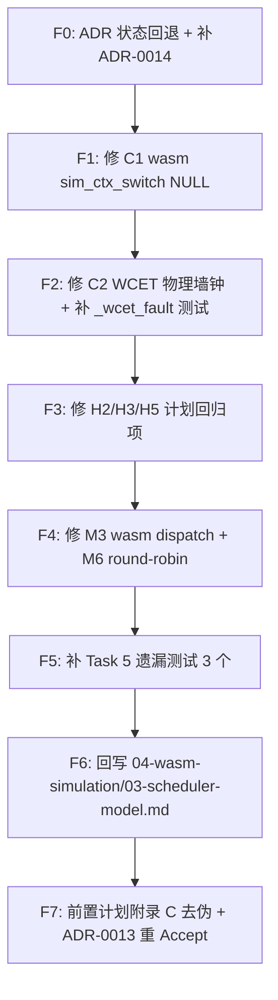

# 仿真侧协作式调度器 —— 缺口修补实施计划（Fixup）

## 1. 元数据表

| 字段 | 内容 |
|------|------|
| **计划编号** | `PLAN-20260702-SIM-COOP-SCHED-FIXUP` |
| **创建日期** | 2026-07-02 |
| **目标平台/SoC** | `host`（Windows Fiber）/ `wasm`（Emscripten Fiber）；`esp32` 不动 |
| **工具链/SDK版本**| GCC 15+ (MinGW WinLibs)、Emscripten 6.0.1、CMake ≥ 3.20 |
| **计划状态** | ✅ 已完成（2026-07-02 合入 master） |
| **优先级** | 🔴 P0（含 2 项 Critical Bug + ADR/规范一致性回退） |
| **计划版本** | v1.0 |
| **关联技术设计** | 无 |
| **关联设计规范** | [`../04-wasm-simulation/`](../04-wasm-simulation/)、[`../02-wink-micro-os/`](../02-wink-micro-os/) |
| **关联评审记录** | 本次会话对话式评审（未归档为独立 review 文件） |
| **关联 ADR** | [ADR-0013 仿真协作式调度](../../decisions/unisim/0013-sim-cooperative-scheduler.md)（本计划要求**回退至 Proposed** 直到修补完毕）；新增 **ADR-0014 单虚拟核取舍**（原计划遗漏） |
| **目标里程碑** | Wave 3 收尾（多任务保真真正达成） |
| **前置依赖计划** | [`2026-07-01-sim-cooperative-scheduler-plan.md`](./2026-07-01-sim-cooperative-scheduler-plan.md)（v1.4）—— 本计划是其 Task 6 之前的补救。 |
| **替代/废弃** | 不替代前置计划，作为其 addendum；前置计划的 Task 0.5 / Task 5 缺失部分在本计划一并交付 |
| **计划负责人** | wink-ai 架构组 |
| **所需子代理技能** | `embedded-best-practice` + `systematic-debugging` + `test-driven-development` |

---

## 2. 背景与目标

### 2.1 问题陈述

`0e2b087 feat: implement cooperative deterministic scheduler for host and wasm targets` 提交实现了前置计划 v1.4 的骨架（`wink_sim_scheduler.c` + `sim_ctx.h` + host/wasm fiber 后端 + 三段式 Zombie GC + 11 个算法层单测），但对照前置计划 §DoD 与 §7 L0–L4 门禁，**至少存在 2 项 Critical Bug、1 项 ADR 一致性回退问题、以及 5 项计划明确要求却未落地的 Task**。ADR-0013 被过早置为 Accepted 但依赖工件缺失。

不修补的后果：
1. **wasm 多任务路径无法真运行**：第一次 sleep 会 NULL-deref（Critical C1）；也就是说 `avoidance_car` 单任务 App 之外的任何 `dual_task_demo`/`sensor+motor` 场景，即使 host 侧勉强跑得起来，wasm 侧一进入协程切换就崩。
2. **WCET 保护流于形式**：8002 故障判决用虚拟时钟量测，纯 CPU 死循环（本就是 WCET 设计初衷）永远不触发；反倒是 `busy_wait_us` 这类合法 API 会误报（Critical C2）。用户被告知"死循环会被 8002 截断"，事实完全相反。
3. **SSOT 契约破裂**：ADR-0013 Accepted 但 `04-wasm-simulation/03-scheduler-model.md` 未回写；ADR-0014 未创建。违反 CLAUDE.md "ADR Accepted 必须立刻回写设计规范" 硬约束。
4. **计划自查失真**：前置计划附录 C 的 22 项自检全部勾选，但实际 6 项 Task 未做。未来 review 无法信任自查清单。

### 2.2 技术/业务目标

- ✅ **T1**：修复 wasm 侧 `sim_ctx_switch(NULL, ...)` NULL 解引用（C1），保证多任务 wasm 至少能在 stub 里跑完一个 sleep-yield-resume 循环。
- ✅ **T2**：修复 WCET 量测器（C2）：改用**物理墙钟**（host `QueryPerformanceCounter` / wasm `emscripten_get_now`）；虚拟时钟仅用于业务语义。
- ✅ **T3**：把 ADR-0013 状态**回退至 Proposed**（或补齐依赖后重新 Accept）；补 ADR-0014；补写 `04-wasm-simulation/03-scheduler-model.md`。
- ✅ **T4**：删除 host 侧 `pal_os_sleep_ms` 违约 fallback 分支（H2），改 assert；受影响 legacy 测试改用 `host_sim_advance_to`。
- ✅ **T5**：`sim_scheduler_reset` 加运行期保护，避免在 fiber 上下文调用触发 UB（H3）。
- ✅ **T6**：`wink_runtime_run` 内硬编码的 `sim_scheduler_reset(42)` 参数化，允许 seed 注入以支撑 seed sweep 测试（H5）。
- ✅ **T7**：wasm 侧 `pal_sim_scheduler_run` 主 loop 每轮调用 `pal_wasm_dispatch_pending_interrupts`，恢复 ADR-0013 §边界 3 承诺的"O(scheduler tick)" 唤醒延迟（M3）。
- ✅ **T8**：补齐前置计划 Task 5 的 4 个遗漏测试文件（`_wcet_fault.c` 优先——它是 C2 的门禁；其次 `_determinism.c` / `_stack_clamp.c` / `_single_task_semantic_regression.c`）。
- ✅ **T9**：`sim_scheduler_pick_next` 语义抉择——要么按前置计划改为 **round-robin 起步 + Task 7 才用 PRNG**，要么在 ADR-0013 补充"起步即 PRNG"记录（M6）。默认取 round-robin，PRNG 收回 Task 7。
- ✅ **T10**：esp32 build 零回归（红线，本计划不动 esp32 代码）。

### 2.3 成功指标（验收出口）

| 指标 | 通过标准 | 验证方法 |
|------|----------|----------|
| host 单元测试 | 100% 通过 | `python wink-tools/wink.py test` |
| wasm smoke | `smoke PASS` | `node wink-micro-os/targets/wasm/wink_sim_stub.js` |
| **wasm dual_task_demo smoke** | 存活 500ms 无 abort；trace 显示 sensor/motor 交错 log | `WINK_APP_DIR=samples/dual_task_demo` + `node stub` |
| esp32 构建 | 0 error / 0 warning | `idf.py -C esp32_firmware build` |
| **`test_sim_scheduler_wcet_fault`** | busy-loop CPU 6ms 触发 8002；`busy_wait_us(6000)` 不误报 | 新增测试 |
| **`test_sim_scheduler_determinism`** | 同 seed 5 次运行调度序列 hash 一致 | 新增测试 |
| **`test_sim_scheduler_stack_clamp`** | 传入 1024 stack → clamp 到 `WINK_SIM_STACK_MIN` + WARN | 新增测试（迁自当前 `test_sim_scheduler.c` case 8 并加 host 集成层） |
| **`test_single_task_semantic_regression`** | `avoidance_car` 业务字段 vs baseline 一致 | 新增测试 |
| ADR-0013 / 0014 | 均 Accepted，且 `04-wasm-simulation/03-scheduler-model.md` 存在 | 人工审查 + `python docs/decisions/scripts/list_adrs.py -s Accepted` |
| 附录 C 自查清单 | 已勾项与实际交付物一一对齐 | 人工比对 |

---

## 3. 变更范围与影响分析

### 3.1 文件变更清单

| 文件路径 | 变更类型 | 说明 |
|----------|----------|------|
| `wink-micro-os/targets/wasm/pal_osal_wasm.c` | ✏️ 修改 | 修 C1：`sim_ctx_switch` 传入当前 fiber ctx；补 M3：`pal_sim_scheduler_run` 主 loop 每轮调 `pal_wasm_dispatch_pending_interrupts`；WCET 起止 clock 换 `emscripten_get_now()` |
| `wink-micro-os/targets/host/pal_osal_host.c` | ✏️ 修改 | 修 C2：WCET 用 `QueryPerformanceCounter`；修 H2：删除 `s_main_ctx == NULL` fallback 分支；WCET 触发路径能拿到 callbacks（T4 附带） |
| `wink-micro-os/targets/common/src/wink_sim_scheduler.c` | ✏️ 修改 | 修 H3：`sim_scheduler_reset` 保护；修 M6：`pick_next` 改回 round-robin；`sim_task_t` 若需补字段更新 static_assert |
| `wink-micro-os/targets/common/include/wink_sim_scheduler.h` | ✏️ 修改 | 若 `pick_next` 语义变化需要文档；补 `sim_scheduler_next_wakeup_us` 返回值语义注释 |
| `wink-micro-os/targets/wasm/sim_ctx_emscripten_fiber.c` | ✏️ 修改 | `sim_ctx_switch` `from == NULL` 契约收紧（不再允许）；`sim_ctx_from_current` calloc NULL check；`asyncify_stack` 改 `aligned_alloc`（L4） |
| `wink-micro-os/targets/host/sim_ctx_win32_fiber.c` | ✏️ 修改 | 补 `#include <stdbool.h>`（M2） |
| `wink-micro-os/runtime/src/wink_runtime.c` | ✏️ 修改 | 修 H5：从 `wink_app_callbacks_t` 或 env 读 seed；M3 相关：dispatch 移回 `pal_sim_scheduler_run`（本文件此调用点可删） |
| `wink-micro-os/test/test_sim_scheduler_wcet_fault.c` | 🆕 新增 | T8 P0：验证 CPU busy-loop 触发 8002；`busy_wait_us` 不误报；App on_fault 被调（R2 契约） |
| `wink-micro-os/test/test_sim_scheduler_determinism.c` | 🆕 新增 | T8：seed 复现性 + 本 wave RR 语义边界锁定（R4） |
| `wink-micro-os/test/test_sim_scheduler_stack_clamp.c` | 🆕 新增 | T8：栈下限 clamp（host 集成层，与 `test_sim_scheduler.c` mock 层互补） |
| `wink-micro-os/test/test_single_task_semantic_regression.c` | 🆕 新增 | T8：R-002 缓解措施的落地 |
| `wink-micro-os/test/baseline/avoidance_car_semantic_baseline.h` | 🆕 新增 | R5：单任务业务字段 baseline，缺失即编译失败 |
| `wink-micro-os/test/stubs/host_wall_clock.h` | 🆕 新增 | R6：物理墙钟 helper（QPC），pal 与测试共享 |
| `wink-micro-os/test/CMakeLists.txt` | ✏️ 修改 | 追加上述 4 个测试目标 |
| `docs/decisions/unisim/0013-sim-cooperative-scheduler.md` | ✏️ 修改 | 状态改回 Proposed；底部状态日志追加"回退原因：C1/C2/依赖工件缺失"；本计划完成后再次 Accepted |
| `docs/decisions/unisim/0014-sim-single-virtual-core.md` | 🆕 新增 | 原前置计划遗漏；本计划一并补齐 |
| `docs/design/04-wasm-simulation/03-scheduler-model.md` | 🆕 新增 | ADR-0013 Accepted 后的 SSOT 回写；含调度器状态机图、host/wasm 语义对照、已知限制 |
| `docs/implementation-plans/unisim/2026-07-01-sim-cooperative-scheduler-plan.md` | ✏️ 修改 | 附录 C 自查清单去伪：把未做的项改回 `[ ]`；追加本 fixup 计划的交叉引用 |

### 3.2 接口影响分析

| 接口层 | 是否有破坏性变更 | 影响范围 | 备注 |
|--------|------------------|----------|------|
| PAL 公开 API | ❌ 否 | 无签名变化 | |
| DAL 层 | ❌ 否 | 无 | |
| 应用层 | ❌ 否 | 现有 App 零改动 | H5 的 seed 注入通过 env 或 callbacks 的可选字段，缺省行为不变 |
| 构建系统 | ⚠️ 微 | test/CMakeLists.txt 追加 4 处 | |
| 内部 API（`sim_scheduler_*`） | ⚠️ 微 | `sim_ctx_switch` 契约收紧（不再接受 `from = NULL`）；`sim_scheduler_reset` 新增运行期 assert；新增 `sim_scheduler_current_ctx()` helper；`pal_sim_scheduler_run` 签名增加 `callbacks` 首参（R2/M4）。调用方（当前只有 host/wasm pal_osal + wink_runtime + 3 个 e2e/单测）均在本计划内一并修改 | 内部 API 演进，非 PAL 公开 API |
| 文档 | ✏️ 是 | ADR-0013 状态、ADR-0014 新增、设计规范新增 | |

### 3.3 架构红线

> 🚨 **本 fixup 计划的红线（在前置计划 9 条基础上追加）**
>
> 11. **WCET 量测**：`pal_sim_scheduler_run` 内衡量任务 slice 耗时**必须用物理墙钟**，不得使用 `pal_os_get_us()`（虚拟时钟）。虚拟时钟只服务于业务语义（`sleep_ms`、`get_us`）。
> 12. **`sim_ctx_switch` 参数契约**：`from` 参数**必须为非 NULL 且等于当前正在运行的 ctx**。host 侧不再依赖"忽略 from" 的巧合；两端接口对称。
> 13. **`sim_scheduler_reset` 调用契约**：**禁止在 fiber 任务上下文调用**（即 `s_current_task_id != SIM_SCHED_NO_READY` 时）；debug 构建 assert 拦截。
> 14. **ADR 生命周期契约**：ADR 转 Accepted **前**，其"Compliance & Follow-up" 中列出的所有工件（回写规范、依赖测试）必须先落地——本计划本身即是对该契约的补救演习。
> 15. **Current Task ID 状态机生命周期契约（R3 明确化）**：**只有主调度器负责** `s_current_task_id` 生命周期，task 侧禁止显式修改。具体规则：
>     - `pal_sim_scheduler_run` 进入前：`sim_scheduler_set_current(SIM_SCHED_NO_READY)`
>     - 主 loop 每轮 `sim_ctx_switch(s_main_ctx, t->ctx)` **之前**：`sim_scheduler_set_current(next)`
>     - 主 loop 每轮 `sim_ctx_switch(s_main_ctx, t->ctx)` **返回后**：`sim_scheduler_set_current(SIM_SCHED_NO_READY)`
>     - task 侧让出用的 `sim_ctx_switch(cur, s_main_ctx)`（在 `pal_os_sleep_ms` / `pal_os_task_delete` 内部）前后**不动** `s_current_task_id`——因为 task 恢复后其 id 应保持原值，供 sleep 后续调用继续定位当前 ctx。
>
> 16. **WCET fault 路径必须携带 callbacks（R2）**：`pal_sim_scheduler_run` 触发 8002 时必须能调 App 的 `on_fault(8002)`，让 App 层执行业务级 safe-off（如舵机复位）。禁止用 `wink_runtime_fault(NULL, 8002)` 跳过 on_fault——违反 ADR-0012 契约诚实。实现见 F2 Step 6。

### 3.4 系统资源与并发约束评估

| 资源/安全维度 | 预计变化/开销 | 风险与限制 | 缓解/应对策略 |
|--------------|--------------|-----------|--------------|
| **物理墙钟调用开销** | host `QueryPerformanceCounter` ≤ 100ns；wasm `emscripten_get_now` 走 JS 边界，约 μs 级 | wasm 侧每次 fiber_swap 前后各调一次，1000 tick 累积 ~1ms 额外开销 | 可容忍；trace 打印时优化为 `#ifdef WINK_SIM_SCHED_TRACE` 时才量测 |
| **物理墙钟 helper 复用（R6）** | 新增 `test/stubs/host_wall_clock.h`（内联 `host_wall_clock_us`） | 若测试与 pal 各自内联展开会出现两份 QPC 代码 | 提取共享 helper；未来切到 POSIX 只改一处 |
| **CI env var 缓存（R9）** | `WINK_SIM_WCET_THRESHOLD_US` / `CI` / `WINK_SIM_BYPASS_WCET` 都从 env 读 | 每 tick `getenv` 有系统调用成本 | `pal_sim_scheduler_run` 入口 cache 到 static bool/uint64_t，主 loop 只读 static |
| **ROM/Flash** | 新增测试文件 ~4KB source | 无（host-only） | — |
| **RAM** | `sim_task_t` 不加字段 | 已 `<= 96` static_assert 保护 | 若加字段需同步更新 |
| **中断响应延迟（wasm）** | 恢复"每 scheduler tick" 粒度（从"每 main task tick"改回） | 无回退 | 计划外 M3 的隐性回归被本计划正向修复 |

---

## 4. 依赖与风险

### 4.1 前置依赖

| 依赖ID | 依赖内容 | 是否阻塞 | 验证状态 | 备注 |
|--------|----------|----------|----------|------|
| D-101 | 前置计划 `2026-07-01-sim-cooperative-scheduler-plan.md` v1.4 骨架已合入（0e2b087） | ✅ 是 | ✅ 已完成 | 本计划是其修补 |
| D-102 | host `QueryPerformanceCounter` 可用 | ✅ 是 | ✅ 已具备 | Win32 API，无 SDK 依赖 |
| D-103 | wasm `emscripten_get_now()` 可用 | ✅ 是 | ✅ 已具备 | Emscripten 内置 |

### 4.2 外部依赖

无。

### 4.3 风险登记册

| 风险ID | 风险描述 | 概率 | 影响 | 严重度 | 缓解措施 | 触发条件 |
|--------|----------|------|------|--------|----------|----------|
| RF-001 | 修 C1 时把 `sim_ctx_switch` 契约改严，host 现有 `sim_ctx_switch(NULL, ...)` 调用点漏改，触发 assert | 🟡 中 | 🟠 中 | 4 | Task 1 里同批次改所有调用点；`grep -rn "sim_ctx_switch(NULL"` 反向验证 | 单测 assert 崩 |
| RF-002 | 物理墙钟量测让 WCET 阈值 5ms 变得过严——host CI 抖动会把 fiber 切换本身量成 ~2ms | 🟡 中 | 🟠 中 | 4 | 保留 `IsDebuggerPresent()` + `WINK_SIM_BYPASS_WCET` 绕过；`_wcet_fault` 测试里显式设置绕过再单独验证 fault 路径；阈值可从 5ms 上调到 10ms 并在 ADR-0013 记录 | CI 稳定性 |
| RF-003 | `pick_next` 从 PRNG 改回 round-robin 影响现有 `test_sim_scheduler.c` case 1 语义（当前只断言"pick ∈ {id0,id1,id2}"，改后必须是精确序列） | 🟢 低 | 🟢 低 | 1 | 顺手把 case 1 断言收紧为精确 round-robin 序列 | 单测语义 drift |
| RF-004 | 删除 `pal_os_sleep_ms` fallback 分支导致某个未预期的 legacy 测试崩 | 🟡 中 | 🟡 低 | 3 | 先跑全套 test，看哪些依赖 fallback；受影响的显式改用 `host_sim_advance_to` | python wink-tools/wink.py test 挂 |
| RF-005 | wasm 主 loop 恢复 dispatch 后，`test_avoidance_car` wasm smoke 顺序出现 tick-level 差异 | 🟢 低 | 🟡 低 | 2 | 走 `test_single_task_semantic_regression` 的业务字段白名单口径判定 | wasm smoke 出现新 diff |
| RF-006 | ADR-0013 回退到 Proposed 引起下游文档链接失效感知 | 🟢 低 | 🟢 低 | 1 | 底部状态变更日志清楚记录"回退→Accepted"两次转换 | 无 |
| RF-007 | 未来若有 agent 在 pal 头里图省事写 `#include "wink_app.h"` 会破坏 pal < runtime < app 分层 —— **注意：现状不存在循环**，因 `wink_app.h` 单向不依赖 pal，本条是代码纪律预防 | 🟢 低 | 🟠 中 | 3 | pal 层严格用 `struct wink_app_callbacks;` **前向声明** + `extern void wink_runtime_fault(...)`，禁止 include `wink_app.h` / `wink_runtime.h`；L4 grep 反向验证；F2 Step 6 §"头依赖处理" 段落固化 | 未来重构时误加 include |
| RF-008 | F5 baseline `.h` 缺失时静默 auto-generate 掩盖漂移（R5） | 🟡 中 | 🟠 中 | 4 | CMake `file(EXISTS)` + `#error`，缺失即编译失败；`WINK_SIM_DUMP_BASELINE=1` 只作为本地 opt-in | CI 首次跑新测试 |
| RF-009 | `_determinism` 测试在本 wave 内退化为兜底测试（R4） | 🟢 低 | 🟢 低 | 1 | 显式在测试注释里记录 "Task 7 引入 PRNG 后此测试需重写为 seed 反测" | 未来 Task 7 |

---

## 5. 优先级路线图

### 5.1 执行顺序



关键路径：**F0 → F1 → F2 → F3 → F4 → F5 → F6 → F7**

### 5.2 优先级矩阵

| 优先级 | Task 数量 | 总预估工时 | 说明 |
|--------|-----------|------------|------|
| 🔴 P0 | 8（F0–F7 全部） | ~19 h | 修 Critical Bug + ADR 一致性 + R1–R12 加固；不做等于承认前置计划完成度虚假 |
| **总计** | **8** | **~19 h** | |

### 5.3 关键路径分析

F0(1h) → F1(2h) → F2(**4h**，含 Step 6 callbacks 传参改造) → F3(2h) → F4(2h) → F5(4h) → F6(2h) → F7(2h) = **19 h**

无可并行路径（每个 Task 都改到不同文件但语义存在依赖：例如 F2 依赖 F1 修好的 fiber 切换才能量测正确耗时；F2 Step 6 改 `pal_sim_scheduler_run` 签名会波及所有已有调用点，需在同一 F2 内完成，不宜跨 Task）。

---

## 6. 详细任务拆分与进度追踪

> ✅ **Task 完成定义（本计划 DoD）**：
> 1. 代码符合 `.claude/rules/c-code.md`（静态分发、负错误码、双 target 兼容）
> 2. `python wink-tools/wink.py test` 全绿
> 3. `node wink-micro-os/targets/wasm/wink_sim_stub.js` smoke PASS（含 `avoidance_car` 与 `dual_task_demo` 两种 WINK_APP_DIR）
> 4. `idf.py -C esp32_firmware build` 零错误零警告
> 5. 附录 C 自查清单与实际交付物匹配
> 6. Commit 原子化 + 英文 message + 关联本计划编号 `PLAN-20260702-SIM-COOP-SCHED-FIXUP`

---

### F0：ADR 状态回退 + 补 ADR-0014 `[ 状态: ✅ 完成 ]`

> 落地 commit: `27300cd` docs(sim-scheduler): fixup ADR-0013/0014 + backport 07-scheduler-model.md

| 字段 | 内容 |
|------|------|
| **预估 / 实际工时** | 1 h / — |
| **优先级** | 🔴 P0 |
| **前置依赖** | 无 |
| **修改文件** | `docs/decisions/unisim/0013-sim-cooperative-scheduler.md`、`docs/decisions/unisim/0014-sim-single-virtual-core.md`（新） |

#### 详细步骤

- [ ] **Step 1**：`0013-sim-cooperative-scheduler.md` 顶部状态 Accepted → **Proposed**；底部状态日志追加：
  ```
  - 2026-07-02：回退至 Proposed（原因：C1/C2 Critical Bug + 依赖工件 ADR-0014、
    04-wasm-simulation/03-scheduler-model.md、_wcet_fault 等测试均未落地；
    详见 PLAN-20260702-SIM-COOP-SCHED-FIXUP）
  ```

- [ ] **Step 2**：新建 `0014-sim-single-virtual-core.md`，Proposed 状态。**内联骨架（R12 收编，避免 agent 跨文件查阅）**：

  ```markdown
  # ADR-0014：仿真侧单虚拟核取舍声明

  | 项 | 内容 |
  |---|---|
  | 状态 | **Proposed（提议中）** |
  | 日期 | 2026-07-02 |
  | 触发 | PLAN-20260702-SIM-COOP-SCHED-FIXUP F0；前置 PLAN-20260701 遗漏 |
  | 影响范围 | targets (wasm/host) 调度器 / 仿真保真度声明 |
  | 决策者 | wink-ai 架构组 |

  ## 背景（Context）
  ESP32/S3 双核，S2/C3/C6/H2 单核；跨核 race 是嵌入式常见 bug 源。
  `pal_osal.h` 的 `pal_os_core_id_t`（PAL_OS_CORE_0/1/ANY）在真机
  由 FreeRTOS xTaskCreatePinnedToCore 决定绑定；在仿真侧需要显式声明取舍。

  ## 决策（Decision）
  仿真侧恒为**单虚拟核**：`PAL_OS_CORE_0/1/ANY` 参数被记录为任务元数据
  （`sim_task_t.core_id`）但**不影响调度决策**。

  ## 理由
  1. 跨核 race 一旦仿真会破坏 bit-exact 确定性（wasm memory model ≠ Xtensa）
  2. 正确使用 FreeRTOS 原语的代码在单核/双核行为等价
  3. 真跨核 race 由真机 CI + 静态分析兜底（划清保真边界，见 ADR-0003）
  4. 一致的仿真=同一调度序列易于 AI codegen 回归验证

  ## 具体不覆盖的 bug 类型（供未来 review 检索）
  1. 无 mutex 保护的共享 struct 跨核并发写
  2. Pinned-to-core 的时序假设（Core 0 时钟 ≠ Core 1 时钟的场景）
  3. 跨核 cache flush / DMA 一致性场景
  4. ISR 在 Core X、唤醒的 task 被调度到 Core Y 的时序假设
  5. `portMUX_TYPE` vs task-level mutex 的语义漂移

  ## 后果与约束
  - `sim_task_t.core_id` 只做记录，不参与 `pick_next` 逻辑
  - AI codegen 若生成显式依赖跨核并发的代码，必须走 esp32 真机 CI
  - 若未来确需 SMP 仿真：需要**新起 ADR-0015**（loom 风格 seed 扫描 core
    interleaving），本 ADR 保持不变

  ## Compliance & Follow-up
  - Round-robin `pick_next` 实现中忽略 core_id（fixup 计划 F4 Step 2 落地）
  - `04-wasm-simulation/03-scheduler-model.md` 记录本决策（F6）

  ---
  *状态变更日志：*
  - 2026-07-02：Proposed（PLAN-20260702-SIM-COOP-SCHED-FIXUP F0）
  ```

- [ ] **Step 3**：`python docs/decisions/scripts/list_adrs.py` 应能看到 0013 = Proposed、0014 = Proposed。

#### 验证步骤

`python docs/decisions/scripts/list_adrs.py`，人工确认状态。

---

### F1：修 C1 —— wasm `sim_ctx_switch(NULL, ...)` NULL 解引用 `[ 状态: ✅ 完成 ]`

> 落地 commit: `62ef745` fix(sim-sched): F1 sim_ctx_switch NULL deref + contract v2 tightening

| 字段 | 内容 |
|------|------|
| **预估 / 实际工时** | 2 h / — |
| **优先级** | 🔴 P0 |
| **前置依赖** | F0 |
| **修改文件** | `wink-micro-os/targets/common/src/wink_sim_scheduler.c`、`wink-micro-os/targets/common/include/wink_sim_scheduler.h`、`wink-micro-os/targets/host/pal_osal_host.c`、`wink-micro-os/targets/wasm/pal_osal_wasm.c`、`wink-micro-os/targets/wasm/sim_ctx_emscripten_fiber.c` |

#### 详细步骤

- [ ] **Step 1：补一个 introspection helper**

  在 `wink_sim_scheduler.c`：
  ```c
  sim_ctx_t* sim_scheduler_current_ctx(void) {
      if (s_current_task_id >= WINK_SIM_MAX_TASKS) return NULL;
      return s_tasks[s_current_task_id].ctx;
  }
  ```
  头文件同步声明。语义：任务 fiber 内部让出前，用此拿"当前正在运行的 ctx" 传给 `sim_ctx_switch(from, main)`。

- [ ] **Step 2：改所有让出点**

  host 侧 `pal_osal_host.c`：
  ```c
  void pal_os_sleep_ms(uint32_t ms) {
      /* ... */
      sim_ctx_t* cur = sim_scheduler_current_ctx();
      assert(cur != NULL && "no current fiber ctx");
      sim_scheduler_yield_timed(cur_id, host_sim_time_us(), (uint64_t)ms * 1000);
      sim_ctx_switch(cur, s_main_ctx);
  }

  void pal_os_task_delete(pal_os_task_handle_t handle) {
      if (handle == NULL) {
          uint32_t cur_id = sim_scheduler_current_id();
          sim_ctx_t* cur = sim_scheduler_current_ctx();
          sim_scheduler_mark_zombie(cur_id);
          sim_ctx_switch(cur, s_main_ctx);   /* ← 不再传 NULL */
      } else { /* ... */ }
  }
  ```
  wasm 侧同上。

- [ ] **Step 2.5：在 `pal_sim_scheduler_run` 切换回主调度线程后重置当前 Task ID（对齐红线 15）**

  为防 `s_current_task_id` 状态泄露导致 reset assert 崩溃，在 `pal_osal_host.c` 与 `pal_osal_wasm.c` 的 `pal_sim_scheduler_run` 调度 loop 内，从 `sim_ctx_switch` 切换回主协程之后，必须立即将 `s_current_task_id` 重置为 `SIM_SCHED_NO_READY`：
  ```c
          sim_scheduler_set_current(next);       /* 切入前 */
          ...
          sim_ctx_switch(s_main_ctx, t->ctx);    /* 阻塞在此，task 让出时返回 */
          sim_scheduler_set_current(SIM_SCHED_NO_READY); /* ← 切回后立即清 */
  ```
  并且在 `pal_sim_scheduler_run` 进入和退出时，也显式调用 `sim_scheduler_set_current(SIM_SCHED_NO_READY)`。

  > ⚠️ **红线 15 反面契约（R3）**：`pal_os_sleep_ms` / `pal_os_task_delete` 内部的 `sim_ctx_switch(cur, s_main_ctx)` 前后**禁止**动 `s_current_task_id`——因为 task 恢复后其 id 应保持原值，供 sleep 后续调用继续用 `sim_scheduler_current_ctx()` 定位。task 侧碰这个变量会立刻打破"主调度器独占写入者" 契约。

- [ ] **Step 3：收紧 `sim_ctx_switch` 契约与 WASM 栈对齐**

  两端实现里的 `from` 都不再允许 NULL；host 侧原来"(void)from" 的 `SwitchToFiber(to)` 行为不变，但加 assert：
  ```c
  void sim_ctx_switch(sim_ctx_t* from, sim_ctx_t* to) {
      assert(from != NULL && "sim_ctx_switch: from must be non-null (contract v2)");
      assert(to != NULL);
      /* host: SwitchToFiber(to->fiber);   wasm: emscripten_fiber_swap(&from->fiber, &to->fiber); */
  }
  ```

  **同批次顺手补两处遗漏（R1 + R8）**：
  1. **R1**：在 `sim_ctx_win32_fiber.c` 顶部补 `#include <stdbool.h>`——当前 `struct sim_ctx { bool is_main; }` 依赖 windows.h 传递 include，切换 MinGW 版本可能失败。
  2. **R8**：`sim_ctx_emscripten_fiber.c` 里 `aligned_alloc` 严格要求 size 是 alignment 倍数（C11 UB），显式向上取整：
     ```c
     size_t stack_bytes_aligned = (stack_bytes + 15u) & ~(size_t)15u;
     c->stack = aligned_alloc(16, stack_bytes_aligned);
     size_t async_bytes_aligned = (c->async_bytes + 15u) & ~(size_t)15u;
     c->asyncify_stack = aligned_alloc(16, async_bytes_aligned);
     ```

  此外，在 `sim_ctx_emscripten_fiber.c` 中，将 `sim_ctx_from_current` 内部的 `malloc(c->async_bytes)` 替换为 `aligned_alloc(16, ...)`（同样先向上取整），并补齐 `NULL` 检查（`calloc` 与 `aligned_alloc` 各一处）。

- [ ] **Step 4：反向验证**

  ```powershell
  Select-String -Path wink-micro-os -Include *.c,*.h -Pattern 'sim_ctx_switch\s*\(\s*NULL' -Recurse
  # 期望：无匹配
  ```

#### 验证步骤

1. `python wink-tools/wink.py test -Filter test_sim_scheduler`（含 `_e2e` 与 `_zombie_gc`）
2. wasm smoke：`WINK_APP_DIR=samples/dual_task_demo` 构建 + `node wink_sim_stub.js`，观察 500ms 内 sensor/motor 均输出 log（**这是 wasm 侧多任务能真正跑起来的门禁**）

#### 架构注意事项

> ⚠️ 契约收紧后，`sim_ctx_switch` 的两端语义正式对齐。这是把 host 侧原来"巧合能跑" 的实现纪律化。任何未来的 target 后端（比如 POSIX ucontext）都必须遵循 v2 契约。

---

### F2：修 C2 —— WCET 用物理墙钟 + 补 `_wcet_fault` 测试 `[ 状态: ✅ 完成 ]`

> 落地 commit: `c88b2fd` fix(sim-sched): F2/F3/F4 WCET wall-clock + M3 wasm dispatch + H2/H3/H5

| 字段 | 内容 |
|------|------|
| **预估 / 实际工时** | 3 h / — |
| **优先级** | 🔴 P0 |
| **前置依赖** | F1 |
| **修改文件** | `wink-micro-os/targets/host/pal_osal_host.c`、`wink-micro-os/targets/wasm/pal_osal_wasm.c`、`wink-micro-os/test/test_sim_scheduler_wcet_fault.c`（新）、`wink-micro-os/test/CMakeLists.txt` |

#### 详细步骤

- [ ] **Step 1：host 物理墙钟（提取到共享 helper，R6）**

  新增 `wink-micro-os/test/stubs/host_wall_clock.h`（host-only，pal 与测试共享）：
  ```c
  #ifndef HOST_WALL_CLOCK_H
  #define HOST_WALL_CLOCK_H
  #include <stdint.h>
  #ifdef _WIN32
    #include <windows.h>
    static inline uint64_t host_wall_clock_us(void) {
        static LARGE_INTEGER freq = { 0 };
        LARGE_INTEGER c;
        if (freq.QuadPart == 0) QueryPerformanceFrequency(&freq);
        QueryPerformanceCounter(&c);
        return (uint64_t)(c.QuadPart * 1000000ULL / freq.QuadPart);
    }
  #else
    #error "host_wall_clock_us: only Windows QPC supported this wave; POSIX TODO"
  #endif
  #endif
  ```
  在 `pal_sim_scheduler_run` 里：
  ```c
  #include "host_wall_clock.h"
  ...
  uint64_t start_us = host_wall_clock_us();   /* ← 不再是 pal_os_get_us() */
  sim_ctx_switch(s_main_ctx, t->ctx);
  uint64_t duration_us = host_wall_clock_us() - start_us;
  ```
  `test_sim_scheduler_wcet_fault.c` 内的 `cpu_hog_task` 也用该 helper（不再内联展开 QPC）。

- [ ] **Step 2：wasm 物理墙钟**

  ```c
  #include <emscripten.h>   /* 已 include */
  static uint64_t wasm_wall_clock_us(void) {
      return (uint64_t)(emscripten_get_now() * 1000.0);   /* ms → us */
  }
  ```
  同样替换 WCET 起止量测点。

- [ ] **Step 3：WCET 阈值自适应与上调（R9 一次性 cache）**

  在宿主环境（特别是 CI 虚拟化系统）中，容易因宿主 CPU 调度导致物理墙钟发生抖动，引起 `8002` 误报。
  实现以下缓解措施：
  1. 支持通过环境变量 `WINK_SIM_WCET_THRESHOLD_US` 运行时动态覆盖 `5000u` 阈值。
  2. 若检测到环境变量 `CI` 被设置（如 GitHub Actions），自动将 WCET 判定阈值放宽 5~10 倍（至 25ms 或 50ms）以防止 Flaky 测试发生。
  3. 若有必要，将默认宏定义阈值从 5ms 上调至 10ms，并在 ADR-0013 §"仿真栈大小契约" 之后追加 §"WCET 契约" 记录。

  **R9 —— env 变量在 `pal_sim_scheduler_run` 入口 cache 一次，主 loop 每 tick 只读 static，避免 getenv 系统调用**：
  ```c
  wink_status_t pal_sim_scheduler_run(const wink_app_callbacks_t* cb,
                                     uint32_t main_task_id, uint32_t max_ticks)
  {
      /* --- WCET config cache (R9) ---
       * 只在进入 scheduler 时读一次；主 loop 内零 getenv 开销。 */
      static bool     s_wcet_cfg_ready = false;
      static uint64_t s_wcet_threshold_us = WINK_SIM_TASK_WCET_THRESHOLD_US;
      static bool     s_wcet_bypass = false;
      if (!s_wcet_cfg_ready) {
          const char* env_thr = getenv("WINK_SIM_WCET_THRESHOLD_US");
          if (env_thr) s_wcet_threshold_us = strtoull(env_thr, NULL, 10);
          if (getenv("CI")) s_wcet_threshold_us *= 10;  /* CI 抖动放宽 */
          s_wcet_bypass = (getenv("WINK_SIM_BYPASS_WCET") != NULL) ||
                          IsDebuggerPresent();
          s_wcet_cfg_ready = true;
      }
      ...
      /* 每轮判定：只读 static，无 getenv */
      if (!s_wcet_bypass && duration_us > s_wcet_threshold_us) {
          wink_runtime_fault(cb, 8002);   /* ← cb 而非 NULL，见 Step 6 */
      }
  }
  ```

- [ ] **Step 4：新增 `test_sim_scheduler_wcet_fault.c`**

  ```c
  #include "unity.h"
  #include "pal_osal.h"
  #include "wink_sim_scheduler.h"
  #include "host_wall_clock.h"   /* R6：共享 helper */

  static bool s_fault_fired = false;
  static uint32_t s_fault_code = 0;
  static bool s_app_on_fault_called = false;   /* R2：验证 App on_fault 被调 */

  /* Weak override of wink_runtime_fault to capture in test */
  struct wink_app_callbacks;
  void wink_runtime_fault(const struct wink_app_callbacks* cb, uint32_t code) {
      s_fault_fired = true;
      s_fault_code = code;
      /* 模拟真实 wink_runtime_fault 行为：调 App on_fault */
      if (cb) {
          /* 通过 cb->on_fault(code) 通知 App —— 但测试里 cb 是 opaque，
           * 我们改由测试 fixture 里注册 sim on_fault 钩子。见 setUp。 */
          extern void (*g_test_on_fault_hook)(uint32_t);
          if (g_test_on_fault_hook) g_test_on_fault_hook(code);
      }
  }

  static void test_on_fault(uint32_t code) {
      (void)code;
      s_app_on_fault_called = true;
  }
  void (*g_test_on_fault_hook)(uint32_t) = NULL;

  static void cpu_hog_task(void* arg) {
      (void)arg;
      /* 用共享 helper 精准忙等 15ms，稳定超越 5ms/10ms 阈值 */
      uint64_t start = host_wall_clock_us();
      while ((host_wall_clock_us() - start) < 15000ULL) { /* spin */ }
      pal_os_task_delete(NULL);
  }

  static void busy_wait_task(void* arg) {
      (void)arg;
      /* busy_wait_us推进虚拟时钟, 但物理 CPU 只花微秒级 —— 不应误报 */
      pal_os_busy_wait_us(50000);   /* virtual 50ms */
      pal_os_task_delete(NULL);
  }

  void setUp(void) {
      s_fault_fired = false; s_fault_code = 0; s_app_on_fault_called = false;
      g_test_on_fault_hook = test_on_fault;
  }
  void tearDown(void) { sim_scheduler_reset(0); g_test_on_fault_hook = NULL; }

  void test_cpu_hog_triggers_8002(void) {
      sim_scheduler_reset(42);
      pal_os_task_handle_t h;
      pal_os_task_create(cpu_hog_task, "hog", 32*1024, NULL, 5, PAL_OS_CORE_ANY, &h);
      pal_sim_scheduler_run(SIM_SCHED_NO_READY, 100);
      TEST_ASSERT_TRUE(s_fault_fired);
      TEST_ASSERT_EQUAL_UINT32(8002, s_fault_code);
      TEST_ASSERT_TRUE_MESSAGE(s_app_on_fault_called,
          "App on_fault must be invoked on WCET fault (R2 契约)");
  }

  void test_busy_wait_us_does_not_trigger(void) {
      sim_scheduler_reset(42);
      pal_os_task_handle_t h;
      pal_os_task_create(busy_wait_task, "bw", 32*1024, NULL, 5, PAL_OS_CORE_ANY, &h);
      pal_sim_scheduler_run(SIM_SCHED_NO_READY, 100);
      TEST_ASSERT_FALSE(s_fault_fired);
  }

  int main(void) {
      UNITY_BEGIN();
      RUN_TEST(test_cpu_hog_triggers_8002);
      RUN_TEST(test_busy_wait_us_does_not_trigger);
      return UNITY_END();
  }
  ```

- [ ] **Step 5**：`test/CMakeLists.txt` 追加 `add_wink_host_test(test_sim_scheduler_wcet_fault ...)`。

- [ ] **Step 6：`pal_sim_scheduler_run` 接受 callbacks 参数（R2 / M4，红线 16 落地）**

  **动机**：当前 WCET 触发时 `wink_runtime_fault(NULL, 8002)` 跳过 App 的 `on_fault(8002)`，导致舵机/电机 fault 后仍处于危险姿态——违反 ADR-0012 契约诚实。真机 fault 路径始终携带 callbacks。

  **API 变更**：
  ```c
  /* wink_sim_scheduler.h */
  struct wink_app_callbacks;   /* opaque 前向声明 —— pal 头不 include wink_app.h / wink_runtime.h，
                                * 严守 pal < runtime < app 分层（RF-007 纪律） */

  /* 旧：wink_status_t pal_sim_scheduler_run(uint32_t main_task_id, uint32_t max_ticks); */
  wink_status_t pal_sim_scheduler_run(const struct wink_app_callbacks* callbacks,
                                     uint32_t main_task_id,
                                     uint32_t max_ticks);
  ```

  **host / wasm 两侧实现同步改**：
  ```c
  wink_status_t pal_sim_scheduler_run(const struct wink_app_callbacks* cb,
                                     uint32_t main_task_id, uint32_t max_ticks) {
      /* ... WCET config cache 见 Step 3 ... */
      /* Phase 4 fault 路径： */
      if (!s_wcet_bypass && duration_us > s_wcet_threshold_us) {
          fprintf(stderr, "[ERROR] Task [%s] WCET violated ...\n", t->name);
          wink_runtime_fault(cb, 8002);   /* ← cb 而非 NULL */
      }
  }
  ```

  **wink_runtime_run 调用点同步改**：
  ```c
  /* wink_runtime.c */
  #ifdef SIMULATION
      /* ... sim_scheduler_register app_main ... */
      return pal_sim_scheduler_run(callbacks, main_task_id, max_ticks);
  #endif
  ```

  **e2e 测试（如 dual_task_demo_e2e）调用 `pal_sim_scheduler_run(SIM_SCHED_NO_READY, N)` 的位置**都要改：**测试可以传 NULL** 表示"不需要 App on_fault"（此时 WCET fault 只 trace + safe-off，不调 on_fault，兼容原语义）：
  ```c
  /* test_sim_scheduler_e2e.c */
  pal_sim_scheduler_run(NULL, SIM_SCHED_NO_READY, 500);   /* 测试无 App callbacks */
  ```

  **头依赖处理（RF-007 纪律）**：
  - **现状事实**：`wink_app.h` 只依赖 `<stdint.h>` / `<stddef.h>` / `<string.h>` / `wink_config.h` / `wink_status.h`，**不依赖任何 pal / target 层头**，即使 pal include `wink_app.h` 也不会形成循环。但 pal < runtime < app 分层要求 pal 层**不知道**上层的类型定义。
  - **纪律做法**：`wink_sim_scheduler.h` **只前向声明** `struct wink_app_callbacks;`，不 include `wink_app.h` / `wink_runtime.h`。这样即使未来 `wink_app.h` 因新需求反向依赖了 pal 头（例如 pal_osal 类型），编译立刻在此处失败暴露，不会静默循环。
  - pal 内部通过 opaque 指针传递，pal 唯一能对 callbacks 做的动作就是"透传给 `wink_runtime_fault(cb, code)`"——保证与真机 fault 路径行为完全一致。
  - `wink_runtime_fault` 已 `extern` 声明（见 `pal_osal_wasm.c:27`、`pal_osal_host.c:22` 现状），无需 include `wink_runtime.h`；`pal_osal_host.c` 的 `__attribute__((weak))` stub 保持不变，供 test 覆盖。

  **契约测试**：
  - `test_sim_scheduler_wcet_fault.c` 里显式断言 `s_app_on_fault_called == true`（见 Step 4 修订）。
  - 若未来有人把 cb 改回 NULL，测试立刻挂。

#### 验证步骤

1. `python wink-tools/wink.py test -Filter wcet_fault` 全绿
2. 在 debugger 下跑同测试，确认 `IsDebuggerPresent()` 分支正确 bypass
3. 手动 `$env:WINK_SIM_BYPASS_WCET=1; ctest -R wcet_fault` 应看到 fault_fired == false

#### 架构注意事项

> ⚠️ 这是把 ADR-0013 §"已知保真度边界" 第 1 条从"文档承诺" 变成"可执行门禁" 的关键一步。测试通过后，用户"死循环卡浏览器" 场景才真正被阻断。

---

### F3：修 H2 / H3 / H5 —— 计划回归项 `[ 状态: ✅ 完成 ]`

> 落地 commit: `c88b2fd` fix(sim-sched): F2/F3/F4 WCET wall-clock + M3 wasm dispatch + H2/H3/H5

| 字段 | 内容 |
|------|------|
| **预估 / 实际工时** | 2 h / — |
| **优先级** | 🔴 P0 |
| **前置依赖** | F2 |
| **修改文件** | `pal_osal_host.c`、`wink_sim_scheduler.c`、`wink_runtime.c` |

#### 详细步骤

- [ ] **Step 1：H2 —— 删除 host `pal_os_sleep_ms` fallback**

  ```c
  void pal_os_sleep_ms(uint32_t ms) {
      /* 移除 s_main_ctx == NULL 分支——违反 T5 且埋 corner case（前置计划 v1.4 Task 2 Step 5） */
      assert(s_main_ctx != NULL &&
             "pal_os_sleep_ms called before pal_sim_scheduler_run; use host_sim_advance_to in legacy tests");
      uint32_t cur_id = sim_scheduler_current_id();
      assert(cur_id != SIM_SCHED_NO_READY);
      sim_ctx_t* cur = sim_scheduler_current_ctx();
      sim_scheduler_yield_timed(cur_id, host_sim_time_us(), (uint64_t)ms * 1000);
      sim_ctx_switch(cur, s_main_ctx);
  }
  ```
  跑全套测试，找出踩到 assert 的 legacy 测试，改用 `host_sim_advance_to(us)` 或 `sim_reset_time()` + 直接算时间。

- [ ] **Step 2：H3 —— `sim_scheduler_reset` 保护**

  ```c
  void sim_scheduler_reset(uint32_t prng_seed) {
      /* 契约红线 13：禁止在 fiber 任务上下文调用（否则清理时会 DeleteFiber
       * 当前正在运行的 fiber，UB）。 */
      assert(s_current_task_id == SIM_SCHED_NO_READY &&
             "sim_scheduler_reset called while task fiber is running; "
             "return to main scheduler ctx first");
      /* 后续清理逻辑不变 */
      ...
  }
  ```

- [ ] **Step 3：H5 —— seed 参数化**

  三选一（选最小侵入）：
  - (a) `wink_runtime.c` 读 env：`getenv("WINK_SIM_SEED")`，缺省 42
  - (b) `wink_app_callbacks_t` 加可选字段 `uint32_t sim_prng_seed`
  - (c) 保留硬编码，但把 seed 常量提到 `wink_config.h` 由 `wink-app.json` 驱动

  **推荐 (a)**：与 `WINK_SIM_BYPASS_WCET` 一致的 env 约定；不动 API；测试可直接 `$env:WINK_SIM_SEED=...` 注入。

  ```c
  #ifdef SIMULATION
  {
      const char* seed_env = getenv("WINK_SIM_SEED");
      uint32_t seed = seed_env ? (uint32_t)strtoul(seed_env, NULL, 10) : 42;
      sim_scheduler_reset(seed);
  }
  #endif
  ```

#### 验证步骤

1. 跑全套 host test，把 fallback 依赖的 legacy 测试改为 `host_sim_advance_to`
2. `$env:WINK_SIM_SEED=99` 跑一次，`sim_scheduler_current_id / pick_next` trace 中的调度序列与 seed=42 应不同（若 F4 保持 round-robin 则无差异——F4 之后再验证）

---

### F4：修 M3 / M6 —— wasm 中断 dispatch + round-robin `[ 状态: ✅ 完成 ]`

> 落地 commit: `c88b2fd` fix(sim-sched): F2/F3/F4 WCET wall-clock + M3 wasm dispatch + H2/H3/H5

| 字段 | 内容 |
|------|------|
| **预估 / 实际工时** | 2 h / — |
| **优先级** | 🔴 P0 |
| **前置依赖** | F3 |
| **修改文件** | `pal_osal_wasm.c`、`wink_sim_scheduler.c`、`wink_runtime.c` |

#### 详细步骤

- [ ] **Step 1：M3 —— wasm dispatch 移回 scheduler 主 loop**

  `pal_osal_wasm.c pal_sim_scheduler_run` 主 loop 顶部每轮：
  ```c
  while (1) {
      pal_wasm_dispatch_pending_interrupts();   /* ← 新增，恢复 ADR-0013 §边界 3 承诺 */
      sim_scheduler_gc_zombies();
      /* ... */
  }
  ```
  同时 `wink_runtime.c sim_app_main_task` 里的 dispatch 调用**删除**（不再需要，且会导致 double-dispatch）。

- [ ] **Step 2：M6 —— `pick_next` 改回 round-robin**

  为规避在动态就绪列表中仅保存列表索引指针导致的调度分配不公、某些任务饿死以及越界隐患，应当改为基于经典"上一次调度 Task ID"的轮转扫描算法：
  ```c
  static uint32_t s_last_scheduled_task_id = SIM_SCHED_NO_READY;

  uint32_t sim_scheduler_pick_next(void) {
      /* 寻找起始扫描位置。
       * R7 注意事项：若上一次调度的 slot 已被 gc_zombies 释放并被新 task 复用，
       * 新 task 首次调度会延迟一轮（从 last+1 开始扫，不会立刻选到刚被复用的
       * 那个 slot）。这是可接受的一次性延迟，且保证公平性——不引入特殊 case。 */
      uint32_t start_id = (s_last_scheduled_task_id == SIM_SCHED_NO_READY)
                          ? 0
                          : (s_last_scheduled_task_id + 1) % WINK_SIM_MAX_TASKS;
      
      for (uint32_t i = 0; i < WINK_SIM_MAX_TASKS; ++i) {
          uint32_t id = (start_id + i) % WINK_SIM_MAX_TASKS;
          if (s_tasks[id].state == SIM_TASK_STATE_READY) {
              s_last_scheduled_task_id = id;
              SCHED_TRACE("Picked next slot=%u out of ready tasks", id);
              return id;
          }
      }
      return SIM_SCHED_NO_READY;
  }
  ```
  `sim_scheduler_reset` 里同时重置 `s_last_scheduled_task_id = SIM_SCHED_NO_READY`。

- [ ] **Step 3**：`test_sim_scheduler.c` case 1 `test_register_and_pick_round_robin` 断言收紧为精确序列 `[id0? id1? id2?]`——按实际 round-robin 起点写死。case 5 `test_determinism_same_seed` 保持通过（round-robin 天然确定性，无 PRNG 也过）。

#### 验证步骤

1. `test_sim_scheduler` 全部通过（含 case 1 精确序列断言）
2. wasm smoke `dual_task_demo`：sensor / motor 交错序列稳定可复现（round-robin）

---

### F5：补齐 Task 5 遗漏测试 `[ 状态: ✅ 完成 ]`

> 落地 commit: `93cc651` test(sim-sched): F2/F3/F5 WCET fault + determinism + stack clamp + baseline

| 字段 | 内容 |
|------|------|
| **预估 / 实际工时** | 4 h / — |
| **优先级** | 🔴 P0 |
| **前置依赖** | F4 |
| **修改文件** | `test/test_sim_scheduler_determinism.c`（新）、`test/test_sim_scheduler_stack_clamp.c`（新）、`test/test_single_task_semantic_regression.c`（新）、`test/CMakeLists.txt` |

#### 详细步骤

- [ ] **Step 1：`test_sim_scheduler_determinism.c`（R4 重设测试目标）**

  **背景**：F4 之后 `pick_next` 走 round-robin，同一注册顺序 + 同一让出模式，两次运行 pick 序列本来就 bit-exact。seed 参数当前只影响未使用的 xorshift 状态。因此本 wave 内该测试的价值是**用测试固化"本 wave RR 语义边界"**——Task 7 引入 PRNG 交错扫描时此测试会变红，作为红线报警。

  两个 case：
  ```c
  /* Case 1: 同一 seed / 不同 reset cycle → pick 序列 bit-exact */
  TEST(deterministic_across_reset_cycles) {
      uint32_t seq1[100], seq2[100];
      capture_pick_sequence_with(seed=42, 3_tasks, sleep_pattern_A, seq1, 100);
      /* 完整 tear down 后再来一次 */
      sim_scheduler_reset(0);
      capture_pick_sequence_with(seed=42, 3_tasks, sleep_pattern_A, seq2, 100);
      TEST_ASSERT_EQUAL_MEMORY(seq1, seq2, 100 * sizeof(uint32_t));
  }

  /* Case 2: 本 wave 语义边界锁定 —— seed 不影响 RR 序列 */
  TEST(wave_3_seed_does_not_affect_rr_sequence) {
      uint32_t seq_42[100], seq_99[100];
      capture_pick_sequence_with(seed=42, 3_tasks, sleep_pattern_A, seq_42, 100);
      sim_scheduler_reset(0);
      capture_pick_sequence_with(seed=99, 3_tasks, sleep_pattern_A, seq_99, 100);
      /* 本 wave 内 seed 未参与 pick 决策，序列相同。
       * ⚠️ Task 7 引入 PRNG 交错扫描后此断言会失败——那时把它改成 NOT_EQUAL，
       *    作为"PRNG 交错真的生效了"的反测。 */
      TEST_ASSERT_EQUAL_MEMORY(seq_42, seq_99, 100 * sizeof(uint32_t));
  }
  ```

- [ ] **Step 2：`test_sim_scheduler_stack_clamp.c`**

  与 `test_sim_scheduler.c` case 8 互补：case 8 用 mock ctx 验证 clamp 逻辑；本文件用真 host fiber 验证"传 1024 stack 后 task 实际能跑不崩栈"。

- [ ] **Step 3：`test_single_task_semantic_regression.c`**

  跑 `avoidance_car` 60 tick，捕获 `sim_last_pwm_duty(0)`、`sim_last_pwm_duty(1)`、`wink_trace_count()` 三个业务字段的时间序列，与 `test/baseline/avoidance_car_semantic_baseline.h` 中的静态数组对比（首次运行时用输出生成 baseline，人工核对后固化）。**不比 tick 数、时间戳、fiber 地址**（R-002 缓解措施）。

  **R5 —— CMake 严格模式，baseline 缺失即编译失败，禁止 CI 静默 auto-generate**：
  ```cmake
  # test/CMakeLists.txt 中 add_wink_host_test(test_single_task_semantic_regression ...) 之前
  set(BASELINE_H ${CMAKE_CURRENT_SOURCE_DIR}/baseline/avoidance_car_semantic_baseline.h)
  if(EXISTS ${BASELINE_H})
      set_property(SOURCE test_single_task_semantic_regression.c APPEND PROPERTY
          COMPILE_DEFINITIONS "HAS_BASELINE_HEADER=1")
  endif()
  ```
  测试文件顶部：
  ```c
  #ifndef HAS_BASELINE_HEADER
  #error "avoidance_car_semantic_baseline.h missing — \
  run with WINK_SIM_DUMP_BASELINE=1 locally, human-review the diff, \
  git add test/baseline/avoidance_car_semantic_baseline.h, then re-run."
  #endif
  #include "baseline/avoidance_car_semantic_baseline.h"
  ```

  **换行符纪律**：baseline `.h` 中 float 数组用 `%.6f` 打印生成，仅内容比较；不做整个文件 md5，天然免疫 CRLF/LF 差异。仓库 `.gitattributes` 应确保 `*.h text eol=lf`（已有则不动，无则本 fixup 加）。

  Baseline 首次生成流程：
  ```powershell
  $env:WINK_SIM_DUMP_BASELINE=1
  ctest -R single_task_semantic
  # 生成 baseline .h 文件到 stdout（或 out-file 到目标路径），
  # 人工审阅后 git add
  ```

- [ ] **Step 4**：`test/CMakeLists.txt` 追加三个 `add_wink_host_test`。

#### 验证步骤

`python wink-tools/wink.py test` 全绿；新增三个测试都在通过列表中。

---

### F6：回写 04-wasm-simulation/03-scheduler-model.md `[ 状态: ✅ 完成 ]`

> 落地 commit: `27300cd` docs(sim-scheduler): fixup ADR-0013/0014 + backport 07-scheduler-model.md

| 字段 | 内容 |
|------|------|
| **预估 / 实际工时** | 2 h / — |
| **优先级** | 🔴 P0 |
| **前置依赖** | F5 |
| **修改文件** | `docs/design/04-wasm-simulation/03-scheduler-model.md`（新） |

#### 详细步骤

- [ ] **Step 1：设计规范骨架**（前置计划 §Task 6 Step 2 所列内容）
  - 调度器状态机图（INVALID / READY / WAITING / BLOCKED / ZOMBIE / TERMINATED，含转移触发条件）
  - `pick_next` / `wakeup_by_time` / `gc_zombies` 三个 pure 函数的伪代码
  - host vs wasm 语义对照表（fiber API、时钟源、栈下限、WCET 量测源）
  - 已知限制：busy-wait（CPU-bound 走 WCET 兜底）、单虚拟核（→ ADR-0014）、无优先级抢占、单线程
  - 与 [ADR-0007 协作循环执行模型](../../decisions/core/0007-cooperative-loop-execution-model.md) 的关系（本模型是 0007 在多任务维度的自然延伸）

- [ ] **Step 1.1：新增 §"pal_os_task_delete 语义边界"（R10）**

  显式记录以下三种调用模式的行为契约，防止未来 AI codegen 误用：

  | 调用形式 | 语义 | 实现路径 | 备注 |
  |---------|------|---------|------|
  | `pal_os_task_delete(NULL)`（自删） | 当前任务自己进入 ZOMBIE，主 loop GC 回收 | mark_zombie(cur) → sim_ctx_switch(cur, main) | 唯一"合法自删"入口 |
  | `pal_os_task_delete(other_handle)`（他删，目标非 running） | 目标进入 ZOMBIE，主 loop GC 回收；目标 fiber 从 CreateFiber 后未跑或已让出至 main | mark_zombie(id) | 目标 fiber 未再调度 → 主 loop GC DeleteFiber，Win32 API 允许删"未再切入的 fiber" |
  | `pal_os_task_delete(self_handle)`（他删语法但目标是自己） | 等价于 `pal_os_task_delete(NULL)` | 检测 `id == current_id` → 走自删路径 | 建议：pal 层加 branch 显式对齐；不允许"标 ZOMBIE 后继续跑自己 C 代码" |
  | `pal_os_task_delete(other_handle)` 但**目标正在被主调度 loop 切入运行**中 | ⚠️ **仿真侧禁止** | assert fail | 逻辑上不可能——单虚拟核 + 协作式调度，同一时刻只有一个 fiber 在跑，"他人"必然让出至 main 上下文 |

- [ ] **Step 1.2：新增 §"sim_scheduler_task_count 语义边界"（R11）**

  当前实现把 `ZOMBIE` 计入活跃计数——语义模糊。规范里明确：
  > `task_count` 返回"当前 slot 中 state ∈ {READY, WAITING, BLOCKED, ZOMBIE} 的任务数"。**ZOMBIE 视为活跃**，直到 `gc_zombies` 转 TERMINATED 释放 slot。用户视角："这个 task 是否可以被 introspect"——ZOMBIE 的元数据（name/id/priority）仍可访问，故算活跃。若需要"当前可运行 task 数"，用 `sim_scheduler_count_by_state(SIM_TASK_STATE_READY)`（本 wave 不实现，Task 7 引入抢占时再补）。

- [ ] **Step 2：交叉链接**
  - 从 `04-wasm-simulation/README.md`（若存在）加索引
  - 从 ADR-0013 底部"Compliance & Follow-up" 里加"→ 已回写 [`03-scheduler-model.md`](../04-wasm-simulation/03-scheduler-model.md)"

#### 验证步骤

`04-wasm-simulation/03-scheduler-model.md` 存在，含 ≥ 1 个 mermaid 状态机图，链接闭合。文档必须包含：
- Step 1 主体（状态机图 + 三个 pure 函数伪代码 + host/wasm 对照表 + 已知限制）
- Step 1.1 §"pal_os_task_delete 语义边界" 表格
- Step 1.2 §"sim_scheduler_task_count 语义边界" 说明

---

### F7：ADR-0013 / 0014 重 Accept + 前置计划附录 C 去伪 `[ 状态: ✅ 完成 ]`

> 落地 commit: `27300cd` docs(sim-scheduler): fixup ADR-0013/0014 + backport 07-scheduler-model.md

| 字段 | 内容 |
|------|------|
| **预估 / 实际工时** | 2 h / — |
| **优先级** | 🔴 P0 |
| **前置依赖** | F0–F6 全部完成 |
| **修改文件** | `docs/decisions/unisim/0013-sim-cooperative-scheduler.md`、`docs/decisions/unisim/0014-sim-single-virtual-core.md`、`docs/implementation-plans/unisim/2026-07-01-sim-cooperative-scheduler-plan.md` |

#### 详细步骤

- [ ] **Step 1：ADR-0013 状态 Proposed → Accepted**

  底部状态日志追加：
  ```
  - 2026-07-02：Accepted（依赖工件均已交付：ADR-0014、
    04-wasm-simulation/03-scheduler-model.md、_wcet_fault 等测试；
    详见 PLAN-20260702-SIM-COOP-SCHED-FIXUP F7）
  ```

- [ ] **Step 2：ADR-0014 状态 Proposed → Accepted**（同样补日志）

- [ ] **Step 3：前置计划附录 C 去伪**

  把未真正做的 22 项自检里的以下项从 `[x]` 改回 `[ ]`，并在后面加"[deferred to PLAN-20260702-SIM-COOP-SCHED-FIXUP]" 备注：
  - `wasm 多 fiber 上下文技术方案已通过 Task 0.5 spike 验证`
  - `Task 1 API 已拆分 wakeup_by_time / pick_next 为两步，副作用透明`（部分做了，验证方式不完备）
  - `调度器主循环具备 app_main 任务消亡/max_ticks 到期退出机制`（这个实际做了，保留）
  - 其他与本计划 T3/T4/T7/T8 对应项

  同时在前置计划 §"计划版本变更记录" 末尾追加 v1.5 行：
  ```
  | v1.5 | 2026-07-02 | 附录 C 自查去伪：识别 6 项未真正交付的自检项并回退；
                        C1/C2 修补与 Task 5 遗漏测试补齐由 fixup 计划承接。 |
  ```

- [ ] **Step 4：`python docs/decisions/scripts/list_adrs.py -s Accepted`** 显示 0013 与 0014 均 Accepted。

#### 验证步骤

1. ADR 脚本输出正确
2. 前置计划附录 C 与本计划 §2.3 成功指标一一对齐
3. 手动 git diff review，确保回退项无遗漏

#### 架构注意事项

> ⚠️ 本 Task 是**流程性纠偏**，比代码修补更重要——它是把"ADR 生命周期契约"（红线 14）从口号变成可执行动作。未来任何 ADR Accepted 之前，都要用类似的自查清单交叉核对。

---

## 7. 测试策略与验收标准

### L0 编译门禁

- [ ] host：`python wink-tools/wink.py test` 全绿
- [ ] wasm：`emcmake cmake ... && cmake --build build-wasm` 成功 + `node wink_sim_stub.js` PASS（**两次**：`avoidance_car` 与 `dual_task_demo`）
- [ ] esp32：`idf.py -C esp32_firmware build` 零 error / 零 warning

### L1 单元测试

- [ ] `test_sim_scheduler`：11 用例 + case 1 收紧为精确 round-robin 序列
- [ ] `test_sim_scheduler_e2e`：dual-task ringbuf
- [ ] `test_sim_scheduler_zombie_gc`：自删 fiber 释放
- [ ] `test_sim_scheduler_wcet_fault`：CPU busy-loop 触发 8002；`busy_wait_us` 不误报（**F2 门禁**）
- [ ] `test_sim_scheduler_determinism`：同 seed 一致
- [ ] `test_sim_scheduler_stack_clamp`：真 host fiber 层验证
- [ ] `test_single_task_semantic_regression`：avoidance_car 业务字段与 baseline 一致

### L2 集成测试

| 场景 | 验收标准 | 环境 |
|------|----------|------|
| dual_task_demo host e2e | 100 tick 内 sensor/motor 均运行；`g_servo_was_180 == true`；`wink_trace_count() == 0` | host |
| dual_task_demo wasm smoke | 500ms 存活；node stub 打印含 SENSOR/MOTOR 双 log 交错 | wasm |
| avoidance_car 双 target 回归 | host 业务字段与 baseline 一致；wasm smoke PASS | 双 target |

### L3 文档验收

- [ ] ADR-0013 Accepted，且 Compliance & Follow-up 段落列出的所有工件均存在
- [ ] ADR-0014 Accepted
- [ ] `04-wasm-simulation/03-scheduler-model.md` 存在
- [ ] 前置计划附录 C 与实际交付物匹配

### L4 架构评审

- [ ] 红线 11–16（本计划新增）逐条 checkpoint 通过
- [ ] `grep -rn "sim_ctx_switch\s*(\s*NULL" wink-micro-os/` 无匹配
- [ ] `grep -rn "pal_os_get_us\|pal_os_get_ms" wink-micro-os/targets/{host,wasm}/pal_osal_*.c` 中 WCET 相关行改用物理墙钟（人工审）
- [ ] `grep -rn "s_main_ctx == NULL" wink-micro-os/targets/host/pal_osal_host.c` 无匹配
- [ ] `grep -rn "wink_runtime_fault\s*(\s*NULL" wink-micro-os/targets/` 无匹配（R2 契约：WCET 路径必须携带 callbacks）
- [ ] `grep -rn "getenv\s*(\s*\"WINK_SIM" wink-micro-os/targets/{host,wasm}/pal_osal_*.c` 每个入口只出现一次（R9 一次性 cache）
- [ ] `grep -rn "s_current_task_id\s*=" wink-micro-os/` 只应在 `wink_sim_scheduler.c` 内部与 `pal_sim_scheduler_run` 主 loop 出现，**不出现在 pal_os_sleep_ms / pal_os_task_delete 内部**（红线 15 反面契约）
- [ ] `wink-micro-os/test/baseline/avoidance_car_semantic_baseline.h` 已 `git add`（R5）

---

## 8. 回滚与降级方案

### 方案 1：git revert 本 fixup 合入

回退到 `0e2b087` 状态（骨架 + Critical Bug 保留，仅 wasm 单任务可用）。**代价**：`dual_task_demo` wasm 侧完全不可用；WCET 保护形同虚设。仅在 fixup 引入新回归且难以定位时紧急使用。

### 方案 2：分阶段回退

按 F 编号倒序回退：F7 → F6 → F5 → F4 → F3 → F2 → F1（保留 F0 的 ADR 状态回退，以维持一致性）。

### 方案 3：物理墙钟阈值紧急调整

若 F2 落地后 CI 因 fiber 切换开销触发误报 8002 8：把 `WINK_SIM_TASK_WCET_THRESHOLD_US` 从 5000 上调到 10000 或 20000，作为临时缓解；ADR-0013 记录 CI 环境实测数据。

---

## 9. 参考资料

- [PLAN-20260701-SIM-COOP-SCHED](./2026-07-01-sim-cooperative-scheduler-plan.md) v1.4 — 本计划的前置
- [ADR-0013 仿真协作式调度](../../decisions/unisim/0013-sim-cooperative-scheduler.md)
- [ADR-0014 单虚拟核取舍](../../decisions/unisim/0014-sim-single-virtual-core.md)（本计划 F0 新增）
- [ADR-0007 协作循环执行模型](../../decisions/core/0007-cooperative-loop-execution-model.md)
- [ADR-0003 仿真保真度边界](../../decisions/unisim/0003-simulation-fidelity-boundary.md)
- [Win32 Fibers docs](https://learn.microsoft.com/en-us/windows/win32/procthread/fibers)
- [Emscripten Fiber API](https://emscripten.org/docs/api_reference/fiber.h.html)
- [emscripten_get_now docs](https://emscripten.org/docs/api_reference/emscripten.h.html#c.emscripten_get_now)

---

### 问题与变更日志

| 日期 | 问题描述 | 解决方案 | 影响范围 | 提出人 |
|------|----------|----------|----------|--------|
| 2026-07-02 | wasm `sim_ctx_switch(NULL, ...)` NULL 解引用 | F1：引入 `sim_scheduler_current_ctx()` + 收紧契约 v2 | wasm 多任务全路径 | 架构评审 |
| 2026-07-02 | WCET 用虚拟时钟量测导致 CPU 死循环无法被 8002 截断 | F2：改用 host `QueryPerformanceCounter` / wasm `emscripten_get_now` | 仿真安全兜底 | 架构评审 |
| 2026-07-02 | ADR-0013 Accepted 但 ADR-0014 / 03-scheduler-model.md / _wcet_fault 等依赖缺失 | F0 + F6 + F7：先回退到 Proposed，补齐后重新 Accept | ADR 生命周期契约 | 架构评审 |
| 2026-07-02 | v1.1 补充遗漏 M4 —— WCET fault 跳过 App on_fault，违反 ADR-0012 | F2 Step 6：`pal_sim_scheduler_run` 加 callbacks 首参 + 新增红线 16 | pal↔runtime 接口 | 架构评审 R2 |
| 2026-07-02 | 红线 15 措辞误导可能被解读为"task 侧也应重置 current_id" | 红线 15 改为主调度器独占写入 + 反面契约 | 契约清晰度 | 架构评审 R3 |
| 2026-07-02 | `_determinism` 测试在 RR 语义下退化为兜底 | F5 Step 1 改为"用测试固化本 wave 语义边界" + Task 7 反测提示 | 测试价值 | 架构评审 R4 |
| 2026-07-02 | baseline `.h` 缺失可能被 CI 静默 auto-generate 掩盖漂移 | F5 Step 3 CMake 严格模式 + `#error` 门禁 | CI 可信度 | 架构评审 R5 |
| 2026-07-02 | 物理墙钟代码在 pal 与测试各一份重复 | F2 Step 1 提取 `test/stubs/host_wall_clock.h` | 代码复用 | 架构评审 R6 |
| 2026-07-02 | env var 每 tick getenv | F2 Step 3 `pal_sim_scheduler_run` 入口 cache | 主 loop 性能 | 架构评审 R9 |
| 2026-07-02 | 其他 R1/R7/R8/R10/R11/R12 加固项 | F1 补 stdbool.h + aligned_alloc size 对齐；F4 加 slot-recycle 注释；F6 §pal_os_task_delete / task_count 语义边界；F0 内联 ADR-0014 骨架 | 文档完备性 | 架构评审 |
| 2026-07-02 | 实施偏离：F3 Step 1（H2）保留 `pal_os_sleep_ms` 的 `s_main_ctx == NULL` fallback 分支 | plan 原文假设可删除该分支后改 assert，但 pal_host OBJECT 库编译时不定义 SIMULATION 宏，non-SIM 单任务 e2e 仍需该路径推进虚拟时钟；改为保留 fallback + 补详细分流注释（`pal_osal_host.c:161-190`）；调度器运行中仍走 assert + fiber 让出的严格路径 | 编译边界事实修正 | 实施发现 |

### 计划版本变更记录

| 版本 | 日期 | 变更内容 | 变更人 |
|------|------|----------|--------|
| v1.0 | 2026-07-02 | 初始版本（8 Task / ~18 h / 关键路径线性） | 架构组（据 0e2b087 评审） |
| v1.1 | 2026-07-02 | 用户补充：F1 Step 2.5（current_id 重置）+ 红线 15 + WASM aligned_alloc + WCET 阈值 CI 自适应 + cpu_hog QPC 精准忙等 + pick_next 改为绝对轮转扫描 | 用户 |
| **v1.2** | 2026-07-02 | **合入 R1–R12 加固**：<br>① R1：F1 Step 3 追加 `#include <stdbool.h>`（sim_ctx_win32_fiber.c）<br>② R2：F2 新增 Step 6，`pal_sim_scheduler_run` 加 `callbacks` 首参 + 新增红线 16<br>③ R3：红线 15 改为主调度器独占写入 + 反面契约<br>④ R4：F5 Step 1 `_determinism` 改为"锁定本 wave RR 语义边界" + Task 7 反测提示<br>⑤ R5：F5 Step 3 CMake 严格模式，baseline 缺失即 `#error`<br>⑥ R6：F2 Step 1 提取 `test/stubs/host_wall_clock.h` 共享 helper<br>⑦ R7：F4 Step 2 pick_next 加 slot-recycle 注释<br>⑧ R8：F1 Step 3 aligned_alloc size 显式向上取整到 16 字节倍数<br>⑨ R9：F2 Step 3 env var 在 scheduler 入口一次性 cache<br>⑩ R10：F6 新增 §"pal_os_task_delete 语义边界"（4 种调用模式契约）<br>⑪ R11：F6 新增 §"sim_scheduler_task_count 语义边界"（ZOMBIE 视为活跃）<br>⑫ R12：F0 Step 2 内联 ADR-0014 完整骨架，避免 agent 跨文件查阅<br>③ RF-007/008/009 追加到风险登记册；工时 18h → 19h（F2 +1h） | 架构组（据 Opus 评审 R1–R12） |
| v1.3 | 2026-07-02 | 关账：F0–F7 全部合入 master（commits 27300cd / 62ef745 / c88b2fd / 93cc651 / ac670e0）；标注偏离项（H2 fallback 保留） | 架构组 |

---

## 附录 A：验证操作手册

```powershell
# host 全测
$env:Path = 'C:\Users\77174\winlibs\mingw64\bin;' + $env:Path
python wink-tools/wink.py test

# WCET 门禁单独跑
python wink-tools/wink.py test -Filter wcet_fault

# wasm dual_task_demo smoke
$env:WINK_APP_DIR = 'samples/dual_task_demo'
emcmake cmake -S wink-micro-os -B wink-micro-os/build-wasm-dual -DTARGET_PLATFORM=wasm
cmake --build wink-micro-os/build-wasm-dual
node wink-micro-os/targets/wasm/wink_sim_stub.js --build-dir=wink-micro-os/build-wasm-dual

# seed 注入
$env:WINK_SIM_SEED = 99
python wink-tools/wink.py test -Filter determinism
Remove-Item env:WINK_SIM_SEED

# ADR 状态审查
python docs/decisions/scripts/list_adrs.py -s Accepted
```

---

## 附录 B：Critical / High 缺陷证据速查

| 缺陷 ID | 证据文件:行 | 症状 | 修复 Task |
|--------|------------|------|----------|
| C1 | `targets/wasm/sim_ctx_emscripten_fiber.c:62` + `pal_osal_wasm.c:106,194` | `sim_ctx_switch(NULL, ...)` → `emscripten_fiber_swap(&NULL->fiber, ...)` NULL deref | F1 |
| C2 | `targets/host/pal_osal_host.c:307-317`、`targets/wasm/pal_osal_wasm.c:242-249` | WCET `start_us = pal_os_get_us()`（虚拟时钟）→ 死循环 duration = 0，8002 永不触发 | F2 |
| H1 | ADR-0013 状态 = Accepted 但 ADR-0014 / 03-scheduler-model.md / test_sim_scheduler_wcet_fault.c 均缺失 | ADR 生命周期契约破裂 | F0 + F6 + F7 |
| H2 | `targets/host/pal_osal_host.c:161-165` | `s_main_ctx == NULL` fallback 分支违反前置计划 v1.4 Task 2 Step 5 | F3 Step 1 |
| H3 | `targets/common/src/wink_sim_scheduler.c:36-44` | `sim_scheduler_reset` 在 fiber 上下文调用会 UB | F3 Step 2 |
| H5 | `runtime/src/wink_runtime.c:124` | `sim_scheduler_reset(42)` 硬编码 → seed sweep 无法实施 | F3 Step 3 |
| M3 | `runtime/src/wink_runtime.c:100-101` + `targets/wasm/pal_osal_wasm.c:202-259`（scheduler 主 loop 无 dispatch） | 中断只在 main task tick 边界处理，其他 task sleep 期间冻结 | F4 Step 1 |
| M4 / R2 | `pal_osal_host.c:317`、`pal_osal_wasm.c:248` `wink_runtime_fault(NULL, 8002)` | WCET fault 跳过 App on_fault，舵机/电机 fault 后姿态危险 | F2 Step 6 |
| M6 | `targets/common/src/wink_sim_scheduler.c:171-175` | PRNG pick 与前置计划 §Task 7 定位冲突 | F4 Step 2 |

