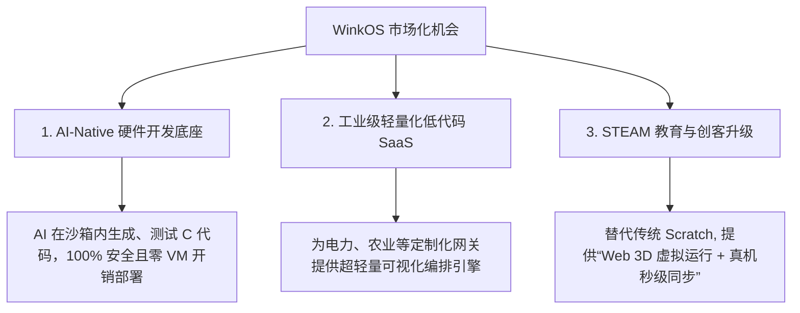

# `wink-micro-os` (WinkOS) 商业价值、竞品分析与市场前景调研报告

在嵌入式与物联网（IoT）领域，新操作系统与框架的诞生极易被质疑为**“重复造轮子”**。本报告站在**资深嵌入式架构师**与**资深产品经理**的双重维度，以严苛的商业和技术标准，对 `wink-micro-os`（以下简称 **WinkOS**）的定位、市场机会、核心受众及开源竞品进行深度剖析。

---

## 1. 核心结论：是不是“重复造轮子”？

**结论：不是重复造轮子。WinkOS 是在“低代码-高保真Web仿真-物理真机”以及“AI Agent 友好型嵌入式底座”这两个交汇点上的范式创新（Paradigm Shift）。**

它在技术路线上进行了极具智慧的取舍，避开了传统嵌入式框架的红海，精准切中了现代软硬件协同开发和 AI 辅助开发的核心痛点。

### 1.1 工业界“大脑与小脑”分布式异构协同的大趋势

在当今智能硬件（如智能汽车、商用无人机、人形机器人）的成熟工业实践中，**“大脑（AI/决策）与小脑（实时控制/MCU）”的物理与逻辑双重解耦已成为标准规范**：
- **Tesla FSD**：自动驾驶大算力芯片（大脑）负责视觉与规划，只向下发“目标转角/扭矩”等语义指令；车身控制器 VCU（小脑，跑 RTOS）负责电机高频闭环与安全监测，有权在异常或丢心跳时本地执行降级刹车。
- **大疆无人机**：伴飞计算机（大脑，跑 Linux/ROS2/SLAM）只负责发送航向/航速意图命令；飞控系统（小脑，MCU 裸跑或跑实时系统）负责 1kHz 姿态闭环与紧急返航守护。
- **具身智能人形机器人**：主控运行全身控制算法（WBC），各关节微控制器负责本地高频闭环驱动。

WinkOS **并非重新发明“如何读写 GPIO”**，而是顺应这一标准设计趋势，通过 WebAssembly 和设备树代码生成，将这一套汽车/机器人巨头独占的高级解耦架构**“平民化”**——让几块钱的 MCU（如 ESP32）也能以极低成本拥有相同的架构高可靠性与 AI 接口标准。

### 1.2 核心分水岭：WinkOS 的独特生态位

```text
           +-------------------------------------------------------+
           |               嵌入式运行时/仿真技术生态位              |
           +-------------------------------------------------------+
           |                                                       |
  [指令/引脚模拟派]                                         [脚本虚拟机解释派]
   - 典型代表：Wokwi, QEMU                                   - 典型代表：MicroPython, Moddable
   - 痛点：极耗 CPU, 无法做 3D 碰撞等高频闭环仿真              - 痛点：需要 100KB+ RAM, GC 停顿, 效率低
           |                                                       |
           +---------------------------+---------------------------+
                                       |
                                       v
                             【同源编译 + 逻辑旁路派】
                              - 典型代表：WinkOS
                              - 优势：MCU 跑 100% 效率原生 C, 无 VM 开销
                                     Web 跑 Wasm, 高频直通旁路保证仿真流畅
```

---

## 2. 目前市面上类似开源项目调研与对比

为了看清 WinkOS 的独特性，我们需要将其与市面上四类主流的类似项目进行横向对比：

### 2.1 竞品横向对比矩阵

| 对比维度 | Arduino 框架 | Wasm 嵌入式虚拟机 (如 WAMR) | Node-RED MCU (Moddable) | MicroPython / CircuitPython | `wink-micro-os` (WinkOS) |
| :--- | :--- | :--- | :--- | :--- | :--- |
| **运行时载体** | 物理 MCU 机器码 | MCU 上的 Wasm 虚拟机 (AOT/译) | MCU 上的 JS 引擎 (XS VM) | MCU 上的 Python 解释器 | **两端同源编译 (物理原生 C / 浏览器 Wasm)** |
| **MCU 额外开销** | 0 (原生执行) | **高** (需 VM 运行时，性能损耗 2-50 倍) | **极高** (需 JS VM 与 GC 堆栈，RAM 占用 >100KB) | **极高** (需大内存，运行效率低) | **0 (原生执行，零 VM 内存/CPU 开销)** |
| **Web 仿真模型** | 指令级/引脚级仿真 (Wokwi) | 无原生双端一致性模拟器 | 依托 Node-RED 网页端模拟 | 纯软件模拟逻辑，无法与硬件外设双向对齐 | **DAL 级逻辑直通旁路 (Value Bypass，Wasm 极速运行)** |
| **内存与安全纪律**| 开放/无约束，易内存碎裂 | 运行在沙箱中，安全但受制于 VM | 自动垃圾回收 (GC)，存在实时性隐患 | 自动垃圾回收 (GC)，无法进行硬实时控制 | **严格零动态内存分配 (静态 BSS)，工业级安全 WDT 截断** |
| **AI 代码生成率** | **低** (库冲突多，阻塞代码多，引脚纠缠) | **中** (需 AI 编写 WASI 接口 and 内部逻辑) | **中** (AI 生成 JS 对象，但仍涉及大量对象操作) | **中** (Python 语法简单，但硬件库接口极其混乱) | **极高 (POD 实例 + 命名式静态 API + 独立设备树)** |

### 2.2 竞品优劣深度解析

1. **对比 Wasm-on-MCU Runtimes（如 Bytecode Alliance 的 WAMR / Wasm3）**：
   * **他们的逻辑**：在单片机上跑一个 WebAssembly 虚拟机，程序编译成 Wasm 字节码发给单片机执行。
   * **WinkOS 的优势**：WAMR 路线在 MCU 上有巨大的 CPU 和内存开销，对于几美分的单片机来说太重了。**WinkOS 是“双向同源编译”**：在 PC/浏览器端编译成 Wasm 跑高保真仿真，在单片机端直接编译成 Xtensa/ARM 原生机器码裸跑。**物理 MCU 上没有任何虚拟机，性能是 100% 的原生速度，RAM 占用仅几 KB**，但却享受了 Wasm 带来的高保真仿真收益。
2. **对比 Node-RED MCU 与 Moddable SDK**：
   * **他们的逻辑**：用 JavaScript 来编写单片机程序，通过 Node-RED 可视化编排，由 Moddable 的 XS 引擎在 MCU 上执行。
   * **WinkOS 的优势**：XS 引擎依然是解释器，需要 100KB+ 的 RAM，且 GC（垃圾回收）会导致毫秒级的随机卡顿，这在工业控制中是不能容忍的。WinkOS 采用纯 C 静态内存分配与协作式协程，兼顾了低代码编排和极低端 MCU（如 32KB RAM 的单片机）的部署能力。
3. **对比 Wokwi 仿真器**：
   * **他们的逻辑**：在浏览器里模拟芯片引脚电平变化（比如把超声波回响的 GPIO 脚以微秒级频率置高电平再拉低）。
   * **WinkOS 的优势**：Wokwi 的引脚模拟开销极高，会导致浏览器严重卡顿，无法在浏览器里跑复杂的 3D 物理碰撞传感器闭环。WinkOS 采用 **DAL 级直通旁路**（在 Wasm 下直接给变量写入 3D 引擎计算好的距离），将通信开销降了几个数量级，支撑了流畅的 3D 仿真工作台。

### 2.3 嵌入式运行范式深度对比 (WinkOS vs. 经典范式)

为了从架构层面彻底看清 WinkOS 协作式执行模型的优势，我们将 WinkOS 与嵌入式领域的主流运行范式（超级循环、抢占式 RTOS、主动状态机、脚本虚拟机）进行系统性对比。

#### 2.3.1 全范式技术对比矩阵

| 对比维度 | 超级循环 (Super Loop) | 抢占式 RTOS (FreeRTOS等) | 主动状态机 (QP/C) | 脚本虚拟机 (MicroPython) | WinkOS (混合协作协程) |
| :--- | :--- | :--- | :--- | :--- | :--- |
| **内存/CPU 开销** | 极低（零额外开销） | 中等（需独立任务栈，几百 B 至几 KB） | 极低（仅静态事件队列） | 极高（需 100KB+ RAM 用于 VM 与 GC） | **极低（静态 BSS 内存分配，无虚拟机开销）** |
| **实时性与确定性** | 极差（易被长 I/O 阻塞卡死） | 极高（硬实时，优先级抢占保证） | 极高（确定性状态转移） | 差（GC 垃圾回收导致毫秒级随机停顿） | **高（Core 1 独占，软定时器与细粒度 WCET 监控）** |
| **并发安全度** | 无并发，绝对安全 | 风险极高（需使用互斥锁，易产生死锁/竞态） | 极安全（无锁消息队列） | 较安全（VM 层有全局锁） | **极安全（单线程非抢占协作，无多线程竞争死锁风险）** |
| **AI 代码生成友好度**| 中（AI 容易生成阻塞延时与类库冲突） | 极差（AI 无法准确编写复杂的多线程同步锁） | 中（状态机代码膨胀，AI 编写困难） | 中（库接口不规范且开销大） | **极高（静态 API + 零并发锁 + 线性协作协程）** |
| **仿真与测试对齐** | 极差（引脚级仿真开销大） | 极差（抢占调度不确定性导致轨迹不可复现） | 较好 | 差 | **极佳（Wasm 两端同源编译，DAL 直通旁路，轨迹完全一致）** |

#### 2.3.2 容器化设计：承袭 RTOS 优势并改进其缺点

WinkOS 通过 OSAL（操作系统抽象层）设计，本质上是在抢占式主系统（RTOS）之上，构建了一个**确定性的、协作式的“运行容器”**。这使其在实际部署时，既能享受 RTOS 的系统级优点，又改进了其在应用层的开发缺点：

*   **系统级承袭：获得 RTOS 的全部并发与功耗管理优势**
    *   **后台并发隔离**：重型网络栈（WiFi/BLE/lwIP）、OTA 固件升级或文件系统读写等“不确定任务”跑在低优先级 RTOS 线程（如 Core 0），绝不会干扰 Core 1 上 WinkOS 应用的实时控制回路。
    *   **低功耗休眠**：当 WinkOS 内部的所有协作协程进入等待（`WINK_PT_DELAY_MS`）时，WinkOS 线程自动调用 RTOS 挂起原语（如 `vTaskDelay`），让出 CPU 给系统 Idle 线程以进入物理低功耗休眠。
    *   **硬实时抢占保证**：对于要求严格的控制任务（如 100Hz 闭环），WinkOS 线程作为高优先级 RTOS 任务运行。当 background 逃生舱任务（低优）运行时，若 Tick 唤醒时间到，RTOS 调度器会**硬抢占**后台任务，保证控制 Tick 的确定性响应。
*   **应用级改进：规避 RTOS 带来的“并发与调试灾难”**
    *   **消灭多线程竞态与死锁**：在 WinkOS 内部，业务层运行在单一的高优先级协作线程中。应用逻辑不需要使用互斥锁（Mutex）或信号量（Semaphore），完全从机制上消除了多线程竞态与死锁隐患，对 AI 线性生成极其友好。
    *   **杜绝物理栈内存溢出**：RTOS 的每个任务都需要分配独立的物理栈，SRAM 碎片率高。WinkOS 采用**无栈协程（Stackless）**，多个并发业务共享同一个物理栈，每个任务的状态开销只有几个字节，极大压缩了硬件成本。
    *   **打通 Web 同源仿真隔离**：由于容器内代码是不涉及抢占调度的单线程协作式结构，它与 WebAssembly 仿真器的单线程 JS 事件循环完全同构，使得 Wasm 仿真测试能 bit-by-bit 还原物理硬件的执行轨迹。

### 2.4 对比重型机器人与自动驾驶仿真器 (ROS2 + Gazebo / NVIDIA Isaac Sim)

在智能机器人与自动驾驶研发中，ROS2 + Gazebo/Webots 以及 NVIDIA Isaac Sim 是业界的黄金标准。我们需要厘清 WinkOS 与它们的本质差异和互补关系：

*   **他们的逻辑**：侧重于**高维算法与物理世界的精确交互**（如物理刚体动力学、雷达点云仿真、摄像头图像生成）。这需要极其昂贵的显卡工作站，安装复杂的 Ubuntu/CUDA/ROS 环境。同时，仿真中运行的是 C++ ROS2 节点或 Python 脚本，而物理 MCU（如底盘控制、执行器）上不得不重新用 C 语言改写成 RTOS 固件。**仿真代码与真机固件完全是两套 codebase，面临致命的 Sim-to-Reality (S2R) 行为裂缝。**
*   **WinkOS 的优势**：聚焦于**底层固件（Firmware-in-the-Loop）的“高保真同源编译”与轻量化 Web 民主化**。
    *   **100% 固件代码同源**：WinkOS 的避障控制 C 代码，在浏览器里通过 WebAssembly 运行的是它，烧录到 MCU（如 ESP32）里裸跑的也是它。彻底消除了传统重型仿真中“逻辑重写”导致的二次 Bug。
    *   **Web 级零门槛分发**：无需安装数百 GB 的软件包与配置环境，一个普通的笔记本打开网页浏览器即可在 1 秒内跑起 3D 物理交互与 Wasm 仿真，使硬件开发流程得以像 Web 开发一样敏捷。
    *   **底层硬件异常观测**：支持从 HAL/DAL 层注入“引脚断开”、“过温报错”、“I2C总线死锁”等硬件级故障，而 Gazebo 等工具极难深入到 MCU 寄存器与驱动级的故障模拟。

---

## 3. 产品经理视角：受众群体与痛点分析

从产品经理（PM）的角度看，一个技术要成功，必须解决**特定受众在特定场景下的高频痛点**。

### 3.1 核心受众画像与痛点矩阵

| 受众群体 (Persona) | 核心场景 (Scenario) | 核心痛点 (Pain Points) | WinkOS 提供的杀手级方案 (Killer Feature) |
| :--- | :--- | :--- | :--- |
| **① 物联网低代码平台商 / 工业面板商** | 工业网关快速配置、智能农业、智能家居流程编排 | 1. 传统 C/C++ 开发周期太长；<br>2. Python/JS 太占内存，硬件成本高；<br>3. 现场微调引脚需要重新编译固件。 | **极轻量级的低代码 C 内核**。配合 [ADR-0008](../../decisions/core/0008-dynamic-device-tree-config-flash.md) 的 Flash 逃生通道，实现配置秒级生效，硬件成本控制在最低。 |
| **② AI Agent 自动化硬件开发团队** | 使用 LLM 自动生成物联网业务代码并直接烧录部署 | 1. AI 编写 C++ 类库和多线程代码时极其容易产生死锁、野指针幻觉；<br>2. AI 无法进行真机烧录前的效果验证。 | **AI-First 架构**。静态命名式 API 几乎杜绝了 AI 幻觉，并且 AI 生成的代码可以**在浏览器 Wasm 沙箱中运行并自我测试**，确认无误后再烧录。 |
| **③ 创客 / 教育与 STEAM 市场** | 智能小车、少儿编程、硬件创意原型开发 | 1. 传统“修改-编译-烧录-看串口”的调试链路太慢，学生容易失去耐心；<br>2. 硬件连线错误容易烧毁板子。 | **三维高保真模拟 + 免编译一键部署**。在网页 3D 场景中连线运行，确保无冲突后直接通过 WebSerial 写入真机。 |
| **④ 智能机器人/智能硬件全栈开发团队 (含 AI 软硬件协同工程师)** | 智能硬件开发中的“大脑与小脑”高效协同与物理验证 | 1. 软件/AI 工程师与硬件底盘开发脱节，必须等待物理 PCB 焊接；<br>2. 大脑与小脑的通信协议经常变动，重构成本高；<br>3. 难以验证 AI 在极端情况（如传感器瞬时断线）下的安全自降级。 | **意图控制契约 + 虚实一致性仿真**。大脑（AI/ROS2）仅下发语义意图（如速度、角度），与具体引脚解耦。在 Wasm 仿真中复用该语义，在真机通信中断或异常时，小脑（WinkOS App层）能通过本地硬实时逻辑瞬间夺回控制权进行安全降级保护。 |

---

## 4. 未来市场机会与商业化路径

随着 **生成式 AI (Generative AI) 渗透到硬件开发领域** 以及 **Web 技术在物联网控制端的崛起**，WinkOS 存在三个极具价值的市场机会：



### 4.1 商业化商业模式 (Business Models)

1.  **AI Coding Tool Chain 授权 (LLM-Native Embedded OS Standard)**:
    随着 Cursor, Copilot 等 Agent 自动编写硬件代码，软件工程需要一个“不容易让 AI 犯错”的运行时。WinkOS 的 C 代码规范和 A* 架构是天生为 LLM parser 准备的。可以将这一套规范打包成 SDK，授权给 AI 硬件生成平台。
2.  **企业级私有化物联网平台 (Private IoT Workspaces)**:
    为工业设备厂商定制开发基于 Web 的低代码工作台。由于 WinkOS 可以在 PC Host 上跑 Unity 单元测试，在 Web 跑高保真仿真，能够为企业客户极大地降低新设备线联调的研发成本。
3.  **Wink Simulator SaaS 订阅与 AI Copilot 插件服务**：
    向中大型智能硬件研发团队提供付费的 3D 仿真工作台与团队协同云空间，提供免安装的虚拟硬件在环测试（FIL）。同时，推出 IDE AI Copilot 插件，专门针对 WinkOS 规范进行无死锁、静态安全的 C 固件代码自动生成与自动仿真校验。

---

## 5. 冷静审视：目前的局限性与风险挑战

作为架构师，在看好 WinkOS 前景的同时，必须清醒地认识到目前的短板，这也是未来研发的重点：

1.  **“冷启动”阶段的外设生态匮乏**：
    *   **风险**：Arduino 拥有成千上万个驱动库。WinkOS 作为一个新框架，每一个新外设都需要开发团队编写：物理驱动 (PAL/DAL) ➔ WebSim Wasm 桥接 ➔ 画布拖拽元数据 (JSON)。
    *   **应对**：必须开发一个**“自动代码转换与驱动生成器”**，利用大模型将现有的 Arduino C++ 驱动库自动翻译重构为 WinkOS 符合规范的 DAL/PAL C 代码。
2.  **开发者对“无栈协程”编程范式的文化阻力**：
    *   **风险**：习惯了同步阻塞式逻辑（`delay`）或抢占式多任务（FreeRTOS）的传统嵌入式工程师，可能会对 WinkOS 基于 Protothreads 的非抢占协作协程写法感到不适，存在学习和接受门槛。
    *   **应对**：在低代码画布和 AI 代码生成中完全屏蔽协程语法，将协程状态机编译作为底层隐藏技术，应用层仅展示线性逻辑；同时提供丰富的实例和文档降低学习曲线。
3.  **AI 生成代码的责任与安全边界**：
    *   **风险**：即使小脑有本地安全否决权，AI 生成的代码依然可能因为异常工况导致设备烧毁或发生意外，带来法律与安全纠纷。
    *   **应对**：在 Wasm 仿真阶段引入 Golden Trace 一致性回归测试与高频“异常路径注入验证”，并要求真机物理烧录时，必须通过系统级硬熔断机制和只读安全保护锁隔离最底层的电机输出。

---

## 6. 最终评估结论

### 严格的架构师意见：
`wink-micro-os` **具有极高的技术与产品价值，绝非重复造轮子**。
它在嵌入式领域首次完整闭环了**“零 VM 开销下的 C 代码双端同源（Host/WebSim/物理 MCU）”**。对于 AI 自动生成代码这一未来的大浪潮，它提供了一个极度规整、安全、没有多线程竞态死锁的优秀运行时载体。

### 战略性建议：
1. **[已落地] [ADR-0008](../../decisions/core/0008-dynamic-device-tree-config-flash.md)**（Flash 动态设备树逃生通道），让真机引脚微调彻底摆脱云编译，打通“秒级原型迭代”的产品体验痛点。
2. **重点攻克“驱动库自动翻译工具（Arduino-to-WinkOS Converter）”**，通过工具链自动转化，迅速白嫖 Arduino 积累了十年的社区驱动红利。
3. **保持 APP 层的纯净性**，坚持其作为 AI 确定性代码生成的靶点，使系统成为 AI-Native 智能硬件时代不可或缺的轻量级基石。
