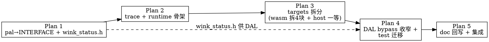

# WinkMicroOS 内核目录架构 A* 重构 — 计划系列索引

> 本目录是一组**分阶段、可独立交付**的实施计划，落地 [`03-directory-architecture.md`](../../../design/02-wink-micro-os/03-directory-architecture.md)（A* 架构）。
>
> **For agentic workers:** 本系列每个计划文档顶部均标注 REQUIRED SUB-SKILL（`superpowers:subagent-driven-development` 或 `superpowers:executing-plans`）。按编号顺序执行；每个计划结束即产出**可编译、可测试**的成果。

---

## 设计依据（一句话）

把 `wink-micro-os/` 重构为 **Ports & Adapters** 内核：`pal`(INTERFACE 契约) ← `dal` ← `runtime` + `trace`（peer 一等层），`targets/`(wasm/esp32/host) 为适配器端口，App/BAL 外部仅 link 公共 include 面。详见 [03-directory-architecture.md](../../../design/02-wink-micro-os/03-directory-architecture.md)。

## 目标目录树（完成后）

```
wink-micro-os/
├── CMakeLists.txt              # 顶层：TARGET_PLATFORM 路由 · WINK_APP_DIR 注入 · 层库聚合
├── README.md                   # 回写：加 runtime/trace 层、更新目录图
├── pal/                        # libpal = INTERFACE（契约 only）
│   ├── CMakeLists.txt
│   └── include/  pal.h · wink_status.h · pal_hal.h · pal_osal.h
├── dal/                        # libdal.a STATIC（可预编译，两端同源）
│   ├── include/  dal_ultrasonic.h · dal_servo.h
│   └── src/      dal_ultrasonic.c · dal_servo.c
├── runtime/                    # libwink_runtime.a STATIC（生命周期+调度，回调注入）
│   ├── include/  wink_app.h · wink_runtime.h
│   └── src/      wink_runtime.c
├── trace/                      # libwink_trace.a STATIC（Golden Trace 一等 peer）
│   ├── include/  wink_trace.h
│   └── src/      wink_trace.c
├── targets/
│   ├── wasm/     pal_hal_wasm.c · pal_osal_wasm.c · wasm_bridge.h · wasm_entry.c
│   ├── esp32/    pal_hal_esp32.c · pal_osal_esp32.c · esp32_entry.c（骨架）
│   └── host/     pal_hal_host.c · pal_osal_host.c（一等 target，吸收旧 host stub）
├── test/
│   ├── unity/ · stubs/{host_test_ctrl,js_sim_host_stub}.{c,h} · test_*.c
└── samples/avoidance_car/      # app_main.c + device_tree.{c,h}
```

## 执行顺序与依赖



| # | 计划 | 产出（完成判据） | 依赖 | 状态 |
|---|---|---|---|---|
| **1** | [pal INTERFACE + wink_status.h](./01-pal-interface-and-wink-status.md) | `pal` 改 INTERFACE 库；`wink_status.h` 落地；`pal.h` 聚合头。host 冒烟编译 PAL 接口通过。 | — | ✅ done |
| **2** | [trace + runtime 骨架](./02-trace-and-runtime-skeleton.md) | `trace/`(ring buffer + fault) 与 `runtime/`(回调注入主循环) 成独立 STATIC 库；host 端跑通"注册回调→跑 N tick→fault 上报"集成测。 | Plan 1 | ✅ done |
| **3** | [targets 拆分 (wasm/host)](./03-targets-decompose-wasm-host.md) | `pal_hal_wasm.c` 拆 4 块 + `wasm_bridge.h` SSOT；`targets/host/` 一等化（吸收 host stub）；DAL 全测试仍绿。 | Plan 1 | ✅ done |
| **4** | [DAL bypass 收窄 + test 迁移](./04-dal-bypass-and-test-migration.md) | 落地 ADR-0003 决策2（ultrasonic bypass 收窄到最底层）；`test/` 改链 `targets/host`；两端同源 sim 测试绿。 | Plan 1、3 | ✅ done |
| **5** | [doc 回写 + 集成](./05-doc-backport-and-integration.md) | README/02-pal/01-overview 回写；04-runtime-and-trace.md 新增；A* 目录树实测与设计文档逐字一致。 | Plan 1~4 | ✅ done |

## 全局约束（所有计划共用）

- **C 标准**：C99（`CMAKE_C_STANDARD 99`），双 target 同源（`emcc`/`xtensa` 干净编译），禁 clang/gcc 独有扩展（ADR-0002）。
- **错误码**：所有可失败函数返回 `wink_status_t`（`int32_t`，0=`WINK_OK`，负=错误）；判定 `if (status < 0)`，禁 `if (status)`（ADR-0001）。
- **DAL 范式**：编译期静态分发 + 命名式 API + POD 结构体，禁 ops 表/函数指针虚表/`container_of`（ADR-0004）。
- **bypass 收窄**：`#ifdef SIMULATION` 只旁路最底层物理信号来源（trigger 时序、echo 脉宽），换算/超时两端同源（ADR-0003 决策2、c-code.md §2）。
- **零动态分配**（§6.1 约束1）：PAL/DAL/runtime/trace/App 运行期禁 `malloc/free/realloc`，句柄与上下文静态/栈分配。
- **Trace 隔离**（§6.1 约束2）：DAL/PAL 驱动只返 `wink_status_t`，**禁直接调 `wink_trace_*`**；fault 捕获与记录收敛在 App 回调或 runtime 调度器。
- **App 注入接口**（§6.1 约束3）：顶层 CMake 用 `WINK_APP_DIR` 缓存变量指定 App 源码路径，未指定则默认 `samples/`。
- **平台配置隐藏**（§6.1 约束4）：平台特定配置（引脚复用、时钟树）封装在 `*_entry.c`，不暴露进 PAL 公共头。
- **Git 提交**：英文 message、原子提交（按逻辑模块聚合）、关联相关 ADR（CLAUDE.md Git Commit Rules）。**在默认分支 `master` 上工作前先开 feature 分支**。
- **测试范式**：host (PC gcc) + Unity（vendor 自 chigo-micro 绝对路径 `D:\workspaces\ai-coding\chigo\chigo-micro\project\embedded\sim\test\unity\`，见 MEMORY）；TDD（先红后绿）。

## 执行前置

1. **开分支**：`git checkout -b feat/wink-micro-os-arch-restructure`（勿在 master 直接施工）。
2. **Unity vendor**：Plan 1 Task 2 会从 chigo-micro 拷贝 Unity 到 `wink-micro-os/test/unity/`。
3. **chigo-micro 路径**：已迁出本仓库，vendor 用绝对路径（见 MEMORY）。

## 与 ADR-0003 计划的关系

本系列 Plan 1/4 **吸收并取代**原 [ADR-0003 计划](../2026-06-23-adr0003-simulation-fidelity-and-code-alignment.md) 的 Task 1~7（host stub 迁移、wasm 拆分、bypass 收窄在新结构上重做）。决策 1（文档边界声明）仍由 ADR-0003 计划 Task 3/4 独立完成（纯文档，无代码依赖，可并行）。Plan 5 复核两者一致性。
