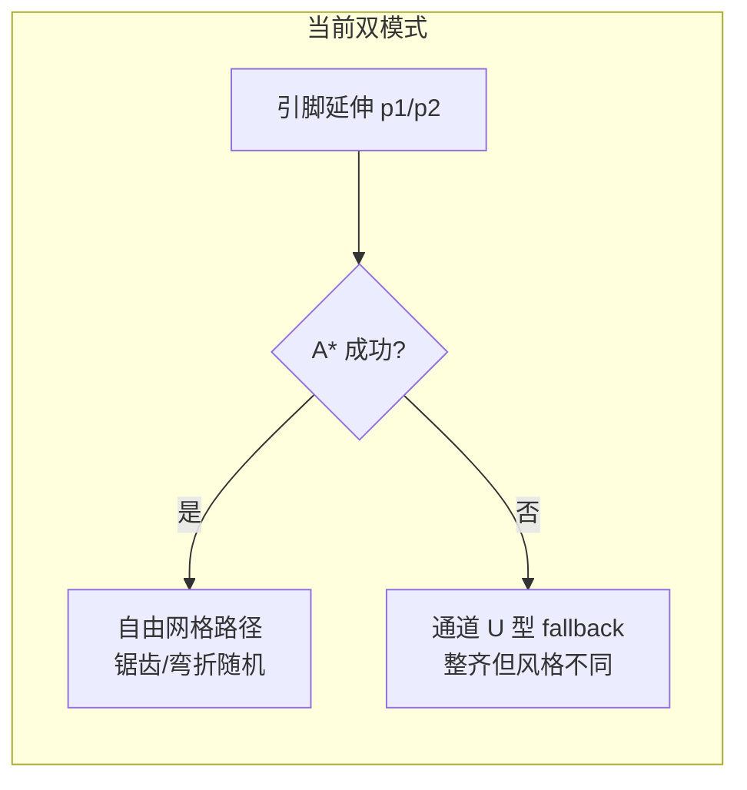
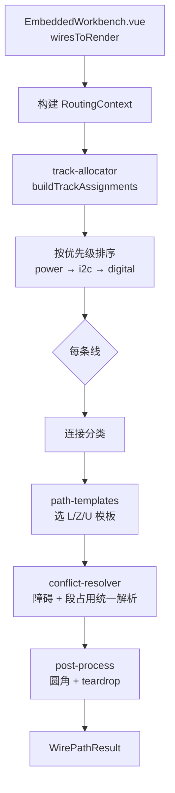
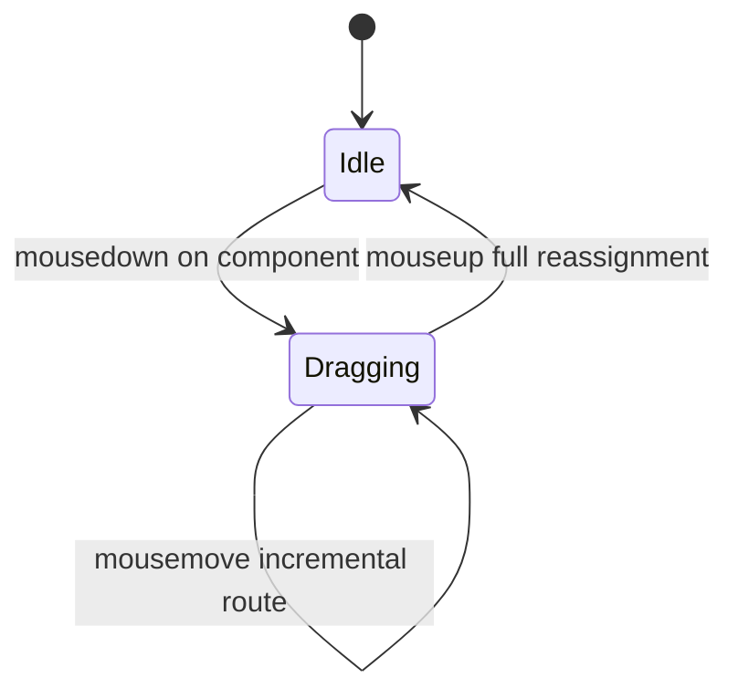
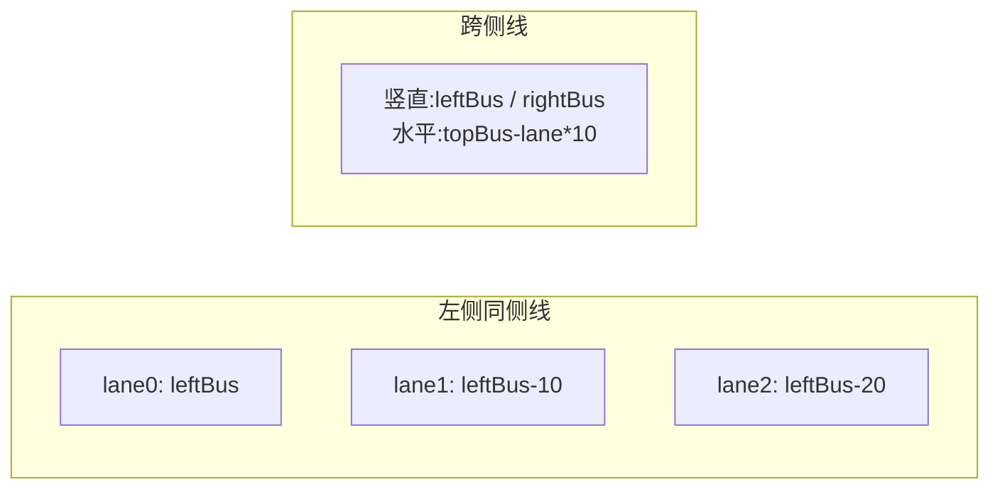

# 前端工作台连线布线算法重构 — 分层通道轨道布线（HCTR）技术设计

| 项 | 内容 |
|----|------|
| 状态 | **Stable（v1.1，实施完成）** |
| 创建日期 | 2026-07-09 |
| 评审日期 | 2026-07-09 |
| 评审结论 | ✅ 总体可行，采纳 H-1～H-7 / M-1～M-5 修订 |
| 范围层级 | ② 技术设计规格（`docs/tech-designs/`） |
| 关联实施计划 | [`../../implementation-plans/frontend/2026-07-09-frontend-wire-routing-hctr-plan.md`](../../implementation-plans/frontend/2026-07-09-frontend-wire-routing-hctr-plan.md) |
| 关联设计规范 | [`../05-frontend-workbench/01-frontend-workbench-architecture.md`](../../design/05-frontend-workbench/01-frontend-workbench-architecture.md) |
| 关联 ADR | 无（纯前端可视化算法，不涉及 C 运行时架构决策） |
| 负责人 | TBD |

---

## 0. TL;DR

**目标**：将 Embedded Workbench 中信号线（Wire）的自动布线算法，从「A* 网格寻路 + 通道 fallback 双模式」重构为 **Hierarchical Channel Track Routing（HCTR，分层通道轨道布线）**，使连线在视觉上更整齐、平行、可预测，同时保留电源星型拓扑、手动 waypoint、GPIO 扇出等已有能力。

**核心策略**：不做自由迷宫寻路；先做**全局轨道分配**，再按**固定正交模板**（L / Z / U）拼路径，用**段级占用**管理线间距，仅在局部失败时做有限绕行。

**交付物**：

- `../../../../wink-ai/packages/embedded-frontend/src/routing/` 新模块（含 legacy 备份）
- 对外 API 与 `WirePathResult` 类型保持兼容
- Vitest 单元测试覆盖核心路由场景
- 设计规范 §7 画布连线部分回写（实施完成后）

**预估工期**：3 个工作日（约 20 小时，含评审修订项）

---

## 1. 背景与问题陈述

### 1.1 当前实现概览

布线逻辑集中在 `../../../../wink-ai/packages/embedded-frontend/src/types/peripheral-pins.ts`：

| 函数 | 职责 |
|------|------|
| `generateSmartPCBPath` | 数字/I2C 信号主入口 |
| `findAStarPath3D` | 10px 网格、双层（Top/Bottom）、转弯惩罚、通道占用 |
| `generateChannelPath` / `generateFallbackOrthogonalPath` | A* 失败时的通道 fallback |
| `generatePowerBusTapPath` / `generatePowerBusTrunkPath` | 电源星型总线（效果较好） |
| `simplifyPath` / `pointsToRoundedSvgPath` / `generateTeardropPath` | 后处理与视觉 |

`EmbeddedWorkbench.vue` 负责：

- 构建障碍物列表（开发板 + 元器件 + 电源节点）
- `buildGlobalLaneMap()` 按 left/right/cross 通道分配 lane 序号
- `buildGpioFanoutMap()` 处理同一 GPIO 多线扇出
- 按 power → i2c → digital 优先级顺序路由，维护 `channelOccupancyMap`

### 1.2 美观度不足根因



| # | 根因 | 视觉表现 |
|---|------|----------|
| R1 | **双模式不一致** | 同画布上部分线走 A* 自由路径，部分走通道模板 |
| R2 | **Lane 与路径脱节** | `lane` 主要影响延伸距离和 fallback 偏移，A* 本体不按轨道走 |
| R3 | **占用粒度过细** | 10px 网格 cell 位图记账，平行线间距不稳定 |
| R4 | **3D/Via 过度** | 原理图场景极少需要跳层，增加视觉噪音 |
| R5 | **I2C 未成束** | SDA/SCL 仅相邻 lane，路径可能分叉 |
| R6 | **同器件出线未对齐** | 多引脚 stub 长度/方向缺乏统一约束 |

### 1.3 设计约束（不可破坏）

1. **正交布线**：所有线段必须水平或垂直（Manhattan）
2. **引脚方向感知**：`startDir` / `endDir` 来自器件类型与旋转
3. **障碍物避让**：不得穿过开发板、元器件本体、电源节点保护区
4. **手动编辑**：用户 waypoint 拖拽、线段偏移、双击删除必须继续工作
5. **电源拓扑**：星型电源总线（tap + trunk）保持不变
6. **对外接口**：`getWirePCBPath()` / `wiresToRender` 调用链改动最小化
7. **性能**：典型场景（≤ 20 条线）单次重算 < 16ms（60fps 友好）

---

## 2. 方案比选

### 2.1 候选方案

| 方案 | 描述 | 优点 | 缺点 |
|------|------|------|------|
| **A. 优化现有 A*** | 提高分辨率、加强转弯/平行惩罚、统一 fallback | 改动小 | 仍难保证全局整齐；多线场景不可预测 |
| **B. HCTR（推荐）** | 全局轨道分配 + 模板拼路 + 段级占用 | 视觉一致、可测、可解释 | 极端密集布局可能需要更多轨道 |
| **C. 可见性图 + Dijkstra** | 在通道交点构图寻最短路径 | 比 A* 干净 | 仍可能产生非平行线段；实现复杂度中等 |
| **D. 力导向/弹簧布局** | 物理模拟拉直线条 | 动态好看 | 不稳定、难保证正交、不适合实时拖拽 |

### 2.2 决策结论

**采用方案 B：HCTR**

理由：

1. Workbench 场景器件数量有限（LED/Button/OLED/Ultrasonic），**结构化通道**比自由寻路更合适
2. 现有 `leftBus/rightBus/topBus/bottomBus` 通道概念可直接升级为**显式轨道坐标**
3. 电源布线已证明「固定拓扑模板」效果好，数字/I2C 线应沿用同一思路
4. Legacy A* 完整备份后可随时回退，风险可控

---

## 3. 目标架构

### 3.1 模块结构

```text
../../../../wink-ai/packages/embedded-frontend/src/routing/
├── types.ts                    # Point, Obstacle, WirePathResult, RoutingContext 等
├── constants.ts                # TRACK_SPACING, GRID_SNAP, STUB_LENGTH 等
├── geometry.ts                 # snapTrackCoord, rotateCardinalDirection, 碰撞检测
├── track-allocator.ts          # 全局轨道分配（替代 buildGlobalLaneMap 核心逻辑）
├── path-templates.ts           # L / Z / U 模板与路径点序列生成
├── segment-occupancy.ts        # 段级占用注册表
├── obstacle-nudge.ts          # （合并入 conflict-resolver.ts，可选保留薄封装）
├── conflict-resolver.ts        # 障碍 + 段占用统一解析（H-4）
├── post-process.ts             # simplifyPath, rounded SVG, teardrop（从 legacy 抽出）
├── wire-routing.ts             # 新算法主入口 generateWirePath()
├── wire-routing-legacy.ts      # 原算法完整备份（generateSmartPCBPath 等）
└── __tests__/
    ├── track-allocator.test.ts
    ├── path-templates.test.ts
    ├── segment-occupancy.test.ts
    └── wire-routing.test.ts
```

`peripheral-pins.ts` 保留引脚/板子/网络定义，布线函数改为 re-export：

```typescript
export { generateWirePath as generateSmartPCBPath } from '../routing/wire-routing';
export { generatePowerBusTapPath, generatePowerBusTrunkPath } from '../routing/wire-routing';
// post-process 工具继续 export 供 UI 使用
```

### 3.2 数据流



### 3.3 与 UI 层边界

| 留在 `EmbeddedWorkbench.vue` | 下沉到 `routing/` |
|-------------------------------|-------------------|
| 障碍物收集（board + components + power nodes） | 轨道分配算法 |
| 颜色、选中态、拖拽交互 | 路径模板与拼路 |
| `wireWaypoints` 状态管理 | waypoint 插入子路径重算 |
| `buildGpioFanoutMap`（端点偏移） | 路径生成与占用 |
| `inactiveWireCache` 拖拽缓存 | 后处理 |

---

## 4. 核心数据结构

### 4.1 连接分类 `WireTopology`

```typescript
type WireTopology =
  | 'power-tap'      // 外设 → 电源节点（走现有星型，不经过 HCTR）
  | 'power-trunk'    // 电源节点 → 板子电源脚（走现有星型）
  | 'same-side'      // 起终点在板子同侧
  | 'cross-side'     // 起终点在板子异侧
  | 'local';         // 起终点距离 < LOCAL_THRESHOLD（默认 80px）
```

判定规则：

- `power-tap` / `power-trunk`：沿用现有 `getWirePCBPath` 分支，**不修改**
- `same-side`：`start.x` 与 `end.x` 同在 `boardCenterX` 左侧或右侧
- `cross-side`：否则
- `local`：`|start.x - end.x| + |start.y - end.y| < LOCAL_THRESHOLD` 且无障碍强制走通道

### 4.2 轨道分配 `TrackAssignment`

```typescript
interface TrackAssignment {
  wireId: string;
  topology: WireTopology;
  priority: number;           // power=0, i2c=1, digital=2
  bundleId?: string;        // I2C 等成束分组 ID
  bundleOffset?: number;    // 束内偏移（如 SDA=0, SCL=1）

  // 显式轨道坐标（snap 后）
  verticalTrackX?: number;   // 竖直轨道 X
  horizontalTrackY?: number; // 水平 bypass 轨道 Y
  bypassSide?: 'top' | 'bottom';

  stubLengthStart: number;
  stubLengthEnd: number;
}
```

对比现状：`buildGlobalLaneMap` 只输出 `lane: number`；新方案输出**可直接用于画线的坐标**。

### 4.3 段占用 `OccupiedSegment`

```typescript
interface OccupiedSegment {
  wireId: string;
  orientation: 'h' | 'v';
  fixed: number;        // H 段: y；V 段: x
  rangeStart: number;   // 沿段方向区间 [start, end]
  rangeEnd: number;
  layer: 0;             // 暂保留字段，固定 0（废弃 3D via）
}
```

冲突判定：同 `orientation` + 同 `fixed`（容差 ±1px）+ 区间重叠 → 冲突。

### 4.4 路由上下文 `RoutingContext`

```typescript
interface RoutingContext {
  boardOrigin: BoardOrigin;
  channels: RoutingChannels;
  obstacles: Obstacle[];
  assignments: Map<string, TrackAssignment>;
  occupancy: SegmentOccupancyRegistry;
  gpioFanout?: { index: number; total: number };
  waypoints?: Point[];
}
```

---

## 5. 算法详设

### 5.1 常量配置

| 常量 | 默认值 | 说明 |
|------|--------|------|
| `GRID_SNAP` | 4 px | **仅**轨道坐标与中间拐点对齐；引脚起终点不 snap |
| `TRACK_SPACING` | 10 px | 相邻轨道间距（`constants.ts` 可配） |
| `MAX_BUMP_COUNT` | 5 | 段占用 bump 上限，超出回退 legacy |
| `STUB_BASE` | 18 px | 引脚延伸基础长度 |
| `STUB_LANE_STEP` | 4 px | 每 lane 额外延伸 |
| `LOCAL_THRESHOLD` | 80 px | local 拓扑曼哈顿距离上限 |
| `I2C_BUNDLE_GAP` | 8 px | SDA/SCL 束内 X/Y 平行间距 |
| `GPIO_FANOUT_SPACING` | 6 px | 同 GPIO 扇出垂直间距 |
| `ROUND_RADIUS` | 6 px | 圆角半径 |
| `OBSTACLE_PADDING` | 8 px | 障碍膨胀 |

**坐标 snap 规则（H-2）**：

```typescript
// geometry.ts
function snapTrackCoord(v: number): number;  // 轨道 / 拐点 → 对齐 GRID_SNAP
function pinCoord(v: number): number;        // 引脚起终点 → 透传，不修改
```

引脚 `relX`/`relY`（如 30、75、85）不保证 4px 整除；对起终点 snap 会导致焊盘与 teardrop 脱离。

### 5.2 阶段一：全局轨道分配

输入：所有待路由连接的元数据（wireId、起终点、priority、channel、signalType、compId）。

**步骤：**

1. **分组**
   - 按 `RoutingChannel`（left / right / cross）分桶
   - I2C：同一 `compId` 的 primary+secondary 标记 `bundleId = compId-i2c`
   - GPIO fanout：同 GPIO 的多条线标记 `fanoutGroup`

2. **桶内排序**（River Routing 顺序保持）
   - 先 `priority` 升序
   - 再 `sortY = (start.y + end.y) / 2` 升序
   - 同 bundle 内保持 pin 定义顺序（SDA 在前）

3. **分配竖直轨道 X**
   - left 桶：`verticalTrackX = leftBus - lane * TRACK_SPACING`
   - right 桶：`verticalTrackX = rightBus + lane * TRACK_SPACING`
   - cross 桶：同时分配 `leftTrackX`（入口侧）与 `rightTrackX`（出口侧）

4. **分配水平 bypass Y**（仅 cross）
   - 默认：`start.y < boardCenterY` → `topBus - lane * TRACK_SPACING`
   - 否则：`bottomBus + lane * TRACK_SPACING`
   - 若与已占用水平段冲突：尝试另一侧 bus

5. **I2C 束分配（H-3）**
   - Bundle 消耗 **1 个 lane**，输出 2 条 `TrackAssignment`
   - 主线（SDA）：`verticalTrackX`、`horizontalTrackY`（bypassY）
   - 次线（SCL）：`verticalTrackX + I2C_BUNDLE_GAP`；`horizontalTrackY + I2C_BUNDLE_GAP`（水平段也平行偏移 8px，而非共用同一 bypassY）
   - 路径模板对束内各线应用**相同拐点序列**，仅 X/Y 整体偏移 `bundleOffset * I2C_BUNDLE_GAP`

6. **输出** `Map<wireId, TrackAssignment>`

#### 5.2.1 动态布局下的轨道重分配（H-1）

元器件拖拽会改变 topology（如 `same-side` → `cross-side`）。策略：

| 阶段 | 行为 |
|------|------|
| **拖拽中**（`mousemove`） | 冻结全局轨道分配；仅重算与被拖元器件相关的线；其余线沿用 `inactiveWireCache` 上一帧结果 |
| **拖拽结束**（`mouseup`） | 一次性调用 `buildTrackAssignments` 全量重算；消除 lane 跳空 |
| **级联调整** | 不做拖拽过程中的级联 bump，避免全画布闪烁 |

`buildTrackAssignments` 保持纯函数；Workbench 负责「何时全量 / 何时增量」的调度。





### 5.3 阶段二：路径模板

每条线根据 `topology` 选择模板，生成**点序列**（正交折线）。

#### 5.3.1 引脚延伸段（所有模板共用）

```text
start ──(沿 startDir, stubLengthStart)──> p1
end   <──(沿 endDir 反向, stubLengthEnd)── p2
```

`stubLengthStart = STUB_BASE + assignment.stubLane * STUB_LANE_STEP`

同器件多线：共享 `stubLengthStart` 基准，按 pin 相对 Y 做 ±2px 微调避免重叠。

#### 5.3.2 Local 模板（L 型）

**启用条件（H-6，全部满足）**：

1. 曼哈顿距离 `< LOCAL_THRESHOLD`（80px）
2. `start → end` 直线不穿越任何障碍物
3. L-hv / L-vh 至少一种不与障碍物相交
4. `startDir` 延伸方向能「看到」终点（不背对，例如同朝右但终点在左侧则禁用）

候选路径：

- `L-hv`：`start → (end.x, start.y) → end`
- `L-vh`：`start → (start.x, end.y) → end`

选择规则：弯折数最少 → 不与障碍相交 → 路径更短。任一条件不满足则升级为 `same-side` 或 `cross-side`。

**边界**：`start.x === boardCenterX` 时归入 left 桶（`<= centerX` 为 left）。

#### 5.3.3 Same-side 模板（Z 型，1 条竖直轨道）

```text
start → p1 → (trackX, p1.y) → (trackX, p2.y) → p2 → end
```

`trackX = assignment.verticalTrackX`

#### 5.3.4 Cross-side 模板（U 型，4 段通道）

```text
start → p1
     → (leftTrackX, p1.y)
     → (leftTrackX, bypassY)
     → (rightTrackX, bypassY)
     → (rightTrackX, p2.y)
     → p2 → end
```

入口/出口左右根据 `start.x` / `end.x` 与 `boardCenterX` 关系自动翻转（不一定 start 在左）。

#### 5.3.5 弯折优先级

```text
local(L) > same-side(Z) > cross-side(U)
```

分类时优先尝试 `local`；条件不满足则升级为 `same-side` 或 `cross-side`。

#### 5.3.6 旋转与引脚方向（M-1）

将 `EmbeddedWorkbench.vue` 中的 `rotateDir` 下沉至 `geometry.ts`：

```typescript
export function rotateCardinalDirection(
  dir: 'left' | 'right' | 'up' | 'down',
  angleDeg: number,
): 'left' | 'right' | 'up' | 'down';
```

单元测试覆盖 0° / 90° / 180° / 270°。`getWirePCBPath` 调用 routing 模块而非 Vue 内联逻辑。

### 5.4 阶段三：统一冲突解析（H-4 / H-7）

将原「障碍 nudge」与「段占用 bump」合并为单一阶段 `conflict-resolver.ts`，避免 nudge 到已被占用的轨道。

**输入**：模板生成的点序列、`TrackAssignment`、`obstacles`、`SegmentOccupancyRegistry`

**解析循环**（最多 `MAX_BUMP_COUNT = 5` 次）：

| 优先级 | 动作 | 前置检查 |
|--------|------|----------|
| 1 | 调整 stub 长度 ±`GRID_SNAP` | 几何碰撞 |
| 2 | 竖直轨道 X bump | 几何碰撞 **且** `occupancy` 无冲突 |
| 3 | 水平 bypass 切换 top ↔ bottom | 同上 |
| 4 | 插入 1 个局部绕行拐点 | 同上 |

**Bump 方向规则（H-7）**：

| 轨道类型 | 优先方向 |
|----------|----------|
| left 桶竖直轨道 | 向左（远离 board） |
| right 桶竖直轨道 | 向右 |
| top bypass | 向上（`topBus - n * TRACK_SPACING`） |
| bottom bypass | 向下 |

Bump 后检查坐标是否在画布 viewport 范围内；超出则尝试反方向；仍失败则 **legacy fallback**。

**并行线保证**：同轨道线段按 River 顺序排列，不交叉。

路由顺序不变：power trunk → power tap → i2c bundles → digital。

### 5.5 阶段四：Waypoint 与手工布线模式（H-5）

**判定**：`waypoints.length > 0` 或 `forcedPoints` 存在 → 进入 **Manual Routing Mode**，放弃模板拼路与轨道约束。

| 模式 | 行为 |
|------|------|
| **Auto（默认）** | HCTR 模板 + 冲突解析 |
| **Manual** | 约束正交连接，不受轨道分配约束 |

Manual 模式规则：

```text
start → p1 → waypoint[0] → ... → waypoint[n] → p2 → end
```

相邻节点间：已正交对齐则直连；否则插入 L-hv 或 L-vh（选较短者）。**不做 bump**，仅做障碍碰撞检测（可警告 dev，不强制移开——用户已接管路径）。

Waypoint 落在障碍物内部：允许渲染（用户意图），dev 环境 `console.warn` 提示。

拖拽线段偏移（`draggingSegment`）：偏移结果作为 `forcedPoints` 传入，同属 Manual 模式。

### 5.6 阶段五：后处理（保留并微调）

从 legacy 抽出，逻辑基本不变：

1. `simplifyPath`：去除共线冗余点
2. `pointsToRoundedSvgPath(pts, ROUND_RADIUS)`：直角圆角
3. `generateTeardropPath`：引脚接入泪滴
4. 输出 `WirePathResult`：`path`, `width`, `segments[{d, layer}]`, `vias[]`, `teardrops[]`
   - **`vias` 恒为空数组**（废弃跳层）
   - **`segments` 仅 layer 0**（兼容现有渲染代码）

### 5.7 线宽规则（不变）

| signalType | width |
|------------|-------|
| power | 3.5 |
| i2c | 1.5 |
| digital | 2.0 |

---

## 6. 典型场景预期

### 6.1 OLED 四线（I2C + 电源）

| 线 | 预期 |
|----|------|
| SDA / SCL | 全程平行，间距 8px，走 left 竖直轨道 + 跨侧 U 型 |
| 3V3 / GND | 走电源星型 tap，不变 |

### 6.2 Ultrasonic 四线

| 线 | 预期 |
|----|------|
| VCC / GND | 电源 tap |
| TRIG / ECHO | 同侧或跨侧 Z/U 型，等距轨道，TRIG 在 ECHO 上方（按 Y 排序） |

### 6.3 多器件共 GPIO

- 扇出点位于板子 GPIO 引脚附近，垂直等距散开
- 散开后再汇入各自分配的竖直轨道

### 6.4 元器件拖拽后

- **拖拽中**：仅更新相关线路径，其他线冻结（§5.2.1）
- **mouseup**：全量 `buildTrackAssignments` 重算，消除 lane 跳空
- 手动 waypoint 优先保留（Manual 模式）

---

## 7. API 设计

### 7.1 新主入口

```typescript
export interface GenerateWirePathOptions {
  start: Point;
  end: Point;
  startDir: CardinalDirection;
  endDir: CardinalDirection;
  wireId: string;
  signalType: 'digital' | 'i2c' | 'power';
  assignment: TrackAssignment;
  obstacles: Obstacle[];
  occupancy: SegmentOccupancyRegistry;
  waypoints?: Point[];
  forcedPoints?: Point[];       // 用户拖拽覆盖
  boardOrigin?: BoardOrigin;
}

export function generateWirePath(opts: GenerateWirePathOptions): WirePathResult;
```

### 7.2 轨道分配入口

```typescript
export interface WireRoutingRequest {
  wireId: string;
  start: Point;
  end: Point;
  signalType: 'digital' | 'i2c' | 'power';
  channel: 'left' | 'right' | 'cross';
  compId?: string;
  netMode?: string;
  bundleId?: string;
}

export function buildTrackAssignments(
  requests: WireRoutingRequest[],
  channels: RoutingChannels,
  boardCenterX: number,
  boardCenterY: number,
): Map<string, TrackAssignment>;
```

### 7.3 兼容层

```typescript
// wire-routing.ts 提供兼容包装，签名与现 generateSmartPCBPath 一致
export function generateSmartPCBPath(
  start, end, startDir, endDir, lane, obstacles?, channelOccupancyMap?, signalType?, waypoints?, boardOrigin?
): WirePathResult;
```

内部：`lane` 映射为 `TrackAssignment` 的轨道坐标；`channelOccupancyMap` 参数**标记 deprecated**，由内部 `SegmentOccupancyRegistry` 替代。兼容层保留一版过渡，避免 `EmbeddedWorkbench.vue` 大改。

---

## 8. 从现状迁移

### 8.1 保留（原样或抽出）

| 模块 | 处置 |
|------|------|
| `generatePowerBusTapPath` | 保留，移入 `routing/post-process.ts` 旁 |
| `generatePowerBusTrunkPath` | 保留 |
| `pointsToRoundedSvgPath` | 抽出到 `post-process.ts` |
| `buildGpioFanoutMap` | 保留在 Workbench |
| `buildGlobalLaneMap` | 过渡期保留；内部可委托 `buildTrackAssignments` |

### 8.2 备份

`wire-routing-legacy.ts` 包含：

- `findAStarPath3D` 及 `AStarNode3D` / `AStarMinHeap`
- `generateSmartPCBPath`（原版）
- `generateChannelPath` / `generateFallbackOrthogonalPath`

通过常量 / URL 开关回退：

```typescript
const USE_LEGACY_ROUTING =
  import.meta.env.VITE_LEGACY_WIRE_ROUTING === 'true' ||
  new URLSearchParams(location.search).get('legacy_routing') === 'true';
```

支持 `?legacy_routing=true` 供 QA 在浏览器中切换，无需重启 dev server（M-3 扩展）。

### 8.3 废弃

| 项 | 说明 |
|----|------|
| `findAStarPath3D` 主路径 | 仅留 legacy 备份 |
| 3D layer / via | 不再生成 |
| 网格 `channelOccupancyMap` | 由段级占用替代；v2.0 硬移除（见 §8.4） |

---

### 8.4 `channelOccupancyMap` 废弃策略（M-3）

| 阶段 | 行为 |
|------|------|
| v1.1（本次） | 兼容包装仍接受参数，**内部忽略**；`import.meta.env.DEV` 下传参时 `console.warn` |
| v2.0（下一轮布线迭代） | 从 `generateSmartPCBPath` 签名移除 |

---

## 9. 测试策略

### 9.1 单元测试（Vitest，≥ 20 用例）

| 用例组 | 覆盖点 |
|--------|--------|
| `track-allocator` | left/right/cross；I2C bundle 双线 bypassY 偏移；priority 排序 |
| `path-templates` | L/Z/U；`snapTrackCoord` vs `pinCoord`；弯折数 |
| `segment-occupancy` | 冲突检测；bump 方向；`MAX_BUMP_COUNT` |
| `conflict-resolver` | 障碍 + 占用联合解析；nudge 不踩占用轨 |
| `geometry` | `rotateCardinalDirection` 0/90/180/270° |
| `wire-routing` | 端到端；Manual 模式；legacy 回退 |

**边界用例（M-4）**：

| ID | 场景 |
|----|------|
| UT-B01 | `start.x === boardCenterX` 桶分类 |
| UT-B02 | 起终点 Y 相同（Z 退化为竖直+水平） |
| UT-B03 | 10 条线全在 left 桶（轨道溢出 bump） |
| UT-B04 | 组件旋转 90°/180° stub 方向 |
| UT-B05 | `start === end` 返回空路径，不除零 |
| UT-B06 | I2C cross-side 水平段平行间距 = 8px |

### 9.2 Golden Snapshot（Task 0.5）

在修改算法前，对 legacy 输出做 snapshot 基准：

```typescript
it('captures legacy routing for default LED layout', () => {
  expect(generateSmartPCBPathLegacy(...)).toMatchSnapshot();
});
```

### 9.3 视觉回归（手动）

| 场景 | 验收 |
|------|------|
| 默认布局（LED + Button + OLED + Ultrasonic） | 线距均匀、I2C 平行、无锯齿 |
| 拖拽元器件 | 拖拽中无全画布闪烁；mouseup 后整齐 |
| 手动 waypoint | Manual 模式；折点保留 |
| Tidy Wires | 清除 waypoint 后恢复 Auto 模式 |
| Debug 轨道层（dev） | 虚线轨道与占用段可视化 |

### 9.4 性能基准（M-2）

在 `wire-routing.test.ts` 中加入可重复 benchmark（warm run，不含 Vue computed）：

```typescript
it('benchmarks 20-wire full recalc under 16ms avg', () => {
  const t0 = performance.now();
  for (let i = 0; i < 10; i++) routeAllWires(ctx20);
  const avg = (performance.now() - t0) / 10;
  expect(avg).toBeLessThan(16);
});
```

单条线增量重算 < 2ms（同 harness）。

---

## 10. 风险与缓解

| 风险 | 概率 | 影响 | 缓解 |
|------|------|------|------|
| 极端密集布局轨道不足 | 中 | 中 | 动态扩展轨道；最后回退 legacy |
| Waypoint 拖拽行为回归 | 中 | 高 | 保留 `forcedPoints` 通道；专项测试 |
| 电源线与信号线视觉不协调 | 低 | 低 | 电源路径完全不动 |
| 拖拽时全画布线闪烁 | 中 | 中 | §5.2.1 冻结分配 + mouseup 全量重算 |
| 无现有 test runner | 高 | 中 | Task 0 引入 Vitest |

---

## 11. 后续演进（非本次范围）

1. **Bus Group 可视化**：I2C 束绘制半透明包络
2. **全局重排按钮增强**：基于 simulated annealing 优化轨道分配
3. **设计规范回写**：`05-frontend-workbench` 增加「连线布线」专节
4. **ADR（可选）**：若主项目其他画布复用 HCTR，再立项 ADR

### 11.1 Debug 轨道可视化层（P1，约 0.5h）

dev 环境可开关，在 SVG 画布叠加：

- 竖直轨道：蓝色虚线
- 水平 bypass：红色虚线
- 已占用段：半透明实线填充
- 每条线 `topology` 标签

实现：`EmbeddedWorkbench.vue` 条件渲染 `<g class="routing-debug-overlay">`。

---

## 12. 开放问题决议（评审确认）

| # | 问题 | 决议 |
|---|------|------|
| Q1 | 是否完全移除 via 渲染？ | **是**。`vias` 恒 `[]`；渲染端 `v-if="wire.vias.length"` |
| Q2 | `TRACK_SPACING` | **默认 10px**，`constants.ts` 可配 |
| Q3 | Legacy 回退暴露 | **dev env + `?legacy_routing=true`** |
| Q4 | `buildGlobalLaneMap` 重构时机 | **本次一并重构**，内部委托 `buildTrackAssignments` |
| Q5 | Vitest | **强烈建议引入** |

---

## 13. 评审修订记录（v1.0 → v1.1）

| ID | 修订摘要 |
|----|----------|
| H-1 | 新增 §5.2.1 拖拽冻结 / mouseup 全量重分配 |
| H-2 | 引脚不 snap；`snapTrackCoord` / `pinCoord` 分离 |
| H-3 | I2C bundle 水平 bypassY 同步偏移 8px |
| H-4 | 合并 obstacle-nudge + occupancy → `conflict-resolver` |
| H-5 | Waypoint → Manual Routing Mode，放弃模板与轨道约束 |
| H-6 | `local` 拓扑增加方向/障碍四重判定 |
| H-7 | bump 方向规则 + `MAX_BUMP_COUNT=5` + viewport 检查 |
| M-1 | `rotateCardinalDirection` 下沉 geometry |
| M-2 | benchmark 用例纳入 §9.4 |
| M-3 | `channelOccupancyMap` 软废弃时间表 §8.4 |
| M-4 | 边界用例扩至 ≥20 |
| M-5 | 实施计划 Task 7 前置修正为 Task 1+2 |

---

## 附录 A：现状 vs HCTR 对照

| 维度 | 现状 | HCTR |
|------|------|------|
| 寻路方式 | A* 10px 网格 | 模板拼路 |
| 线间距 | 网格惩罚（软） | 段级占用（硬） |
| 跨侧路径 | A* 或 U 型 fallback | 统一 U 型 |
| I2C | 相邻 lane | 显式 bundle |
| 跳层 | 支持 | 废弃 |
| 可预测性 | 低 | 高 |
| 回退 | 无 | legacy 模块 |

## 附录 B：路径示意

### B.1 Cross-side U 型

```text
  [Periph]                    [Board]
     ● start                       ● end
     |                             |
     +--- p1                       p2 ---+
     |                                    |
  ===+====================================+===  bypassY (topBus)
     |                                    |
  leftTrack                           rightTrack
```

### B.2 Same-side Z 型

```text
  [Periph]          trackX          [Board]
     ● start           |               ● end
     |                 |               |
     +--- p1            |               p2 ---+
                       |
                       +-------------------+
```

---

*文档版本：v1.1 · 2026-07-09 · Approved（含专家评审修订）*

