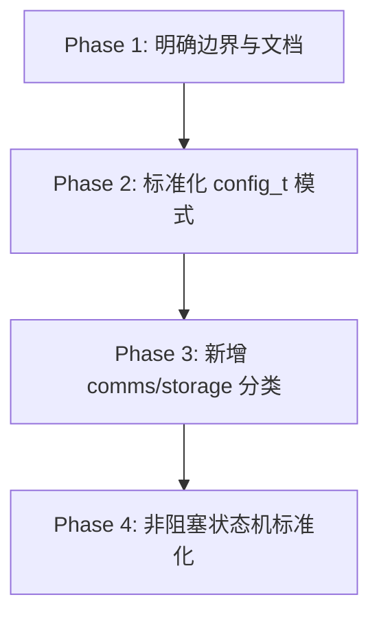

# 技术提案：DAL 器件抽象层重构与标准化 (DAL Refactoring Proposal)

本文档详细记录了 `wink-micro-os` 器件抽象层 (DAL) 的具体重构执行路线图与标准化规范。

---

## 1. 路线图总览与分阶段执行



---

## 2. 详细改进步骤

### Step 1: 规范化外设分类边界 (Primary Intent Rule)

| 外设 / 器件 | 分类 | 主要意图 | 依据理由 |
| :--- | :--- | :--- | :--- |
| **Rotary Encoder (HMI)** | `input` | 人机交互 | 主要由人工操作用于旋转/选择菜单。 |
| **Rotary Encoder (Motor Speed)** | `sensor` | 客观物理测量 | 用于测量电机轴旋转速度/方向。 |
| **NeoPixel (WS2812) Strip** | `display` | 矩阵/像素渲染 | 高带宽像素级颜色流渲染。 |
| **NeoPixel (WS2812) Status LED** | `output` | 简单状态指示 | 仅用于低带宽状态闪烁。 |
| **Passive Buzzer (Tones)** | `output` | 简单声音指示 | 产生声音信号，归入 Output 避免过度抽象。 |
| **Keypad / Touchscreen** | `input` | 人机交互 | 收集人类按键与触控事件。 |

---

### Step 2: 标准化 `config_t` 代码生成结构体模式

#### 统一设计模式模板：
```c
// dal_foo.h
typedef struct {
    uint16_t pin_a;
    uint16_t pin_b;
    uint32_t frequency_hz;
} dal_foo_config_t;

typedef struct {
    dal_foo_config_t config;  // 直接存储配置副本
    bool             initialized;
    // --- 运行时状态 ---
    uint32_t         run_counter;
} dal_foo_t;

wink_status_t dal_foo_init(dal_foo_t *dev, const dal_foo_config_t *cfg);
```

---

### Step 3: 新增外设分类 (`communication` 与 `storage`)
为了支持物联网通信特性（如 WiFi, BLE, NFC, GPS）和本地数据记录（EEPROM, SPI Flash），创建对应目录与规范：
* `wink-micro-os/dal/include/communication/`
* `wink-micro-os/dal/include/storage/`
* `wink-micro-os/dal/src/communication/`
* `wink-micro-os/dal/src/storage/`

---

### Step 4: 非阻塞状态机标准化 (Non-blocking State Machine)
高延迟 DAL 必须严格实现标准状态机生命周期，严禁在 `read`/`write` 中出现超过 `100us` 的阻塞等待。
