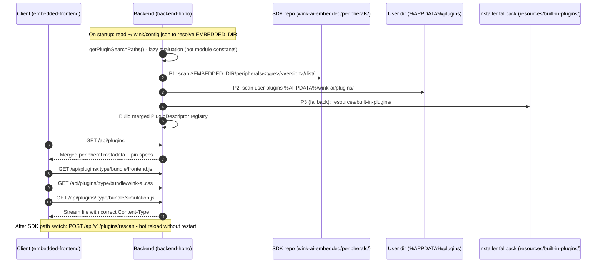

# Peripherals Migration to `wink-ai-embedded` - Complete Architecture Plan

> Revised after architectural review. Includes solutions for all 6 critical technical blind spots found in real code analysis.

---

## 1. Background and Architectural Vision

### 1.1 Current Pain Points

The peripheral ecosystem (Button, LED, Mono OLED, RC Servo, Ultrasonic, etc.) is split across two repositories:

1. **Firmware / C drivers & CodeGen rules**: `wink-ai-embedded/wink-micro-os/` (`dal/src/*`, `codegen/drivers/*.yaml`)
2. **UniSim simulation & UI widgets**: `wink-ai/peripherals/builtin/`

Problems this causes:

- **Developer friction**: Adding a new peripheral requires commits to two separate Git repos
- **Version drift risk**: Switching SDK versions does not update the simulation plugins in the main repo
- **No independent distribution**: Peripherals cannot be tagged and shipped as a self-contained hardware-software asset

### 1.2 Target Architecture: Hardware-Software Co-Design SSOT

Migrate all peripheral plugins into **`wink-ai-embedded/peripherals/`**, making `wink-ai-embedded` a complete **SDK + Peripheral Asset Suite**:

```
wink-ai-embedded/
├── wink-micro-os/          # 1. Embedded OS kernel & C driver layer
├── wink-micro-app/         # 2. Official example app library
└── peripherals/            # 3. Peripheral ecosystem plugin library  <-- MIGRATION TARGET
    ├── package.json        # Independent Node toolchain (not shared with monorepo)
    ├── build.ps1           # Standalone build script (depends only on global winkcli)
    ├── tsconfig.json       # References @wink-ai/unisim-ui, no cross-repo paths
    ├── button/
    │   └── 1.0.0/
    │       ├── dist/       # Pre-compiled bundle committed to Git
    │       │   ├── manifest.json
    │       │   ├── schema.json
    │       │   ├── frontend.js
    │       │   ├── wink-ai.css
    │       │   └── simulation.js
    │       └── src/
    ├── led/
    ├── mono_oled/
    ├── rc_servo/
    └── ultrasonic/
```

---

## 2. End-to-End Loading Pipeline



---

## 3. PREREQUISITE: `@wink-ai/unisim-ui` Package (Must be done first)

> **This is the critical blocker for the entire migration.** Without it, peripheral source code cannot compile in an independent repository.

### 3.1 Root Cause

Current `vite.config.sim.ts` / `vite.config.ui.ts` use hardcoded monorepo-relative paths:

```typescript
// CURRENT: depends on monorepo physical structure - broken in a separate repo
'@': path.resolve(__dirname, '../../../../packages/embedded-frontend/src'),
'@unisim': path.resolve(__dirname, '../../../../packages/unisim/src'),
```

`peripherals/tsconfig.json` also cross-references via relative paths:

```json
{
  "extends": "../packages/embedded-frontend/node_modules/@vue/tsconfig/tsconfig.dom.json",
  "paths": { "@/*": ["../packages/embedded-frontend/src/*"] }
}
```

### 3.2 Solution: New `packages/unisim-ui/` with Minimal Public API

**Design principle**: Do NOT copy all of `embedded-frontend`. Extract only the minimum public API boundary needed by peripheral plugins.

From actual code analysis of `button/src/definition.ts`, peripherals only use:

```typescript
import { definePeripheral } from '@/peripherals/define-peripheral';
import type { PeripheralDefinition, PeripheralPropsSchema } from '@/peripherals/types';
// Note: @unisim/plugin is already a standalone package - does not go into unisim-ui
```

**New package `packages/unisim-ui/`**:

```
packages/unisim-ui/
├── package.json      # { "name": "@wink-ai/unisim-ui", "version": "1.0.0" }
├── src/
│   ├── index.ts      # Unified export entry
│   ├── define-peripheral.ts   # re-export from embedded-frontend/peripherals
│   └── types.ts               # re-export peripheral public types
└── tsconfig.json
```

`packages/unisim-ui/src/index.ts`:

```typescript
// Export ONLY the public API needed for peripheral plugin development
export { definePeripheral } from '@wink-ai/embedded-frontend/peripherals/define-peripheral';
export type {
  PeripheralDefinition,
  PeripheralPropsSchema,
  PinOverlayDef,
  PinsOverlayMap,
} from '@wink-ai/embedded-frontend/peripherals/types';
```

**After migration, peripheral `vite.config.*.ts` becomes**:

```typescript
resolve: {
  alias: {
    // Resolved via npm package - no physical path dependency
    '@/peripherals': '@wink-ai/unisim-ui',
    '@/peripherals/define-peripheral': '@wink-ai/unisim-ui/define-peripheral',
    '@unisim/plugin': '@wink-ai/unisim/plugin',  // unisim is already standalone
  },
},
```

**`wink-ai-embedded/peripherals/package.json`** (independent Node environment):

```json
{
  "devDependencies": {
    "@wink-ai/unisim-ui": "^1.0.0",
    "@wink-ai/unisim": "^0.1.0",
    "vite": "^5.0.0",
    "@vitejs/plugin-vue": "^5.0.0"
  }
}
```

---

## 4. Module-by-Module Modification Plan

### 4.1 `packages/backend-hono` - Path Resolution & Two-Tier Fallback

**File**: [`src/config/paths.config.ts`](file:///d:/MyWorkSpace_program/lowcode-nocode/ai-app/wink-ai/packages/backend-hono/src/config/paths.config.ts)

```typescript
// Two-tier fallback: P1 SDK peripherals -> P2 installer bundled fallback
PERIPHERAL_BUILTIN_DIR: resolveEnvPath(
  process.env.WINK_PERIPHERAL_BUILTIN_DIR,
  EMBEDDED_DIR
    ? path.join(EMBEDDED_DIR, "peripherals")           // P1: SDK repo peripherals
    : path.resolve(process.cwd(), "resources/built-in-plugins"), // P2: installer fallback
),
PERIPHERAL_DEV_DIR: resolveEnvPath(
  process.env.WINK_PERIPHERAL_DEV_DIR,
  EMBEDDED_DIR ? path.join(EMBEDDED_DIR, "peripherals") : undefined,
),
```

> **Production compatibility**: When `EMBEDDED_DIR` is empty (not yet configured), automatically falls back to `built-in-plugins/` from the installer package. Once SDK is configured, automatically upgrades to SDK version. User sees no difference.

---

**File**: [`src/modules/plugins/plugin-discovery.service.ts`](file:///d:/MyWorkSpace_program/lowcode-nocode/ai-app/wink-ai/packages/backend-hono/src/modules/plugins/plugin-discovery.service.ts)

**Problem**: Three module-level constants are frozen at process startup - SDK path changes are invisible:

```typescript
// PROBLEM: evaluated at module import, never updated after that
const DEV_DIR = PATHS.PERIPHERAL_DEV_DIR;
const USER_DIR = PATHS.PERIPHERAL_USER_DIR;
const BUILTIN_DIR = PATHS.PERIPHERAL_BUILTIN_DIR;
```

**Fix**: Delete module-level constants, use lazy evaluation inside functions:

```typescript
// Read from PATHS on each call - supports hot reload via PATHS.invalidate()
export async function getPluginSearchPaths(): Promise<PluginSearchPath[]> {
  const devDir = PATHS.PERIPHERAL_DEV_DIR; // <-- read inside function
  const userDir = PATHS.PERIPHERAL_USER_DIR;
  const builtinDir = PATHS.PERIPHERAL_BUILTIN_DIR;
  // ... rest unchanged
}
```

**New hot-rescan endpoint** ([`src/http/routes/v1/settings.route.ts`](file:///d:/MyWorkSpace_program/lowcode-nocode/ai-app/wink-ai/packages/backend-hono/src/http/routes/v1/settings.route.ts)):

```typescript
// POST /api/v1/plugins/rescan
// Called by frontend after user changes embeddedDir - no backend restart needed
settingsRouter.post('/plugins/rescan', async c => {
  PATHS.invalidate(); // Re-read ~/.wink/config.json
  pluginDescriptorCache.clear(); // Clear cached plugin registry
  const plugins = await scanAllPluginDescriptors();
  return c.json({ code: 0, data: { count: plugins.length } });
});
```

---

### 4.2 `src-tauri/src/sidecar.rs` - Dev & Prod Mode Path Fix

**Dev mode fix** ([`sidecar.rs` L162](file:///d:/MyWorkSpace_program/lowcode-nocode/ai-app/wink-ai/src-tauri/src/sidecar.rs)):

```rust
// BEFORE: hardcoded monorepo path
let builtin_plugins_dir = project_root.join("peripherals").join("builtin");

// AFTER: derive from embedded_dir (must be placed after embedded_dir is computed)
let embedded_dir = project_root.parent()...join("wink-ai-embedded");
let builtin_plugins_dir = embedded_dir.join("peripherals"); // <-- 1-line change
```

**Prod mode** (L222, L245) - **keep as-is**:

```rust
// Prod mode: bundled built-in peripherals still come from installer resources/
// backend paths.config.ts reads EMBEDDED_DIR from ~/.wink/config.json at runtime
// and prefers EMBEDDED_DIR/peripherals; WINK_PERIPHERAL_BUILTIN_DIR is the final fallback
let builtin_plugins_dir = resource_dir.join("built-in-plugins");
.env("WINK_PERIPHERAL_BUILTIN_DIR", builtin_plugins_dir...)
```

---

### 4.3 Build Script - Self-Contained for Standalone Repo

**After migration** (script location: `wink-ai-embedded/peripherals/build.ps1`):

```powershell
# REMOVE: monorepo probe branch (wink-ai-embedded is now a standalone repo)
# DELETE this block:
$MonoRepoPath = Join-Path $ScriptDir "..\.packages\wink-tools"

# KEEP: global winkcli probe (WINK_CLI_EXE env var -> winkcli.exe in PATH)
# No changes needed to the EXE detection logic

# FIX: $BuiltinDir now points to script directory itself (not a "builtin" subfolder)
$BuiltinDir = $ScriptDir   # was: Join-Path $ScriptDir "builtin"
```

**New `peripherals/package.json`** (independent Node toolchain):

```json
{
  "name": "@wink-ai-embedded/peripherals",
  "private": true,
  "scripts": {
    "build": "pwsh ./build.ps1",
    "build:watch": "pwsh ./build.ps1 -Watch"
  },
  "devDependencies": {
    "@wink-ai/unisim-ui": "^1.0.0",
    "@wink-ai/unisim": "^0.1.0",
    "@vitejs/plugin-vue": "^5.0.0",
    "postcss-prefix-selector": "^1.16.0",
    "vite": "^5.0.0",
    "vue": "^3.4.0"
  }
}
```

---

### 4.4 `packages/wink-tools` - CLI Path Integration

**Add to** [`tools/paths.py`](file:///d:/MyWorkSpace_program/lowcode-nocode/ai-app/wink-ai/packages/wink-tools/tools/paths.py):

```python
def peripherals_root() -> Path:
    """Peripherals plugin suite tree (.../wink-ai-embedded/peripherals)."""
    return embedded_root() / "peripherals"
```

**New `winkcli` commands**:

- `winkcli build unisim-plugin --path <dir>` - compile plugin under `peripherals_root()`
- `winkcli create peripheral <type>` - scaffold C driver + simulation/UI templates together

---

### 4.5 CSS Static Asset Serving - Already Supported (No Changes Needed)

Code confirmed: [`plugin-bundle.controller.ts`](file:///d:/MyWorkSpace_program/lowcode-nocode/ai-app/wink-ai/packages/backend-hono/src/modules/plugins/plugin-bundle.controller.ts) `/:type/bundle/:file` already handles CSS:

```typescript
c.header(
  'Content-Type',
  file.endsWith('.css')
    ? 'text/css' // already supported
    : file.endsWith('.json')
      ? 'application/json'
      : 'application/javascript',
);
```

`GET /api/plugins/button/bundle/wink-ai.css` works correctly before and after migration. **No changes needed.**

---

## 5. Implementation Phases

|    Phase    | Goal                        | Key Actions                                                                                                                | Depends On     |
| :---------: | :-------------------------- | :------------------------------------------------------------------------------------------------------------------------- | :------------- |
| **Phase 0** | Create `packages/unisim-ui` | Extract peripheral public API from embedded-frontend; publish `@wink-ai/unisim-ui`                                         | None           |
| **Phase 1** | Prepare SDK repo            | Move peripherals into `wink-ai-embedded/peripherals/`; update vite.config aliases; add standalone `package.json`           | Phase 0        |
| **Phase 2** | Backend adaptation          | Update `paths.config.ts` two-tier fallback; remove module-level constants in discovery service; add `POST /plugins/rescan` | Phase 1        |
| **Phase 3** | Tauri adaptation            | Dev mode: 1-line Rust change `embedded_dir.join("peripherals")`; prod mode: unchanged                                      | Phase 2        |
| **Phase 4** | CLI integration             | Add `peripherals_root()` to paths.py; adapt `winkcli build unisim-plugin`                                                  | Phase 1        |
| **Phase 5** | End-to-end validation       | See verification matrix in Section 6                                                                                       | All phases     |
| **Phase 6** | Cleanup                     | Delete `wink-ai/peripherals/` directory; update `build:peripherals` script                                                 | Phase 5 passes |

---

## 6. Verification Matrix

### 6.1 Basic Functionality

```bash
# Verify plugin discovery (SDK peripherals + user peripherals)
curl http://localhost:3001/api/plugins
# -> Should return button, led, mono_oled, rc_servo, ultrasonic, ws2812_strip, etc.

# Verify file serving (JS / CSS / JSON all correct)
curl -I http://localhost:3001/api/plugins/button/bundle/frontend.js   # Content-Type: application/javascript
curl -I http://localhost:3001/api/plugins/button/bundle/wink-ai.css   # Content-Type: text/css
curl -I http://localhost:3001/api/plugins/button/bundle/manifest.json # Content-Type: application/json
```

### 6.2 SDK Path Hot-Swap

```bash
# 1. Change embeddedDir in settings
# 2. Trigger rescan (no restart needed)
curl -X POST http://localhost:3001/api/v1/plugins/rescan
# -> {"code":0,"data":{"count":9}}

# 3. Verify plugin list reflects new SDK version
curl http://localhost:3001/api/plugins | jq '.[0].version'
```

### 6.3 Production Mode Fallback

```bash
# Scenario: user has not configured SDK (EMBEDDED_DIR is empty)
# Expected: installer built-in peripherals are used automatically - simulation works normally
# -> Plugin list returns without any 404 errors
```

### 6.4 End-to-End Simulation

```
1. Open embedded simulation interface
2. Drag Button and LED onto canvas
3. Wire and start simulation
4. Verify: click Button -> LED turns on/off (signal correctly propagated)
5. Verify: OLED display, Servo rotation, Ultrasonic ranging all work normally
```

---

## 7. Key Benefits Summary

| Dimension                | Before                            | After                                                         |
| :----------------------- | :-------------------------------- | :------------------------------------------------------------ |
| **Peripheral ownership** | Split across 2 repos              | Unified in `wink-ai-embedded`                                 |
| **Version consistency**  | Can drift                         | SDK + peripheral Git versions 100% aligned                    |
| **SDK switching**        | Peripherals stay fixed            | Auto-follow switch via `POST /rescan` hot reload              |
| **Adding peripherals**   | Requires commits to 2 repos       | Single-repo closure: C driver + simulation + UI in one commit |
| **Offline distribution** | Bundled in main repo              | SDK ships its own peripherals; installer only keeps fallback  |
| **Vite aliases**         | 4-level relative cross-repo paths | Clean npm package import `@wink-ai/unisim-ui`                 |
| **Backend paths**        | Static constants at startup       | Lazy evaluation + hot-rescan support                          |
